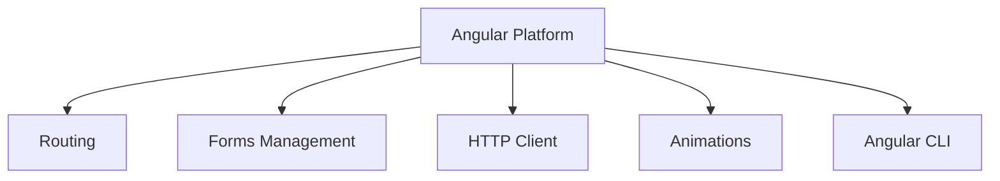
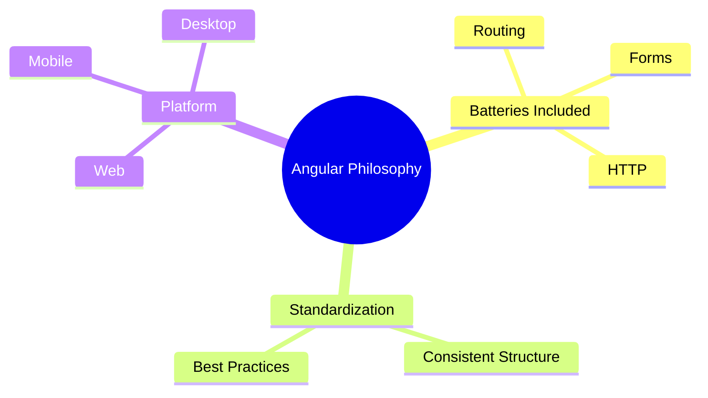

# Triết lý của Angular: Không chỉ là thư viện, đó là một Nền tảng 🏰

Chào mừng bạn đến với thế giới của Angular! Nếu React giống như một bộ Lego mà bạn phải tự tìm thêm các mảnh ghép từ bên ngoài, thì Angular giống như một ngôi nhà "chìa khóa trao tay" đầy đủ tiện nghi.

## 1. Angular là một "Platform" (Nền tảng)

Thông thường, mọi người hay gọi Angular là một Framework. Nhưng thực tế, Google thiết kế nó như một **Platform**.

*   **Thư viện (Library):** Giống như bạn đi siêu thị mua nguyên liệu về nấu ăn. Bạn thích mua thịt ở quầy này, rau ở quầy kia. (Giống React).
*   **Nền tảng (Platform):** Giống như một nhà hàng buffet. Mọi thứ đã được chuẩn bị sẵn, từ khai vị, món chính đến tráng miệng. Bạn chỉ việc vào và sử dụng theo một quy chuẩn nhất định.

## 2. Triết lý "Batteries-included" (Mọi thứ đã sẵn sàng)

Angular đi kèm với tất cả các công cụ bạn cần để xây dựng một ứng dụng chuyên nghiệp mà không cần cài thêm quá nhiều thư viện bên thứ ba:
*   **Routing:** Điều hướng trang.
*   **Forms:** Quản lý dữ liệu người dùng nhập.
*   **HTTP Client:** Giao tiếp với máy chủ (API).
*   **Testing:** Công cụ kiểm thử có sẵn.

## 3. Tại sao lại chọn Angular?

Angular tuân theo những tiêu chuẩn rất khắt khe. Điều này có nghĩa là:
*   **Tính nhất quán:** Dù bạn làm ở công ty A hay công ty B, code Angular thường có cấu trúc rất giống nhau, giúp bạn dễ dàng hòa nhập vào dự án mới.
*   **Phát triển quy mô lớn:** Angular cực kỳ mạnh mẽ cho các dự án "khủng" với hàng trăm lập trình viên cùng làm việc.

---
**Tóm lại:** Angular không chỉ giúp bạn tạo ra giao diện, nó cung cấp cả một hệ sinh thái mạnh mẽ và kỷ luật để bạn xây dựng những ứng dụng bền vững.

Hãy sẵn sàng để khám phá "ngôi nhà" đầy đủ tiện nghi này nhé! 🚀
