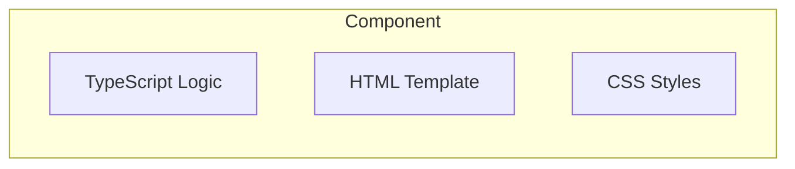
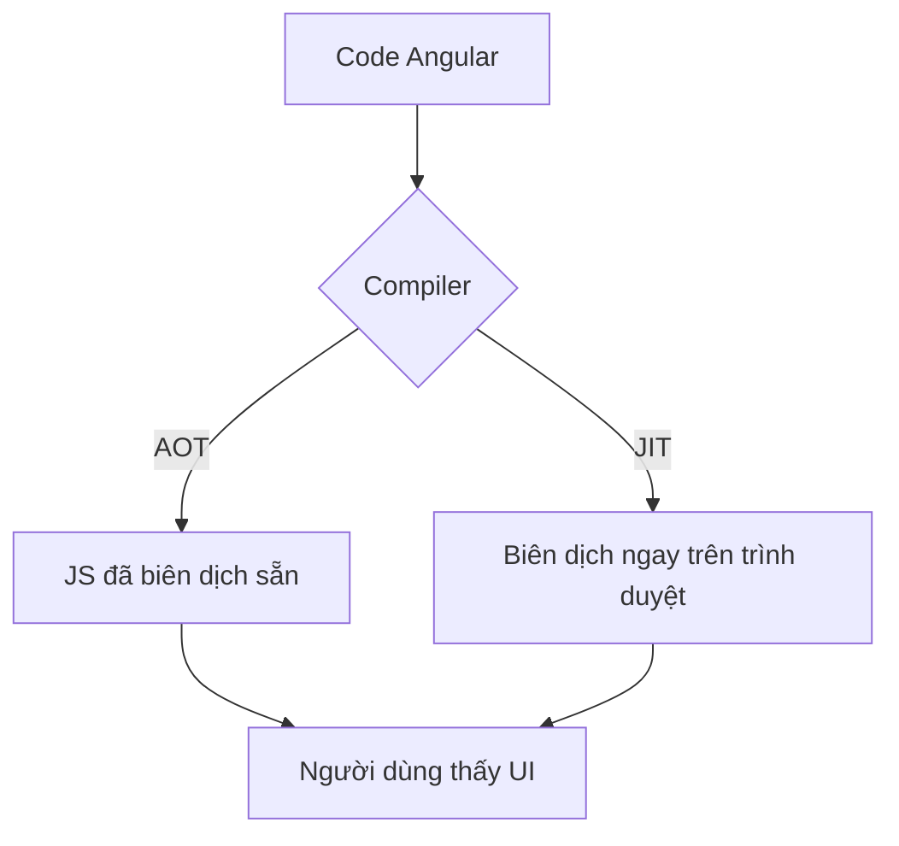

# Tổng quan kiến trúc Angular: Những mảnh ghép nền tảng 🧱

Để hiểu cách Angular vận hành, hãy tưởng tượng bạn đang quản lý một rạp chiếu phim. Mỗi bộ phận đều có nhiệm vụ riêng để tạo nên một buổi diễn hoàn hảo.

## 1. Component (Thành phần) - Trái tim của ứng dụng

Mỗi phần của giao diện là một **Component**. Nó bao gồm 3 phần chính:
*   **Code (TypeScript):** Nơi xử lý logic (như bộ não).
*   **Template (HTML):** Nơi hiển thị giao diện (như bộ mặt).
*   **Styles (CSS):** Nơi làm đẹp (như trang phục).

## 2. Template (Bản thiết kế giao diện)

Template là nơi bạn nói với Angular rằng: "Tôi muốn hiển thị dữ liệu này ở vị trí này". Angular sử dụng một cú pháp đặc biệt (như `{{ }}`) để kết nối logic từ TypeScript vào HTML.

## 3. Compiler (Bộ biên dịch) - Người phiên dịch tận tâm

Máy tính không hiểu được code Angular ngay lập tức. Chúng ta cần một **Compiler** để dịch nó sang thứ mà trình duyệt hiểu được (JavaScript thuần).

Có hai "anh bạn" phiên dịch chính:
*   **JIT (Just-in-Time):** Phiên dịch ngay lúc ứng dụng đang chạy trên trình duyệt. (Giống như phiên dịch viên dịch đuổi theo lời người nói).
*   **AOT (Ahead-of-Time):** Phiên dịch xong xuôi hết rồi mới gửi cho trình duyệt. (Giống như cuốn sách đã được dịch sẵn sang tiếng Việt trước khi bán cho bạn).

> **Mẹo nhỏ:** AOT giúp ứng dụng chạy nhanh hơn và bảo mật hơn vì mọi thứ đã được chuẩn bị kỹ càng từ trước!

## 4. Các mảnh ghép khác (Module, Service...)

Mặc dù Component là trung tâm, Angular còn có:
*   **Services:** Nơi chứa các logic dùng chung (như kho chứa đồ).
*   **Modules:** Cách gom nhóm các Component lại với nhau (như các phòng ban trong rạp phim).

---
**Kết luận:** Kiến trúc của Angular rất chặt chẽ và có tổ chức. Khi bạn hiểu rõ Component và cách chúng được biên dịch, bạn đã nắm chắc nền móng để xây dựng những ứng dụng tuyệt vời rồi!

Cùng đến với bài tiếp theo để xem dữ liệu "bay" qua lại như thế nào nhé! ✈️
