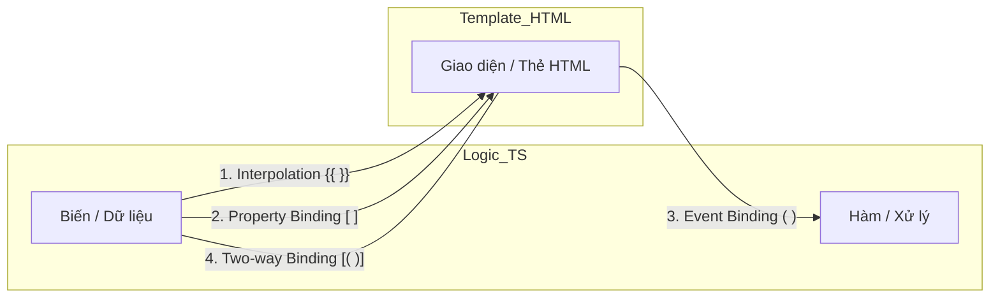

# Data Binding: Sợi dây kết nối kỳ diệu 🧵

Data Binding là cách Angular kết nối "bộ não" (TypeScript) và "khuôn mặt" (HTML) của Component. Hãy cùng xem 4 cách kết nối cơ bản nhất nhé!

## 1. Interpolation (Nội suy) - `{{ value }}`

Dùng để hiển thị dữ liệu từ TypeScript ra HTML.
*   **Hướng:** Từ TypeScript -> HTML.
*   **Cú pháp:** Dùng hai dấu ngoặc nhọn `{{ }}`.
*   **Ví dụ:** Bạn có biến `name = 'Angular'`, trong HTML viết `<h1>Chào {{ name }}</h1>`.

## 2. Property Binding (Ràng buộc thuộc tính) - `[property]`

Dùng để thiết lập giá trị cho các thuộc tính của thẻ HTML (như `src`, `href`, `disabled`...).
*   **Hướng:** Từ TypeScript -> HTML.
*   **Cú pháp:** Dùng dấu ngoặc vuông `[ ]`.
*   **Ví dụ:** `[src]="imageUrl"`.

## 3. Event Binding (Ràng buộc sự kiện) - `(event)`

Dùng để lắng nghe các hành động của người dùng (như click, gõ phím...).
*   **Hướng:** Từ HTML -> TypeScript.
*   **Cú pháp:** Dùng dấu ngoặc đơn `( )`.
*   **Ví dụ:** `(click)="onSave()"` - Khi người dùng bấm nút, hàm `onSave()` trong "bộ não" sẽ chạy.

## 4. Two-way Binding (Ràng buộc hai chiều) - `[(ngModel)]`

Đây là cách kết hợp cả hai hướng. Dữ liệu thay đổi ở "não" thì "mặt" đổi theo, và ngược lại.
*   **Hướng:** Cả hai chiều <-->.
*   **Cú pháp:** "Cái hộp trong quả chuối" `[( )]`.
*   **Ví dụ:** Bạn gõ vào ô nhập liệu (Input), biến trong TypeScript cũng tự cập nhật ngay lập tức.

## 5. Bảng tổng kết nhanh

| Kiểu Binding | Cú pháp | Hướng dữ liệu |
| :--- | :--- | :--- |
| **Interpolation** | `{{ }}` | TS -> HTML |
| **Property** | `[ ]` | TS -> HTML |
| **Event** | `( )` | HTML -> TS |
| **Two-way** | `[( )]` | Cả hai chiều |

---
**Tóm lại:** Data Binding giúp bạn không còn phải mệt mỏi dùng JavaScript thuần để tìm `getElementById` rồi gán giá trị nữa. Angular sẽ tự làm hết cho bạn!

Hẹn gặp bạn ở bài cuối cùng về Dependency Injection nhé! 🌟
