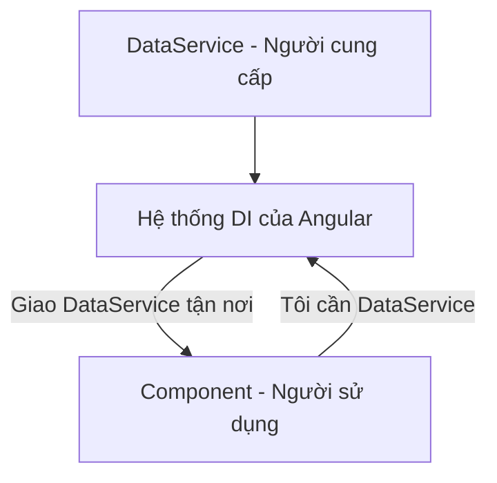

# Dependency Injection (DI): Đừng tự làm, hãy để Angular "ship" tận nơi 🚚

Dependency Injection (Tiêm phụ thuộc) nghe có vẻ hàn lâm, nhưng thực ra nó rất gần gũi. Hãy cùng tìm hiểu qua một ví dụ đời thường nhé!

## 1. Vấn đề: Khi bạn tự làm mọi thứ

Hãy tưởng tượng bạn muốn ăn một cái bánh Pizza.
*   **Cách 1 (Không có DI):** Bạn phải tự đi mua bột, tự làm đế, tự mua phô mai, tự nướng... Bạn mất quá nhiều thời gian cho việc chuẩn bị thay vì tập trung vào việc thưởng thức (xử lý logic chính).
*   **Cách 2 (Có DI):** Bạn chỉ cần gọi điện: "Cho tôi một Pizza hải sản". Cửa hàng sẽ "ship" bánh đến tận cửa nhà bạn. Bạn chỉ việc nhận bánh và ăn.

Trong Angular, cái bánh Pizza chính là các **Service** (nơi chứa logic xử lý dữ liệu), và cửa hàng chính là hệ thống **DI**.

## 2. Dependency Injection (DI) là gì?

DI là một mô hình thiết kế mà ở đó một Component không cần phải tự khởi tạo các Service mà nó cần. Thay vào đó, nó chỉ cần "khai báo" rằng: "Tôi cần Service này", và Angular sẽ tự động cung cấp (tiêm) Service đó vào cho Component.



## 3. Tại sao Angular lại dùng DI?

1.  **Dễ quản lý:** Bạn không cần quan tâm Service được tạo ra như thế nào.
2.  **Tái sử dụng:** Một Service có thể được "ship" đến cho rất nhiều Component khác nhau.
3.  **Dễ kiểm thử (Testing):** Bạn có thể dễ dàng thay thế một Service thật bằng một Service "giả" khi làm test.

## 4. Cách hoạt động đơn giản

*   **Bước 1: Tạo Service:** Bạn dùng `@Injectable()` để nói với Angular: "Đây là một dịch vụ có thể đem đi ship".
*   **Bước 2: Đăng ký Service:** Bạn nói với Angular nơi bạn muốn cung cấp Service này (thường là toàn bộ ứng dụng).
*   **Bước 3: Sử dụng:** Trong Component, bạn chỉ cần khai báo trong `constructor`.

```typescript
// Component nói với Angular
constructor(private pizzaService: PizzaService) { 
  // Angular sẽ tự động mang pizzaService đến đây cho bạn dùng
}
```

---
**Lời kết:** Dependency Injection giống như một dịch vụ hậu cần thông minh. Nó giúp code của bạn sạch sẽ hơn, chuyên nghiệp hơn và cực kỳ linh hoạt.

Chúc mừng bạn đã hoàn thành loạt bài tìm hiểu về các khái niệm cơ bản nhất của Angular! Hành trình vạn dặm bắt đầu từ một bước chân, và bạn đã đi được những bước rất vững chắc rồi đấy! 🎉
