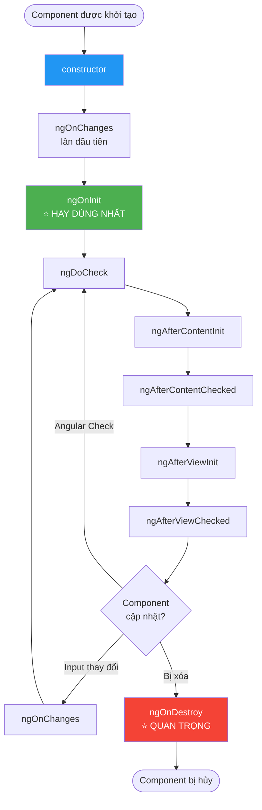

# 05 - Vòng đời của Component (Component Lifecycle) 🌱

Mỗi Component trong Angular đều trải qua một "cuộc đời" từ lúc được tạo ra đến khi bị xóa đi. Angular cung cấp các **Lifecycle Hooks** — các hàm đặc biệt được gọi đúng vào từng thời điểm trong vòng đời đó — để bạn can thiệp và xử lý logic phù hợp.

> **Ví dụ thực tế:** Giống như một nhân viên mới vào công ty: có ngày đầu tiên nhận việc (`ngOnInit`), làm việc hàng ngày (`ngOnChanges`), và cuối cùng là ngày nghỉ việc (`ngOnDestroy`). Bạn cần biết phải làm gì ở mỗi giai đoạn.

---

## 1. Sơ đồ tổng quan vòng đời



---

## 2. Các Lifecycle Hooks quan trọng nhất

### 🟢 `ngOnInit` — "Ngày đầu đi làm"

Đây là hook **hay được dùng nhất**. Nó chạy **một lần duy nhất** sau khi Angular khởi tạo xong tất cả các Input của component.

**Dùng để:** Gọi API, khởi tạo dữ liệu, setup logic ban đầu.

```typescript
@Component({
  standalone: true,
  template: `
    @if (isLoading()) {
      <p>Đang tải danh sách hợp đồng...</p>
    } @else {
      <ul>
        @for (contract of contracts(); track contract.id) {
          <li>{{ contract.code }} - {{ contract.customerName }}</li>
        }
      </ul>
    }
  `
})
export class ContractListComponent implements OnInit {
  // Signals để lưu state
  contracts = signal<Contract[]>([]);
  isLoading = signal(false);

  // Inject service thay vì constructor
  private contractService = inject(ContractService);

  ngOnInit(): void {
    // Gọi API ngay khi component được tải
    this.loadContracts();
  }

  private loadContracts() {
    this.isLoading.set(true);
    this.contractService.getAll().subscribe({
      next: (data) => this.contracts.set(data),
      error: (err) => console.error(err),
      complete: () => this.isLoading.set(false)
    });
  }
}
```

> ⚠️ **Tại sao không dùng `constructor` để gọi API?**
> `constructor` chạy khi class được khởi tạo — lúc này Angular chưa xử lý xong các `@Input()`. Dùng `ngOnInit` để đảm bảo mọi thứ đã sẵn sàng.

---

### 🔄 `ngOnChanges` — "Sếp vừa giao việc mới"

Chạy mỗi khi một **Input property** nhận được giá trị mới từ component cha. Nó nhận vào một object `SimpleChanges` cho biết giá trị cũ và mới.

```typescript
@Component({ standalone: true, template: `...` })
export class ContractDetailComponent implements OnChanges {
  @Input({ required: true }) contractId!: string;

  private service = inject(ContractService);
  contract = signal<Contract | null>(null);

  ngOnChanges(changes: SimpleChanges): void {
    // Mỗi khi contractId thay đổi, load lại dữ liệu
    if (changes['contractId'] && !changes['contractId'].firstChange) {
      console.log(
        'ID cũ:', changes['contractId'].previousValue,
        '→ ID mới:', changes['contractId'].currentValue
      );
      this.loadContract(this.contractId);
    }
  }

  private loadContract(id: string) {
    this.service.getById(id).subscribe(data => this.contract.set(data));
  }
}
```

---

### 💀 `ngOnDestroy` — "Ngày nghỉ việc — dọn dẹp trước khi đi"

Chạy **trước khi component bị xóa khỏi DOM**. Đây là nơi bạn **bắt buộc phải dọn dẹp** để tránh **Memory Leak** (rò rỉ bộ nhớ).

```typescript
@Component({ standalone: true, template: `...` })
export class NotificationComponent implements OnDestroy {
  // Dùng để hủy subscription
  private destroy$ = new Subject<void>();
  private intervalId!: ReturnType<typeof setInterval>;

  ngOnInit(): void {
    // Subscription sẽ tự hủy khi component bị destroy
    this.notificationService.getStream()
      .pipe(takeUntil(this.destroy$))
      .subscribe(notification => this.handleNotification(notification));

    // Timer cần được clear thủ công
    this.intervalId = setInterval(() => this.refreshStatus(), 30000);
  }

  ngOnDestroy(): void {
    // 1. Hủy tất cả subscriptions RxJS
    this.destroy$.next();
    this.destroy$.complete();

    // 2. Xóa timers
    clearInterval(this.intervalId);

    console.log('Component đã được dọn dẹp sạch sẽ!');
  }
}
```

> ✅ **Tip hiện đại:** Trong Angular v16+, bạn có thể dùng `takeUntilDestroyed()` thay cho pattern `Subject + takeUntil`:
> ```typescript
> private destroyRef = inject(DestroyRef);
> 
> ngOnInit() {
>   this.service.getStream()
>     .pipe(takeUntilDestroyed(this.destroyRef))
>     .subscribe(...);
> }
> ```

---

### 👁️ `ngAfterViewInit` — "Khi giao diện đã hiện ra"

Chạy sau khi Angular render xong template và các **Child Components**. Dùng khi bạn cần truy cập trực tiếp vào các phần tử DOM.

```typescript
@Component({
  standalone: true,
  template: `
    <canvas #chartCanvas></canvas>
  `
})
export class ChartComponent implements AfterViewInit {
  // Trỏ đến phần tử DOM
  @ViewChild('chartCanvas') canvasRef!: ElementRef<HTMLCanvasElement>;
  
  ngAfterViewInit(): void {
    // Lúc này canvas đã tồn tại trong DOM, có thể vẽ chart
    const ctx = this.canvasRef.nativeElement.getContext('2d');
    // ... khởi tạo Chart.js
  }
}
```

---

## 3. Bảng tóm tắt nhanh

| Hook | Khi nào chạy | Dùng để |
|:---|:---|:---|
| `constructor` | Khi class được tạo | Inject dependencies |
| `ngOnChanges` | Khi Input thay đổi | Phản ứng với dữ liệu từ parent |
| `ngOnInit` ⭐ | Sau khi init xong | Gọi API, setup ban đầu |
| `ngAfterViewInit` | Sau khi render xong DOM | Tương tác DOM, khởi tạo chart |
| `ngOnDestroy` ⭐ | Trước khi bị xóa | Hủy subscription, clear timer |

---

## 4. Ví dụ Enterprise: Màn hình danh sách hồ sơ tín dụng

```typescript
// credit-case-list.component.ts (PDMS Context)
@Component({
  standalone: true,
  imports: [CommonModule, RouterModule],
  template: `
    <div class="filter-bar">
      <input type="text" (input)="onSearch($event)" placeholder="Tìm kiếm...">
    </div>
    
    @if (isLoading()) {
      <app-skeleton-loader />
    } @else {
      @for (case of filteredCases(); track case.id) {
        <app-credit-case-card [caseData]="case" />
      }
    }
  `
})
export class CreditCaseListComponent implements OnInit, OnDestroy {
  @Input() branchCode!: string; // Lọc theo chi nhánh

  private caseService = inject(CreditCaseService);
  private searchSubject = new Subject<string>();
  private destroy$ = new Subject<void>();

  cases = signal<CreditCase[]>([]);
  searchTerm = signal('');
  isLoading = signal(false);

  filteredCases = computed(() =>
    this.cases().filter(c =>
      c.customerName.toLowerCase().includes(this.searchTerm().toLowerCase())
    )
  );

  ngOnInit(): void {
    // 1. Load data ban đầu
    this.loadCases();

    // 2. Debounce search để không gọi API mỗi keystroke
    this.searchSubject.pipe(
      debounceTime(300),
      distinctUntilChanged(),
      takeUntil(this.destroy$)
    ).subscribe(term => this.searchTerm.set(term));
  }

  ngOnDestroy(): void {
    this.destroy$.next();
    this.destroy$.complete();
  }

  onSearch(event: Event): void {
    this.searchSubject.next((event.target as HTMLInputElement).value);
  }

  private loadCases(): void {
    this.isLoading.set(true);
    this.caseService.getByBranch(this.branchCode)
      .pipe(takeUntil(this.destroy$))
      .subscribe({
        next: (data) => this.cases.set(data),
        finalize: () => this.isLoading.set(false)
      });
  }
}
```

---

**Takeaway:**
- Dùng **`ngOnInit`** để gọi API và khởi tạo — không bao giờ dùng constructor cho việc này.
- Luôn dọn dẹp trong **`ngOnDestroy`** — đây là dấu hiệu của một lập trình viên chuyên nghiệp.
- **Memory Leak** từ việc quên `unsubscribe` là một trong những bug phổ biến nhất trong các ứng dụng Angular.
