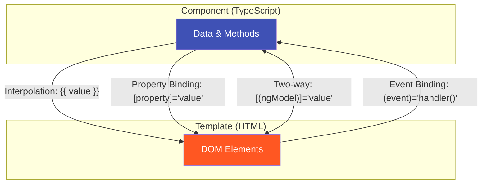
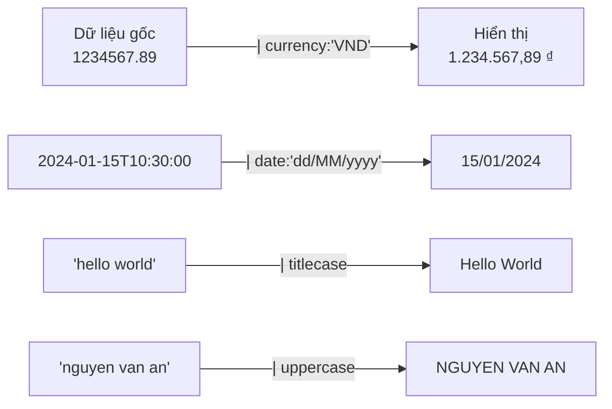

# 06 - Template Syntax & Pipes — Ngôn ngữ của Giao diện 🎨

Template là nơi bạn mô tả giao diện sẽ trông như thế nào. Angular cung cấp một ngôn ngữ template mạnh mẽ với các **binding** (liên kết dữ liệu) và **pipes** (bộ lọc/định dạng) giúp hiển thị dữ liệu một cách linh hoạt.

> **Ví dụ thực tế:** Template giống như bảng thiết kế nội thất. Pipes giống như thợ sơn — họ không thay đổi căn phòng, chỉ làm nó đẹp hơn trước khi hiển thị.

---

## 1. Các loại Data Binding (Liên kết dữ liệu)



---

### 🔵 1.1 Interpolation — Hiển thị giá trị

Dùng `{{ }}` để hiển thị giá trị từ component ra HTML. Angular sẽ tự động escape HTML để tránh XSS.

```typescript
@Component({
  template: `
    <h1>Xin chào, {{ customerName }}!</h1>
    <p>Số hợp đồng: {{ contractCount }}</p>
    <p>Tổng dư nợ: {{ totalDebt | currency:'VND' }}</p>
    <p>Biểu thức: {{ 1 + 1 }}</p>
    <p>Method call: {{ getStatusLabel(status) }}</p>
  `
})
export class DashboardComponent {
  customerName = 'Nguyễn Văn An';
  contractCount = 5;
  totalDebt = 150000000;
  status = 'ACTIVE';

  getStatusLabel(status: string): string {
    const labels: Record<string, string> = {
      'ACTIVE': '✅ Đang hoạt động',
      'CLOSED': '🔒 Đã đóng',
      'OVERDUE': '⚠️ Quá hạn'
    };
    return labels[status] ?? status;
  }
}
```

---

### 🟠 1.2 Property Binding — Gán giá trị cho thuộc tính

Dùng `[property]="expression"` để gán giá trị **động** cho các thuộc tính HTML hoặc Input của component.

```html
<!-- Gán cho thuộc tính HTML -->
<button [disabled]="isSubmitting">Lưu hồ sơ</button>

<input [value]="searchTerm" [placeholder]="inputPlaceholder">

<!-- Gán cho class và style -->
<div [class.overdue]="isOverdue" [style.color]="statusColor">
  Trạng thái hợp đồng
</div>

<!-- Gán cho Input của child component -->
<app-contract-card [contract]="selectedContract" [isEditable]="canEdit">
</app-contract-card>
```

> **Lưu ý:** `[disabled]="true"` khác với `disabled="true"`.
> - `[disabled]="true"` → Truyền giá trị Boolean `true`.
> - `disabled="true"` → Truyền chuỗi `"true"` (luôn disabled).

---

### 🟢 1.3 Event Binding — Lắng nghe sự kiện

Dùng `(event)="handler()"` để phản ứng với các sự kiện DOM.

```html
<!-- Các sự kiện phổ biến -->
<button (click)="submitForm()">Nộp hồ sơ</button>
<input (input)="onSearchInput($event)" (keyup.enter)="search()">
<select (change)="onStatusChange($event)">
  <option value="ALL">Tất cả</option>
  <option value="ACTIVE">Đang hiệu lực</option>
</select>

<!-- $event là Native DOM Event object -->
<form (submit)="onFormSubmit($event)">
```

```typescript
onSearchInput(event: Event): void {
  const value = (event.target as HTMLInputElement).value;
  this.searchTerm.set(value);
}

onFormSubmit(event: SubmitEvent): void {
  event.preventDefault(); // Ngăn reload trang
  this.saveData();
}
```

---

### 🔴 1.4 Two-way Binding — Liên kết hai chiều

Dùng `[(ngModel)]` cho form đơn giản (Template-driven) hoặc `[(property)]` cho Signals.

```typescript
@Component({
  standalone: true,
  imports: [FormsModule], // Cần import FormsModule để dùng ngModel
  template: `
    <input [(ngModel)]="searchKeyword" placeholder="Nhập từ khóa...">
    <p>Đang tìm: {{ searchKeyword }}</p>
  `
})
export class SearchComponent {
  searchKeyword = ''; // Tự động đồng bộ với input
}
```

**Two-way binding hiện đại với Signals (Angular v17+):**
```typescript
// Child component
@Component({
  selector: 'app-quantity-input',
  template: `
    <button (click)="quantity.update(v => v - 1)">-</button>
    <span>{{ quantity() }}</span>
    <button (click)="quantity.update(v => v + 1)">+</button>
  `
})
export class QuantityInputComponent {
  quantity = model(1); // model() tạo two-way binding với signal
}

// Parent template
// <app-quantity-input [(quantity)]="cartQuantity" />
```

---

## 2. Pipes — Bộ lọc và định dạng dữ liệu

Pipes biến đổi dữ liệu **trước khi hiển thị**, không làm thay đổi dữ liệu gốc.



### Các Pipes tích hợp sẵn

```html
<!-- 💰 Currency - Tiền tệ -->
<p>{{ contract.disbursementAmount | currency:'VND':'symbol':'1.0-0' }}</p>
<!-- Output: ₫150.000.000 -->

<!-- 📅 Date - Ngày tháng -->
<p>Ngày ký: {{ contract.signedDate | date:'dd/MM/yyyy HH:mm' }}</p>
<!-- Output: 15/01/2024 09:30 -->

<p>{{ contract.signedDate | date:'relative' }}</p>
<!-- Output: 3 ngày trước (nếu dùng custom pipe) -->

<!-- 🔢 Number - Số -->
<p>Lãi suất: {{ interestRate | number:'1.2-2' }}%</p>
<!-- Output: 8.50% -->

<!-- 📝 Text -->
<p>{{ customerName | uppercase }}</p>     <!-- NGUYEN VAN AN -->
<p>{{ description | titlecase }}</p>     <!-- Loan Agreement For House -->
<p>{{ longText | slice:0:100 }}...</p>   <!-- 100 ký tự đầu -->

<!-- 🔗 JSON (Dùng để debug) -->
<pre>{{ debugData | json }}</pre>

<!-- 🔄 Async - Tự động subscribe/unsubscribe Observable -->
<p>{{ userProfile$ | async | json }}</p>
```

---

### Tạo Custom Pipe

Khi dữ liệu cần định dạng đặc thù theo nghiệp vụ, bạn tạo pipe riêng.

```typescript
// contract-status.pipe.ts
@Pipe({
  name: 'contractStatus',
  standalone: true,
  pure: true // Chỉ tính lại khi input thay đổi (mặc định)
})
export class ContractStatusPipe implements PipeTransform {
  transform(status: string, format: 'label' | 'icon' | 'color' = 'label'): string {
    const statusMap: Record<string, { label: string; icon: string; color: string }> = {
      'DRAFT':    { label: 'Nháp',        icon: '📝', color: '#9E9E9E' },
      'PENDING':  { label: 'Chờ duyệt',   icon: '⏳', color: '#FF9800' },
      'ACTIVE':   { label: 'Hiệu lực',    icon: '✅', color: '#4CAF50' },
      'OVERDUE':  { label: 'Quá hạn',     icon: '⚠️', color: '#F44336' },
      'CLOSED':   { label: 'Đã đóng',     icon: '🔒', color: '#607D8B' },
    };
    
    return statusMap[status]?.[format] ?? status;
  }
}

// Sử dụng trong template
// <span [style.color]="contract.status | contractStatus:'color'">
//   {{ contract.status | contractStatus:'icon' }}
//   {{ contract.status | contractStatus:'label' }}
// </span>
```

```typescript
// currency-vnd.pipe.ts - Format số tiền Việt Nam
@Pipe({ name: 'vnd', standalone: true })
export class VndPipe implements PipeTransform {
  transform(value: number | null): string {
    if (value == null) return '—';
    
    if (value >= 1_000_000_000) {
      return `${(value / 1_000_000_000).toFixed(1)} tỷ đồng`;
    }
    if (value >= 1_000_000) {
      return `${(value / 1_000_000).toFixed(0)} triệu đồng`;
    }
    return `${value.toLocaleString('vi-VN')} đồng`;
  }
}

// {{ 150000000 | vnd }}  → "150 triệu đồng"
// {{ 2500000000 | vnd }} → "2.5 tỷ đồng"
```

---

## 3. Template Reference Variables (`#`)

Dùng `#varName` để tạo biến tham chiếu đến phần tử DOM hoặc component trong template.

```html
<input #searchInput type="text" placeholder="Tìm kiếm...">
<button (click)="search(searchInput.value)">Tìm</button>
<button (click)="searchInput.value = ''">Xóa</button>
```

```html
<!-- Tham chiếu đến Component con -->
<app-contract-form #contractForm></app-contract-form>
<button (click)="contractForm.reset()">Reset Form</button>
<button (click)="contractForm.submit()">Lưu</button>
```

---

## 4. Ví dụ tổng hợp: Bảng danh sách hợp đồng

```typescript
@Component({
  standalone: true,
  imports: [ContractStatusPipe, VndPipe, DatePipe, SlicePipe],
  template: `
    <table>
      <thead>
        <tr>
          <th>Mã HĐ</th>
          <th>Khách hàng</th>
          <th>Số tiền vay</th>
          <th>Ngày ký</th>
          <th>Trạng thái</th>
        </tr>
      </thead>
      <tbody>
        @for (contract of contracts(); track contract.id) {
          <tr [class.overdue]="contract.status === 'OVERDUE'">
            <td>{{ contract.code }}</td>
            <td>{{ contract.customerName | titlecase }}</td>
            <td>{{ contract.amount | vnd }}</td>
            <td>{{ contract.signedDate | date:'dd/MM/yyyy' }}</td>
            <td>
              <span [style.color]="contract.status | contractStatus:'color'">
                {{ contract.status | contractStatus:'icon' }}
                {{ contract.status | contractStatus:'label' }}
              </span>
            </td>
          </tr>
        }
      </tbody>
    </table>
  `
})
export class ContractTableComponent {
  contracts = input<Contract[]>([]);
}
```

---

**Takeaway:**
- **Interpolation `{{ }}`** để hiển thị dữ liệu ra HTML.
- **Property Binding `[prop]`** để truyền dữ liệu động vào thuộc tính.
- **Event Binding `(event)`** để lắng nghe tương tác người dùng.
- **Pipes** không thay đổi dữ liệu gốc, chỉ định dạng để hiển thị — luôn tạo Custom Pipe cho nghiệp vụ đặc thù.
