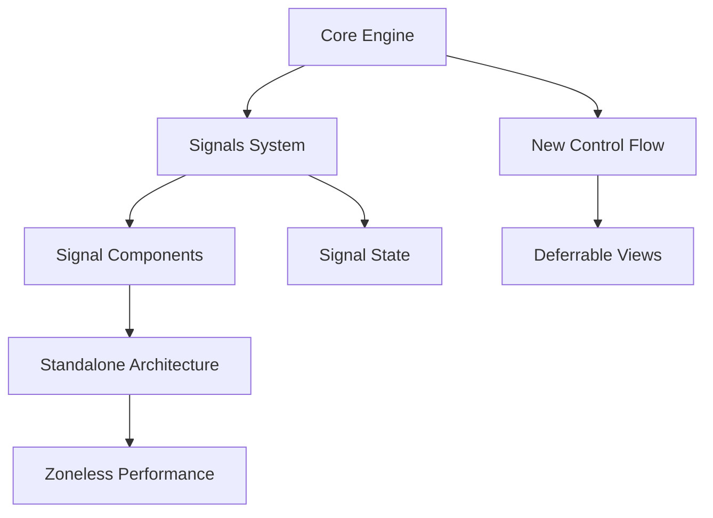

# Lộ trình Chinh phục Modern Angular (v17+)

Chào mừng bạn đến với series hướng dẫn chuyên sâu về Angular hiện đại. Series này tập trung vào sự chuyển dịch lớn nhất của Angular kể từ phiên bản 2: **Fine-grained Reactivity với Signals** và **Zoneless Performance**.

## 🎯 Mục tiêu của Series
- Nắm vững triết lý thiết kế mới của Angular.
- Chuyển đổi từ mô hình dựa trên Zone.js sang Signals.
- Xây dựng ứng dụng Enterprise với Standalone Components và Functional APIs.
- Hiểu sâu về Dependency Injection và tối ưu hóa hiệu năng thực tế.

## 🗺️ Bản đồ nội dung

### 1. [01-Signals: Nền tảng mới](01-Signals-The-New-Foundation.md)
- Hiểu về Cơ chế Reactivity (Phản ứng).
- Signal, Computed, Effect.
- Tại sao Signals vượt trội hơn RxJS cho UI State.
- Signal Graph và cơ chế thông báo thay đổi.

### 2. [02-Kiến trúc Component hiện đại](02-Modern-Component-Architecture.md)
- Standalone Components là mặc định.
- Signal-based Inputs, Outputs.
- Model Inputs (Two-way binding mới).
- Query Signals: `viewChild`, `contentChild`.

### 3. [03-Control Flow & Deferrable Views](03-New-Control-Flow.md)
- Cú pháp `@if`, `@for`, `@switch`.
- Tối ưu hóa render với track by.
- `@defer`: Cách mạng trong việc Lazy Loading các phần của Component.

### 4. [04-Làm chủ Dependency Injection (DI)](04-Dependency-Injection-Mastery.md)
- Hàm `inject()` vs Constructor Injection.
- Provider Hierarchy (Root, Component, Element).
- Functional Resolvers và Guards.

### 5. [05-Quản lý State & HTTP](05-Enterprise-State-HTTP.md)
- State Management đơn giản với Signals.
- Functional Interceptors.
- SSR & Hydration (Event Replay).

### 6. [06-Mẫu thiết kế nâng cao (Advanced Patterns)](06-Advanced-Patterns.md)
- Domain-Driven Design (DDD) trong Angular.
- Monorepos với Nx.
- Zoneless Angular: Tương lai của ứng dụng siêu hiệu năng.

---

## 🏗️ Sơ đồ tổng quan kiến trúc Angular hiện đại

---
*Series được biên soạn với mục tiêu tiếp cận khoa học, đi sâu vào bản chất thay vì chỉ hướng dẫn sử dụng.*
