# Lộ trình Angular "Zero to Hero" cho Dự án Enterprise 🚀

> Series này được thiết kế cho **Newbie đến Enterprise** — từ khái niệm cơ bản đến kiến trúc dự án banking phức tạp. Mỗi bài đều có ví dụ thực tế từ domain **PDMS (Document Management System)**.

---

## 🗺️ Bản đồ Lộ trình

```mermaid
graph TD
    Start((Bắt đầu)) --> F1

    subgraph F1["🟢 Phase 1: Nền tảng (Bài 01-06)"]
        direction LR
        P1A[01. Nhập môn & Môi trường]
        P1B[02. Components]
        P1C[03. Data Binding & Events]
        P1D[04. Directives & Pipes]
        P1E[05. Lifecycle Hooks]
        P1F[06. Component Communication]
    end

    subgraph F2["🔵 Phase 2: Reactivity & Forms (Bài 07-10)"]
        direction LR
        P2A[07. RxJS & Observables]
        P2B[08. Signals: Modern Reactivity]
        P2C[09. Reactive Forms Mastery]
        P2D[10. Routing & Navigation]
    end

    subgraph F3["🟡 Phase 3: Core Enterprise (Bài 11-14)"]
        direction LR
        P3A[11. Dependency Injection]
        P3B[12. HTTP Client]
        P3C[13. Testing]
        P3D[14. Enterprise Architecture]
    end

    subgraph F4["🔴 Phase 4: Advanced Enterprise (Bài 15-21)"]
        direction LR
        P4A[15. Change Detection & OnPush]
        P4B[16. NgRx State Management]
        P4C[17. HTTP Interceptors & Auth]
        P4D[18. Route Guards & Resolvers]
        P4E[19. Content Projection]
        P4F[20. Lazy Loading]
        P4G[21. Error Handling]
    end

    F1 --> F2 --> F3 --> F4 --> End((Angular Hero!))

    style Start fill:#f9f,stroke:#333,stroke-width:4px
    style End fill:#00e676,stroke:#333,stroke-width:4px
```



---

## 📚 Danh sách bài học đầy đủ

### 🟢 Phase 1: Nền tảng

| # | Bài | Bạn sẽ biết |
|---|---|---|
| 01 | [[01-Introduction-and-Environment\|Nhập môn & Cài đặt]] | Angular CLI, cấu trúc project, tsconfig |
| 02 | [[02-Components-The-Building-Blocks\|Components]] | signal inputs, @if @for @switch, Smart/Dumb pattern, OnPush |
| 03 | [[03-Data-Binding-and-Event-Handling\|Data Binding & Events]] | Interpolation, Property, Event, Two-way, `model()`, `input()`, `output()` |
| 04 | [[04-Directives-and-Pipes\|Directives & Pipes]] | Built-in directives, Custom directive, Async pipe |
| 05 | [[05-Component-Lifecycle-Hooks\|Lifecycle Hooks]] | ngOnInit, ngOnChanges, ngOnDestroy, DestroyRef |
| 06 | [[06-Component-Communication\|Component Communication]] | @Input/@Output, ViewChild, EventEmitter, Signals |

### 🔵 Phase 2: Reactivity & Forms

| # | Bài | Bạn sẽ biết |
|---|---|---|
| 07 | [[07-RxJS-and-Observables-Foundation\|RxJS & Observables]] | Observable, Subject, BehaviorSubject, 15+ operators, `takeUntilDestroyed`, `toSignal` |
| 08 | [[08-Signals-The-Modern-Reactivity\|Signals: Modern Reactivity]] | signal(), computed(), effect(), input/output/model signals |
| 09 | [[09-Reactive-Forms-Mastery\|Reactive Forms Mastery]] | FormBuilder, FormArray, cross-field validators, async validators, server errors |
| 10 | [[10-Routing-and-Navigation\|Routing & Navigation]] | Lazy routes, `withComponentInputBinding`, functional guards, resolvers, preload strategies |

### 🟡 Phase 3: Core Enterprise

| # | Bài | Bạn sẽ biết |
|---|---|---|
| 11 | [[11-Dependency-Injection-and-Services\|Dependency Injection & Services]] | inject(), providedIn, InjectionToken, Hierarchical DI |
| 12 | [[12-HTTP-Client-and-Data-Fetching\|HTTP Client]] | Typed HttpClient, functional interceptors, retry strategies, `resource()` API (Angular 19) |
| 13 | [[13-Testing-Fundamentals\|Testing Fundamentals]] | Jasmine/Vitest, TestBed, Mock services, HttpTestingController |
| 14 | [[14-Enterprise-Architecture-and-Standalone\|Enterprise Architecture]] | Standalone, Feature/Core/Shared pattern, Barrel exports |

### 🔴 Phase 4: Advanced Enterprise

| # | Bài | Bạn sẽ biết |
|---|---|---|
| 15 | [[15-Change-Detection-and-OnPush\|Change Detection & OnPush]] | Default vs OnPush, ChangeDetectorRef, Signals + OnPush |
| 16 | [[16-NgRx-State-Management\|NgRx State Management]] | Actions, Reducers, Effects, Selectors, NgRx Signals Store |
| 17 | [[17-HTTP-Interceptors-Auth-Patterns\|HTTP Interceptors & Auth]] | Auth interceptor, Token refresh queue, Retry, Logging |
| 18 | [[18-Route-Guards-and-Resolvers\|Route Guards & Resolvers]] | canActivate, canDeactivate, Role guards, ResolveFn, prefetch |
| 19 | [[19-Content-Projection-and-Advanced-Template\|Content Projection & Advanced Templates]] | ng-content, ViewChild, ContentChild, Generic DataTable |
| 20 | [[20-Lazy-Loading-and-Code-Splitting\|Lazy Loading & Code Splitting]] | Lazy routes, Preloading strategies, @defer, NgOptimizedImage |
| 21 | [[21-Error-Handling-Global-Patterns\|Error Handling & Global Patterns]] | Global handler, AsyncState<T> pattern, Toast service |

---

## 🎯 Learning Path gợi ý theo mục tiêu

| Mục tiêu | Lộ trình | Thời gian |
|---|---|---|
| Bắt đầu nhanh | 01 → 02 → 03 → 05 → 08 → 10 → 11 → 12 | 2 tuần |
| Dự án thực tế | Phase 1-3 + bài 15, 17, 18 | 4-6 tuần |
| Backend dev học thêm FE | 02 → 03 → 08 → 09 → 10 → 12 → 17 | 3-4 tuần |
| Senior-level | Toàn bộ 21 bài + mini-app | 2-3 tháng |

---

## 💡 Angular 17-19 Quick Reference

```
✅ Standalone components (không cần NgModule)
✅ Signal inputs: input() / input.required()
✅ Signal outputs: output() / model()
✅ New control flow: @if @else @for @switch @empty @defer
✅ Functional guards/resolvers
✅ withComponentInputBinding() — route params → inputs
✅ takeUntilDestroyed() — auto cleanup
✅ resource() API (Angular 19) — declarative HTTP
```

---

## 🛠️ Tech Stack

```
Angular 17-19 + TypeScript
RxJS 7+
NgRx 18+ (optional)
Angular Material / PrimeNG
Angular DevTools (Chrome extension)
```

---

*Cập nhật: Angular 17-19 | Standalone-first | Signal-first | 21 bài | PDMS domain examples*
