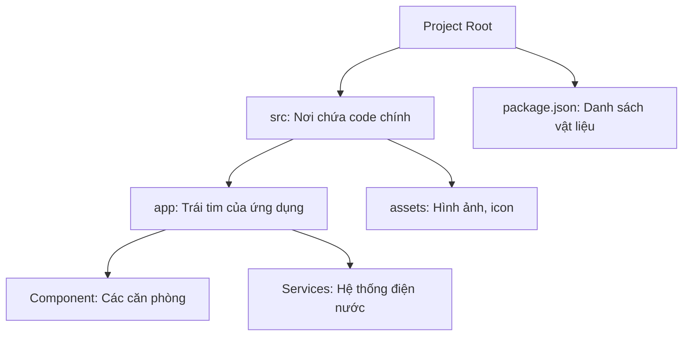

# 01. Nhập môn & Cài đặt Môi trường 🛠️

Chào mừng bạn đến với thế giới của Angular! Nếu bạn là một "tân binh", đừng lo lắng, chúng ta sẽ bắt đầu từ con số 0.

## 🏢 1. Tại sao lại là Angular?

Hãy tưởng tượng bạn muốn xây dựng một công trình:
- **HTML/CSS/JS thuần**: Giống như việc bạn tự đúc từng viên gạch, tự trộn vữa. Rất linh hoạt nhưng mất thời gian và dễ sai sót nếu công trình lớn.
- **Angular**: Giống như một **bộ khung nhà thép tiền chế**. Mọi thứ đã được tính toán sẵn, có quy chuẩn rõ ràng. Bạn chỉ cần lắp ghép và hoàn thiện. Angular cực kỳ phù hợp cho các dự án lớn, phức tạp (Enterprise).

### Lợi ích chính:
- **Tất cả trong một (Batteries Included)**: Có sẵn mọi thứ từ Routing, Forms đến HTTP Client.
- **Quy chuẩn cao**: Làm việc trong nhóm lớn cực kỳ sướng vì ai cũng viết code theo một kiểu.

## 🪄 2. Angular CLI: Cây đũa thần

CLI (Command Line Interface) là công cụ giúp bạn tạo code bằng dòng lệnh. Thay vì phải tạo từng file thủ công, bạn chỉ cần gõ vài chữ.

- `ng new`: Xây móng cho một dự án mới.
- `ng generate (ng g)`: Tạo thêm phòng, cửa sổ (Component, Service).
- `ng serve`: Bật đèn và mời khách vào xem nhà (Chạy dự án trên máy cục bộ).

## 🗺️ 3. Cấu trúc dự án: Bản đồ tòa nhà

Khi bạn mở một dự án Angular, bạn sẽ thấy rất nhiều thư mục. Đừng hoảng sợ! Đây là những chỗ quan trọng nhất:

- **src/app**: 90% thời gian bạn sẽ ở đây. Đây là nơi chứa các logic chính.
- **main.ts**: Điểm bắt đầu, nơi nhấn nút "Start" cho ứng dụng.
- **index.html**: Trang web duy nhất (Angular là Single Page Application - SPA).

---
**Bài học tiếp theo:** Chúng ta sẽ học cách tạo ra những "viên gạch" đầu tiên - **Components**!
