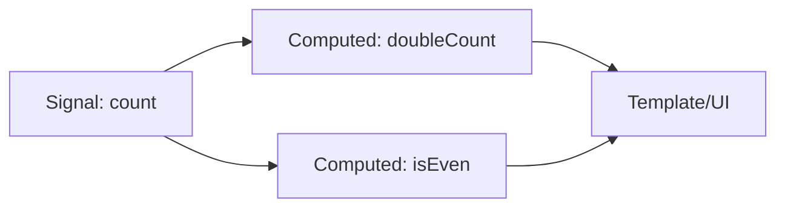
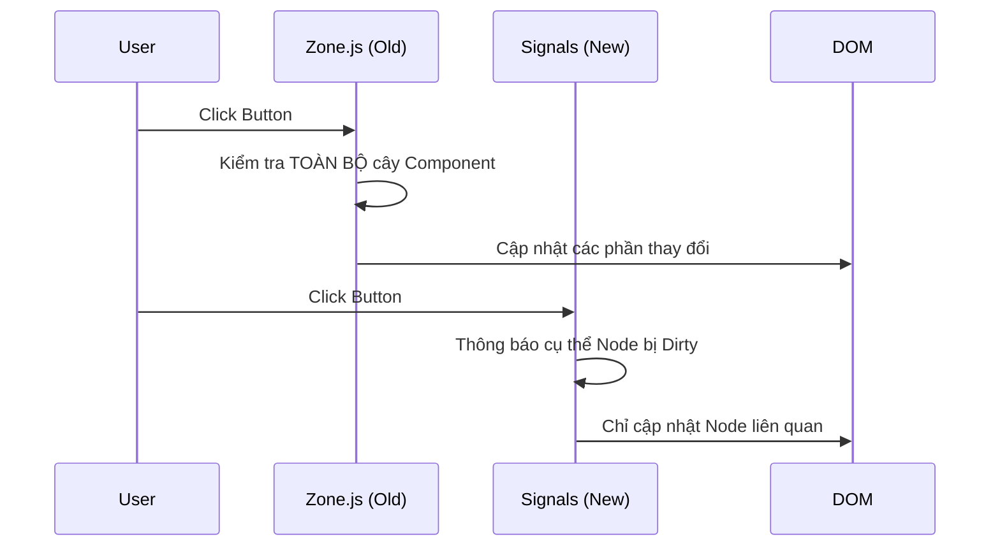

# 01 - Signals: Nền tảng của Reactivity hiện đại

Signals là sự thay đổi mang tính nền tảng nhất trong cách Angular xử lý sự thay đổi dữ liệu. Thay vì dựa vào `Zone.js` để "đoán" xem có gì thay đổi, Signals cung cấp một cơ chế thông báo chính xác (fine-grained notification).

## 1. Khái niệm cốt lõi

Một **Signal** là một giá trị có khả năng thay đổi theo thời gian và thông báo cho những ai đang quan tâm (consumers) khi nó thay đổi.

### 3 Trụ cột của Signals:
1.  **Writable Signals**: Cho phép đọc và ghi giá trị.
2.  **Computed Signals**: Giá trị dẫn xuất (derived), tự động tính toán lại khi các signals phụ thuộc thay đổi.
3.  **Effects**: Các hàm chạy khi một hoặc nhiều signals thay đổi (thường dùng cho các tác vụ side-effect như Logging, Sync với LocalStorage).

```typescript
const count = signal(0); // Writable
const doubleCount = computed(() => count() * 2); // Computed

effect(() => {
  console.log(`Giá trị hiện tại là: ${count()}`); // Chạy mỗi khi count thay đổi
});

count.set(5); // Cập nhật giá trị
count.update(v => v + 1); // Cập nhật dựa trên giá trị cũ
```

## 2. Signal Graph (Đồ thị phụ thuộc)

Angular xây dựng một đồ thị phụ thuộc giữa các signals. Khi một signal gốc thay đổi, nó chỉ đánh dấu các node liên quan là "Dirty".



## 3. Tại sao không dùng RxJS cho UI State?

| Đặc tính | RxJS (Observables) | Signals |
| :--- | :--- | :--- |
| **Bản chất** | Stream dữ liệu (Async) | Trạng thái đồng bộ (Sync) |
| **Glitch-free** | Có thể gặp lỗi trạng thái tạm thời | Luôn đảm bảo tính nhất quán |
| **Cú pháp** | Phức tạp (pipe, map, switchMap) | Đơn giản như gọi hàm `()` |
| **Hủy đăng ký** | Cần `unsubscribe` | Tự động quản lý vòng đời |

## 4. Cách Signals thay thế Zone.js

Trong mô hình truyền thống (Zone.js), bất kỳ sự kiện nào (click, timeout) cũng khiến Angular kiểm tra toàn bộ cây component. Với **Zoneless Angular (Signals)**, Angular biết chính xác node nào trong DOM cần cập nhật.

### So sánh cơ chế Change Detection:



## 5. Ví dụ thực tế: Giỏ hàng

```typescript
@Component({
  standalone: true,
  template: `
    <div>Sản phẩm: {{ name() }}</div>
    <div>Giá: {{ price() }}</div>
    <div>Số lượng: {{ quantity() }}</div>
    <hr>
    <div>Tổng cộng: {{ total() }}</div>
  `
})
export class CartItemComponent {
  name = signal('Angular Hoodie');
  price = signal(100);
  quantity = signal(1);

  // Tự động tính lại khi price hoặc quantity thay đổi
  total = computed(() => this.price() * this.quantity());
}
```

---
**Kết luận:** Signals không chỉ là một API mới, nó là sự thay đổi về tư duy: Từ việc "kiểm tra mọi thứ" sang "biết chính xác thứ gì cần làm".
