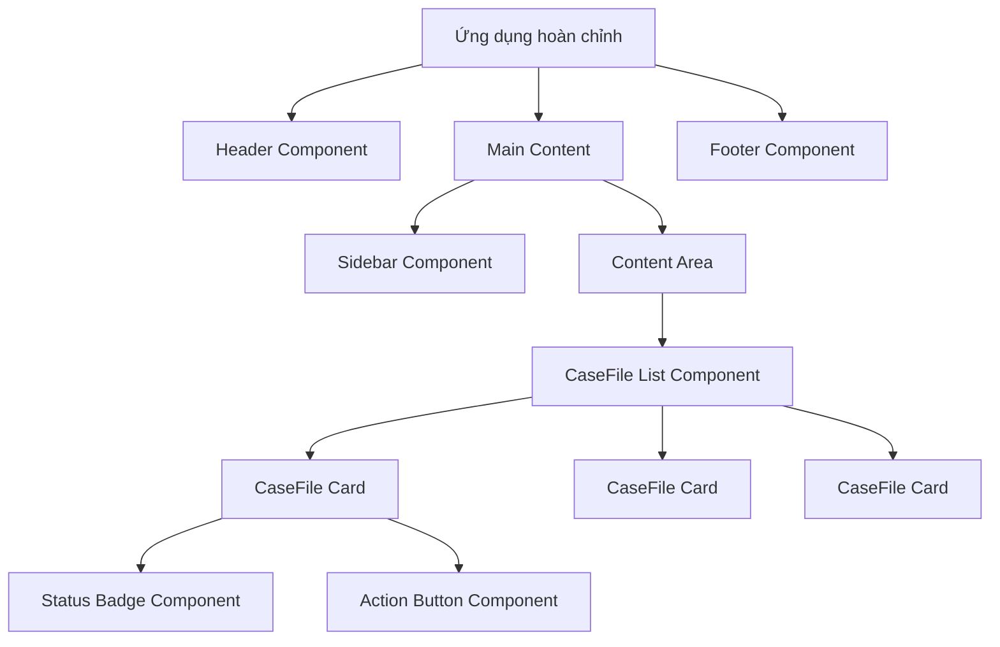
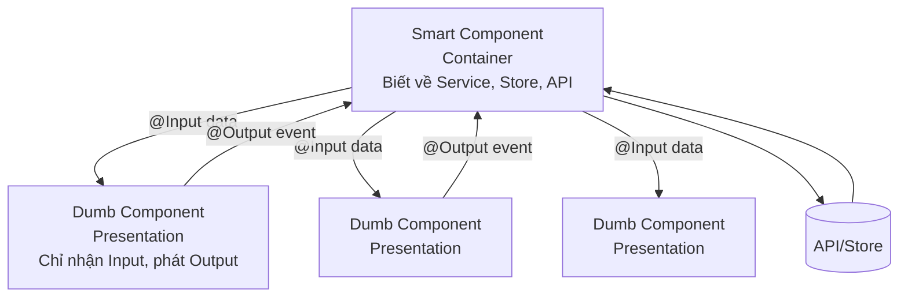

# 02. Component: Viên gạch xây nhà 🧱

> **Bài học nền tảng** — Mọi thứ trong Angular đều là Component. Hiểu sâu Component là nền tảng để học toàn bộ framework.

---

## 🧩 1. Component là gì?

### Ẩn dụ: Bộ xếp hình Lego có bộ não



---

## 🏗️ 2. Cấu tạo một Component

Một component gồm 3 lớp (hoặc gộp làm 1 file):

```typescript
// credit-card.component.ts — Cấu trúc đầy đủ
import { Component, input, output, signal, computed, OnInit } from '@angular/core';
import { CommonModule, CurrencyPipe } from '@angular/common';

// Decorator định nghĩa metadata
@Component({
  // Tên dùng trong HTML: <app-credit-card />
  selector: 'app-credit-card',
  
  // Standalone = không cần NgModule (Angular 17+ recommended)
  standalone: true,
  
  // Dependencies: import những gì cần dùng trong template
  imports: [CurrencyPipe],
  
  // Có thể viết template/styles inline hoặc tách file riêng
  templateUrl: './credit-card.component.html',
  styleUrl: './credit-card.component.scss',
})
export class CreditCardComponent implements OnInit {
  // Khai báo class properties ở đây
  ngOnInit() {
    // Logic khởi tạo
  }
}
```

---

## 📥 3. Inputs: Nhận dữ liệu từ bên ngoài

### Cách cũ (vẫn hoạt động)
```typescript
@Input() cardNumber: string = '';
@Input({ required: true }) balance!: number;
```

### Cách mới — Signal Inputs (Angular 17+, khuyến khích dùng)

```typescript
@Component({
  selector: 'app-credit-card',
  standalone: true,
  imports: [CurrencyPipe],
  template: `
    <div class="card" [class.expired]="isExpired()">
      <!-- Gọi input như function: cardNumber() -->
      <div class="card-number">
        **** **** **** {{ cardNumber().slice(-4) }}
      </div>
      <div class="balance">
        {{ balance() | currency:'VND':'symbol':'1.0-0' }}
      </div>
      <!-- Computed value tự cập nhật -->
      <div class="status" [class.warning]="isLowBalance()">
        {{ isLowBalance() ? '⚠️ Số dư thấp' : '✅ Bình thường' }}
      </div>
      <span class="holder">{{ cardHolder() }}</span>
    </div>
  `
})
export class CreditCardComponent {
  // Signal inputs — reactive, type-safe
  cardNumber = input.required<string>();          // Bắt buộc phải truyền
  balance = input.required<number>();
  cardHolder = input<string>('Khách hàng');       // Có default value
  creditLimit = input<number>(50_000_000);        // Hạn mức mặc định 50tr
  expiryDate = input<Date | null>(null);
  
  // Computed từ inputs — tự cập nhật khi input thay đổi
  isLowBalance = computed(() => this.balance() < this.creditLimit() * 0.1);
  isExpired = computed(() => {
    const exp = this.expiryDate();
    return exp ? exp < new Date() : false;
  });
}
```

---

## 📤 4. Outputs: Phát sự kiện ra ngoài

```typescript
@Component({
  selector: 'app-credit-card',
  template: `
    <div class="card">
      ...
      <button (click)="onPayClick()">Thanh toán</button>
      <button (click)="onBlockClick()">Khoá thẻ</button>
    </div>
  `
})
export class CreditCardComponent {
  cardNumber = input.required<string>();
  balance = input.required<number>();
  
  // Output events — dùng output() function (Angular 17+)
  paymentRequested = output<{ cardNumber: string; amount: number }>();
  cardBlocked = output<string>(); // Phát ra card number

  // Cách cũ vẫn hoạt động:
  // @Output() paymentRequested = new EventEmitter<...>();
  
  onPayClick() {
    this.paymentRequested.emit({ 
      cardNumber: this.cardNumber(), 
      amount: 0 
    });
  }
  
  onBlockClick() {
    this.cardBlocked.emit(this.cardNumber());
  }
}
```

```html
<!-- Cách dùng trong parent component -->
<app-credit-card
  [cardNumber]="card.number"
  [balance]="card.balance"
  [cardHolder]="card.holderName"
  (paymentRequested)="handlePayment($event)"
  (cardBlocked)="handleBlock($event)"
/>
```

---

## 🔄 5. New Control Flow (Angular 17+): @if @for @switch

Thay thế `*ngIf`, `*ngFor`, `*ngSwitch` cũ:

```html
<!-- Template đầy đủ cho danh sách thẻ -->
<div class="cards-section">
  
  <!-- @if thay thế *ngIf -->
  @if (isLoading()) {
    <div class="skeleton" *ngFor="let i of [1,2,3]"></div>
  } @else if (cards().length === 0) {
    <div class="empty-state">
      <p>Chưa có thẻ tín dụng nào</p>
      <button (click)="requestCard()">Đăng ký thẻ mới</button>
    </div>
  } @else {
    <!-- @for thay thế *ngFor — bắt buộc có track -->
    @for (card of cards(); track card.id) {
      <app-credit-card
        [cardNumber]="card.number"
        [balance]="card.balance"
        (paymentRequested)="onPayment($event)"
      />
    } @empty {
      <p>Danh sách rỗng</p>
    }
  }
  
  <!-- @switch thay thế *ngSwitch -->
  @switch (accountType()) {
    @case ('PREMIUM') {
      <app-premium-benefits />
    }
    @case ('STANDARD') {
      <app-standard-benefits />
    }
    @default {
      <app-basic-benefits />
    }
  }
</div>
```

---

## 🎯 6. Inline Template vs Separate Files

### Khi nào dùng inline template?
```typescript
// ✅ Dùng inline khi template ngắn (< 15 dòng), component đơn giản
@Component({
  selector: 'app-status-badge',
  standalone: true,
  template: `
    <span class="badge badge--{{ status() }}">
      {{ statusLabel() }}
    </span>
  `,
  styles: [`
    .badge { padding: 4px 12px; border-radius: 999px; font-size: 12px; }
    .badge--PENDING { background: #fff3cd; color: #856404; }
    .badge--APPROVED { background: #d4edda; color: #155724; }
    .badge--REJECTED { background: #f8d7da; color: #721c24; }
  `]
})
export class StatusBadgeComponent {
  status = input.required<'PENDING' | 'APPROVED' | 'REJECTED'>();
  
  statusLabel = computed(() => ({
    PENDING: 'Chờ duyệt',
    APPROVED: 'Đã duyệt',
    REJECTED: 'Từ chối'
  }[this.status()]));
}
```

---

## 🧠 7. Smart vs Dumb Components (Container Pattern)

Đây là pattern quan trọng nhất cho enterprise:



```typescript
// ✅ Smart Component — biết về Service và Store
@Component({
  selector: 'app-case-file-page',
  template: `
    <app-case-file-list
      [items]="caseFiles()"
      [isLoading]="isLoading()"
      (approve)="handleApprove($event)"
      (loadMore)="handleLoadMore($event)"
    />
  `
})
export class CaseFilePageComponent {
  private store = inject(CaseFileStore);
  caseFiles = this.store.items;    // Signal từ store
  isLoading = this.store.isLoading;
  
  handleApprove(id: string) {
    this.store.approve(id); // Gọi store action
  }
  handleLoadMore(page: number) {
    this.store.loadPage(page);
  }
}

// ✅ Dumb Component — chỉ render và phát event
@Component({
  selector: 'app-case-file-list',
  changeDetection: ChangeDetectionStrategy.OnPush, // Luôn OnPush với Dumb components
  template: `...`
})
export class CaseFileListComponent {
  items = input<CaseFile[]>([]);
  isLoading = input(false);
  approve = output<string>();
  loadMore = output<number>();
}
```

---

## 📊 8. Tổng kết

| Khái niệm | Mục đích | Ví dụ |
|---|---|---|
| `selector` | Tên tag HTML | `<app-credit-card>` |
| `input()` | Nhận dữ liệu từ cha | `balance = input<number>()` |
| `output()` | Phát sự kiện lên cha | `clicked = output<void>()` |
| `@if @for @switch` | Control flow mới | Thay `*ngIf`, `*ngFor` |
| Smart/Dumb | Pattern tổ chức | Container vs Presentation |
| `ChangeDetectionStrategy.OnPush` | Performance | Luôn dùng cho Dumb component |

---

**Bài tiếp theo:** [[03-Data-Binding-and-Event-Handling|03. Data Binding & Event Handling]] 🔗
