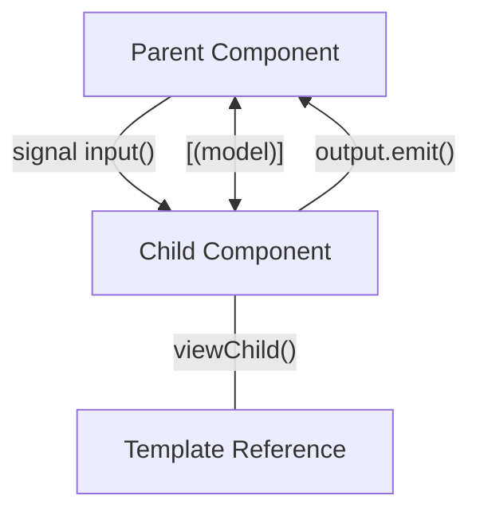

# 02 - Kiến trúc Component hiện đại

Trong Angular v17+, kiến trúc component đã chuyển mình mạnh mẽ sang hướng **Standalone-first** và **Signal-based**. Mọi tương tác dữ liệu giữa các component giờ đây đều có thể thực hiện thông qua Signals.

## 1. Standalone Components: Chuẩn mực mới

Không còn cần `NgModule`, mỗi Component là một đơn vị độc lập, tự quản lý các phụ thuộc của chính nó.

```typescript
@Component({
  selector: 'app-user-profile',
  standalone: true, // Luôn luôn dùng standalone: true
  imports: [CommonModule, OtherComponent], // Import trực tiếp những gì cần dùng
  template: `...`
})
export class UserProfileComponent {}
```

## 2. Signal-based Inputs

Thay vì dùng `@Input()` decorator truyền thống, chúng ta sử dụng hàm `input()`. Điều này biến dữ liệu đầu vào thành một Signal, cho phép chúng ta dùng `computed` hoặc `effect` dựa trên giá trị của input đó một cách dễ dàng.

```typescript
export class UserDetailComponent {
  // Input truyền thống (vẫn dùng được nhưng không khuyến khích)
  // @Input() userId!: string;

  // Signal Input (Hiện đại)
  userId = input.required<string>(); // Bắt buộc phải truyền
  isAdmin = input(false); // Giá trị mặc định là false

  // Tự động tính toán khi userId thay đổi
  userLabel = computed(() => `User ID: ${this.userId()}`);
}
```

## 3. Model Inputs (Two-way Binding mới)

`model()` là một loại input đặc biệt cho phép "Two-way data binding" mà không cần cú pháp cồng kềnh.

```typescript
// Component con
export class CustomCheckboxComponent {
  checked = model(false);

  toggle() {
    this.checked.set(!this.checked()); // Cập nhật sẽ phản hồi ngược lại Component cha
  }
}

// Component cha sử dụng
// <app-custom-checkbox [(checked)]="isAdmin" />
```

## 4. Signal-based Outputs

Hàm `output()` thay thế cho `@Output()` và `EventEmitter`. Nó gọn nhẹ hơn và không phụ thuộc vào RxJS.

```typescript
export class UserListComponent {
  userSelected = output<User>();

  selectUser(user: User) {
    this.userSelected.emit(user);
  }
}
```

## 5. Query Signals: Truy cập Component con

Thay vì `@ViewChild`, chúng ta dùng `viewChild()`. Kết quả trả về là một Signal.

```typescript
export class ParentComponent {
  // Trả về Signal chứa Component con
  header = viewChild(HeaderComponent);
  
  // Trả về Signal chứa danh sách các phần tử
  items = viewChildren('listItem');

  ngOnInit() {
    effect(() => {
      console.log('Header hiện tại:', this.header());
    });
  }
}
```

## 6. Sơ đồ luồng dữ liệu trong Modern Component



## 7. Lợi ích của kiến trúc mới
1.  **Tính nhất quán**: Mọi thứ (State, Inputs, Queries) đều là Signals.
2.  **Hiệu năng**: Angular biết chính xác khi nào Input thay đổi để cập nhật template, không cần so sánh bẩn (dirty checking) thủ công.
3.  **Type-safe**: API mới hỗ trợ TypeScript tốt hơn rất nhiều.

---
**Bài tập thực hành:** Thử tạo một `CounterComponent` sử dụng `model()` cho giá trị count và `output()` khi giá trị đạt mốc giới hạn.
