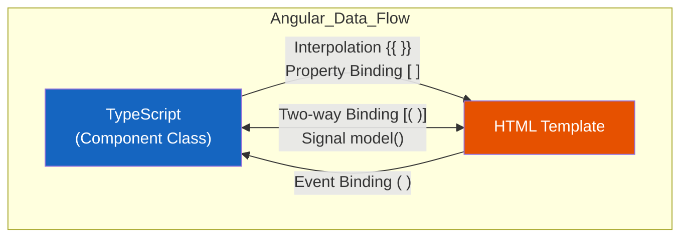
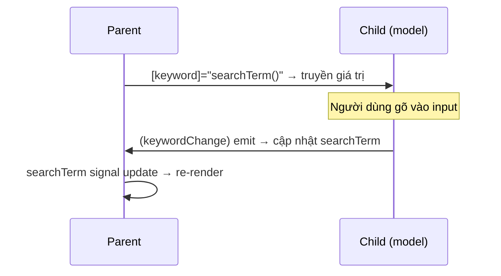

# 03. Data Binding & Xử lý Sự kiện ⚡

> **Mục tiêu**: Hiểu sâu 4 loại data binding, signal-based two-way binding (Angular 17+), event handling nâng cao, và các pattern thực tế trong dự án enterprise như PDMS.

---

## 🗺️ Bức tranh tổng quan



**Nguyên tắc cốt lõi:**
- `[ ]` → Dữ liệu đi từ **TS → HTML** (đọc)
- `( )` → Dữ liệu đi từ **HTML → TS** (viết/gọi)
- `[( )]` → Hai chiều đồng thời (đọc + viết)
- `{{ }}` → Nội suy chuỗi vào DOM

---

## 1. Interpolation `{{ }}` — Hiển thị dữ liệu

Interpolation không chỉ dùng cho biến đơn giản — nó evaluate **expression** TypeScript:

```typescript
@Component({
  selector: 'app-case-header',
  standalone: true,
  template: `
    <h1>Hồ sơ: {{ caseCode }}</h1>
    <p>Tổng tài sản: {{ formatCurrency(totalAssets) }}</p>
    <p>Trạng thái: {{ isApproved ? '✅ Đã duyệt' : '⏳ Chờ duyệt' }}</p>
    <p>Thời gian còn lại: {{ deadlineDate | date:'dd/MM/yyyy HH:mm' }}</p>
  `
})
export class CaseHeaderComponent {
  caseCode = 'PDMS-2024-001';
  totalAssets = 5_000_000_000; // 5 tỷ VND
  isApproved = false;
  deadlineDate = new Date('2024-12-31');

  formatCurrency(amount: number): string {
    return new Intl.NumberFormat('vi-VN', {
      style: 'currency',
      currency: 'VND'
    }).format(amount);
  }
}
```

> ⚠️ **Giới hạn của Interpolation**: Không dùng được với `boolean`, `null` nếu cần gán attribute HTML. Khi đó hãy dùng Property Binding.

---

## 2. Property Binding `[ ]` — Điều khiển thuộc tính HTML

```typescript
@Component({
  selector: 'app-approval-button',
  standalone: true,
  imports: [CommonModule],
  template: `
    <!-- Binding vào DOM property -->
    <button [disabled]="!canApprove || isLoading">
      Phê duyệt hồ sơ
    </button>

    <!-- Binding vào attribute (dùng attr. prefix) -->
    <td [attr.colspan]="colSpan">Tổng cộng</td>

    <!-- Binding vào class -->
    <div [class.highlight]="isUrgent" [class.overdue]="isOverdue">
      {{ caseTitle }}
    </div>

    <!-- Binding vào style -->
    <div [style.color]="riskColor" [style.font-weight]="'bold'">
      Mức rủi ro: {{ riskLevel }}
    </div>

    <!-- Binding component input -->
    <app-document-viewer [documentId]="selectedDocId" [readonly]="true" />
  `
})
export class ApprovalButtonComponent {
  canApprove = true;
  isLoading = false;
  colSpan = 3;
  isUrgent = true;
  isOverdue = false;
  caseTitle = 'Hồ sơ tín dụng - Nguyễn Văn A';
  riskLevel = 'CAO';
  riskColor = 'red';
  selectedDocId = 'DOC-001';
}
```

### 🔑 Property vs Attribute — Điểm dễ nhầm

```html
<!-- SAI: value là attribute, chỉ set giá trị ban đầu -->
<input value="{{ searchTerm }}">

<!-- ĐÚNG: value là property, reactive với thay đổi -->
<input [value]="searchTerm">

<!-- Khi nào phải dùng attr.? -->
<!-- aria-*, colspan, rowspan, data-* không có DOM property tương ứng -->
<button [attr.aria-label]="'Phê duyệt hồ sơ ' + caseCode">...</button>
```

---

## 3. Event Binding `( )` — Xử lý sự kiện người dùng

```typescript
@Component({
  selector: 'app-document-list',
  standalone: true,
  template: `
    <!-- Sự kiện cơ bản với $event -->
    <input 
      (input)="onSearch($event)"
      (keydown.enter)="onSearchConfirm()"
      (keydown.escape)="clearSearch()"
      placeholder="Tìm kiếm hồ sơ..."
    />

    <!-- Ngăn default behavior -->
    <a href="/case/detail" (click)="navigateToCase($event, caseId)">
      Xem chi tiết
    </a>

    <!-- Event từ custom component -->
    <app-case-card 
      [case]="selectedCase"
      (approved)="onCaseApproved($event)"
      (rejected)="onCaseRejected($event)"
    />

    <!-- Mouse events nâng cao -->
    <div 
      (mouseenter)="showTooltip(case)"
      (mouseleave)="hideTooltip()"
      (contextmenu)="showContextMenu($event)"
    >
      {{ case.title }}
    </div>
  `
})
export class DocumentListComponent {
  caseId = 'CASE-001';
  searchTerm = '';

  onSearch(event: Event): void {
    const input = event.target as HTMLInputElement;
    this.searchTerm = input.value;
    this.filterCases(this.searchTerm);
  }

  onSearchConfirm(): void {
    console.log('Tìm kiếm:', this.searchTerm);
  }

  clearSearch(): void {
    this.searchTerm = '';
  }

  navigateToCase(event: Event, caseId: string): void {
    event.preventDefault(); // Ngăn chuyển trang
    // Điều hướng bằng Router thay thế
    console.log('Navigate to:', caseId);
  }

  onCaseApproved(caseData: CaseApprovalEvent): void {
    console.log('Đã phê duyệt:', caseData);
  }

  onCaseRejected(reason: string): void {
    console.log('Từ chối:', reason);
  }

  showTooltip(caseItem: any): void {}
  hideTooltip(): void {}
  showContextMenu(event: MouseEvent): void { event.preventDefault(); }
  filterCases(term: string): void {}
}
```

---

## 4. Two-way Binding `[( )]` — Đồng bộ hai chiều

### 4.1 Cách cũ: `[(ngModel)]` (Template-driven)

```typescript
import { FormsModule } from '@angular/forms';

@Component({
  selector: 'app-search-filter',
  standalone: true,
  imports: [FormsModule],
  template: `
    <input [(ngModel)]="searchKeyword" placeholder="Tìm kiếm...">
    <p>Đang tìm: {{ searchKeyword }}</p>
  `
})
export class SearchFilterComponent {
  searchKeyword = '';
}
```

### 4.2 Cách mới: Signal `model()` — Angular 17+ ⭐

`model()` là cách hiện đại nhất để làm two-way binding giữa parent/child component:

```typescript
// ---- Child Component ----
import { Component, model } from '@angular/core';

@Component({
  selector: 'app-case-search',
  standalone: true,
  template: `
    <input 
      [value]="keyword()" 
      (input)="keyword.set(($event.target as HTMLInputElement).value)"
      class="search-input"
    />
    <button (click)="keyword.set('')">Xóa</button>
  `
})
export class CaseSearchComponent {
  // model() tạo ra 2 thứ: signal để đọc + output để emit ngược lên parent
  keyword = model(''); // giá trị mặc định là ''
  keyword = model.required<string>(); // bắt buộc truyền vào
}

// ---- Parent Component ----
@Component({
  selector: 'app-case-list-page',
  standalone: true,
  imports: [CaseSearchComponent],
  template: `
    <!-- Two-way binding với model signal -->
    <app-case-search [(keyword)]="searchTerm" />
    
    <!-- Hoặc tách ra one-way + event -->
    <app-case-search 
      [keyword]="searchTerm()" 
      (keywordChange)="searchTerm.set($event)"
    />
    
    <p>Parent thấy: {{ searchTerm() }}</p>
  `
})
export class CaseListPageComponent {
  searchTerm = signal('');
}
```



---

## 5. Event Handling Nâng cao — Patterns Enterprise

### 5.1 Debounce Search với Signal + RxJS

```typescript
import { Component, signal, effect } from '@angular/core';
import { Subject, debounceTime, distinctUntilChanged } from 'rxjs';
import { takeUntilDestroyed } from '@angular/core/rxjs-interop';

@Component({
  selector: 'app-case-search-advanced',
  standalone: true,
  template: `
    <input
      [value]="searchTerm()"
      (input)="onInput($event)"
      placeholder="Tìm hồ sơ, CIF..."
    />
    @if (isSearching()) {
      <span class="spinner">Đang tìm...</span>
    }
    @for (result of searchResults(); track result.id) {
      <div class="result-item">{{ result.caseName }}</div>
    }
  `
})
export class CaseSearchAdvancedComponent {
  searchTerm = signal('');
  isSearching = signal(false);
  searchResults = signal<CaseSearchResult[]>([]);

  private search$ = new Subject<string>();

  constructor(private caseService: CaseService) {
    // Debounce 300ms, bỏ qua nếu cùng giá trị
    this.search$.pipe(
      debounceTime(300),
      distinctUntilChanged(),
      takeUntilDestroyed() // tự unsubscribe khi component destroy
    ).subscribe(term => {
      this.performSearch(term);
    });
  }

  onInput(event: Event): void {
    const value = (event.target as HTMLInputElement).value;
    this.searchTerm.set(value);
    this.search$.next(value);
  }

  private performSearch(term: string): void {
    if (!term.trim()) {
      this.searchResults.set([]);
      return;
    }
    this.isSearching.set(true);
    this.caseService.search(term).subscribe({
      next: (results) => {
        this.searchResults.set(results);
        this.isSearching.set(false);
      },
      error: () => this.isSearching.set(false)
    });
  }
}
```

### 5.2 Custom Event với Output Signal (Angular 17+)

```typescript
import { Component, input, output } from '@angular/core';

interface LoanCase {
  id: string;
  cifCode: string;
  loanAmount: number;
  status: 'PENDING' | 'APPROVED' | 'REJECTED';
}

@Component({
  selector: 'app-loan-card',
  standalone: true,
  template: `
    <div class="case-card" [class.urgent]="case().status === 'PENDING'">
      <h3>{{ case().cifCode }}</h3>
      <p>Số tiền: {{ case().loanAmount | currency:'VND' }}</p>

      <div class="actions">
        <button (click)="approve()">✅ Phê duyệt</button>
        <button (click)="reject()">❌ Từ chối</button>
        <button (click)="viewDetail()">📄 Chi tiết</button>
      </div>
    </div>
  `
})
export class LoanCardComponent {
  // input() — signal input (Angular 17+)
  case = input.required<LoanCase>();

  // output() — thay thế EventEmitter truyền thống
  approved = output<string>(); // emit case ID
  rejected = output<{ id: string; reason: string }>();
  detailViewed = output<LoanCase>();

  approve(): void {
    this.approved.emit(this.case().id);
  }

  reject(): void {
    // Trong thực tế sẽ mở dialog nhập lý do
    this.rejected.emit({ id: this.case().id, reason: 'Không đủ điều kiện' });
  }

  viewDetail(): void {
    this.detailViewed.emit(this.case());
  }
}

// ---- Cách dùng trong parent ----
@Component({
  template: `
    @for (loanCase of cases(); track loanCase.id) {
      <app-loan-card
        [case]="loanCase"
        (approved)="handleApproval($event)"
        (rejected)="handleRejection($event)"
        (detailViewed)="navigateToDetail($event)"
      />
    }
  `
})
export class LoanListPageComponent {
  cases = signal<LoanCase[]>([]);

  handleApproval(caseId: string): void {
    console.log('Phê duyệt hồ sơ:', caseId);
  }

  handleRejection(data: { id: string; reason: string }): void {
    console.log('Từ chối hồ sơ:', data.id, 'Lý do:', data.reason);
  }

  navigateToDetail(loanCase: LoanCase): void {
    console.log('Xem chi tiết:', loanCase);
  }
}
```

---

## 6. So sánh Input/Output: Cũ vs Mới (Angular 17+)

| Tính năng | Cách cũ | Cách mới (17+) |
|---|---|---|
| Nhận input | `@Input() value: string` | `value = input<string>()` |
| Input bắt buộc | `@Input({ required: true })` | `value = input.required<string>()` |
| Phát event | `@Output() changed = new EventEmitter()` | `changed = output<string>()` |
| Two-way | `@Input()` + `@Output() valueChange` | `value = model<string>()` |
| Transform | `@Input({ transform: trimString })` | `value = input('', { transform: trimString })` |

```typescript
// Ví dụ transform input
import { input, booleanAttribute, numberAttribute } from '@angular/core';

@Component({ selector: 'app-pagination', standalone: true, template: '...' })
export class PaginationComponent {
  // Tự động convert string '5' → number 5
  pageSize = input(10, { transform: numberAttribute });

  // Tự động convert string 'true'/'false' → boolean
  showFirstLast = input(true, { transform: booleanAttribute });

  // Transform custom
  label = input('', { transform: (v: string) => v.trim().toUpperCase() });
}
```

---

## 7. Checklist & Anti-patterns

### ✅ Làm đúng
```html
<!-- ✅ Dùng property binding cho boolean -->
<button [disabled]="isLoading">Lưu</button>

<!-- ✅ Dùng event modifier -->
<input (keydown.enter)="submit()">

<!-- ✅ Model signal cho two-way -->
<app-filter [(value)]="filterValue" />
```

### ❌ Tránh làm
```html
<!-- ❌ Interpolation cho attribute boolean -->
<button disabled="{{ isLoading }}">Lưu</button>

<!-- ❌ Logic phức tạp trong template -->
<div>{{ items.filter(i => i.active).sort((a,b) => a.name.localeCompare(b.name)).length }}</div>

<!-- ❌ Gọi hàm không cần thiết trong template (perf issue) -->
<td>{{ expensiveCalculation(row) }}</td>
<!-- ✅ Thay bằng computed signal hoặc pipe -->
```

---

## 📚 Tóm tắt

| Syntax | Hướng | Dùng khi |
|---|---|---|
| `{{ expr }}` | TS → HTML | Hiển thị text đơn giản |
| `[prop]="expr"` | TS → HTML | Gán property/attribute động |
| `(event)="fn()"` | HTML → TS | Xử lý user interaction |
| `[(ngModel)]="var"` | Hai chiều | Form đơn giản (template-driven) |
| `model()` signal | Hai chiều | Component API hiện đại (Angular 17+) |
| `input()` signal | TS → HTML | Nhận data từ parent (Angular 17+) |
| `output()` signal | HTML → TS | Emit event lên parent (Angular 17+) |

> **Bài tiếp theo →** [[04-Directives-and-Pipes]] — Học cách tạo directive tái sử dụng và pipe transform dữ liệu
