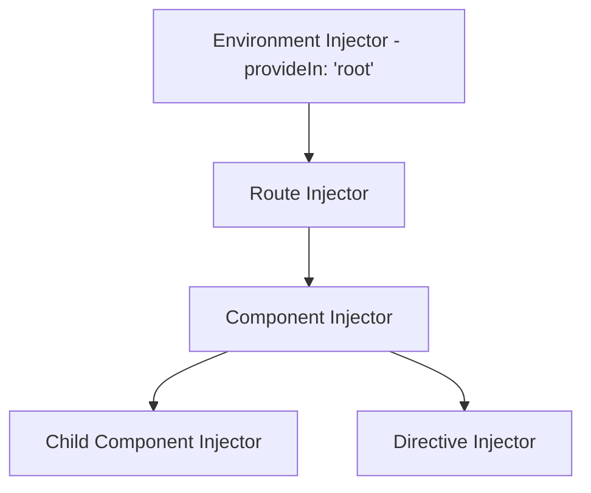

# 04 - Dependency Injection (DI) Mastery

Dependency Injection là "linh hồn" của Angular. Trong các phiên bản gần đây, Angular giới thiệu hàm `inject()`, thay đổi hoàn toàn cách chúng ta tiếp cận DI so với Constructor truyền thống.

## 1. Hàm `inject()` vs Constructor

### Cách cũ (Constructor Injection):
```typescript
constructor(private userService: UserService) {}
```

### Cách mới (inject function):
```typescript
private userService = inject(UserService);
```

**Ưu điểm của `inject()`:**
-   **Đúng kiểu (Type Inference)**: TypeScript tự động nhận diện kiểu dữ liệu.
-   **Sử dụng được trong hàm (Functional API)**: Không nhất thiết phải trong class.
-   **Code sạch hơn**: Đặc biệt khi có nhiều dependencies hoặc kế hoạch (inheritance).

## 2. DI Hierarchy (Hệ thống phân cấp Provider)

Angular có 3 cấp độ Provider chính:

1.  **Root (Environment):** Duy nhất một instance cho toàn bộ ứng dụng.
2.  **Component/Directive:** Một instance mới được tạo cho mỗi component.
3.  **Element (Node):** Instance gắn liền với một phần tử DOM cụ thể.



## 3. Các DI Decorators (Resolution Modifiers)

Khi sử dụng `inject()`, chúng ta có thể tùy chỉnh cách tìm kiếm provider:

```typescript
// Tìm ở các cấp cha, nếu không thấy thì trả về null (không báo lỗi)
const service = inject(OptionalService, { optional: true });

// Chỉ tìm ở chính nó, không tìm lên các cấp cha
const hostService = inject(HostService, { self: true });

// Tìm ở các cấp cha, bỏ qua chính nó
const parentService = inject(ParentService, { skipSelf: true });
```

## 4. Functional Design Patterns với DI

Hàm `inject()` cho phép chúng ta tạo ra các "Utility functions" có sức mạnh của DI.

```typescript
// Một hàm tiện ích dùng chung
export function useUserPermissions() {
  const auth = inject(AuthService);
  const router = inject(Router);

  return computed(() => {
    if (!auth.isLoggedIn()) {
      router.navigate(['/login']);
      return [];
    }
    return auth.permissions();
  });
}

// Cách dùng trong Component
@Component({...})
export class AdminComponent {
  permissions = useUserPermissions(); // Sạch sẽ và tái sử dụng cao
}
```

## 5. Functional Guards & Resolvers

Trong Angular hiện đại, Guards và Resolvers không còn dùng class mà dùng hàm, tận dụng `inject()`.

```typescript
// auth.guard.ts
export const authGuard: CanActivateFn = (route, state) => {
  const authService = inject(AuthService);
  const router = inject(Router);

  return authService.isLoggedIn() ? true : router.parseUrl('/login');
};
```

## 6. Token Injection nâng cao

Sử dụng `InjectionToken` để inject các giá trị cấu hình hoặc interface.

```typescript
export const API_CONFIG = new InjectionToken<string>('api.config');

// Trong main.ts / app.config.ts
bootstrapApplication(AppComponent, {
  providers: [
    { provide: API_CONFIG, useValue: 'https://api.example.com' }
  ]
});
```

---
**Kết luận:** Việc chuyển dịch sang hàm `inject()` không chỉ là thay đổi cú pháp, mà là mở ra cánh cửa cho phong cách lập trình hàm (Functional Programming) trong Angular, giúp code linh hoạt và dễ kiểm thử hơn.
