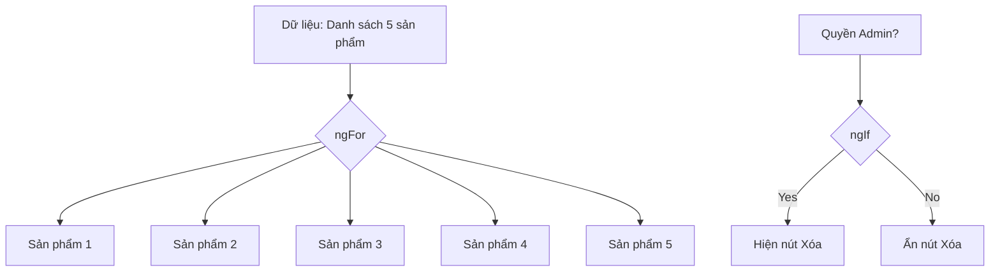

# 04. Directives & Pipes: Công cụ & Bộ lọc 🛠️🧼

Trong Angular, **Directives** giúp bạn điều khiển cấu trúc HTML, còn **Pipes** giúp bạn định dạng lại dữ liệu hiển thị.

## 🛠️ 1. Directives: Những "Công cụ" quyền năng

Hãy tưởng tượng bạn đang xây nhà.
- **Structural Directives (`*ngIf`, `*ngFor`)**: Giống như việc bạn quyết định có xây thêm một bức tường hay không, hoặc xây 10 cái cửa sổ giống hệt nhau.

- **Attribute Directives (`ngClass`, `ngStyle`)**: Giống như việc bạn quyết định sơn tường màu gì hoặc thay đổi kích thước của một căn phòng.

## 🧼 2. Pipes: Những "Bộ lọc" thông minh

Pipes giống như máy lọc nước. Dữ liệu thô đi vào, dữ liệu "đẹp" đi ra.

- **DatePipe**: `2024-05-20` -> `May 20, 2024`
- **CurrencyPipe**: `1000` -> `$1,000.00`
- **UpperCasePipe**: `angular` -> `ANGULAR`

**Cú pháp**: `{{ dữ_liệu | tên_pipe }}`

### 💎 Custom Pipes
Bạn có thể tự tạo ra "máy lọc" riêng cho mình. Ví dụ: một bộ lọc tự động thêm chữ "VNĐ" vào sau số tiền hoặc viết hoa chữ cái đầu tiên.

---
**Bài học tiếp theo:** Một Component từ khi sinh ra đến khi mất đi sẽ trải qua những gì? Hãy tìm hiểu về **Component Lifecycle Hooks**!
