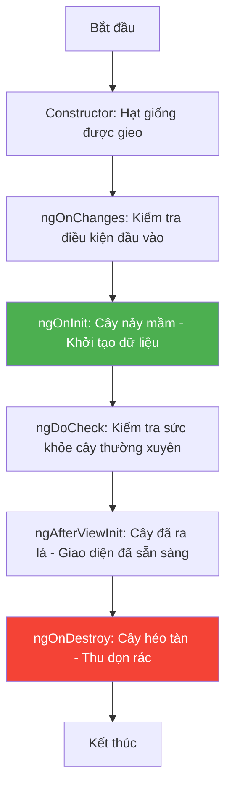

# 05. Vòng đời Component (Lifecycle Hooks) 🌱➡️🌳➡️🍂

Mỗi Component trong Angular đều có một "vòng đời": được sinh ra, lớn lên, thay đổi và cuối cùng là biến mất. Angular cung cấp các **Hooks** (điểm móc) để bạn có thể nhảy vào xử lý code tại đúng thời điểm đó.

## 🕰️ 1. Dòng thời gian Vòng đời

Hãy tưởng tượng bạn đang trồng một cái cây:

## 🔑 2. Các Hooks quan trọng nhất cho Newbie

### 🟢 `ngOnInit` (Lúc nảy mầm)
Đây là nơi quan trọng nhất. Bạn thường dùng nó để gọi API lấy dữ liệu từ server ngay khi Component vừa xuất hiện.
> **Analogy**: Giống như việc bạn vừa mở mắt thức dậy, việc đầu tiên là đi đánh răng rửa mặt để chuẩn bị cho ngày mới.

### 🟡 `ngOnChanges` (Lúc thay đổi)
Chạy khi các dữ liệu truyền từ Component cha vào (@Input) có sự thay đổi.
> **Analogy**: Giống như việc bạn đang mặc áo phông nhưng mẹ bắt bạn thay áo sơ mi để đi tiệc.

### 🔵 `ngAfterViewInit` (Giao diện sẵn sàng)
Chạy khi HTML của Component đã được vẽ xong hoàn toàn. Bạn chỉ nên đụng vào các thẻ HTML (DOM) ở đây.

### 🔴 `ngOnDestroy` (Lúc biến mất)
Chạy ngay trước khi Component bị xóa khỏi màn hình. Dùng để dọn dẹp (hủy các kết nối, xóa bộ nhớ tạm) để tránh làm chậm máy.
> **Analogy**: Giống như trước khi rời khỏi phòng, bạn phải tắt đèn và khóa cửa.

---
**Bài học tiếp theo:** Làm thế nào để các Component cha và con "trao đổi chiêu thức" với nhau? Khám phá **Component Communication**!
