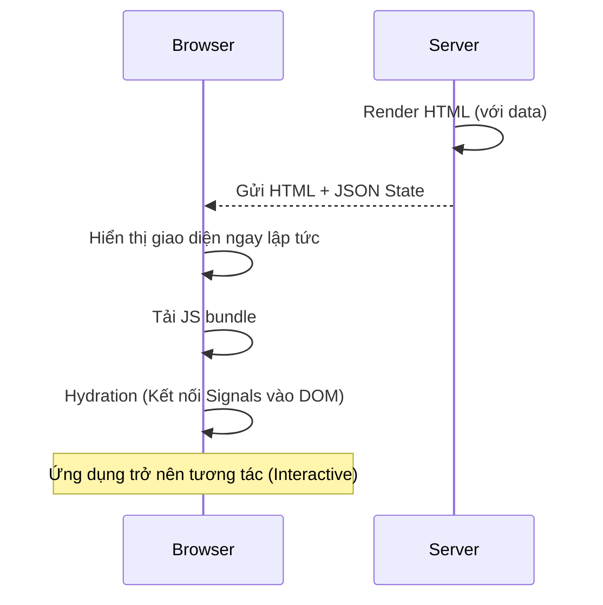

# 05 - Enterprise State & HTTP

Xây dựng ứng dụng doanh nghiệp đòi hỏi cách quản lý trạng thái (state) và xử lý dữ liệu (HTTP) bền vững. Trong Modern Angular, chúng ta kết hợp sức mạnh của Signals cho UI State và RxJS cho Data Streams.

## 1. State Management với Signals

Với Signals, bạn không nhất thiết phải dùng Redux hay NgRx cho mọi dự án. Một Service đơn giản với `signal` và `computed` là đủ cho hầu hết các trường hợp.

```typescript
@Injectable({ providedIn: 'root' })
export class ProductStore {
  // Private state
  private state = signal({
    products: [] as Product[],
    loading: false,
    filter: ''
  });

  // Selectors (Public computed signals)
  products = computed(() => this.state().products);
  filteredProducts = computed(() => 
    this.state().products.filter(p => p.name.includes(this.state().filter))
  );

  // Actions
  async loadProducts() {
    this.state.update(s => ({ ...s, loading: true }));
    const data = await lastValueFrom(this.http.get<Product[]>('/api/products'));
    this.state.update(s => ({ ...s, products: data, loading: false }));
  }
}
```

## 2. Functional HTTP Interceptors

Angular v15+ giới thiệu Functional Interceptors, nhẹ nhàng và dễ cấu hình hơn class-based.

```typescript
// auth.interceptor.ts
export const authInterceptor: HttpInterceptorFn = (req, next) => {
  const token = inject(AuthService).getToken();
  
  if (token) {
    const cloned = req.clone({
      setHeaders: { Authorization: `Bearer ${token}` }
    });
    return next(cloned);
  }
  
  return next(req);
};

// Đăng ký trong app.config.ts
export const appConfig: ApplicationConfig = {
  providers: [
    provideHttpClient(
      withInterceptors([authInterceptor, loggingInterceptor])
    )
  ]
};
```

## 3. SSR & Client Hydration

Angular hiện đại hỗ trợ **Server Side Rendering (SSR)** và **Hydration** (Event Replay) cực kỳ mượt mà.

### Cơ chế Hydration:
Thay vì xóa toàn bộ DOM do Server render và vẽ lại từ đầu, Angular sẽ "hồi sinh" (hydrate) các phần tử DOM hiện có, gắn các event listeners và kết nối chúng với Signals.



## 4. Resource API (Tính năng mới đang thử nghiệm)

Trong tương lai gần (v19+), Angular sẽ giới thiệu `resource()` để đơn giản hóa việc fetch dữ liệu đồng bộ với Signals.

```typescript
userResource = resource({
  request: () => ({ id: this.userId() }),
  loader: ({ request }) => fetch(`.../users/${request.id}`).then(res => res.json())
});

// Template: userResource.value()?.name
```

## 5. Tối ưu hóa Performance với RxJS & Signals

Sử dụng `toSignal` để chuyển đổi các stream dữ liệu từ HttpClient (RxJS) sang Signals để dùng trong template.

```typescript
export class UserComponent {
  private userService = inject(UserService);
  
  // Chuyển Observable thành Signal
  users = toSignal(this.userService.getAll(), { initialValue: [] });
}
```

---
**Ghi chú:** Luôn sử dụng RxJS cho các tác vụ bất đồng bộ (Async) phức tạp như Search (switchMap, debounceTime) và dùng Signals để lưu trữ kết quả cuối cùng hiển thị lên UI.
