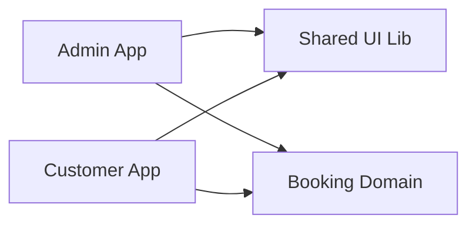
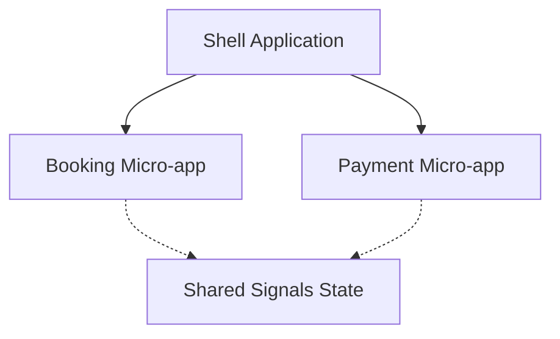

# 06 - Advanced Patterns & The Future

Trong chương cuối này, chúng ta sẽ xem xét cách tổ chức ứng dụng Angular ở quy mô lớn (Enterprise Scale) và hướng đi tương lai của framework.

## 1. Domain-Driven Design (DDD) & Hexagonal Architecture

Với Standalone Components, việc áp dụng DDD trở nên dễ dàng hơn bao giờ hết. Chúng ta chia ứng dụng theo các Domain (Lĩnh vực nghiệp vụ) thay vì theo loại file (Component, Service).

```text
src/app/
  booking/
    data-access/    (Services, Signals State)
    feature-shell/  (Smart Components, Routes)
    ui/             (Dumb Components, Shared UI)
    util/           (Pipes, Validators)
  check-in/
    ...
  shared/
    ...
```

## 2. Monorepos với Nx

Đối với các hệ thống lớn có nhiều ứng dụng dùng chung thư viện, **Nx** là công cụ không thể thiếu.

-   **Module Boundaries**: Đảm bảo `booking` domain không thể import trực tiếp từ `check-in` domain.
-   **Computation Caching**: Không build lại những gì không thay đổi.
-   **Graph Visualization**: Xem sơ đồ phụ thuộc của toàn bộ dự án.



## 3. Zoneless Angular: Đỉnh cao hiệu năng

Mục tiêu cuối cùng của Signals là loại bỏ hoàn toàn `Zone.js`. Một ứng dụng Zoneless sẽ:
-   Gói bundle nhỏ hơn (giảm ~30KB).
-   Thời gian render nhanh hơn vì không cần chạy Change Detection cho toàn bộ ứng dụng.
-   Dễ debug hơn (không còn "Black magic" từ Zone.js).

### Cách kích hoạt Zoneless (v18+):
```typescript
// app.config.ts
export const appConfig: ApplicationConfig = {
  providers: [
    provideExperimentalZonelessChangeDetection()
  ]
};
```

## 4. Signal Store (NgRx SignalStore)

Mẫu thiết kế State Management hiện đại nhất hiện nay cho Angular, tối ưu cho Signals và hỗ trợ Functional Mixins.

```typescript
export const UserStore = signalStore(
  { providedIn: 'root' },
  withState({ users: [], loading: false }),
  withMethods((store) => {
    const userService = inject(UserService);
    return {
      loadAll: rxMethod<void>(pipe(
        tap(() => patchState(store, { loading: true })),
        switchMap(() => userService.getAll().pipe(
          tap(users => patchState(store, { users, loading: false }))
        ))
      ))
    };
  })
);
```

## 5. Micro Frontends với Module Federation

Angular hỗ trợ chia nhỏ ứng dụng lớn thành các ứng dụng nhỏ độc lập, có thể deploy riêng biệt nhưng chạy chung trong một "Shell".



## Tổng kết Series

Modern Angular là một framework hoàn toàn mới trong lớp vỏ cũ. Bằng cách nắm vững:
1.  **Signals**: Cho Reactivity.
2.  **Standalone**: Cho kiến trúc.
3.  **Functional APIs**: Cho sự linh hoạt.
4.  **Control Flow**: Cho hiệu năng.

Bạn đã sẵn sàng để xây dựng những ứng dụng web nhanh nhất, bền vững nhất hiện nay.

---
*Chúc bạn thành công trên con đường trở thành Angular Expert!*
