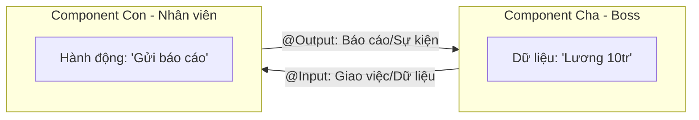

# 06. Giao tiếp giữa các Component 👨‍👩‍👦

Trong một ứng dụng lớn, các Component không thể sống cô lập. Chúng cần nói chuyện và trao đổi dữ liệu với nhau.

## 🤝 1. Cha và Con nói chuyện như thế nào?

Hãy tưởng tượng gia đình Component:

### 📥 a. @Input: Cha gửi cho Con
- **Mục đích**: Truyền dữ liệu từ bên ngoài vào trong Component.
- **Analogy**: Giống như người cha đưa tiền tiêu vặt cho con. Người con chỉ việc nhận và sử dụng.
- **Cú pháp**: 
    - Cha: `<app-child [money]="1000"></app-child>`
    - Con: `@Input() money: number = 0;`

### 📤 b. @Output & EventEmitter: Con báo cáo cho Cha
- **Mục đích**: Phát ra một sự kiện để báo cho Component cha biết.
- **Analogy**: Giống như khi người con làm xong bài tập, người con hét lên "Con xong rồi!" để cha biết.
- **Cú pháp**: 
    - Con: `@Output() finished = new EventEmitter<void>();`
    - Cha: `<app-child (finished)="onChildFinished()"></app-child>`

## 📞 2. Khi nào dùng cái gì?

| Tình huống | Cách dùng |
| :--- | :--- |
| **Cha muốn truyền cấu hình, dữ liệu cho Con** | `@Input` |
| **Con muốn báo là nút đã được click, Form đã gửi** | `@Output` |
| **Hai Component không liên quan gì nhau** | `Service` (Chúng ta sẽ học ở bài 11) |

---
**Bài học tiếp theo:** Làm quen với thế giới của các dòng dữ liệu bất tận - **RxJS & Observables**!
