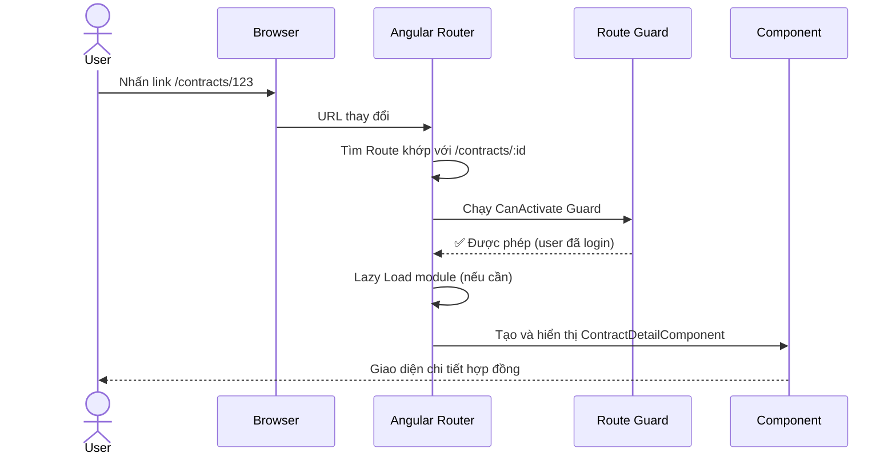
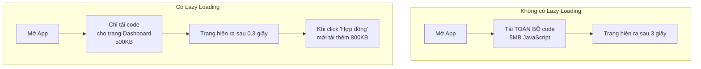
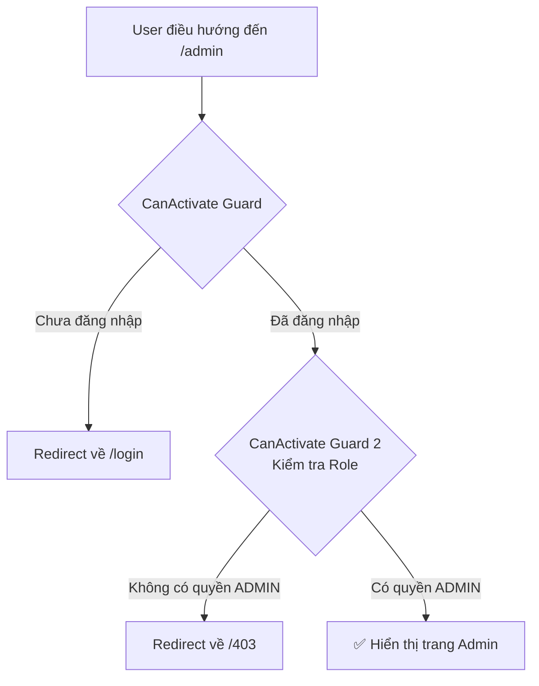

# 07 - Routing & Navigation — Điều hướng trong Ứng dụng 🗺️

Routing là xương sống của một Single Page Application (SPA). Thay vì tải lại trang web mỗi khi người dùng chuyển trang, Angular Router **tráo đổi component** trong trang một cách mượt mà mà không reload toàn bộ.

> **Ví dụ thực tế:** Như một trung tâm thương mại. URL là biển số tầng/khu, Router là nhân viên lễ tân biết đường dẫn bạn đến đúng cửa hàng, và Component là cửa hàng đó. Bạn không cần ra ngoài rồi vào lại trung tâm mỗi lần đổi cửa hàng.

---

## 1. Cơ chế hoạt động của Router



---

## 2. Cấu hình Route cơ bản

### Bước 1: Định nghĩa Routes

```typescript
// app.routes.ts
import { Routes } from '@angular/router';

export const routes: Routes = [
  // Route mặc định — Redirect về trang chủ
  {
    path: '',
    redirectTo: '/dashboard',
    pathMatch: 'full'
  },

  // Route tĩnh
  {
    path: 'dashboard',
    component: DashboardComponent,
    title: 'Tổng quan' // Tự động cập nhật <title> của trang
  },

  // Route có tham số động (:id)
  {
    path: 'contracts/:id',
    component: ContractDetailComponent,
    title: 'Chi tiết hợp đồng'
  },

  // Route lồng nhau (Nested Routes)
  {
    path: 'customers',
    component: CustomerLayoutComponent,
    children: [
      { path: '', component: CustomerListComponent },
      { path: ':id', component: CustomerDetailComponent },
      { path: ':id/edit', component: CustomerEditComponent }
    ]
  },

  // Wildcard — Trang 404
  {
    path: '**',
    component: NotFoundComponent
  }
];
```

### Bước 2: Đăng ký trong `app.config.ts`

```typescript
// app.config.ts
import { provideRouter, withComponentInputBinding } from '@angular/router';

export const appConfig: ApplicationConfig = {
  providers: [
    provideRouter(
      routes,
      withComponentInputBinding(), // 🔥 Tự động bind route params vào @Input
      withHashLocation()           // Dùng hash (#) thay vì HTML5 history
    )
  ]
};
```

### Bước 3: Thêm `<router-outlet>` vào template

```html
<!-- app.component.html -->
<nav>
  <a routerLink="/dashboard" routerLinkActive="active">Dashboard</a>
  <a routerLink="/contracts" routerLinkActive="active">Hợp đồng</a>
  <a routerLink="/customers" routerLinkActive="active">Khách hàng</a>
</nav>

<!-- 👇 Đây là nơi Angular "lắp" component vào -->
<router-outlet></router-outlet>
```

---

## 3. Đọc Route Parameters

### Cách hiện đại: `withComponentInputBinding()` + `@Input`

```typescript
// Cách mới (Angular v16+) — Đơn giản và clean nhất
@Component({ standalone: true, template: `...` })
export class ContractDetailComponent implements OnInit {
  // Angular tự động inject route param vào @Input
  @Input() id!: string;
  
  private service = inject(ContractService);
  contract = signal<Contract | null>(null);

  ngOnInit(): void {
    // Dùng ngay this.id mà không cần subscribe
    this.service.getById(this.id).subscribe(data => this.contract.set(data));
  }
}
```

### Cách truyền thống: `ActivatedRoute`

```typescript
@Component({ standalone: true, template: `...` })
export class ContractDetailComponent implements OnInit {
  private route = inject(ActivatedRoute);
  private service = inject(ContractService);
  contract = signal<Contract | null>(null);

  ngOnInit(): void {
    // Subscribe vì params có thể thay đổi (user nhấn back/forward)
    this.route.paramMap.pipe(
      switchMap(params => {
        const id = params.get('id')!;
        return this.service.getById(id);
      })
    ).subscribe(data => this.contract.set(data));
  }
}
```

### Đọc Query Parameters (`?status=ACTIVE&page=1`)

```typescript
@Component({ standalone: true, template: `...` })
export class ContractListComponent implements OnInit {
  private route = inject(ActivatedRoute);
  private router = inject(Router);

  statusFilter = signal('ALL');
  currentPage = signal(1);

  ngOnInit(): void {
    this.route.queryParamMap.subscribe(params => {
      this.statusFilter.set(params.get('status') ?? 'ALL');
      this.currentPage.set(Number(params.get('page') ?? 1));
    });
  }

  onStatusChange(status: string): void {
    // Cập nhật URL mà không reload trang
    this.router.navigate([], {
      relativeTo: this.route,
      queryParams: { status, page: 1 },
      queryParamsHandling: 'merge' // Giữ lại các params khác
    });
  }
}
```

---

## 4. Lazy Loading — Tải Component khi cần

Thay vì tải toàn bộ ứng dụng khi mở trang, Lazy Loading chỉ tải code khi người dùng thực sự cần.



```typescript
// app.routes.ts — Lazy Loading với loadComponent
export const routes: Routes = [
  {
    path: 'dashboard',
    // Chỉ import khi user vào trang này
    loadComponent: () =>
      import('./features/dashboard/dashboard.component')
        .then(m => m.DashboardComponent)
  },

  // Lazy load cả một nhóm routes (Feature Module)
  {
    path: 'contracts',
    loadChildren: () =>
      import('./features/contracts/contracts.routes')
        .then(m => m.CONTRACT_ROUTES)
  },

  {
    path: 'reports',
    loadChildren: () =>
      import('./features/reports/reports.routes')
        .then(m => m.REPORT_ROUTES)
  }
];

// contracts/contracts.routes.ts — Routes của feature
export const CONTRACT_ROUTES: Routes = [
  { path: '', component: ContractListComponent },
  { path: 'new', component: ContractCreateComponent },
  { path: ':id', component: ContractDetailComponent },
  { path: ':id/edit', component: ContractEditComponent }
];
```

---

## 5. Route Guards — Bảo vệ các trang

Guards là các hàm kiểm tra điều kiện **trước khi** cho phép người dùng vào một trang.



```typescript
// auth.guard.ts — Functional Guard (Angular v15+)
export const authGuard: CanActivateFn = (route, state) => {
  const authService = inject(AuthService);
  const router = inject(Router);

  if (authService.isLoggedIn()) {
    return true;
  }

  // Lưu URL muốn vào để sau khi login redirect đúng trang
  return router.createUrlTree(['/login'], {
    queryParams: { returnUrl: state.url }
  });
};

// role.guard.ts — Kiểm tra quyền truy cập
export const roleGuard = (requiredRole: string): CanActivateFn => {
  return () => {
    const authService = inject(AuthService);
    const router = inject(Router);

    if (authService.hasRole(requiredRole)) {
      return true;
    }

    return router.createUrlTree(['/403']);
  };
};

// app.routes.ts — Áp dụng Guards
export const routes: Routes = [
  {
    path: 'admin',
    canActivate: [authGuard, roleGuard('ADMIN')],
    loadComponent: () => import('./admin/admin.component')
  },
  {
    path: 'contracts',
    canActivate: [authGuard],
    // Áp dụng guard cho TẤT CẢ các child routes
    canActivateChild: [authGuard],
    loadChildren: () => import('./features/contracts/contracts.routes')
  }
];
```

---

## 6. Điều hướng bằng code (Programmatic Navigation)

```typescript
@Component({ standalone: true, template: `...` })
export class ContractCreateComponent {
  private router = inject(Router);
  private route = inject(ActivatedRoute);

  async onSubmit(formData: ContractForm): Promise<void> {
    const newContract = await this.contractService.create(formData);
    
    // Điều hướng đến trang chi tiết sau khi tạo thành công
    this.router.navigate(['/contracts', newContract.id]);
    
    // Hoặc dùng relative navigation
    this.router.navigate(['..', newContract.id], { relativeTo: this.route });
    
    // Hoặc mở trong tab mới
    window.open(`/contracts/${newContract.id}`, '_blank');
  }

  onCancel(): void {
    // Quay lại trang trước
    this.router.navigate(['/contracts']);
  }
}
```

---

## 7. Resolver — Tải data trước khi hiển thị trang

Resolver tải dữ liệu **trước khi component được khởi tạo**, tránh hiện trang rỗng rồi mới load.

```typescript
// contract-detail.resolver.ts
export const contractDetailResolver: ResolveFn<Contract> = (route) => {
  const service = inject(ContractService);
  const id = route.paramMap.get('id')!;
  
  return service.getById(id).pipe(
    catchError(() => {
      inject(Router).navigate(['/404']);
      return EMPTY;
    })
  );
};

// app.routes.ts
{
  path: 'contracts/:id',
  component: ContractDetailComponent,
  resolve: {
    contract: contractDetailResolver // Tên 'contract' sẽ có trong route.data
  }
}

// ContractDetailComponent
@Component({ standalone: true, template: `...` })
export class ContractDetailComponent implements OnInit {
  private route = inject(ActivatedRoute);
  contract = signal<Contract | null>(null);

  ngOnInit(): void {
    // Dữ liệu đã được load sẵn bởi Resolver
    this.contract.set(this.route.snapshot.data['contract']);
  }
}
```

---

## 8. Cấu trúc thư mục Enterprise

```
src/
├── app/
│   ├── app.routes.ts         ← Routes chính
│   ├── core/
│   │   └── guards/
│   │       ├── auth.guard.ts
│   │       └── role.guard.ts
│   └── features/
│       ├── dashboard/
│       │   └── dashboard.component.ts
│       ├── contracts/
│       │   ├── contracts.routes.ts     ← Feature routes
│       │   ├── list/
│       │   ├── detail/
│       │   └── create/
│       └── customers/
│           ├── customers.routes.ts
│           └── ...
```

---

**Takeaway:**
- **Lazy Loading** là bắt buộc trong dự án enterprise — giảm thời gian tải ban đầu đáng kể.
- **Guards** bảo vệ trang theo Authentication (đăng nhập) và Authorization (quyền).
- **`withComponentInputBinding()`** giúp đọc route params sạch hơn qua `@Input`.
- **Resolver** giải quyết vấn đề "màn hình trống" khi chờ dữ liệu load.
