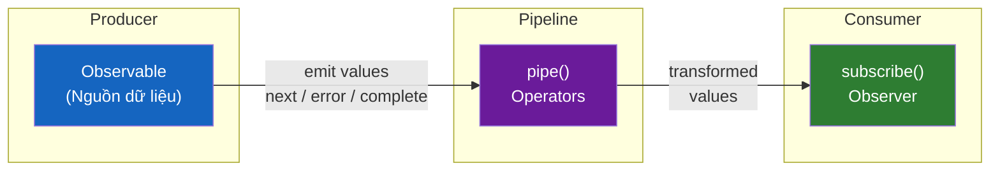
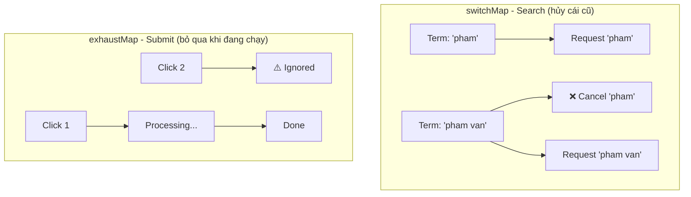
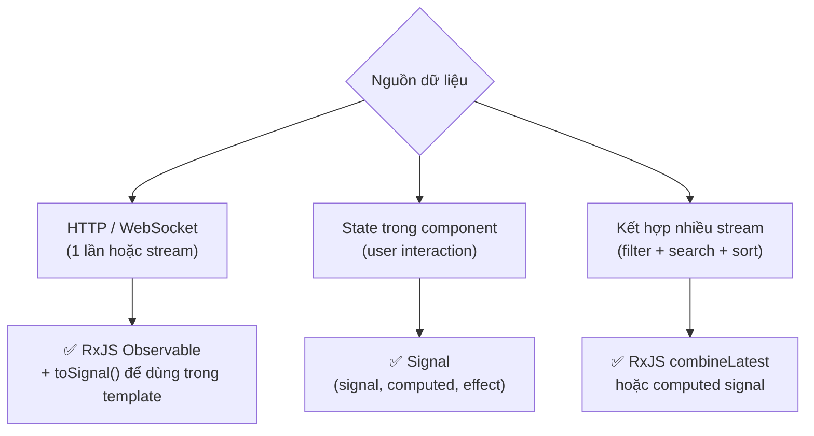

# 07. RxJS & Observables — Làm chủ luồng dữ liệu bất đồng bộ 🌊

> **Mục tiêu**: Hiểu Observable/Observer/Subject, thành thạo các operator quan trọng nhất, quản lý subscription đúng cách với `takeUntilDestroyed`, và áp dụng RxJS vào nghiệp vụ banking phức tạp.

---

## 🗺️ Mental Model: RxJS là gì?



**Khác biệt so với Promise:**
| | Promise | Observable |
|---|---|---|
| Số lượng giá trị | 1 | Nhiều (stream) |
| Lazy? | Không (chạy ngay) | Có (chạy khi subscribe) |
| Có thể cancel? | Không | Có (unsubscribe) |
| Đồng bộ? | Không | Cả hai đều được |
| Retry? | Phải tự làm | Có `retry()` operator |

---

## 1. Observable cơ bản — Tạo và subscribe

```typescript
import { Observable, of, from, interval, fromEvent } from 'rxjs';

// Tạo observable thủ công
const caseStatus$ = new Observable<string>(subscriber => {
  subscriber.next('PENDING');
  subscriber.next('IN_REVIEW');
  subscriber.next('APPROVED');
  subscriber.complete();
  // subscriber.error(new Error('Lỗi phê duyệt')); // hoặc emit lỗi
});

// Subscribe — bắt đầu nhận dữ liệu
const subscription = caseStatus$.subscribe({
  next: (status) => console.log('Trạng thái:', status),
  error: (err)   => console.error('Lỗi:', err),
  complete: ()   => console.log('Luồng hoàn thành')
});

// Nhớ unsubscribe khi không dùng nữa!
subscription.unsubscribe();

// --- Các cách tạo Observable phổ biến ---
of(1, 2, 3)                    // emit từng giá trị rồi complete
from([1, 2, 3])                // từ array/Promise/iterable
interval(1000)                 // emit số tăng dần mỗi 1 giây
fromEvent(button, 'click')     // từ DOM event
```

---

## 2. Subject — Vừa là Observable vừa là Observer

```typescript
import { Subject, BehaviorSubject, ReplaySubject } from 'rxjs';

// Subject: Multicast — nhiều subscriber nhận cùng 1 stream
const notification$ = new Subject<string>();
notification$.subscribe(msg => console.log('User A nhận:', msg));
notification$.subscribe(msg => console.log('User B nhận:', msg));
notification$.next('Hồ sơ của bạn đã được phê duyệt'); // cả A và B đều nhận

// BehaviorSubject: Có giá trị ban đầu, subscriber mới nhận ngay giá trị cuối
const currentCase$ = new BehaviorSubject<CaseDetail | null>(null);
currentCase$.subscribe(c => console.log('Case hiện tại:', c?.caseCode));
currentCase$.next({ caseCode: 'PDMS-001', status: 'PENDING' } as CaseDetail);
// Subscriber mới join lúc này sẽ nhận ngay 'PDMS-001'
currentCase$.subscribe(c => console.log('Subscriber mới:', c?.caseCode)); 
console.log('Giá trị hiện tại:', currentCase$.getValue());

// ReplaySubject: Phát lại N giá trị cuối cho subscriber mới
const recentSearches$ = new ReplaySubject<string>(5); // replay 5 cái cuối
```

---

## 3. Operators quan trọng nhất — "Bộ lọc" của pipeline

### 3.1 Transformation Operators

```typescript
import { map, switchMap, mergeMap, concatMap, exhaustMap } from 'rxjs/operators';

// map: Biến đổi từng giá trị
this.caseService.getAll().pipe(
  map(cases => cases.filter(c => c.status === 'PENDING')),
  map(cases => cases.map(c => ({ ...c, displayName: `[${c.caseCode}] ${c.borrowerName}` })))
).subscribe(displayCases => this.cases.set(displayCases));

// switchMap: Khi có giá trị mới → HUỶ request cũ, bắt đầu request mới
// ✅ Dùng cho: search (mỗi keystroke), route params thay đổi
this.searchTerm$.pipe(
  debounceTime(300),
  switchMap(term => this.caseService.search(term)) // auto cancel nếu term đổi
).subscribe(results => this.results.set(results));

// mergeMap: Chạy song song, không hủy
// ✅ Dùng cho: upload nhiều file cùng lúc
selectedDocIds$.pipe(
  mergeMap(docId => this.docService.upload(docId)) // upload song song
).subscribe(result => console.log('Uploaded:', result));

// concatMap: Chạy tuần tự, đợi cái trước xong mới chạy cái sau
// ✅ Dùng cho: audit log, sequential processing
approvalActions$.pipe(
  concatMap(action => this.approvalService.processStep(action)) // FIFO
).subscribe();

// exhaustMap: Bỏ qua trigger mới nếu đang xử lý
// ✅ Dùng cho: submit button (tránh double-submit)
submitClicks$.pipe(
  exhaustMap(() => this.formService.submit(formData)) // bỏ qua click thứ 2
).subscribe();
```



### 3.2 Filtering Operators

```typescript
import { filter, take, takeWhile, skip, debounceTime, distinctUntilChanged, throttleTime } from 'rxjs/operators';

// filter: Chỉ cho giá trị thỏa mãn đi qua
cases$.pipe(
  filter(cases => cases.length > 0),
  filter(cases => cases.some(c => c.status === 'PENDING'))
)

// debounceTime: Chờ sau khi giá trị dừng thay đổi
searchInput$.pipe(debounceTime(300)) // Chờ 300ms sau khi ngừng gõ

// distinctUntilChanged: Bỏ qua nếu giá trị giống cái trước
searchInput$.pipe(
  debounceTime(300),
  distinctUntilChanged() // Không search lại nếu term không đổi
)

// take: Chỉ lấy N giá trị đầu tiên rồi complete
this.caseService.getById(id).pipe(take(1)).subscribe() // HTTP → 1 lần rồi xong

// throttleTime: Chỉ nhận tối đa 1 giá trị mỗi N ms
scrollEvent$.pipe(throttleTime(200)) // Scroll throttle
```

### 3.3 Combination Operators

```typescript
import { forkJoin, combineLatest, zip, merge, concat } from 'rxjs';

// forkJoin: Chờ TẤT CẢ complete rồi emit 1 lần
// ✅ Dùng cho: Load nhiều API cùng lúc khi vào trang
forkJoin({
  caseDetail: this.caseService.getById(caseId),
  documents: this.docService.getByCaseId(caseId),
  approvalHistory: this.approvalService.getHistory(caseId),
  borrowerInfo: this.cifService.getByCaseId(caseId)
}).subscribe(({ caseDetail, documents, approvalHistory, borrowerInfo }) => {
  // Tất cả đã load xong, dùng cả 4
  this.caseDetail.set(caseDetail);
  this.documents.set(documents);
});

// combineLatest: Emit mỗi khi BẤT KỲ source nào thay đổi
// ✅ Dùng cho: Filter/sort khi nhiều điều kiện thay đổi
combineLatest({
  cases: this.cases$,
  statusFilter: this.statusFilter$,
  dateRange: this.dateRange$
}).pipe(
  map(({ cases, statusFilter, dateRange }) =>
    cases.filter(c =>
      (statusFilter === 'ALL' || c.status === statusFilter) &&
      c.createdAt >= dateRange.from &&
      c.createdAt <= dateRange.to
    )
  )
).subscribe(filtered => this.filteredCases.set(filtered));
```

---

## 4. Error Handling — Xử lý lỗi trong stream

```typescript
import { catchError, retry, retryWhen, delay, throwError, EMPTY } from 'rxjs';

this.caseService.getById(caseId).pipe(
  // retry(3): tự retry 3 lần trước khi throw
  retry(3),

  // retryWhen: retry với delay tăng dần (exponential backoff)
  retryWhen(errors => errors.pipe(
    delay(1000), // chờ 1 giây
    take(3)      // tối đa 3 lần
  )),

  // catchError: bắt lỗi, trả về giá trị mặc định hoặc throw lại
  catchError(err => {
    if (err.status === 404) {
      return of(null); // trả về null thay vì throw
    }
    if (err.status === 403) {
      this.router.navigate(['/forbidden']);
      return EMPTY; // không emit gì cả
    }
    return throwError(() => err); // ném lại lỗi
  })
).subscribe(caseDetail => {
  this.caseDetail.set(caseDetail);
});
```

---

## 5. Quản lý Subscription — Chống Memory Leak ⚠️

### ❌ Vấn đề: Quên unsubscribe

```typescript
// ❌ SAI — Memory leak! subscription sống mãi dù component đã destroy
ngOnInit() {
  this.caseService.getLiveCases().subscribe(cases => {
    this.cases = cases;
  });
}
```

### ✅ Cách 1: `takeUntilDestroyed` — Hiện đại nhất (Angular 16+)

```typescript
import { takeUntilDestroyed } from '@angular/core/rxjs-interop';
import { DestroyRef, inject } from '@angular/core';

@Component({ standalone: true, template: '...' })
export class CaseListComponent implements OnInit {
  private destroyRef = inject(DestroyRef);

  ngOnInit() {
    // Tự động unsubscribe khi component destroy
    this.caseService.getLiveCases().pipe(
      takeUntilDestroyed(this.destroyRef)
    ).subscribe(cases => this.cases.set(cases));

    // Hoặc gọi trong constructor (không cần truyền destroyRef)
  }
}

// Dùng trong constructor (cách ngắn nhất)
@Component({ standalone: true, template: '...' })
export class CaseSearchComponent {
  private search$ = new Subject<string>();

  constructor(private caseService: CaseService) {
    this.search$.pipe(
      debounceTime(300),
      switchMap(term => this.caseService.search(term)),
      takeUntilDestroyed() // Không cần tham số nếu dùng trong constructor
    ).subscribe(results => this.results.set(results));
  }
}
```

### ✅ Cách 2: `async` pipe trong template

```typescript
// Service trả về Observable
@Injectable({ providedIn: 'root' })
export class CaseService {
  getCases(): Observable<Case[]> {
    return this.http.get<Case[]>('/api/cases');
  }
}

// Component — KHÔNG subscribe thủ công
@Component({
  template: `
    @if (cases$ | async; as cases) {
      @for (case of cases; track case.id) {
        <app-case-card [case]="case" />
      }
    } @else {
      <app-loading />
    }
  `
})
export class CaseListComponent {
  // async pipe tự subscribe + unsubscribe
  cases$ = this.caseService.getCases();
  constructor(private caseService: CaseService) {}
}
```

### ✅ Cách 3: `toSignal()` — Kết hợp RxJS + Signals

```typescript
import { toSignal } from '@angular/core/rxjs-interop';

@Component({
  template: `
    @for (case of cases(); track case.id) {
      <app-case-card [case]="case" />
    }
  `
})
export class CaseListComponent {
  // toSignal tự quản lý subscription
  cases = toSignal(this.caseService.getCases(), { initialValue: [] });

  constructor(private caseService: CaseService) {}
}
```

---

## 6. Ứng dụng thực tế: Live Approval Dashboard

```typescript
@Component({
  selector: 'app-approval-dashboard',
  standalone: true,
  template: `
    <div class="stats">
      <span>Chờ duyệt: {{ pendingCount() }}</span>
      <span>Đã duyệt hôm nay: {{ approvedToday() }}</span>
    </div>

    @for (notification of notifications(); track notification.id) {
      <div class="notification" [class.urgent]="notification.priority === 'HIGH'">
        {{ notification.message }}
      </div>
    }
  `
})
export class ApprovalDashboardComponent {
  // WebSocket stream — real-time cases
  private liveUpdates$ = this.wsService.connect('/ws/approvals').pipe(
    retry({ count: 5, delay: 2000 }), // retry 5 lần nếu mất kết nối
    takeUntilDestroyed()
  );

  // Derived streams
  private pending$ = this.liveUpdates$.pipe(
    filter(update => update.type === 'CASE_UPDATED'),
    map(update => update.pendingCases),
    startWith([])
  );

  pendingCount = toSignal(
    this.pending$.pipe(map(cases => cases.length)),
    { initialValue: 0 }
  );

  approvedToday = toSignal(
    timer(0, 60_000).pipe( // refresh mỗi phút
      switchMap(() => this.statsService.getApprovedTodayCount())
    ),
    { initialValue: 0 }
  );

  notifications = toSignal(
    this.liveUpdates$.pipe(
      filter(u => u.type === 'NOTIFICATION'),
      scan((acc, notif) => [notif, ...acc].slice(0, 10), [] as Notification[])
    ),
    { initialValue: [] }
  );

  constructor(
    private wsService: WebSocketService,
    private statsService: StatsService
  ) {}
}
```

---

## 7. Khi nào dùng RxJS vs Signal?



---

## 📚 Tóm tắt Operators Must-know

| Category | Operator | Dùng khi |
|---|---|---|
| Transform | `map` | Biến đổi giá trị |
| Transform | `switchMap` | Search, route change |
| Transform | `mergeMap` | Upload song song |
| Transform | `concatMap` | Sequential processing |
| Transform | `exhaustMap` | Prevent double submit |
| Filter | `filter` | Lọc điều kiện |
| Filter | `debounceTime` | Search input |
| Filter | `distinctUntilChanged` | Tránh duplicate |
| Filter | `take(1)` | HTTP one-shot |
| Combination | `forkJoin` | Load nhiều API |
| Combination | `combineLatest` | Multi-filter |
| Error | `catchError` | Xử lý lỗi |
| Error | `retry` | Auto retry |
| Lifecycle | `takeUntilDestroyed` | Auto cleanup |

> **Bài tiếp theo →** [[08-Signals-The-Modern-Reactivity]] — Signals là gì và tại sao Angular đang migrate sang Signals
