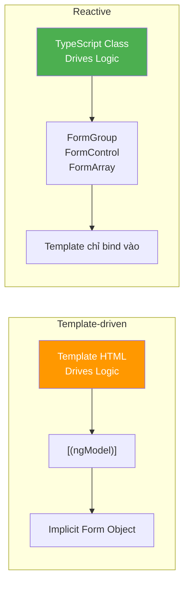
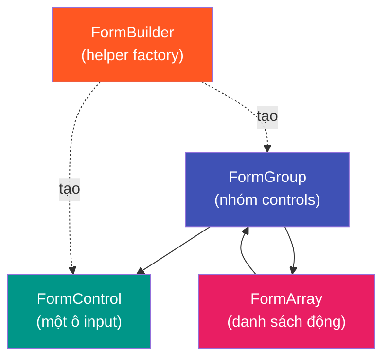
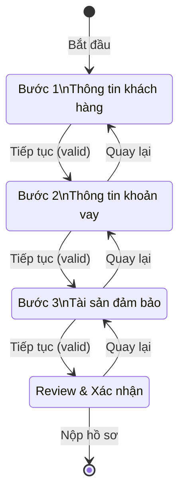

# 08 - Reactive Forms — Xây dựng Form Nghiệp vụ Phức tạp 📋

Form trong dự án ngân hàng/doanh nghiệp không đơn giản chỉ là ô nhập liệu. Chúng có **validation phức tạp**, **phụ thuộc điều kiện**, **logic nghiệp vụ**, và **nhiều bước**. Angular **Reactive Forms** được thiết kế chính xác để giải quyết vấn đề này.

> **Template-driven Forms** (dùng `ngModel`) phù hợp cho form đơn giản.
> **Reactive Forms** là lựa chọn **bắt buộc** cho form doanh nghiệp phức tạp.

---

## 1. Reactive Forms vs Template-driven Forms



| Tiêu chí | Template-driven | Reactive |
|:---|:---:|:---:|
| Kiểm soát logic | Template | **TypeScript** |
| Unit Testing | Khó | **Dễ** |
| Form phức tạp | Khó | **Phù hợp** |
| Dynamic controls | Rất khó | **FormArray** |
| Validation async | Khó | **Dễ** |

---

## 2. Các building blocks



---

## 3. Form cơ bản — Thông tin hợp đồng

```typescript
// contract-form.component.ts
@Component({
  standalone: true,
  imports: [ReactiveFormsModule],
  template: `
    <form [formGroup]="form" (ngSubmit)="onSubmit()">
      
      <!-- Thông tin khách hàng -->
      <section formGroupName="customer">
        <input formControlName="fullName" placeholder="Họ và tên">
        @if (getError('customer.fullName', 'required')) {
          <span class="error">Vui lòng nhập họ tên</span>
        }

        <input formControlName="idNumber" placeholder="Số CMND/CCCD">
        @if (getError('customer.idNumber', 'pattern')) {
          <span class="error">CCCD phải gồm 12 chữ số</span>
        }
      </section>

      <!-- Thông tin khoản vay -->
      <section formGroupName="loan">
        <input formControlName="amount" type="number" placeholder="Số tiền vay">
        <input formControlName="termMonths" type="number" placeholder="Thời hạn (tháng)">
        <input formControlName="interestRate" type="number" placeholder="Lãi suất (%)">

        <!-- Hiển thị số tiền trả hàng tháng -->
        <p>Trả hàng tháng: {{ monthlyPayment() | currency:'VND':'symbol':'1.0-0' }}</p>
      </section>

      <button type="submit" [disabled]="form.invalid || isSubmitting()">
        {{ isSubmitting() ? 'Đang lưu...' : 'Tạo hợp đồng' }}
      </button>
    </form>
  `
})
export class ContractFormComponent {
  private fb = inject(FormBuilder);
  isSubmitting = signal(false);

  form = this.fb.group({
    customer: this.fb.group({
      fullName:    ['', [Validators.required, Validators.minLength(3)]],
      idNumber:    ['', [Validators.required, Validators.pattern(/^\d{12}$/)]],
      phoneNumber: ['', [Validators.required, Validators.pattern(/^0\d{9}$/)]],
      email:       ['', [Validators.email]],
    }),
    loan: this.fb.group({
      amount:       [null, [Validators.required, Validators.min(1_000_000)]],
      termMonths:   [12,   [Validators.required, Validators.min(1), Validators.max(360)]],
      interestRate: [8.5,  [Validators.required, Validators.min(0), Validators.max(100)]],
      purpose:      ['',   [Validators.required]],
    })
  });

  // Tính toán derived value từ form
  monthlyPayment = computed(() => {
    const { amount, termMonths, interestRate } = this.form.value.loan ?? {};
    if (!amount || !termMonths || !interestRate) return 0;

    const r = (interestRate / 100) / 12; // Lãi suất tháng
    const n = termMonths;
    // Công thức PMT
    return amount * (r * Math.pow(1 + r, n)) / (Math.pow(1 + r, n) - 1);
  });

  // Helper lấy lỗi validation
  getError(path: string, error: string): boolean {
    const control = this.form.get(path);
    return !!(control?.hasError(error) && (control?.dirty || control?.touched));
  }

  async onSubmit(): Promise<void> {
    if (this.form.invalid) {
      this.form.markAllAsTouched(); // Hiển thị tất cả lỗi
      return;
    }

    this.isSubmitting.set(true);
    try {
      await lastValueFrom(this.contractService.create(this.form.getRawValue()));
      // Thông báo thành công...
    } finally {
      this.isSubmitting.set(false);
    }
  }
}
```

---

## 4. Custom Validators

### Synchronous Validator

```typescript
// validators/vn-validators.ts

// Kiểm tra CCCD hợp lệ (12 số, không lặp)
export function cccdValidator(): ValidatorFn {
  return (control: AbstractControl): ValidationErrors | null => {
    const value = control.value as string;
    if (!value) return null;

    if (!/^\d{12}$/.test(value)) {
      return { cccdFormat: 'CCCD phải gồm đúng 12 chữ số' };
    }
    // Kiểm tra checksum tỉnh (3 số đầu)
    const validProvinceCodes = ['001', '002', '004', /* ... */];
    if (!validProvinceCodes.includes(value.substring(0, 3))) {
      return { cccdProvince: 'Mã tỉnh không hợp lệ' };
    }
    return null;
  };
}

// Kiểm tra số tiền theo hạn mức
export function maxLoanAmountValidator(maxAmount: number): ValidatorFn {
  return (control: AbstractControl): ValidationErrors | null => {
    const value = Number(control.value);
    if (value > maxAmount) {
      return { 
        maxLoanAmount: { 
          actual: value, 
          max: maxAmount,
          message: `Số tiền vay không được vượt quá ${maxAmount.toLocaleString('vi-VN')} đồng`
        }
      };
    }
    return null;
  };
}

// Cross-field validator — Ngày kết thúc phải sau ngày bắt đầu
export function dateRangeValidator(): ValidatorFn {
  return (group: AbstractControl): ValidationErrors | null => {
    const start = group.get('startDate')?.value;
    const end = group.get('endDate')?.value;
    
    if (start && end && new Date(end) <= new Date(start)) {
      return { dateRange: 'Ngày kết thúc phải sau ngày bắt đầu' };
    }
    return null;
  };
}
```

### Asynchronous Validator (Gọi API kiểm tra)

```typescript
// Kiểm tra mã khách hàng có tồn tại trong hệ thống không
export function customerExistsValidator(customerService: CustomerService): AsyncValidatorFn {
  return (control: AbstractControl): Observable<ValidationErrors | null> => {
    if (!control.value) return of(null);

    return timer(500).pipe( // Debounce 500ms tránh gọi API liên tục
      switchMap(() => customerService.checkExists(control.value)),
      map(exists => exists ? null : { customerNotFound: 'Mã khách hàng không tồn tại' }),
      catchError(() => of({ serverError: 'Không thể kiểm tra, thử lại sau' }))
    );
  };
}

// Sử dụng:
this.fb.control('', {
  validators: [Validators.required],
  asyncValidators: [customerExistsValidator(this.customerService)],
  updateOn: 'blur' // Chỉ validate khi blur, không phải mỗi keystroke
});
```

---

## 5. FormArray — Form động (thêm/xóa dòng)

Rất phổ biến trong nghiệp vụ: Thêm nhiều tài sản đảm bảo, thêm nhiều bên liên quan,...

```typescript
@Component({
  standalone: true,
  imports: [ReactiveFormsModule],
  template: `
    <div formArrayName="collaterals">
      @for (item of collaterals.controls; track i; let i = $index) {
        <div [formGroupName]="i" class="collateral-row">
          <select formControlName="type">
            <option value="REAL_ESTATE">Bất động sản</option>
            <option value="VEHICLE">Phương tiện</option>
            <option value="SAVINGS">Sổ tiết kiệm</option>
          </select>
          
          <input formControlName="description" placeholder="Mô tả tài sản">
          <input formControlName="value" type="number" placeholder="Giá trị (VND)">
          
          <button type="button" (click)="removeCollateral(i)">🗑️ Xóa</button>
        </div>
      }
      
      <button type="button" (click)="addCollateral()">
        ➕ Thêm tài sản đảm bảo
      </button>
      
      <p>Tổng giá trị TSĐB: {{ totalCollateralValue() | currency:'VND' }}</p>
    </div>
  `
})
export class LoanApplicationFormComponent {
  private fb = inject(FormBuilder);

  form = this.fb.group({
    collaterals: this.fb.array([
      this.createCollateralGroup() // Bắt đầu với 1 dòng
    ])
  });

  // Getter tiện lợi để truy cập FormArray
  get collaterals(): FormArray {
    return this.form.get('collaterals') as FormArray;
  }

  // Factory tạo một nhóm control cho tài sản
  private createCollateralGroup(): FormGroup {
    return this.fb.group({
      type:        ['REAL_ESTATE', Validators.required],
      description: ['', Validators.required],
      value:       [null, [Validators.required, Validators.min(0)]],
      documents:   [[]] // Danh sách file đính kèm
    });
  }

  addCollateral(): void {
    this.collaterals.push(this.createCollateralGroup());
  }

  removeCollateral(index: number): void {
    this.collaterals.removeAt(index);
  }

  // Tính tổng giá trị từ form
  totalCollateralValue = computed(() => {
    return this.collaterals.value
      .reduce((sum: number, item: any) => sum + (Number(item.value) || 0), 0);
  });
}
```

---

## 6. Xử lý Form nhiều bước (Multi-step / Wizard)



```typescript
@Component({ standalone: true, template: `...` })
export class LoanApplicationWizardComponent {
  private fb = inject(FormBuilder);

  currentStep = signal(1);
  totalSteps = 4;

  // Mỗi step có một FormGroup riêng
  steps = {
    customerInfo: this.fb.group({ /* ... */ }),
    loanDetails:  this.fb.group({ /* ... */ }),
    collaterals:  this.fb.group({ /* ... */ }),
  };

  get currentStepForm(): FormGroup {
    const stepForms: Record<number, FormGroup> = {
      1: this.steps.customerInfo,
      2: this.steps.loanDetails,
      3: this.steps.collaterals,
    };
    return stepForms[this.currentStep()];
  }

  nextStep(): void {
    if (this.currentStepForm.invalid) {
      this.currentStepForm.markAllAsTouched();
      return;
    }
    this.currentStep.update(s => Math.min(s + 1, this.totalSteps));
  }

  previousStep(): void {
    this.currentStep.update(s => Math.max(s - 1, 1));
  }

  async submit(): Promise<void> {
    // Gộp tất cả dữ liệu từ các steps
    const formData = {
      ...this.steps.customerInfo.value,
      ...this.steps.loanDetails.value,
      ...this.steps.collaterals.value,
    };

    await lastValueFrom(this.loanService.submitApplication(formData));
  }
}
```

---

## 7. Reactive Changes — Phản ứng khi form thay đổi

```typescript
ngOnInit(): void {
  // Khi thay đổi loại khoản vay → cập nhật lại validators
  this.form.get('loanType')!.valueChanges.subscribe(type => {
    const amountControl = this.form.get('amount')!;
    
    if (type === 'MORTGAGE') {
      amountControl.setValidators([
        Validators.required,
        Validators.min(100_000_000),
        Validators.max(50_000_000_000)
      ]);
    } else if (type === 'PERSONAL') {
      amountControl.setValidators([
        Validators.required,
        Validators.min(5_000_000),
        Validators.max(500_000_000)
      ]);
    }
    
    amountControl.updateValueAndValidity(); // Áp dụng validators mới
  });

  // Auto-fill khi nhập mã khách hàng
  this.form.get('customerId')!.valueChanges.pipe(
    debounceTime(500),
    distinctUntilChanged(),
    filter(id => id?.length >= 6),
    switchMap(id => this.customerService.getById(id)),
    takeUntilDestroyed(this.destroyRef)
  ).subscribe(customer => {
    this.form.patchValue({
      customerName: customer.fullName,
      customerPhone: customer.phone
    });
  });
}
```

---

**Takeaway:**
- **Reactive Forms** là lựa chọn duy nhất cho form doanh nghiệp phức tạp.
- **Custom Validators** (sync + async) xử lý validation nghiệp vụ đặc thù.
- **FormArray** giải quyết bài toán danh sách động (thêm/xóa dòng).
- Luôn dùng `markAllAsTouched()` để hiển thị lỗi trước khi submit.
- `valueChanges` + RxJS operators để xây dựng form reactive thực sự.
