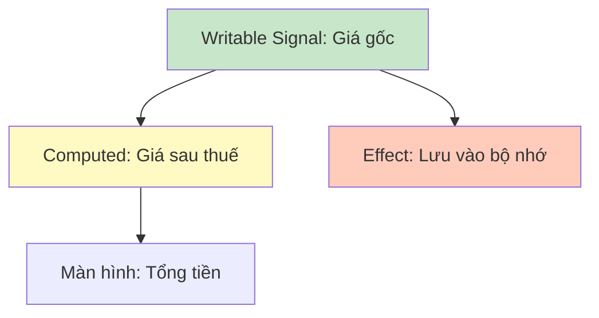

# 08. Signals: Phản xạ hiện đại 📡

**Signals** là một tính năng mới của Angular (từ bản v16) giúp ứng dụng của bạn chạy nhanh hơn và code dễ viết hơn rất nhiều so với RxJS.

## 📊 1. Signals là gì?

Hãy tưởng tượng một **bảng tính Excel**.
- Nếu bạn thay đổi số ở ô A1, thì ô B1 (có công thức `=A1*2`) sẽ **tự động** nhảy số theo.
- Bạn không cần phải đi bảo ô B1 là: "Ê, A1 đổi rồi kìa, tính lại đi!".

Đó chính là cách Signals hoạt động. Khi dữ liệu thay đổi, những chỗ sử dụng dữ liệu đó sẽ tự biết để cập nhật.

## 🏗️ 2. Ba trụ cột của Signals

### 🟢 a. Writable Signal (Cái loa phát tin)
Nơi bạn lưu trữ dữ liệu và có thể thay đổi nó.
- `const count = signal(0);`
- `count.set(5);` // Đổi thành 5

### 🟡 b. Computed Signal (Người tính toán)
Tự động tính giá trị dựa trên các Signal khác. Nó chỉ tính lại khi các Signal gốc thay đổi.
- `const double = computed(() => count() * 2);`

### 🔴 c. Effect (Người thực thi)
Làm một việc gì đó (như hiện thông báo, lưu dữ liệu) mỗi khi Signal thay đổi.
- `effect(() => console.log('Giá trị hiện tại là:', count()));`

## ⚖️ 3. Khi nào dùng Signals?

| Tình huống | Nên dùng |
| :--- | :--- |
| **Lưu trạng thái UI (ẩn/hiện, tên user, giỏ hàng)** | `Signals` (Rất nhanh và dễ) |
| **Gọi API, xử lý sự kiện liên tục (như gõ phím)** | `RxJS` (Mạnh mẽ hơn) |

---
**Bài học tiếp theo:** Xây dựng những biểu mẫu (Form) chuyên nghiệp và cực "khủng" với **Reactive Forms**!
