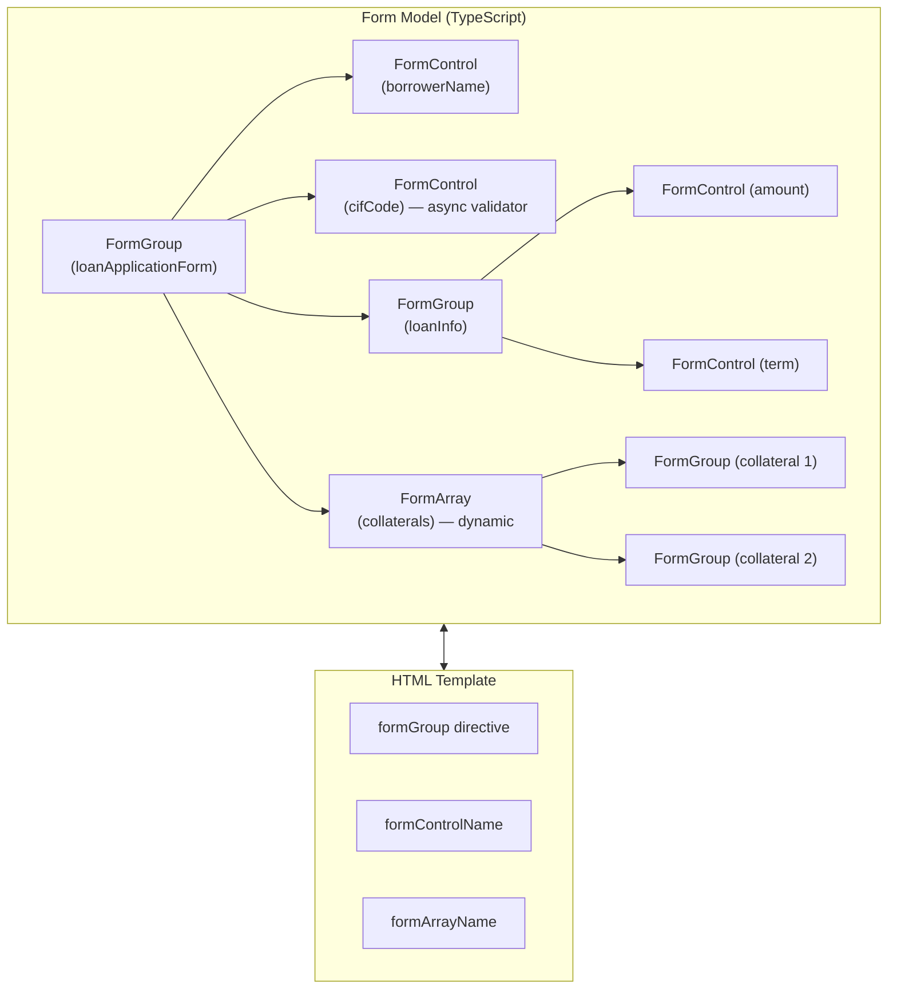

# 09. Reactive Forms Mastery — Form phức tạp cho ứng dụng enterprise 📝

> **Mục tiêu**: Làm chủ toàn bộ Reactive Forms từ cơ bản đến nâng cao: FormBuilder, dynamic FormArray, cross-field validators, async validators, và xây dựng form hồ sơ tín dụng đa bước thực tế.

---

## 🗺️ Kiến trúc Reactive Forms



---

## 1. Setup & FormBuilder

```typescript
import { Component, inject, OnInit } from '@angular/core';
import {
  FormBuilder, FormGroup, FormArray, Validators,
  AbstractControl, ValidationErrors, AsyncValidatorFn
} from '@angular/forms';
import { ReactiveFormsModule } from '@angular/forms';

@Component({
  selector: 'app-loan-application-form',
  standalone: true,
  imports: [ReactiveFormsModule, CommonModule],
  template: `<!-- xem bên dưới -->`
})
export class LoanApplicationFormComponent implements OnInit {
  private fb = inject(FormBuilder);

  form!: FormGroup;

  ngOnInit(): void {
    this.form = this.fb.group({
      // --- Thông tin khách hàng ---
      borrowerName: ['', [Validators.required, Validators.minLength(2)]],
      cifCode: ['', {
        validators: [Validators.required, Validators.pattern(/^CIF\d{6}$/)],
        asyncValidators: [this.cifExistsValidator()],
        updateOn: 'blur' // chỉ validate khi blur, không validate mỗi keystroke
      }],
      idNumber: ['', [Validators.required, idNumberValidator]],

      // --- Thông tin khoản vay ---
      loanInfo: this.fb.group({
        amount: [null, [Validators.required, Validators.min(10_000_000), Validators.max(50_000_000_000)]],
        term: [12, [Validators.required, Validators.min(1), Validators.max(360)]],
        purpose: ['', Validators.required],
        interestRate: [{ value: 8.5, disabled: true }] // readonly, tính từ server
      }, {
        validators: [loanAmountTermValidator] // cross-field validator
      }),

      // --- Tài sản đảm bảo (dynamic) ---
      collaterals: this.fb.array([]),

      // --- Cam kết ---
      agreedToTerms: [false, Validators.requiredTrue]
    });
  }

  // Getter tiện lợi
  get loanInfo(): FormGroup { return this.form.get('loanInfo') as FormGroup; }
  get collaterals(): FormArray { return this.form.get('collaterals') as FormArray; }
}
```

---

## 2. Custom Validators — Validators tự viết

### 2.1 Synchronous Validator

```typescript
import { AbstractControl, ValidationErrors, ValidatorFn } from '@angular/forms';

// Validator hàm đơn giản
export function idNumberValidator(control: AbstractControl): ValidationErrors | null {
  const value = control.value as string;
  if (!value) return null; // để Validators.required handle
  
  // CMND cũ: 9 số | CCCD mới: 12 số
  const isValid = /^\d{9}$/.test(value) || /^\d{12}$/.test(value);
  return isValid ? null : { invalidIdNumber: { actual: value } };
}

// Validator factory (nhận tham số)
export function minAmountForPurpose(minAmounts: Record<string, number>): ValidatorFn {
  return (control: AbstractControl): ValidationErrors | null => {
    const form = control.parent;
    if (!form) return null;
    
    const purpose = form.get('purpose')?.value;
    const amount = control.value as number;
    const min = minAmounts[purpose] ?? 0;
    
    if (amount < min) {
      return { belowMinAmount: { required: min, actual: amount, purpose } };
    }
    return null;
  };
}

// Cross-field validator (validate trên FormGroup)
export function loanAmountTermValidator(group: AbstractControl): ValidationErrors | null {
  const amount = group.get('amount')?.value as number;
  const term = group.get('term')?.value as number;
  
  if (!amount || !term) return null;
  
  // Vay trên 1 tỷ → tối thiểu 12 tháng
  if (amount > 1_000_000_000 && term < 12) {
    return { termTooShort: { minTerm: 12, actualTerm: term } };
  }
  // Vay dưới 10 triệu → tối đa 24 tháng
  if (amount < 10_000_000 && term > 24) {
    return { termTooLong: { maxTerm: 24, actualTerm: term } };
  }
  return null;
}
```

### 2.2 Async Validator — Kiểm tra dữ liệu với server

```typescript
import { inject } from '@angular/core';
import { Observable, timer, of } from 'rxjs';
import { switchMap, map, catchError, first } from 'rxjs/operators';

@Component({/* ... */})
export class LoanApplicationFormComponent {
  private cifService = inject(CifService);

  // Async validator: kiểm tra CIF có tồn tại không
  cifExistsValidator(): AsyncValidatorFn {
    return (control: AbstractControl): Observable<ValidationErrors | null> => {
      if (!control.value) return of(null);
      
      // Debounce 400ms để tránh gọi API mỗi keystroke
      return timer(400).pipe(
        switchMap(() => this.cifService.checkExists(control.value)),
        map(exists => exists ? null : { cifNotFound: true }),
        catchError(() => of({ cifCheckFailed: true })),
        first() // phải complete sau 1 emit
      );
    };
  }
}
```

---

## 3. Dynamic FormArray — Thêm/xóa dòng linh hoạt

```typescript
// Tạo một FormGroup cho 1 tài sản đảm bảo
private createCollateralGroup(data?: Partial<Collateral>): FormGroup {
  return this.fb.group({
    type: [data?.type ?? 'REAL_ESTATE', Validators.required],
    description: [data?.description ?? '', Validators.required],
    estimatedValue: [data?.estimatedValue ?? null, [
      Validators.required,
      Validators.min(1_000_000)
    ]],
    ownerName: [data?.ownerName ?? '', Validators.required],
    documentNumber: [data?.documentNumber ?? '']
  });
}

// Thêm tài sản
addCollateral(): void {
  this.collaterals.push(this.createCollateralGroup());
}

// Xóa tài sản theo index
removeCollateral(index: number): void {
  this.collaterals.removeAt(index);
}

// Load dữ liệu cũ vào form
patchFormWithExistingData(application: LoanApplication): void {
  // patchValue: chỉ update các field được cung cấp
  this.form.patchValue({
    borrowerName: application.borrowerName,
    cifCode: application.cifCode,
    loanInfo: {
      amount: application.loanAmount,
      term: application.loanTermMonths
    }
  });

  // Load tài sản đảm bảo vào FormArray
  this.collaterals.clear();
  application.collaterals.forEach(c => {
    this.collaterals.push(this.createCollateralGroup(c));
  });
}
```

---

## 4. Template — Kết nối Form Model với HTML

```html
<form [formGroup]="form" (ngSubmit)="onSubmit()">

  <!-- Thông tin khách hàng -->
  <section>
    <label>Họ tên khách hàng *</label>
    <input formControlName="borrowerName" />
    @if (form.get('borrowerName')?.errors?.['required'] && form.get('borrowerName')?.touched) {
      <span class="error">Vui lòng nhập họ tên</span>
    }
    @if (form.get('borrowerName')?.errors?.['minlength']) {
      <span class="error">Tối thiểu 2 ký tự</span>
    }

    <label>Mã CIF *</label>
    <input formControlName="cifCode" />
    @if (form.get('cifCode')?.pending) {
      <span class="checking">Đang kiểm tra CIF...</span>
    }
    @if (form.get('cifCode')?.errors?.['cifNotFound']) {
      <span class="error">Mã CIF không tồn tại trong hệ thống</span>
    }
  </section>

  <!-- Thông tin khoản vay (nested FormGroup) -->
  <section formGroupName="loanInfo">
    <label>Số tiền vay *</label>
    <input type="number" formControlName="amount" />

    <label>Thời hạn (tháng) *</label>
    <input type="number" formControlName="term" />

    <!-- Cross-field error nằm trên FormGroup -->
    @if (loanInfo.errors?.['termTooShort']) {
      <span class="error">
        Khoản vay trên 1 tỷ phải có thời hạn tối thiểu 12 tháng
      </span>
    }
  </section>

  <!-- Tài sản đảm bảo (FormArray) -->
  <section>
    <h3>Tài sản đảm bảo</h3>
    <div formArrayName="collaterals">
      @for (group of collaterals.controls; track $index; let i = $index) {
        <div [formGroupName]="i" class="collateral-row">
          <select formControlName="type">
            <option value="REAL_ESTATE">Bất động sản</option>
            <option value="VEHICLE">Phương tiện</option>
            <option value="SAVINGS">Sổ tiết kiệm</option>
          </select>
          <input formControlName="description" placeholder="Mô tả" />
          <input type="number" formControlName="estimatedValue" placeholder="Giá trị ước tính" />
          <button type="button" (click)="removeCollateral(i)">Xóa</button>
        </div>
      }
    </div>
    <button type="button" (click)="addCollateral()">+ Thêm tài sản</button>
  </section>

  <!-- Submit -->
  <button
    type="submit"
    [disabled]="form.invalid || form.pending || isSubmitting()"
  >
    @if (isSubmitting()) { Đang gửi... } @else { Nộp hồ sơ }
  </button>
</form>
```

---

## 5. Submit & State Management

```typescript
@Component({/* ... */})
export class LoanApplicationFormComponent {
  isSubmitting = signal(false);
  submitError = signal<string | null>(null);

  onSubmit(): void {
    if (this.form.invalid) {
      // Đánh dấu tất cả là "touched" để hiện lỗi
      this.form.markAllAsTouched();
      return;
    }

    this.isSubmitting.set(true);
    this.submitError.set(null);

    // Lấy value bao gồm cả disabled controls
    const rawValue = this.form.getRawValue();

    const payload: CreateLoanApplicationRequest = {
      borrowerName: rawValue.borrowerName,
      cifCode: rawValue.cifCode,
      loanAmount: rawValue.loanInfo.amount,
      loanTermMonths: rawValue.loanInfo.term,
      purpose: rawValue.loanInfo.purpose,
      collaterals: rawValue.collaterals
    };

    this.loanService.createApplication(payload).pipe(
      takeUntilDestroyed(this.destroyRef)
    ).subscribe({
      next: (result) => {
        this.isSubmitting.set(false);
        this.router.navigate(['/cases', result.caseId]);
      },
      error: (err) => {
        this.isSubmitting.set(false);
        if (err.status === 422) {
          // Server trả về validation errors
          this.applyServerErrors(err.error.fieldErrors);
        } else {
          this.submitError.set('Có lỗi xảy ra, vui lòng thử lại');
        }
      }
    });
  }

  // Map lỗi từ server vào form controls
  private applyServerErrors(fieldErrors: Record<string, string>): void {
    Object.entries(fieldErrors).forEach(([field, message]) => {
      const control = this.form.get(field);
      control?.setErrors({ serverError: message });
    });
  }
}
```

---

## 6. Reusable Error Message Component

```typescript
@Component({
  selector: 'app-field-error',
  standalone: true,
  template: `
    @if (control && control.invalid && (control.dirty || control.touched)) {
      <div class="field-error">
        @if (control.errors?.['required']) { <span>Trường này là bắt buộc</span> }
        @if (control.errors?.['email']) { <span>Email không đúng định dạng</span> }
        @if (control.errors?.['minlength'] as err) {
          <span>Tối thiểu {{ err.requiredLength }} ký tự</span>
        }
        @if (control.errors?.['min'] as err) {
          <span>Giá trị tối thiểu: {{ err.min | number }}</span>
        }
        @if (control.errors?.['serverError'] as err) {
          <span>{{ err }}</span>
        }
        @if (control.errors?.['cifNotFound']) {
          <span>Mã CIF không tồn tại trong hệ thống</span>
        }
      </div>
    }
  `
})
export class FieldErrorComponent {
  control = input<AbstractControl | null>(null);
}

// Cách dùng
// <app-field-error [control]="form.get('cifCode')" />
```

---

## 7. Form Status — Kiểm tra trạng thái

```typescript
// form.status có thể là: 'VALID' | 'INVALID' | 'PENDING' | 'DISABLED'
const status = this.form.status;

// Reactive — lắng nghe khi status thay đổi
this.form.statusChanges.pipe(
  takeUntilDestroyed()
).subscribe(status => {
  console.log('Form status:', status);
});

// Lắng nghe khi value thay đổi
this.form.get('loanInfo.amount')?.valueChanges.pipe(
  debounceTime(500),
  takeUntilDestroyed()
).subscribe(amount => {
  // Tính lãi suất theo số tiền vay
  this.recalculateInterestRate(amount);
});
```

---

## 📚 Tóm tắt

| Tính năng | API | Dùng khi |
|---|---|---|
| Tạo form | `fb.group()` | Nhóm các controls |
| Danh sách động | `fb.array()` | Thêm/xóa row |
| Validate đơn | `ValidatorFn` | Rules đơn giản |
| Validate chéo field | Group-level validator | So sánh 2 fields |
| Validate async | `AsyncValidatorFn` | Check server |
| Xử lý submit | `getRawValue()` | Bao gồm disabled |
| Server errors | `setErrors()` | Map lỗi từ API |

> **Bài tiếp theo →** [[10-Routing-and-Navigation]] — Lazy loading, Guards, và Resolvers trong ứng dụng nhiều trang
