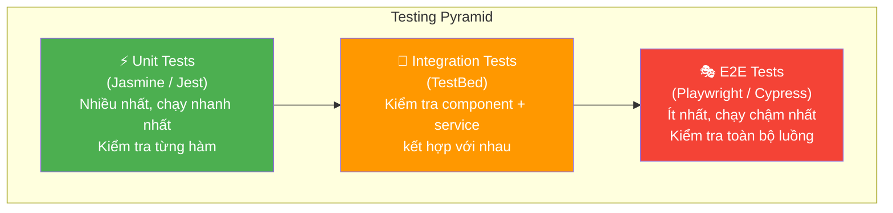

# 09 - Testing Angular — Kiểm thử ứng dụng chuyên nghiệp 🧪

Testing không phải là thứ tùy chọn trong dự án doanh nghiệp — đó là **bảo hiểm** cho code của bạn. Một bộ test tốt giúp bạn tự tin refactor, deploy mà không sợ break tính năng cũ.

> **Triết lý:** Đừng test để "check box" yêu cầu. Hãy test những gì quan trọng với nghiệp vụ và dễ bị break khi thay đổi.

---

## 1. Tháp kiểm thử (Testing Pyramid)



---

## 2. Unit Test — Kiểm thử Service và Logic

```typescript
// contract.service.spec.ts
describe('ContractService', () => {
  let service: ContractService;
  let httpMock: HttpTestingController;

  beforeEach(() => {
    TestBed.configureTestingModule({
      providers: [
        ContractService,
        provideHttpClientTesting()
      ]
    });
    service = TestBed.inject(ContractService);
    httpMock = TestBed.inject(HttpTestingController);
  });

  afterEach(() => {
    httpMock.verify(); // Đảm bảo không có request nào bị bỏ sót
  });

  it('nên trả về danh sách hợp đồng', () => {
    const mockContracts: Contract[] = [
      { id: '1', code: 'HD001', customerName: 'Nguyễn Văn An', status: 'ACTIVE' },
      { id: '2', code: 'HD002', customerName: 'Trần Thị Bình', status: 'PENDING' }
    ];

    service.getAll().subscribe(contracts => {
      expect(contracts).toHaveSize(2);
      expect(contracts[0].code).toBe('HD001');
    });

    const req = httpMock.expectOne('/api/contracts');
    expect(req.request.method).toBe('GET');
    req.flush(mockContracts); // Trả dữ liệu giả lập
  });

  it('nên xử lý lỗi 401 và redirect về login', () => {
    const router = TestBed.inject(Router);
    const navigateSpy = jest.spyOn(router, 'navigate');

    service.getAll().subscribe({ error: () => {} });

    const req = httpMock.expectOne('/api/contracts');
    req.flush('Unauthorized', { status: 401, statusText: 'Unauthorized' });

    expect(navigateSpy).toHaveBeenCalledWith(['/login']);
  });
});
```

---

## 3. Component Test — TestBed

```typescript
// contract-list.component.spec.ts
describe('ContractListComponent', () => {
  let component: ContractListComponent;
  let fixture: ComponentFixture<ContractListComponent>;
  let mockContractService: jasmine.SpyObj<ContractService>;

  beforeEach(async () => {
    mockContractService = jasmine.createSpyObj('ContractService', ['getAll']);
    mockContractService.getAll.and.returnValue(of([
      { id: '1', code: 'HD001', customerName: 'Nguyễn Văn An', status: 'ACTIVE' }
    ]));

    await TestBed.configureTestingModule({
      imports: [ContractListComponent], // Standalone component
      providers: [
        { provide: ContractService, useValue: mockContractService }
      ]
    }).compileComponents();

    fixture = TestBed.createComponent(ContractListComponent);
    component = fixture.componentInstance;
    fixture.detectChanges(); // Kích hoạt ngOnInit
  });

  it('nên hiển thị danh sách hợp đồng', () => {
    const rows = fixture.nativeElement.querySelectorAll('tr.contract-row');
    expect(rows.length).toBe(1);
    expect(rows[0].textContent).toContain('HD001');
    expect(rows[0].textContent).toContain('Nguyễn Văn An');
  });

  it('nên hiển thị loading khi đang tải', () => {
    component.isLoading.set(true);
    fixture.detectChanges();
    
    const skeleton = fixture.nativeElement.querySelector('app-skeleton-loader');
    expect(skeleton).toBeTruthy();
  });
});
```

---

## 4. Test Reactive Form Validation

```typescript
describe('ContractFormComponent — Validation', () => {
  let component: ContractFormComponent;

  beforeEach(() => {
    // Có thể test FormGroup mà không cần TestBed
    component = new ContractFormComponent(new FormBuilder());
  });

  it('form phải invalid nếu họ tên trống', () => {
    component.form.get('customer.fullName')!.setValue('');
    expect(component.form.get('customer.fullName')!.hasError('required')).toBeTruthy();
  });

  it('CCCD phải đúng 12 chữ số', () => {
    const cccdControl = component.form.get('customer.idNumber')!;
    
    cccdControl.setValue('123'); // Sai
    expect(cccdControl.hasError('pattern')).toBeTruthy();
    
    cccdControl.setValue('123456789012'); // Đúng
    expect(cccdControl.valid).toBeTruthy();
  });

  it('số tiền vay phải lớn hơn 1 triệu', () => {
    component.form.get('loan.amount')!.setValue(500_000);
    expect(component.form.get('loan.amount')!.hasError('min')).toBeTruthy();
  });
});
```

---

**Takeaway:**
- **Unit tests** nên chiếm 70%+ — test service, pipes, validators, pure functions.
- **Component tests** kiểm tra template render đúng không, user interaction có hoạt động không.
- Dùng **Mock** thay thế các dependencies thực sự (HTTP, service khác) để test độc lập.
- Test theo hành vi người dùng, không phải theo implementation details.
