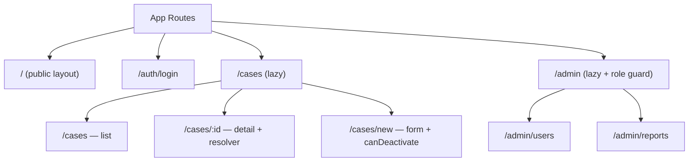

# 10. Routing & Navigation — Lazy Loading, Guards và withComponentInputBinding 🗺️

> **Mục tiêu**: Cấu hình routes enterprise, lazy loading với `loadComponent`/`loadChildren`, `withComponentInputBinding`, `PreloadStrategy`, route guards hiện đại (functional), và resolvers để prefetch data.

---

## 🗺️ Kiến trúc Routing PDMS



---

## 1. Cấu hình Routes chuẩn Enterprise

```typescript
// app.routes.ts
import { Routes } from '@angular/router';
import { authGuard } from './core/guards/auth.guard';
import { roleGuard } from './core/guards/role.guard';
import { caseDetailResolver } from './features/cases/resolvers/case-detail.resolver';

export const routes: Routes = [
  // Public routes — eager load (nhỏ)
  { path: '', redirectTo: '/cases', pathMatch: 'full' },
  {
    path: 'auth',
    loadComponent: () => import('./features/auth/login.component').then(m => m.LoginComponent)
  },

  // Protected — lazy load theo feature module
  {
    path: 'cases',
    canActivate: [authGuard],
    loadChildren: () => import('./features/cases/cases.routes').then(m => m.CASES_ROUTES)
  },
  {
    path: 'admin',
    canActivate: [authGuard, () => roleGuard(['ADMIN', 'SUPER_ADMIN'])],
    loadChildren: () => import('./features/admin/admin.routes').then(m => m.ADMIN_ROUTES)
  },

  // Wildcard
  { path: '**', loadComponent: () => import('./shared/not-found.component').then(m => m.NotFoundComponent) }
];

// cases.routes.ts — Feature routes
export const CASES_ROUTES: Routes = [
  {
    path: '',
    loadComponent: () => import('./case-list.component').then(m => m.CaseListComponent)
  },
  {
    path: 'new',
    loadComponent: () => import('./case-form.component').then(m => m.CaseFormComponent),
    canDeactivate: [unsavedChangesGuard]
  },
  {
    path: ':id',
    loadComponent: () => import('./case-detail.component').then(m => m.CaseDetailComponent),
    resolve: { caseDetail: caseDetailResolver },   // prefetch data
    data: { title: 'Chi tiết hồ sơ' }
  },
  {
    path: ':id/edit',
    loadComponent: () => import('./case-form.component').then(m => m.CaseFormComponent),
    resolve: { caseDetail: caseDetailResolver },
    canDeactivate: [unsavedChangesGuard]
  }
];
```

---

## 2. `withComponentInputBinding` — Route params tự động bind vào `input()`

> **Angular 16+** — Không cần inject `ActivatedRoute` nữa!

```typescript
// main.ts — bật tính năng
import { provideRouter, withComponentInputBinding, withPreloading, PreloadAllModules } from '@angular/router';

bootstrapApplication(AppComponent, {
  providers: [
    provideRouter(
      routes,
      withComponentInputBinding(),  // ⭐ map route params → component inputs
      withPreloading(PreloadAllModules)
    )
  ]
});

// case-detail.component.ts — nhận params qua input()
@Component({
  selector: 'app-case-detail',
  standalone: true,
  template: `
    @if (caseDetail(); as detail) {
      <h1>Hồ sơ: {{ detail.caseCode }}</h1>
    }
    <p>ID từ URL: {{ id() }}</p>
    <p>Tab đang mở: {{ tab() }}</p>
  `
})
export class CaseDetailComponent {
  // withComponentInputBinding tự động map :id → id input
  id = input.required<string>();

  // Query params cũng được bind tự động
  tab = input<string>('overview');

  // Resolver data cũng được bind tự động
  caseDetail = input<CaseDetail | null>(null);

  // ---- KHÔNG CẦN inject(ActivatedRoute) ----
  // ❌ Cách cũ:
  // private route = inject(ActivatedRoute);
  // ngOnInit() { this.route.params.subscribe(p => this.id = p['id']); }
}
```

---

## 3. Functional Guards — Cách hiện đại (Angular 15+)

```typescript
// auth.guard.ts
import { inject } from '@angular/core';
import { CanActivateFn, Router } from '@angular/router';

export const authGuard: CanActivateFn = (route, state) => {
  const authService = inject(AuthService);
  const router = inject(Router);

  if (authService.isLoggedIn()) {
    return true;
  }

  // Lưu URL để redirect sau khi login
  return router.createUrlTree(['/auth/login'], {
    queryParams: { returnUrl: state.url }
  });
};

// role.guard.ts — Tái sử dụng với factory
export function roleGuard(allowedRoles: string[]): CanActivateFn {
  return (route, state) => {
    const authService = inject(AuthService);
    const router = inject(Router);

    const userRoles = authService.currentUser()?.roles ?? [];
    const hasRole = allowedRoles.some(r => userRoles.includes(r));

    if (hasRole) return true;

    return router.createUrlTree(['/forbidden']);
  };
}

// unsaved-changes.guard.ts
import { CanDeactivateFn } from '@angular/router';

// Interface cho components có unsaved changes
export interface HasUnsavedChanges {
  hasUnsavedChanges(): boolean;
}

export const unsavedChangesGuard: CanDeactivateFn<HasUnsavedChanges> = (component) => {
  if (!component.hasUnsavedChanges()) return true;

  return confirm('Bạn có thay đổi chưa lưu. Bạn có chắc muốn rời trang?');
  // Trong thực tế: inject DialogService và trả về Observable<boolean>
};

// case-form.component.ts — implement interface
@Component({ /* ... */ })
export class CaseFormComponent implements HasUnsavedChanges {
  private formDirty = signal(false);

  hasUnsavedChanges(): boolean {
    return this.formDirty();
  }
}
```

---

## 4. Resolver — Prefetch data trước khi component render

```typescript
// case-detail.resolver.ts
import { ResolveFn, Router } from '@angular/router';
import { inject } from '@angular/core';
import { catchError, EMPTY } from 'rxjs';

export const caseDetailResolver: ResolveFn<CaseDetail> = (route, state) => {
  const caseService = inject(CaseService);
  const router = inject(Router);
  const caseId = route.paramMap.get('id')!;

  return caseService.getById(caseId).pipe(
    catchError(err => {
      if (err.status === 404) {
        router.navigate(['/not-found']);
      }
      return EMPTY; // Hủy navigation nếu lỗi
    })
  );
};

// Component nhận resolver data qua input (withComponentInputBinding)
// hoặc qua ActivatedRoute
@Component({ /* ... */ })
export class CaseDetailComponent {
  // Với withComponentInputBinding — tên input phải trùng key resolver
  caseDetail = input<CaseDetail | null>(null);
}
```

---

## 5. Preloading Strategy — Tải trước intelligent

```typescript
// selective-preload.strategy.ts
import { PreloadingStrategy, Route } from '@angular/router';
import { Observable, of } from 'rxjs';
import { Injectable } from '@angular/core';

@Injectable({ providedIn: 'root' })
export class RoleBasedPreloadStrategy implements PreloadingStrategy {
  private authService = inject(AuthService);

  preload(route: Route, load: () => Observable<any>): Observable<any> {
    // Chỉ preload nếu route.data.preload = true VÀ user có quyền
    const shouldPreload = route.data?.['preload'] as boolean;
    const requiredRole = route.data?.['requiredRole'] as string;

    if (!shouldPreload) return of(null);

    if (requiredRole) {
      const hasRole = this.authService.hasRole(requiredRole);
      return hasRole ? load() : of(null);
    }

    return load();
  }
}

// Dùng trong routes
{
  path: 'reports',
  data: { preload: true, requiredRole: 'ANALYST' },
  loadChildren: () => import('./reports/reports.routes')
}

// Đăng ký strategy
provideRouter(routes, withPreloading(RoleBasedPreloadStrategy))
```

---

## 6. Router Events — Track navigation

```typescript
@Component({ selector: 'app-root', standalone: true })
export class AppComponent {
  private router = inject(Router);
  isNavigating = signal(false);

  constructor() {
    // Hiện loading bar khi navigate
    this.router.events.pipe(
      takeUntilDestroyed()
    ).subscribe(event => {
      if (event instanceof NavigationStart) {
        this.isNavigating.set(true);
      }
      if (event instanceof NavigationEnd || event instanceof NavigationError) {
        this.isNavigating.set(false);
        // Scroll to top khi vào trang mới
        window.scrollTo(0, 0);
      }
    });
  }
}
```

---

## 7. Programmatic Navigation

```typescript
@Component({ /* ... */ })
export class CaseListComponent {
  private router = inject(Router);

  navigateToDetail(caseId: string): void {
    this.router.navigate(['/cases', caseId]);
  }

  navigateWithQueryParams(status: string): void {
    this.router.navigate(['/cases'], {
      queryParams: { status, page: 1 },
      queryParamsHandling: 'merge' // giữ query params hiện có
    });
  }

  // Mở trong tab mới (dùng routerLink trong template thường hơn)
  openInNewTab(caseId: string): void {
    const url = this.router.createUrlTree(['/cases', caseId]).toString();
    window.open(url, '_blank');
  }
}
```

---

## 📚 Tóm tắt

| Tính năng | API | Angular version |
|---|---|---|
| Lazy load component | `loadComponent` | 14+ |
| Lazy load routes | `loadChildren` | All |
| Route params → input | `withComponentInputBinding` | 16+ |
| Functional guard | `CanActivateFn` | 15+ |
| Functional deactivate | `CanDeactivateFn` | 15+ |
| Functional resolver | `ResolveFn` | 14+ |
| Preload strategy | `withPreloading` | All |

> **Bài tiếp theo →** [[11-Dependency-Injection-and-Services]] — DI Providers, InjectionToken, và service architecture
