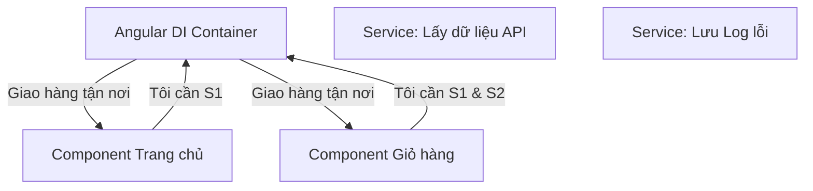

# 11. Dependency Injection & Services: Hệ thống Điện Nước 💉🚰

Trong Angular, **Service** là nơi chứa các logic dùng chung cho nhiều Component, còn **Dependency Injection (DI)** là cách để các Component "mượn" các Service đó.

## 🏢 1. Tại sao cần Services?

Hãy tưởng tượng bạn đang điều hành một **Nhà hàng**:
- **Component**: Là các Đầu bếp. Mỗi người nấu một món (Giao diện).
- **Service**: Là "Dịch vụ cung cấp thực phẩm" hoặc "Hệ thống điện nước".
    - Các đầu bếp không cần tự đi chợ mua thịt (Gọi API).
    - Các đầu bếp không cần tự đi đào giếng lấy nước (Xử lý dữ liệu thô).
    - Họ chỉ cần yêu cầu: "Tôi cần nước sạch" và hệ thống sẽ mang đến tận nơi.

## 💉 2. Dependency Injection (DI) là gì?

DI là hành động "bơm" (inject) một dịch vụ vào nơi cần nó.



## 🪄 3. Cách dùng hiện đại: Hàm `inject()`

Thay vì phải khai báo dài dòng trong Constructor, Angular hiện đại cho phép bạn dùng hàm `inject()` cực kỳ ngắn gọn:

```typescript
// Trong Component của bạn
export class MyComponent {
  private dataService = inject(DataService); // "Bơm" service vào đây
}
```

## 🌍 4. Singleton Service
Mặc định, một Service trong Angular chỉ có **duy nhất một bản thể** (Singleton) cho toàn bộ ứng dụng. Nếu bạn lưu dữ liệu vào Service ở trang A, sang trang B bạn vẫn thấy dữ liệu đó. Nó giống như một cái "kho chung" của cả công ty.

---
**Bài học tiếp theo:** Làm sao để lấy dữ liệu thực từ Internet? Chào mừng bạn đến với **HTTP Client**!
