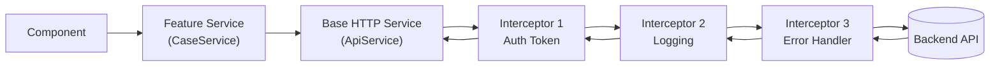

# 12. HTTP Client — Typed Client, Interceptors và Resource API 🌐

> **Mục tiêu**: Xây dựng HTTP layer enterprise-grade với `HttpClient` typed, functional interceptors, retry/timeout strategies, và `resource()` API mới của Angular 19 cho declarative data fetching.

---

## 🗺️ HTTP Layer Architecture



---

## 1. Setup — provideHttpClient với Interceptors

```typescript
// app.config.ts
import { provideHttpClient, withInterceptors, withInterceptorsFromDi } from '@angular/common/http';

export const appConfig: ApplicationConfig = {
  providers: [
    provideHttpClient(
      withInterceptors([
        authInterceptor,      // Gắn JWT token
        loggingInterceptor,   // Log request/response
        errorInterceptor,     // Xử lý lỗi global
      ])
    )
  ]
};
```

---

## 2. Typed HTTP Client — Luôn định nghĩa kiểu dữ liệu

```typescript
// models/case.model.ts
export interface CaseDetail {
  id: string;
  caseCode: string;
  cifCode: string;
  borrowerName: string;
  loanAmount: number;
  status: 'PENDING' | 'IN_REVIEW' | 'APPROVED' | 'REJECTED';
  createdAt: string; // ISO string từ API
  documents: DocumentRef[];
}

export interface PageResponse<T> {
  content: T[];
  totalElements: number;
  totalPages: number;
  pageNumber: number;
  pageSize: number;
}

export interface ApiError {
  timestamp: string;
  status: number;
  message: string;
  fieldErrors?: Record<string, string>;
}

// services/case.service.ts
import { Injectable, inject } from '@angular/core';
import { HttpClient, HttpParams } from '@angular/common/http';
import { Observable } from 'rxjs';
import { map, tap } from 'rxjs/operators';
import { environment } from '@env/environment';

export interface CaseSearchParams {
  keyword?: string;
  status?: string;
  fromDate?: string;
  toDate?: string;
  page?: number;
  size?: number;
  sort?: string;
}

@Injectable({ providedIn: 'root' })
export class CaseService {
  private http = inject(HttpClient);
  private baseUrl = `${environment.apiBaseUrl}/api/v1/cases`;

  // Typed response — HttpClient<T> inference
  getById(id: string): Observable<CaseDetail> {
    return this.http.get<CaseDetail>(`${this.baseUrl}/${id}`);
  }

  search(params: CaseSearchParams): Observable<PageResponse<CaseDetail>> {
    const httpParams = this.buildHttpParams(params);
    return this.http.get<PageResponse<CaseDetail>>(this.baseUrl, { params: httpParams });
  }

  create(payload: CreateCaseRequest): Observable<CaseDetail> {
    return this.http.post<CaseDetail>(this.baseUrl, payload);
  }

  update(id: string, payload: UpdateCaseRequest): Observable<CaseDetail> {
    return this.http.put<CaseDetail>(`${this.baseUrl}/${id}`, payload);
  }

  patchStatus(id: string, status: string, reason?: string): Observable<CaseDetail> {
    return this.http.patch<CaseDetail>(`${this.baseUrl}/${id}/status`, { status, reason });
  }

  delete(id: string): Observable<void> {
    return this.http.delete<void>(`${this.baseUrl}/${id}`);
  }

  // Upload file với progress tracking
  uploadDocument(caseId: string, file: File): Observable<{ docId: string; url: string }> {
    const formData = new FormData();
    formData.append('file', file);
    formData.append('caseId', caseId);
    return this.http.post<{ docId: string; url: string }>(
      `${this.baseUrl}/${caseId}/documents`,
      formData
    );
  }

  // Lấy full HTTP response (cần check headers, status code)
  getWithMetadata(id: string): Observable<HttpResponse<CaseDetail>> {
    return this.http.get<CaseDetail>(`${this.baseUrl}/${id}`, { observe: 'response' });
  }

  private buildHttpParams(params: CaseSearchParams): HttpParams {
    let httpParams = new HttpParams();
    Object.entries(params).forEach(([key, value]) => {
      if (value !== undefined && value !== null && value !== '') {
        httpParams = httpParams.set(key, String(value));
      }
    });
    return httpParams;
  }
}
```

---

## 3. Functional Interceptors (Angular 15+)

### 3.1 Auth Interceptor với Token Refresh

```typescript
// interceptors/auth.interceptor.ts
import { HttpInterceptorFn, HttpRequest, HttpHandlerFn, HttpErrorResponse } from '@angular/common/http';
import { inject } from '@angular/core';
import { catchError, switchMap, throwError, BehaviorSubject, filter, take } from 'rxjs';

let isRefreshing = false;
const refreshTokenSubject = new BehaviorSubject<string | null>(null);

export const authInterceptor: HttpInterceptorFn = (req, next) => {
  const authService = inject(AuthService);
  const token = authService.getAccessToken();

  const authReq = token ? addTokenHeader(req, token) : req;

  return next(authReq).pipe(
    catchError(error => {
      if (error instanceof HttpErrorResponse && error.status === 401) {
        return handle401Error(authReq, next, authService);
      }
      return throwError(() => error);
    })
  );
};

function addTokenHeader(req: HttpRequest<unknown>, token: string): HttpRequest<unknown> {
  return req.clone({
    headers: req.headers.set('Authorization', `Bearer ${token}`)
  });
}

function handle401Error(
  req: HttpRequest<unknown>,
  next: HttpHandlerFn,
  authService: AuthService
) {
  if (!isRefreshing) {
    isRefreshing = true;
    refreshTokenSubject.next(null);

    return authService.refreshToken().pipe(
      switchMap(tokens => {
        isRefreshing = false;
        refreshTokenSubject.next(tokens.accessToken);
        return next(addTokenHeader(req, tokens.accessToken));
      }),
      catchError(err => {
        isRefreshing = false;
        authService.logout();
        return throwError(() => err);
      })
    );
  }

  // Các request khác đang chờ → đợi token mới
  return refreshTokenSubject.pipe(
    filter(token => token !== null),
    take(1),
    switchMap(token => next(addTokenHeader(req, token!)))
  );
}
```

### 3.2 Logging Interceptor

```typescript
// interceptors/logging.interceptor.ts
import { HttpInterceptorFn } from '@angular/common/http';
import { tap, finalize } from 'rxjs/operators';

export const loggingInterceptor: HttpInterceptorFn = (req, next) => {
  const startTime = Date.now();
  console.log(`[HTTP] ▶ ${req.method} ${req.url}`);

  return next(req).pipe(
    tap({
      next: (event) => {
        if (event instanceof HttpResponse) {
          const duration = Date.now() - startTime;
          console.log(`[HTTP] ✅ ${req.method} ${req.url} → ${event.status} (${duration}ms)`);
        }
      },
      error: (err) => {
        const duration = Date.now() - startTime;
        console.error(`[HTTP] ❌ ${req.method} ${req.url} → ${err.status} (${duration}ms)`);
      }
    })
  );
};
```

### 3.3 Error Handler Interceptor

```typescript
// interceptors/error.interceptor.ts
import { HttpInterceptorFn, HttpErrorResponse } from '@angular/common/http';
import { inject } from '@angular/core';
import { catchError, throwError } from 'rxjs';
import { retry, timer } from 'rxjs';

export const errorInterceptor: HttpInterceptorFn = (req, next) => {
  const notificationService = inject(NotificationService);
  const router = inject(Router);

  return next(req).pipe(
    // Tự retry 2 lần với delay cho lỗi 5xx
    retry({
      count: 2,
      delay: (error, retryCount) => {
        if (error instanceof HttpErrorResponse && error.status >= 500) {
          return timer(retryCount * 1000); // 1s, 2s
        }
        throw error; // Không retry cho 4xx
      }
    }),
    catchError((error: HttpErrorResponse) => {
      switch (error.status) {
        case 0:
          notificationService.error('Không thể kết nối đến server');
          break;
        case 401:
          // Đã handle ở auth interceptor
          break;
        case 403:
          notificationService.error('Bạn không có quyền thực hiện thao tác này');
          router.navigate(['/forbidden']);
          break;
        case 404:
          notificationService.error('Không tìm thấy dữ liệu');
          break;
        case 422:
          // Validation error — để component tự xử lý
          break;
        case 429:
          notificationService.warn('Quá nhiều yêu cầu, vui lòng thử lại sau');
          break;
        default:
          if (error.status >= 500) {
            notificationService.error('Lỗi hệ thống, vui lòng liên hệ IT');
          }
      }
      return throwError(() => error);
    })
  );
};
```

---

## 4. `resource()` API — Angular 19 Declarative Fetching ⭐

`resource()` là tính năng mới nhất, tích hợp Signals với HTTP mà không cần subscribe thủ công:

```typescript
import { Component, signal, resource, inject } from '@angular/core';
import { httpResource } from '@angular/common/http'; // Angular 19.2+

@Component({
  selector: 'app-case-detail',
  standalone: true,
  template: `
    @switch (caseResource.status()) {
      @case ('loading') { <app-skeleton /> }
      @case ('error') {
        <app-error-state [message]="caseResource.error()?.message" />
      }
      @case ('resolved') {
        <app-case-info [case]="caseResource.value()!" />
      }
    }

    <!-- Filter → tự động refetch -->
    <select (change)="statusFilter.set($event.target.value)">
      <option value="">Tất cả</option>
      <option value="PENDING">Chờ duyệt</option>
    </select>
  `
})
export class CaseDetailComponent {
  caseId = input.required<string>();
  statusFilter = signal('');

  // httpResource — tự fetch khi caseId thay đổi
  caseResource = httpResource<CaseDetail>(
    () => `/api/v1/cases/${this.caseId()}`
  );

  // resource() với custom fetcher — linh hoạt hơn
  casesResource = resource({
    // request fn: tính toán params, thay đổi → refetch
    request: () => ({
      status: this.statusFilter(),
      page: this.currentPage()
    }),
    // loader fn: thực hiện fetch với params đó
    loader: ({ request, abortSignal }) =>
      fetch(`/api/v1/cases?status=${request.status}&page=${request.page}`, { signal: abortSignal })
        .then(r => r.json()) as Promise<PageResponse<CaseDetail>>
  });
}

// Cách dùng resource() với Angular HttpClient
@Component({ /* ... */ })
export class CaseListComponent {
  private http = inject(HttpClient);
  statusFilter = signal<string>('');
  currentPage = signal(0);

  casesResource = resource({
    request: () => ({ status: this.statusFilter(), page: this.currentPage() }),
    loader: ({ request }) =>
      firstValueFrom(
        this.http.get<PageResponse<CaseDetail>>('/api/v1/cases', {
          params: { status: request.status, page: String(request.page) }
        })
      )
  });

  // Programmatic refresh
  refreshCases(): void {
    this.casesResource.reload();
  }
}
```

---

## 5. Comparison: Cách dùng HTTP theo thời kỳ

```typescript
// ---- Cách 1: RxJS thuần (vẫn valid, phổ biến nhất) ----
cases = toSignal(
  this.caseService.search({ status: 'PENDING' }),
  { initialValue: null }
);

// ---- Cách 2: toSignal + switchMap (khi params thay đổi) ----
private statusFilter = signal('PENDING');
cases = toSignal(
  toObservable(this.statusFilter).pipe(
    switchMap(status => this.caseService.search({ status }))
  ),
  { initialValue: null }
);

// ---- Cách 3: resource() (Angular 19+, declarative) ----
casesResource = resource({
  request: () => this.statusFilter(),
  loader: ({ request }) => firstValueFrom(this.caseService.search({ status: request }))
});
```

---

## 6. Testing HTTP Service

```typescript
// case.service.spec.ts
import { TestBed } from '@angular/core/testing';
import { provideHttpClientTesting } from '@angular/common/http/testing';
import { HttpTestingController } from '@angular/common/http/testing';

describe('CaseService', () => {
  let service: CaseService;
  let httpMock: HttpTestingController;

  beforeEach(() => {
    TestBed.configureTestingModule({
      providers: [CaseService, provideHttpClientTesting()]
    });
    service = TestBed.inject(CaseService);
    httpMock = TestBed.inject(HttpTestingController);
  });

  afterEach(() => httpMock.verify()); // Đảm bảo không có request pending

  it('should GET case by id', () => {
    const mockCase: CaseDetail = { id: '1', caseCode: 'PDMS-001' } as CaseDetail;

    service.getById('1').subscribe(c => {
      expect(c.caseCode).toBe('PDMS-001');
    });

    const req = httpMock.expectOne('/api/v1/cases/1');
    expect(req.request.method).toBe('GET');
    req.flush(mockCase); // giả lập response
  });
});
```

---

## 📚 Tóm tắt

| Tính năng | API | Dùng khi |
|---|---|---|
| HTTP call cơ bản | `HttpClient.get/post/put/delete` | Mọi trường hợp |
| Typed response | `get<T>()` | Luôn dùng |
| Build query params | `HttpParams` | GET với filter |
| Auth token | `authInterceptor` | Tất cả protected routes |
| Error handling global | `errorInterceptor` | Toast, redirect |
| Declarative fetching | `resource()` | Angular 19+, signal-first |
| Nhanh với Signals | `httpResource()` | Angular 19.2+ |

> **Bài tiếp theo →** [[13-Testing-Fundamentals]] — Unit test với Jest/Jasmine, component testing với TestBed
