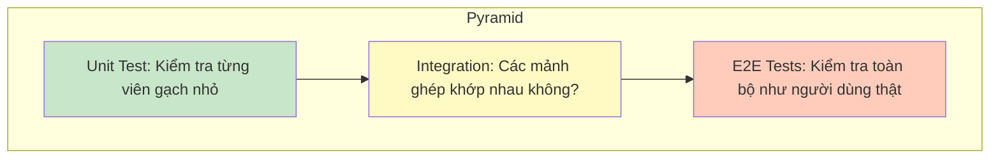

# 13. Kiểm thử cơ bản (Testing Fundamentals) 🧪

Viết code mà không viết Test giống như việc bạn xây nhà mà không có bảo hiểm. Khi bạn thay đổi một thứ gì đó, bạn không thể chắc chắn liệu những thứ khác có bị hỏng hay không.

## 🛡️ 1. Tại sao phải Testing?

Hãy tưởng tượng bạn là một **Người kiểm định chất lượng** trong nhà máy:
- Bạn không đợi đến khi khách hàng mua hàng về mới phát hiện sản phẩm lỗi.
- Bạn kiểm tra từng linh kiện ngay tại nhà máy để đảm bảo mọi thứ đều hoàn hảo.

## 🗼 2. Tháp Kiểm thử (Testing Pyramid)

### ⚡ a. Unit Test (Nhiều nhất)
Kiểm tra những hàm nhỏ nhất, đơn giản nhất. Chạy cực nhanh.
- Ví dụ: Test hàm "Cộng hai số" có ra kết quả đúng không.

### 🔗 b. Component Test (Integration)
Kiểm tra xem Component có hiện đúng chữ trên màn hình không, nút bấm có hoạt động không.

### 🎭 c. E2E Test (Ít nhất)
Dùng một con robot giả lập người dùng, mở trình duyệt, bấm từng nút từ đầu đến cuối trang web.

##  ferramentas 3. Công cụ trong Angular
- **Jasmine**: Ngôn ngữ để bạn viết các câu lệnh kiểm tra (Ví dụ: `expect(a).toBe(b)`).
- **Karma**: Công cụ giúp bạn chạy các bài test đó trên trình duyệt.

---
**Bài học tiếp theo:** Cách tổ chức dự án lớn và bí mật của các Senior - **Enterprise Architecture & Standalone**!
