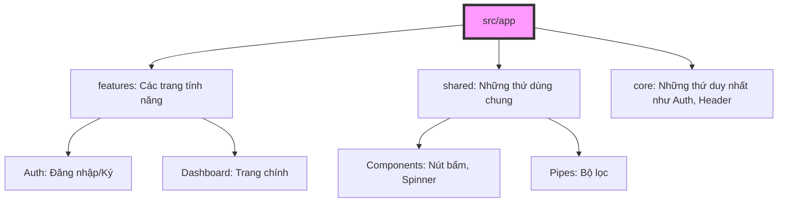

# 14. Kiến trúc Enterprise & Standalone 🏗️🏢

Chào mừng bạn đến với bài học cuối cùng! Đây là nơi chúng ta học cách tổ chức một dự án "khủng" sao cho nó không trở thành một mớ hỗn độn.

## 📦 1. Standalone Components: Tạm biệt NgModule

Ngày xưa, Angular rất phức tạp vì bạn phải khai báo mọi thứ vào một cái "thùng" gọi là `NgModule`.
Từ Angular 14+, chúng ta có **Standalone Components**.
- **Analogy**: Giống như mỗi nhân viên có một bộ dụng cụ riêng đeo bên mình, cần gì dùng nấy, không cần phải chạy vào kho chung của công ty để mượn đồ nữa. Điều này giúp code gọn nhẹ và dễ hiểu hơn rất nhiều.

## 🏛️ 2. Kiến trúc thư mục chuyên nghiệp

Khi làm dự án lớn, đừng để tất cả code vào một chỗ. Hãy chia theo "Nghiệp vụ" (Domain):

### Quy tắc tổ chức:
- **features/**: Chứa các trang chính của ứng dụng.
- **shared/**: Chứa những linh kiện nhỏ có thể dùng ở bất cứ đâu (Nút bấm, ô nhập liệu).
- **core/**: Chứa các "trái tim" của ứng dụng (Authentication, Interceptors).

## 🚀 3. Tổng kết hành trình

Bạn đã đi từ một **Newbie** không biết gì về Angular, trải qua các kiến thức về Component, Data Binding, RxJS, Signals... cho đến khi hiểu về **Kiến trúc Enterprise**.

Angular là một hành trình dài, hãy kiên trì thực hành. Chìa khóa để trở thành một **Senior** không phải là thuộc lòng code, mà là hiểu được **Tư duy hệ thống** và **Cách giải quyết vấn đề**.

---
**Chúc mừng bạn đã hoàn thành Series Angular Zero to Hero!** 🎉 Chúc bạn sớm xây dựng được những ứng dụng tuyệt vời!
