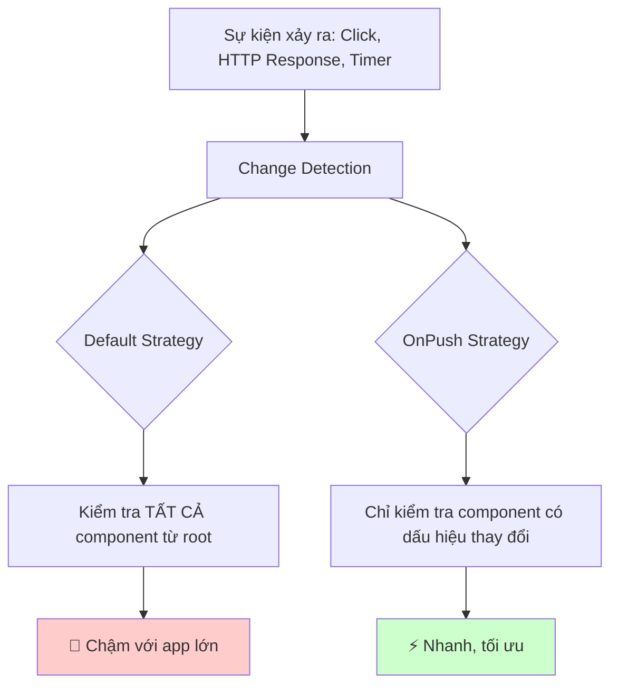
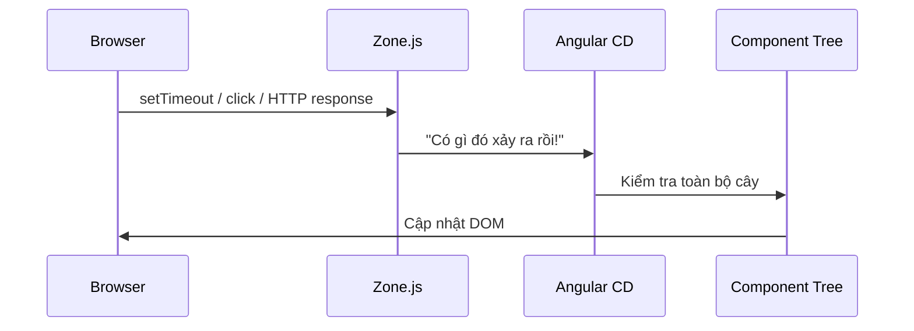

# 15. Change Detection & OnPush Strategy: Bộ não phản xạ của Angular ⚡

> **Tại sao cần học bài này?**
> Trong các dự án banking/enterprise phức tạp, UI có hàng trăm component. Nếu mọi thứ cập nhật cùng lúc khi bất kỳ dữ liệu nào thay đổi, ứng dụng sẽ **chậm nghiêm trọng**. OnPush là "công tắc tắt điện thông minh" giúp Angular chỉ cập nhật những gì cần thiết.

---

## 🧠 1. Change Detection là gì?

### Ẩn dụ cho Newbie 🏠

Hãy tưởng tượng bạn quản lý một tòa nhà 100 phòng. Mỗi khi có khách (sự kiện), bạn có 2 lựa chọn:

- **Default Strategy:** Đi kiểm tra **tất cả 100 phòng** xem phòng nào thay đổi không. Rất chắc chắn nhưng tốn công.
- **OnPush Strategy:** Chỉ kiểm tra phòng nào **bấm chuông báo** (nhận Input mới hoặc có Event nội bộ). Nhanh hơn rất nhiều.



---

## ⚙️ 2. Cơ chế hoạt động bên trong

Angular sử dụng **Zone.js** để "nghe lén" tất cả các sự kiện bất đồng bộ:



### Default vs OnPush Triggers

| Tình huống | Default | OnPush |
|---|---|---|
| @Input() thay đổi | ✅ Re-render | ✅ Re-render |
| Event DOM nội bộ (click) | ✅ Re-render | ✅ Re-render |
| Observable/Signal emit | ✅ Re-render | ✅ Re-render (với async pipe) |
| Service data thay đổi | ✅ Re-render | ❌ KHÔNG re-render |
| Mutation object trực tiếp | ✅ Re-render | ❌ KHÔNG re-render |

---

## 🚀 3. Bật OnPush Strategy

```typescript
import { Component, ChangeDetectionStrategy, Input } from '@angular/core';

@Component({
  selector: 'app-credit-card-item',
  standalone: true,
  changeDetection: ChangeDetectionStrategy.OnPush, // ← Thêm dòng này
  template: `
    <div class="card">
      <h3>{{ card.cardNumber | slice:0:4 }}****</h3>
      <p>Số dư: {{ card.balance | currency:'VND' }}</p>
    </div>
  `
})
export class CreditCardItemComponent {
  @Input() card!: CreditCard; // OnPush sẽ re-render khi object reference thay đổi
}
```

---

## 🧪 4. Vấn đề phổ biến với OnPush và cách giải quyết

### ❌ Lỗi: Mutation trực tiếp không trigger re-render

```typescript
// ❌ SAI - OnPush không phát hiện
updateBalance() {
  this.card.balance = 5000000; // Sửa trực tiếp → OnPush bỏ qua!
}

// ✅ ĐÚNG - Tạo object mới → OnPush phát hiện reference thay đổi
updateBalance() {
  this.card = { ...this.card, balance: 5000000 }; // Spread operator tạo object mới
}
```

### ✅ Pattern: Luôn dùng Immutable Updates

```typescript
// Với mảng
// ❌ SAI
this.transactions.push(newTx);

// ✅ ĐÚNG
this.transactions = [...this.transactions, newTx];

// Với object
// ❌ SAI
this.userProfile.name = 'Nguyễn Văn A';

// ✅ ĐÚNG
this.userProfile = { ...this.userProfile, name: 'Nguyễn Văn A' };
```

---

## 🔧 5. ChangeDetectorRef: Điều khiển thủ công

Đôi khi bạn cần "ép" Angular kiểm tra lại dù đang dùng OnPush:

```typescript
import { Component, ChangeDetectionStrategy, ChangeDetectorRef, inject } from '@angular/core';

@Component({
  changeDetection: ChangeDetectionStrategy.OnPush,
  template: `...`
})
export class NotificationComponent {
  private cdr = inject(ChangeDetectorRef);
  notifications: string[] = [];

  ngOnInit() {
    // Ví dụ: WebSocket nhận thông báo real-time
    this.websocketService.messages$.subscribe(msg => {
      this.notifications.push(msg);
      this.cdr.markForCheck(); // ← Báo cho Angular: "Kiểm tra tôi lần tới đi!"
    });
  }

  // Hoặc detach để hoàn toàn kiểm soát
  pauseUpdates() {
    this.cdr.detach(); // Tạm dừng CD cho component này
  }

  resumeUpdates() {
    this.cdr.reattach(); // Bật lại CD
    this.cdr.detectChanges(); // Kiểm tra ngay lập tức
  }
}
```

---

## 📡 6. Signals + OnPush: Combo mạnh nhất

Từ Angular 16+, **Signals** và **OnPush** là cặp đôi hoàn hảo:

```typescript
@Component({
  standalone: true,
  changeDetection: ChangeDetectionStrategy.OnPush,
  template: `
    <!-- Signal tự động trigger CD khi dùng OnPush -->
    <div>Số dư: {{ balance() | currency:'VND' }}</div>
    <div>Giao dịch gần nhất: {{ lastTransaction() }}</div>
  `
})
export class AccountSummaryComponent {
  // Signals trong template tự động trigger re-render
  balance = signal(0);
  lastTransaction = signal('Chưa có');

  updateFromApi(data: AccountData) {
    this.balance.set(data.balance);
    this.lastTransaction.set(data.lastTx);
    // Không cần cdr.markForCheck() nữa!
  }
}
```

---

## 🏦 7. Ví dụ thực chiến: Bảng giao dịch ngân hàng

```typescript
// transaction-list.component.ts
@Component({
  selector: 'app-transaction-list',
  standalone: true,
  imports: [CommonModule, CurrencyPipe, DatePipe],
  changeDetection: ChangeDetectionStrategy.OnPush,
  template: `
    <div class="transaction-header">
      <h2>Lịch sử giao dịch</h2>
      @if (isLoading()) {
        <span class="spinner">Đang tải...</span>
      }
    </div>
    
    @for (tx of transactions(); track tx.id) {
      <div class="tx-row" [class.credit]="tx.type === 'CREDIT'" [class.debit]="tx.type === 'DEBIT'">
        <span>{{ tx.description }}</span>
        <span>{{ tx.amount | currency:'VND' }}</span>
        <span>{{ tx.date | date:'dd/MM/yyyy HH:mm' }}</span>
      </div>
    } @empty {
      <p>Không có giao dịch nào</p>
    }
  `
})
export class TransactionListComponent {
  private txService = inject(TransactionService);
  
  transactions = signal<Transaction[]>([]);
  isLoading = signal(false);

  ngOnInit() {
    this.loadTransactions();
  }

  loadTransactions() {
    this.isLoading.set(true);
    this.txService.getAll().subscribe({
      next: (data) => {
        this.transactions.set(data); // Signal tự trigger re-render
        this.isLoading.set(false);
      },
      error: () => this.isLoading.set(false)
    });
  }
}
```

---

## 📊 8. Tổng kết: Khi nào dùng gì?

```mermaid
flowchart TD
    Q[Component này làm gì?] --> Simple[Hiển thị thuần: Chỉ nhận @Input và render]
    Q --> Complex[Phức tạp: Subscribe nhiều service, real-time data]
    
    Simple --> OnPush[✅ Dùng OnPush\nKết hợp Signals\nHiệu năng tối ưu]
    Complex --> Depends{Có dùng Signals không?}
    
    Depends -- Có --> OnPushSignal[✅ OnPush + Signals\nAngular tự quản lý]
    Depends -- Không --> CDRef[⚠️ Dùng Default hoặc\nOnPush + cdr.markForCheck()]
    
    style OnPush fill:#c8e6c9
    style OnPushSignal fill:#c8e6c9
```

### Best Practice tóm gọn:
- **Luôn bắt đầu với OnPush** cho mọi component mới
- **Dùng Signals** thay vì mutate trực tiếp
- **async pipe** trong template tự động trigger CD với OnPush
- Chỉ dùng `cdr.markForCheck()` khi thực sự cần (WebSocket, third-party callbacks)

---

**Bài tiếp theo:** [[16-NgRx-State-Management|16. NgRx: Quản lý State tập trung cho ứng dụng lớn]] 🏪
