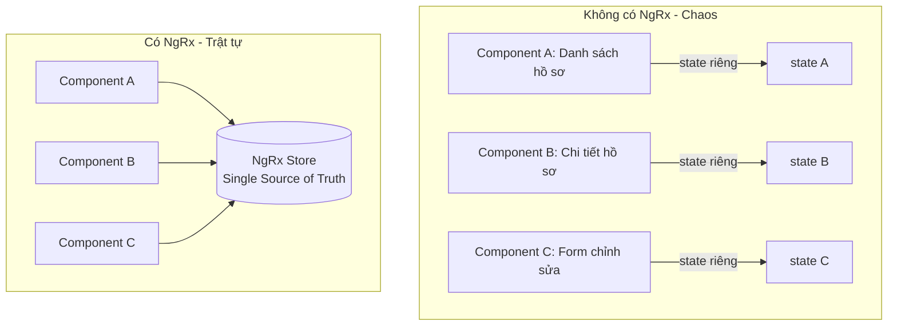
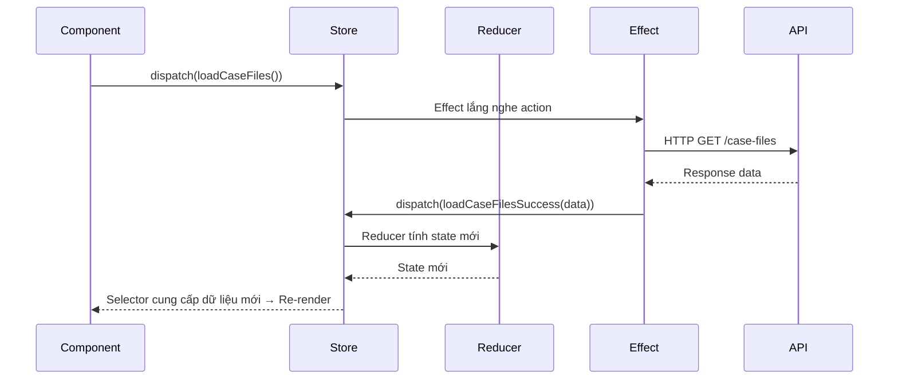
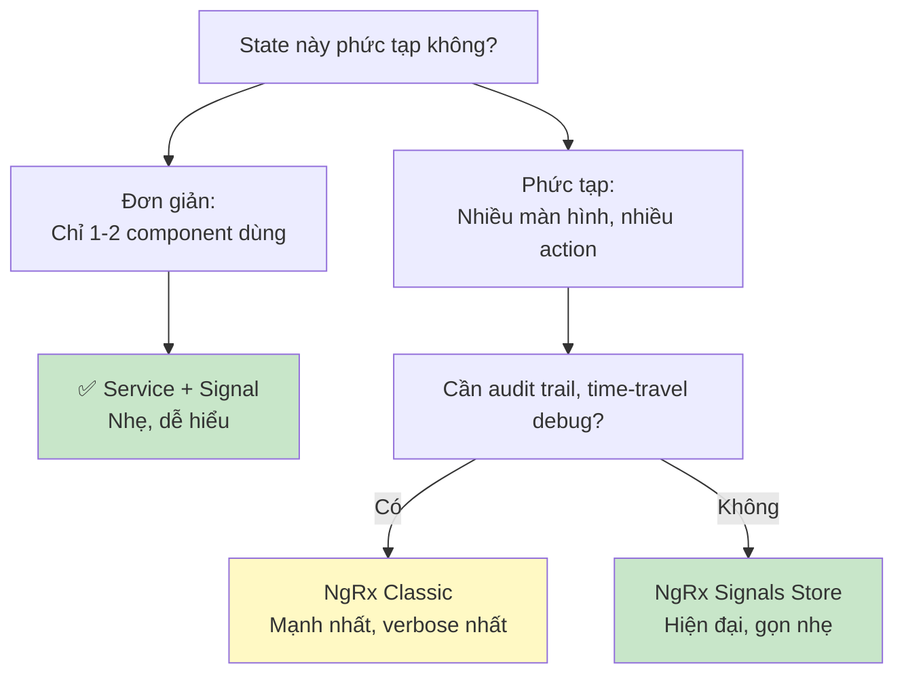

# 16. NgRx: Quản lý State tập trung cho dự án lớn 🏪

> **Tại sao cần NgRx?**
> Khi ứng dụng có hàng chục màn hình, dữ liệu được chia sẻ giữa nhiều component, bạn cần một "ngân hàng dữ liệu trung tâm" — đó là NgRx. Bài này dùng Context: **Hệ thống quản lý hồ sơ tín dụng (PDMS)** làm ví dụ xuyên suốt.

---

## 🏦 1. Vấn đề: Tại sao cần State Management?

### Ẩn dụ: Ngân hàng không có hệ thống sổ sách trung tâm

Hãy tưởng tượng mỗi nhân viên ngân hàng tự lưu thông tin khách hàng trong sổ tay riêng:
- Nhân viên A cập nhật địa chỉ khách
- Nhân viên B vẫn dùng địa chỉ cũ
- **Kết quả:** Dữ liệu không nhất quán, sai sót xảy ra khắp nơi

NgRx là **"Hệ thống core banking"** — một nguồn sự thật duy nhất (Single Source of Truth).



---

## 🔄 2. Vòng đời dữ liệu trong NgRx (Redux Pattern)



---

## 🛠️ 3. Các thành phần cơ bản

### 3.1. State — Trạng thái

```typescript
// case-file.state.ts
export interface CaseFile {
  id: string;
  cif: string;
  borrowerName: string;
  loanAmount: number;
  status: 'PENDING' | 'APPROVED' | 'REJECTED';
  createdAt: Date;
}

export interface CaseFileState {
  items: CaseFile[];
  selectedItem: CaseFile | null;
  isLoading: boolean;
  error: string | null;
  totalCount: number;
  currentPage: number;
}

export const initialCaseFileState: CaseFileState = {
  items: [],
  selectedItem: null,
  isLoading: false,
  error: null,
  totalCount: 0,
  currentPage: 1
};
```

### 3.2. Actions — Sự kiện

```typescript
// case-file.actions.ts
import { createActionGroup, emptyProps, props } from '@ngrx/store';

export const CaseFileActions = createActionGroup({
  source: 'CaseFile',
  events: {
    // Load danh sách
    'Load Case Files': props<{ page: number; filter?: string }>(),
    'Load Case Files Success': props<{ items: CaseFile[]; totalCount: number }>(),
    'Load Case Files Failure': props<{ error: string }>(),
    
    // Load chi tiết
    'Load Case File Detail': props<{ id: string }>(),
    'Load Case File Detail Success': props<{ item: CaseFile }>(),
    
    // Phê duyệt
    'Approve Case File': props<{ id: string; comment: string }>(),
    'Approve Case File Success': props<{ updatedItem: CaseFile }>(),
    'Approve Case File Failure': props<{ error: string }>(),
    
    // UI
    'Select Case File': props<{ id: string }>(),
    'Clear Selected': emptyProps(),
  }
});
```

### 3.3. Reducer — Người xử lý trạng thái

```typescript
// case-file.reducer.ts
import { createReducer, on } from '@ngrx/store';

export const caseFileReducer = createReducer(
  initialCaseFileState,
  
  // Load list
  on(CaseFileActions.loadCaseFiles, (state) => ({
    ...state,
    isLoading: true,
    error: null
  })),
  
  on(CaseFileActions.loadCaseFilesSuccess, (state, { items, totalCount }) => ({
    ...state,
    items,
    totalCount,
    isLoading: false
  })),
  
  on(CaseFileActions.loadCaseFilesFailure, (state, { error }) => ({
    ...state,
    error,
    isLoading: false
  })),
  
  // Approve — cập nhật item trong mảng immutably
  on(CaseFileActions.approveCaseFileSuccess, (state, { updatedItem }) => ({
    ...state,
    items: state.items.map(item => 
      item.id === updatedItem.id ? updatedItem : item
    ),
    selectedItem: state.selectedItem?.id === updatedItem.id 
      ? updatedItem 
      : state.selectedItem
  }))
);
```

### 3.4. Selectors — Bộ lọc dữ liệu thông minh

```typescript
// case-file.selectors.ts
import { createFeatureSelector, createSelector } from '@ngrx/store';

const selectCaseFileState = createFeatureSelector<CaseFileState>('caseFile');

export const CaseFileSelectors = {
  selectAll: createSelector(selectCaseFileState, s => s.items),
  selectLoading: createSelector(selectCaseFileState, s => s.isLoading),
  selectError: createSelector(selectCaseFileState, s => s.error),
  selectTotal: createSelector(selectCaseFileState, s => s.totalCount),
  selectSelected: createSelector(selectCaseFileState, s => s.selectedItem),
  
  // Derived selector — tính từ state gốc
  selectPendingCount: createSelector(
    selectCaseFileState,
    s => s.items.filter(f => f.status === 'PENDING').length
  ),
  
  selectFilteredByLoan: (minAmount: number) => createSelector(
    selectCaseFileState,
    s => s.items.filter(f => f.loanAmount >= minAmount)
  )
};
```

### 3.5. Effects — Xử lý Side Effects (API calls)

```typescript
// case-file.effects.ts
import { Injectable, inject } from '@angular/core';
import { Actions, createEffect, ofType } from '@ngrx/effects';
import { catchError, exhaustMap, map, of, switchMap } from 'rxjs';

@Injectable()
export class CaseFileEffects {
  private actions$ = inject(Actions);
  private caseFileService = inject(CaseFileService);
  private toastService = inject(ToastService);

  loadCaseFiles$ = createEffect(() =>
    this.actions$.pipe(
      ofType(CaseFileActions.loadCaseFiles),
      // switchMap: Hủy request cũ khi có request mới (tốt cho search)
      switchMap(({ page, filter }) =>
        this.caseFileService.getAll({ page, filter }).pipe(
          map(response => CaseFileActions.loadCaseFilesSuccess({
            items: response.data,
            totalCount: response.total
          })),
          catchError(err => of(CaseFileActions.loadCaseFilesFailure({
            error: err.message
          })))
        )
      )
    )
  );

  approveCaseFile$ = createEffect(() =>
    this.actions$.pipe(
      ofType(CaseFileActions.approveCaseFile),
      // exhaustMap: Bỏ qua request mới khi đang xử lý (tốt cho submit form)
      exhaustMap(({ id, comment }) =>
        this.caseFileService.approve(id, comment).pipe(
          map(updatedItem => {
            this.toastService.success('Phê duyệt hồ sơ thành công!');
            return CaseFileActions.approveCaseFileSuccess({ updatedItem });
          }),
          catchError(err => {
            this.toastService.error('Phê duyệt thất bại: ' + err.message);
            return of(CaseFileActions.approveCaseFileFailure({ error: err.message }));
          })
        )
      )
    )
  );
}
```

---

## 🖥️ 4. Dùng NgRx trong Component

```typescript
// case-file-list.component.ts
@Component({
  standalone: true,
  changeDetection: ChangeDetectionStrategy.OnPush,
  template: `
    @if (isLoading$ | async) {
      <app-skeleton-loader />
    }
    
    @if (error$ | async; as error) {
      <app-error-banner [message]="error" />
    }
    
    <div class="case-file-list">
      @for (file of caseFiles$ | async; track file.id) {
        <app-case-file-card 
          [caseFile]="file"
          (approve)="onApprove($event)"
          (viewDetail)="onViewDetail($event)"
        />
      }
    </div>
    
    <app-pagination 
      [total]="totalCount$ | async"
      (pageChange)="onPageChange($event)"
    />
  `
})
export class CaseFileListComponent implements OnInit {
  private store = inject(Store);

  // Streams từ Store — luôn up-to-date
  caseFiles$ = this.store.select(CaseFileSelectors.selectAll);
  isLoading$ = this.store.select(CaseFileSelectors.selectLoading);
  error$ = this.store.select(CaseFileSelectors.selectError);
  totalCount$ = this.store.select(CaseFileSelectors.selectTotal);
  pendingCount$ = this.store.select(CaseFileSelectors.selectPendingCount);

  ngOnInit() {
    this.store.dispatch(CaseFileActions.loadCaseFiles({ page: 1 }));
  }

  onApprove(id: string) {
    // Dialog confirm trước khi dispatch
    this.store.dispatch(CaseFileActions.approveCaseFile({ 
      id, 
      comment: 'Đã xét duyệt' 
    }));
  }

  onPageChange(page: number) {
    this.store.dispatch(CaseFileActions.loadCaseFiles({ page }));
  }
  
  onViewDetail(id: string) {
    this.store.dispatch(CaseFileActions.selectCaseFile({ id }));
  }
}
```

---

## 📁 5. Cấu trúc thư mục NgRx chuẩn enterprise

```
src/app/features/case-file/
├── store/
│   ├── case-file.actions.ts
│   ├── case-file.reducer.ts
│   ├── case-file.selectors.ts
│   ├── case-file.effects.ts
│   └── index.ts                  ← Export tất cả
├── services/
│   └── case-file.service.ts
├── components/
│   ├── case-file-list/
│   └── case-file-card/
└── case-file.routes.ts
```

---

## 🔄 6. NgRx Signals Store (Mới nhất - Angular 18+)

NgRx Signals Store là API mới, gọn nhẹ hơn, thay thế dần classic NgRx:

```typescript
// case-file-signals.store.ts
import { signalStore, withState, withMethods, withComputed, patchState } from '@ngrx/signals';
import { rxMethod } from '@ngrx/signals/rxjs-interop';

export const CaseFileStore = signalStore(
  { providedIn: 'root' },
  
  withState<CaseFileState>(initialCaseFileState),
  
  withComputed(({ items }) => ({
    pendingCount: computed(() => items().filter(f => f.status === 'PENDING').length),
    approvedItems: computed(() => items().filter(f => f.status === 'APPROVED')),
  })),
  
  withMethods((store, service = inject(CaseFileService)) => ({
    loadCaseFiles: rxMethod<{ page: number }>(
      pipe(
        switchMap(({ page }) => {
          patchState(store, { isLoading: true });
          return service.getAll({ page }).pipe(
            tapResponse({
              next: (res) => patchState(store, { 
                items: res.data, 
                totalCount: res.total,
                isLoading: false 
              }),
              error: (err) => patchState(store, { 
                error: err.message, 
                isLoading: false 
              })
            })
          );
        })
      )
    ),
    
    selectCaseFile(id: string) {
      const found = store.items().find(f => f.id === id) ?? null;
      patchState(store, { selectedItem: found });
    }
  }))
);

// Dùng trong Component — siêu gọn
@Component({ ... })
export class CaseFileListComponent {
  store = inject(CaseFileStore); // Inject trực tiếp
  
  ngOnInit() {
    this.store.loadCaseFiles({ page: 1 });
  }
  
  // Template: store.items(), store.isLoading(), store.pendingCount()
}
```

---

## 📊 7. Khi nào dùng NgRx vs Signal/Service?



---

**Bài tiếp theo:** [[17-HTTP-Interceptors-Auth-Patterns|17. HTTP Interceptors & Auth Patterns]] 🔐
