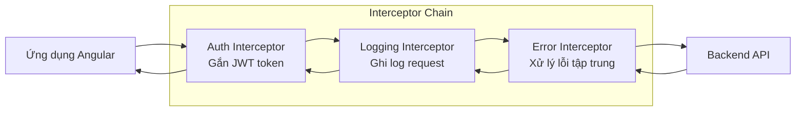
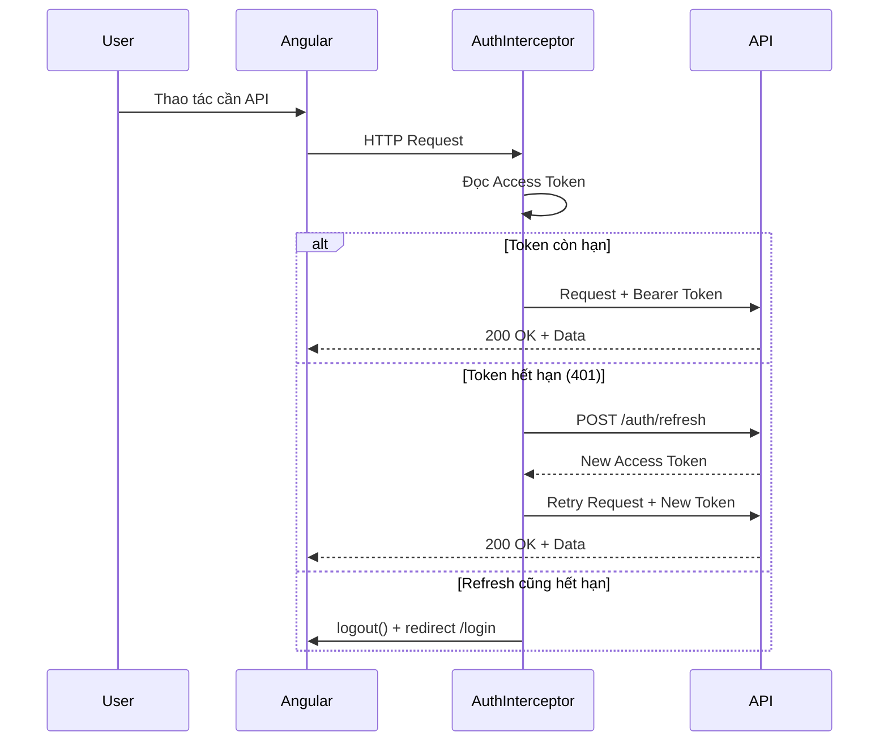

# 17. HTTP Interceptors & Auth Patterns 🔐

> **Tại sao quan trọng với enterprise?**
> Mọi dự án ngân hàng đều cần: tự động gắn JWT token, xử lý token hết hạn, retry khi lỗi 401, log request/response. Interceptor là lớp middleware của Angular HTTP — viết một lần, áp dụng cho toàn bộ API call.

---

## 🧱 1. Interceptor là gì?

### Ẩn dụ: Trạm kiểm soát hải quan

Hãy tưởng tượng mọi **request HTTP** là một container hàng hoá xuất khẩu, và mọi **response** là hàng nhập khẩu:



---

## 🔑 2. Auth Interceptor: Tự động gắn JWT

### Pattern đầy đủ cho enterprise

```typescript
// auth.interceptor.ts
import { HttpInterceptorFn, HttpRequest, HttpHandlerFn } from '@angular/common/http';
import { inject } from '@angular/core';
import { catchError, switchMap, throwError, BehaviorSubject, filter, take } from 'rxjs';

let isRefreshing = false;
const refreshTokenSubject = new BehaviorSubject<string | null>(null);

export const authInterceptor: HttpInterceptorFn = (req, next) => {
  const authService = inject(AuthService);
  const token = authService.getAccessToken();

  // Không gắn token cho các request public (login, refresh)
  if (isPublicUrl(req.url)) {
    return next(req);
  }

  // Gắn token vào header
  const authReq = addAuthHeader(req, token);

  return next(authReq).pipe(
    catchError(error => {
      if (error.status === 401 && !req.url.includes('refresh-token')) {
        return handleTokenRefresh(req, next, authService);
      }
      return throwError(() => error);
    })
  );
};

// Thêm Bearer token
function addAuthHeader(req: HttpRequest<unknown>, token: string | null) {
  if (!token) return req;
  return req.clone({
    setHeaders: { Authorization: `Bearer ${token}` }
  });
}

// Tự động refresh token khi hết hạn (401)
function handleTokenRefresh(
  req: HttpRequest<unknown>,
  next: HttpHandlerFn,
  authService: AuthService
) {
  if (!isRefreshing) {
    isRefreshing = true;
    refreshTokenSubject.next(null);

    return authService.refreshToken().pipe(
      switchMap(({ accessToken }) => {
        isRefreshing = false;
        refreshTokenSubject.next(accessToken);
        return next(addAuthHeader(req, accessToken));
      }),
      catchError(err => {
        isRefreshing = false;
        authService.logout(); // Đăng xuất nếu refresh thất bại
        return throwError(() => err);
      })
    );
  }

  // Có request khác đang đợi token mới → queue lại
  return refreshTokenSubject.pipe(
    filter(token => token !== null),
    take(1),
    switchMap(token => next(addAuthHeader(req, token!)))
  );
}

function isPublicUrl(url: string): boolean {
  const publicUrls = ['/auth/login', '/auth/refresh', '/public/'];
  return publicUrls.some(u => url.includes(u));
}
```

---

## 📝 3. Logging Interceptor: Ghi log request/response

```typescript
// logging.interceptor.ts
export const loggingInterceptor: HttpInterceptorFn = (req, next) => {
  const startTime = Date.now();
  const logger = inject(LoggerService);

  logger.debug(`[HTTP] → ${req.method} ${req.url}`, {
    body: req.body,
    params: req.params.toString()
  });

  return next(req).pipe(
    tap({
      next: (event) => {
        if (event instanceof HttpResponse) {
          const duration = Date.now() - startTime;
          logger.debug(`[HTTP] ← ${event.status} ${req.url} (${duration}ms)`);
          
          // Cảnh báo nếu response chậm quá 3 giây
          if (duration > 3000) {
            logger.warn(`[SLOW API] ${req.url} took ${duration}ms`);
          }
        }
      },
      error: (error) => {
        logger.error(`[HTTP] ← ERROR ${error.status} ${req.url}`, error);
      }
    })
  );
};
```

---

## ❌ 4. Error Interceptor: Xử lý lỗi tập trung

```typescript
// error.interceptor.ts
import { HttpInterceptorFn, HttpErrorResponse } from '@angular/common/http';
import { inject } from '@angular/core';
import { catchError, throwError } from 'rxjs';

export const errorInterceptor: HttpInterceptorFn = (req, next) => {
  const toastService = inject(ToastService);
  const router = inject(Router);

  return next(req).pipe(
    catchError((error: HttpErrorResponse) => {
      switch (error.status) {
        case 400:
          // Lỗi validation từ server — hiển thị message cụ thể
          const message = error.error?.message || 'Dữ liệu không hợp lệ';
          toastService.error(message);
          break;

        case 401:
          // Không xác thực — đã xử lý ở authInterceptor
          break;

        case 403:
          toastService.warning('Bạn không có quyền thực hiện thao tác này');
          router.navigate(['/forbidden']);
          break;

        case 404:
          toastService.error('Không tìm thấy dữ liệu');
          break;

        case 422:
          // Validation errors từ backend (Laravel/Spring Boot format)
          const validationErrors = error.error?.errors;
          if (validationErrors) {
            const firstError = Object.values(validationErrors)[0] as string[];
            toastService.error(firstError[0]);
          }
          break;

        case 500:
        case 502:
        case 503:
          toastService.error('Hệ thống đang gặp sự cố. Vui lòng thử lại sau.');
          break;

        default:
          if (!navigator.onLine) {
            toastService.error('Mất kết nối mạng!');
          }
      }

      // Luôn propagate lỗi để component tự xử lý thêm nếu cần
      return throwError(() => error);
    })
  );
};
```

---

## 🔄 5. Retry Interceptor: Tự động thử lại

```typescript
// retry.interceptor.ts
import { retry, timer } from 'rxjs';

export const retryInterceptor: HttpInterceptorFn = (req, next) => {
  // Chỉ retry GET request, không retry POST/PUT (tránh duplicate)
  if (req.method !== 'GET') {
    return next(req);
  }

  return next(req).pipe(
    retry({
      count: 3, // Thử lại tối đa 3 lần
      delay: (error, retryCount) => {
        // Chỉ retry 5xx errors, không retry 4xx
        if (error.status >= 400 && error.status < 500) {
          throw error;
        }
        // Exponential backoff: 1s, 2s, 4s
        return timer(1000 * Math.pow(2, retryCount - 1));
      }
    })
  );
};
```

---

## ⚙️ 6. Đăng ký Interceptors

```typescript
// app.config.ts
import { provideHttpClient, withInterceptors } from '@angular/common/http';

export const appConfig: ApplicationConfig = {
  providers: [
    provideHttpClient(
      withInterceptors([
        // Thứ tự quan trọng! Interceptor đầu tiên bọc ngoài cùng
        loggingInterceptor,    // 1. Log trước tiên
        authInterceptor,       // 2. Gắn auth token
        retryInterceptor,      // 3. Retry nếu cần
        errorInterceptor,      // 4. Xử lý lỗi cuối cùng
      ])
    ),
    // ...
  ]
};
```

---

## 🔐 7. AuthService: Quản lý token

```typescript
// auth.service.ts
@Injectable({ providedIn: 'root' })
export class AuthService {
  private http = inject(HttpClient);
  private router = inject(Router);
  
  private readonly ACCESS_TOKEN_KEY = 'pdms_access_token';
  private readonly REFRESH_TOKEN_KEY = 'pdms_refresh_token';

  // Signal cho trạng thái đăng nhập
  private _isLoggedIn = signal(this.hasValidToken());
  isLoggedIn = this._isLoggedIn.asReadonly();

  login(credentials: LoginDto): Observable<AuthResponse> {
    return this.http.post<AuthResponse>('/api/auth/login', credentials).pipe(
      tap(res => this.saveTokens(res))
    );
  }

  refreshToken(): Observable<{ accessToken: string }> {
    const refreshToken = this.getRefreshToken();
    return this.http.post<{ accessToken: string }>('/api/auth/refresh', { refreshToken });
  }

  logout() {
    localStorage.removeItem(this.ACCESS_TOKEN_KEY);
    localStorage.removeItem(this.REFRESH_TOKEN_KEY);
    this._isLoggedIn.set(false);
    this.router.navigate(['/login']);
  }

  getAccessToken(): string | null {
    return localStorage.getItem(this.ACCESS_TOKEN_KEY);
  }

  private getRefreshToken(): string | null {
    return localStorage.getItem(this.REFRESH_TOKEN_KEY);
  }

  private saveTokens(res: AuthResponse) {
    localStorage.setItem(this.ACCESS_TOKEN_KEY, res.accessToken);
    localStorage.setItem(this.REFRESH_TOKEN_KEY, res.refreshToken);
    this._isLoggedIn.set(true);
  }

  private hasValidToken(): boolean {
    const token = this.getAccessToken();
    if (!token) return false;
    // Decode JWT và kiểm tra exp (đơn giản)
    try {
      const payload = JSON.parse(atob(token.split('.')[1]));
      return payload.exp * 1000 > Date.now();
    } catch {
      return false;
    }
  }
}
```

---

## 📊 8. Tóm tắt luồng Auth hoàn chỉnh



---

**Bài tiếp theo:** [[18-Route-Guards-and-Resolvers|18. Route Guards & Resolvers: Kiểm soát điều hướng]] 🛡️
