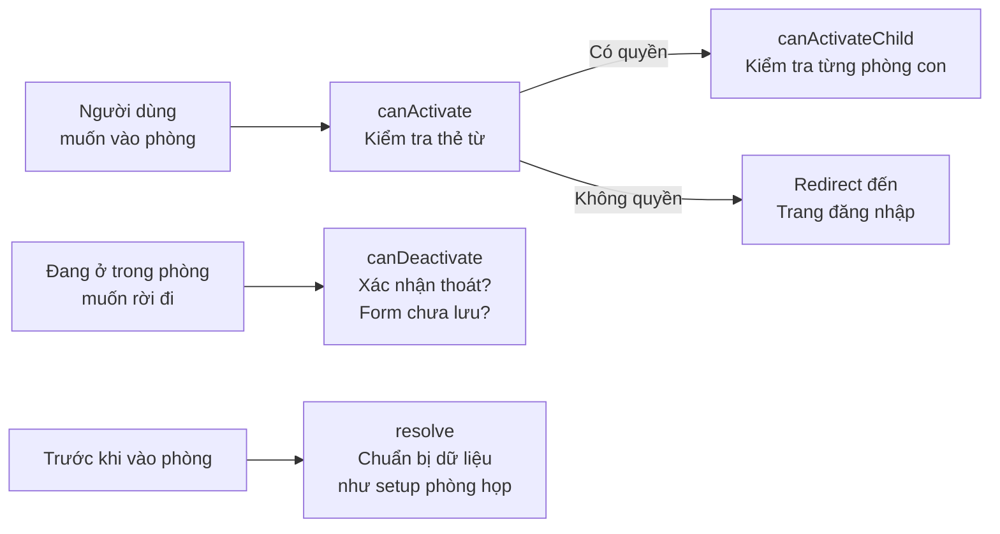
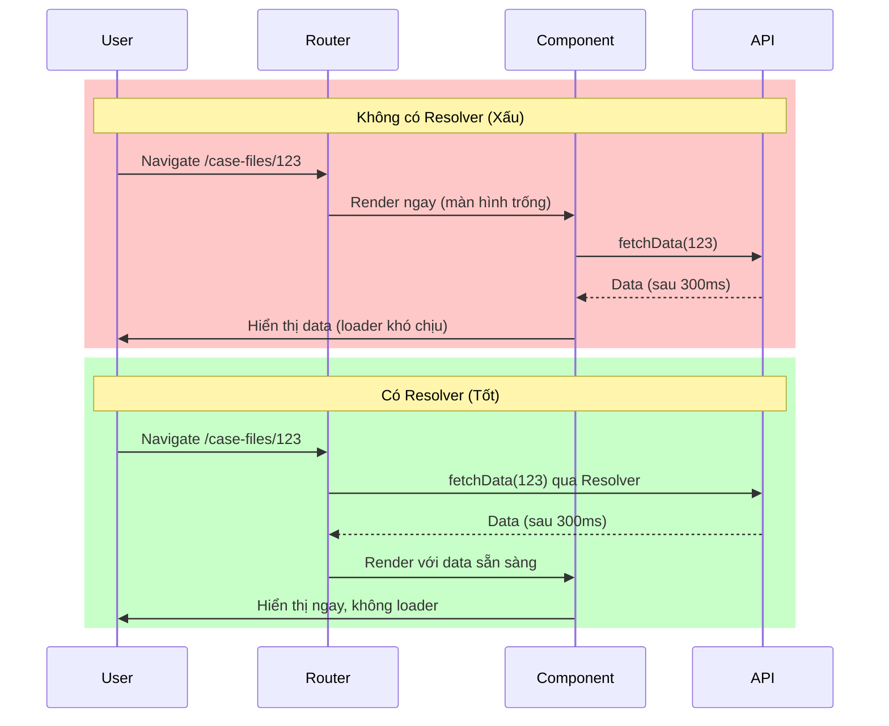

# 18. Route Guards & Resolvers: Kiểm soát điều hướng 🛡️

> **Tại sao quan trọng?**
> Guards là "bảo vệ" đứng trước cánh cửa mỗi route. Resolvers là "người chuẩn bị" tải dữ liệu trước khi component render. Cả hai giúp ứng dụng banking an toàn và trải nghiệm mượt mà hơn.

---

## 🚪 1. Route Guards là gì?

### Ẩn dụ: Hệ thống bảo mật toà nhà ngân hàng



---

## 🔐 2. canActivate Guard: Kiểm tra đăng nhập

```typescript
// auth.guard.ts
import { inject } from '@angular/core';
import { CanActivateFn, Router } from '@angular/router';

export const authGuard: CanActivateFn = (route, state) => {
  const authService = inject(AuthService);
  const router = inject(Router);

  if (authService.isLoggedIn()) {
    return true;
  }

  // Lưu URL người dùng muốn vào để sau khi login redirect về
  router.navigate(['/login'], { 
    queryParams: { returnUrl: state.url } 
  });
  return false;
};
```

---

## 👮 3. Role/Permission Guard: Kiểm tra quyền hạn

```typescript
// permission.guard.ts
import { inject } from '@angular/core';
import { CanActivateFn, ActivatedRouteSnapshot } from '@angular/router';

export const permissionGuard: CanActivateFn = (route: ActivatedRouteSnapshot) => {
  const permissionService = inject(PermissionService);
  const router = inject(Router);
  
  // Lấy danh sách quyền yêu cầu từ route data
  const requiredPermissions: string[] = route.data['permissions'] ?? [];
  const requiredRoles: string[] = route.data['roles'] ?? [];

  const hasPermission = requiredPermissions.length === 0 || 
    requiredPermissions.every(p => permissionService.hasPermission(p));
  
  const hasRole = requiredRoles.length === 0 || 
    requiredRoles.some(r => permissionService.hasRole(r));

  if (hasPermission && hasRole) {
    return true;
  }

  router.navigate(['/forbidden']);
  return false;
};

// Dùng trong routes:
// {
//   path: 'approve-credit',
//   component: ApproveCreditComponent,
//   data: { 
//     permissions: ['CREDIT_APPROVE'],
//     roles: ['APPROVER', 'MANAGER']
//   },
//   canActivate: [authGuard, permissionGuard]
// }
```

---

## ⚠️ 4. canDeactivate Guard: Cảnh báo khi rời trang chưa lưu

```typescript
// unsaved-changes.guard.ts
import { CanDeactivateFn } from '@angular/router';
import { Observable } from 'rxjs';

// Interface để component implement
export interface CanComponentDeactivate {
  canDeactivate(): boolean | Observable<boolean> | Promise<boolean>;
}

export const unsavedChangesGuard: CanDeactivateFn<CanComponentDeactivate> = (component) => {
  return component.canDeactivate ? component.canDeactivate() : true;
};

// Trong component form:
@Component({ ... })
export class CreditApplicationFormComponent implements CanComponentDeactivate {
  private isDirty = signal(false);
  private dialogService = inject(DialogService);

  canDeactivate(): Observable<boolean> {
    if (!this.isDirty()) {
      return of(true); // Không có thay đổi, thoát bình thường
    }

    // Hiện dialog xác nhận
    return this.dialogService.confirm({
      title: 'Bỏ các thay đổi?',
      message: 'Form chưa được lưu. Bạn có chắc muốn rời trang này không?',
      confirmText: 'Rời trang',
      cancelText: 'Tiếp tục chỉnh sửa'
    });
  }
}
```

---

## 📦 5. Resolver: Tải dữ liệu trước khi render

### Ẩn dụ: Phục vụ phòng chuẩn bị trước khi khách vào

Thay vì component render trước rồi mới tải dữ liệu (màn hình trắng/spinner), Resolver tải dữ liệu **trước** rồi mới cho vào.

```typescript
// case-file-detail.resolver.ts
import { inject } from '@angular/core';
import { ResolveFn, ActivatedRouteSnapshot, Router } from '@angular/router';
import { catchError, EMPTY } from 'rxjs';

export const caseFileDetailResolver: ResolveFn<CaseFile> = (
  route: ActivatedRouteSnapshot
) => {
  const caseFileService = inject(CaseFileService);
  const router = inject(Router);
  const id = route.paramMap.get('id')!;

  return caseFileService.getById(id).pipe(
    catchError(() => {
      // Nếu không tìm thấy, redirect về danh sách
      router.navigate(['/case-files']);
      return EMPTY; // EMPTY = không emit gì, route sẽ không activate
    })
  );
};
```

---

## 🗺️ 6. Cấu hình Routes đầy đủ cho enterprise

```typescript
// app.routes.ts
import { Routes } from '@angular/router';

export const routes: Routes = [
  // Public routes — không cần guard
  {
    path: 'login',
    loadComponent: () => import('./features/auth/login/login.component')
      .then(m => m.LoginComponent)
  },

  // Protected routes — cần đăng nhập
  {
    path: '',
    canActivate: [authGuard],
    loadComponent: () => import('./layouts/main-layout/main-layout.component')
      .then(m => m.MainLayoutComponent),
    children: [
      {
        path: 'dashboard',
        loadComponent: () => import('./features/dashboard/dashboard.component')
          .then(m => m.DashboardComponent)
      },
      
      // Lazy-loaded feature module với guard phân quyền
      {
        path: 'case-files',
        canActivate: [permissionGuard],
        data: { permissions: ['CASE_FILE_VIEW'] },
        children: [
          {
            path: '',
            loadComponent: () => import('./features/case-file/list/case-file-list.component')
              .then(m => m.CaseFileListComponent)
          },
          {
            path: ':id',
            resolve: { caseFile: caseFileDetailResolver }, // ← Resolver
            loadComponent: () => import('./features/case-file/detail/case-file-detail.component')
              .then(m => m.CaseFileDetailComponent)
          },
          {
            path: ':id/edit',
            canActivate: [permissionGuard],
            canDeactivate: [unsavedChangesGuard], // ← Cảnh báo rời trang
            data: { permissions: ['CASE_FILE_EDIT'] },
            resolve: { caseFile: caseFileDetailResolver },
            loadComponent: () => import('./features/case-file/edit/case-file-edit.component')
              .then(m => m.CaseFileEditComponent)
          }
        ]
      },
      
      // Approve — chỉ APPROVER và MANAGER mới vào được
      {
        path: 'approvals',
        canActivate: [permissionGuard],
        data: { roles: ['APPROVER', 'MANAGER'] },
        loadChildren: () => import('./features/approval/approval.routes')
          .then(m => m.approvalRoutes)
      }
    ]
  },

  // Fallback
  { path: 'forbidden', loadComponent: () => import('./pages/forbidden.component').then(m => m.ForbiddenComponent) },
  { path: '**', redirectTo: 'dashboard' }
];
```

---

## 🔄 7. Dùng dữ liệu từ Resolver trong Component

```typescript
// case-file-detail.component.ts
@Component({
  standalone: true,
  template: `
    <h1>{{ caseFile.borrowerName }}</h1>
    <p>Mã hồ sơ: {{ caseFile.id }}</p>
    <p>Số tiền vay: {{ caseFile.loanAmount | currency:'VND' }}</p>
    <app-status-badge [status]="caseFile.status" />
  `
})
export class CaseFileDetailComponent {
  private route = inject(ActivatedRoute);
  
  // Lấy dữ liệu đã được resolve — không cần loading state!
  caseFile: CaseFile = this.route.snapshot.data['caseFile'];
}
```

---

## 📊 8. So sánh: Không có vs Có Resolver



---

**Bài tiếp theo:** [[19-Content-Projection-and-Advanced-Template|19. Content Projection & Advanced Template Patterns]] 🎭
