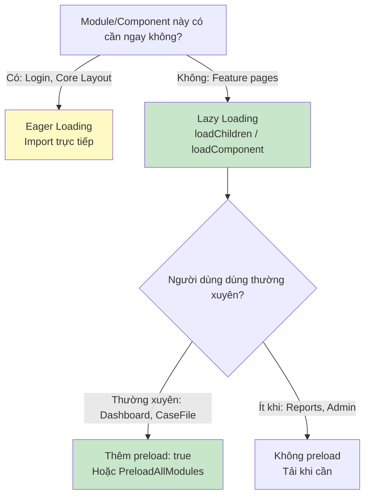

# 20. Lazy Loading & Code Splitting: Tối ưu Bundle Size 🚀

> **Tại sao quan trọng với enterprise?**
> Dự án banking có hàng chục màn hình. Nếu load tất cả cùng lúc, lần đầu vào app người dùng phải chờ tải về **5-10MB JavaScript**. Lazy Loading chia nhỏ bundle, chỉ tải khi cần → app khởi động nhanh hơn **50-80%**.

---

## 📦 1. Bundle là gì? Vấn đề là gì?

### Ẩn dụ: Siêu thị vs Cửa hàng tiện lợi

```mermaid
graph TD
    subgraph Không có Lazy Loading
        A[App khởi động] --> B[Tải TOÀN BỘ code: 8MB]
        B --> C[Người dùng chờ... 5 giây]
        C --> D[Mở trang Login]
    end
    
    subgraph Có Lazy Loading
        E[App khởi động] --> F[Chỉ tải core: 200KB]
        F --> G[Mở trang Login ngay: 0.5 giây]
        G --> H[Người dùng vào Dashboard]
        H --> I[Tải Dashboard module: 300KB]
        I --> J[Vào Case Files]
        J --> K[Tải Case Files module: 400KB]
    end
    
    style C fill:#ffcccc
    style G fill:#ccffcc
```



---

## ⚙️ 2. Lazy Loading Routes

### Cấu hình cơ bản

```typescript
// app.routes.ts
export const routes: Routes = [
  // Tải ngay khi app khởi động (Critical path)
  {
    path: 'login',
    component: LoginComponent // ← Import trực tiếp = Eager loading
  },
  
  // Lazy load khi người dùng điều hướng đến
  {
    path: 'dashboard',
    loadComponent: () => 
      import('./features/dashboard/dashboard.component')
        .then(m => m.DashboardComponent)
  },
  
  // Lazy load cả một nhóm routes (feature module)
  {
    path: 'case-files',
    loadChildren: () => 
      import('./features/case-file/case-file.routes')
        .then(m => m.caseFileRoutes)
  },
  
  {
    path: 'approvals',
    loadChildren: () => 
      import('./features/approval/approval.routes')
        .then(m => m.approvalRoutes)
  },
  
  {
    path: 'reports',
    loadChildren: () => 
      import('./features/reports/reports.routes')
        .then(m => m.reportsRoutes)
  }
];
```

### Feature routes file

```typescript
// case-file.routes.ts
export const caseFileRoutes: Routes = [
  {
    path: '',
    loadComponent: () => import('./list/case-file-list.component')
      .then(m => m.CaseFileListComponent)
  },
  {
    path: 'new',
    loadComponent: () => import('./create/case-file-create.component')
      .then(m => m.CaseFileCreateComponent)
  },
  {
    path: ':id',
    loadComponent: () => import('./detail/case-file-detail.component')
      .then(m => m.CaseFileDetailComponent)
  }
];
```

---

## ⚡ 3. Preloading: Tải trước khi cần

Lazy Loading có nhược điểm: lần đầu vào route sẽ có một khoảng chờ nhỏ. Preloading giải quyết điều này:

```typescript
// app.config.ts
import { provideRouter, withPreloading, PreloadAllModules } from '@angular/router';

export const appConfig: ApplicationConfig = {
  providers: [
    // PreloadAllModules: Sau khi app load xong, tải ngầm tất cả lazy modules
    provideRouter(routes, withPreloading(PreloadAllModules))
  ]
};
```

### Custom Preloading Strategy

Tải trước một số route quan trọng, bỏ qua những route ít dùng:

```typescript
// selective-preload.strategy.ts
import { Injectable } from '@angular/core';
import { PreloadingStrategy, Route } from '@angular/router';
import { Observable, of } from 'rxjs';

@Injectable({ providedIn: 'root' })
export class SelectivePreloadStrategy implements PreloadingStrategy {
  preload(route: Route, load: () => Observable<any>): Observable<any> {
    // Chỉ preload nếu route có flag preload: true
    if (route.data?.['preload']) {
      console.log(`Preloading: ${route.path}`);
      return load();
    }
    return of(null);
  }
}

// Trong routes:
{
  path: 'dashboard',
  data: { preload: true }, // ← Sẽ được preload
  loadChildren: () => import('./features/dashboard/dashboard.routes')
    .then(m => m.dashboardRoutes)
},
{
  path: 'reports', // Không có preload: true → Chỉ tải khi cần
  loadChildren: () => import('./features/reports/reports.routes')
    .then(m => m.reportsRoutes)
}
```

---

## 🎭 4. Lazy Loading với Suspense: ng-defer (Angular 17+)

```typescript
@Component({
  template: `
    <!-- Defer: Trì hoãn việc render component nặng -->
    @defer (on viewport) {
      <!-- Chỉ render khi user scroll đến vùng này -->
      <app-heavy-chart [data]="chartData" />
    } @placeholder {
      <!-- Hiện trong khi chờ -->
      <div class="chart-placeholder">Đang tải biểu đồ...</div>
    } @loading (minimum 500ms) {
      <app-skeleton height="300px" />
    } @error {
      <p>Không thể tải biểu đồ</p>
    }
    
    <!-- Defer khi idle (trình duyệt rảnh) -->
    @defer (on idle) {
      <app-notification-panel />
    }
    
    <!-- Defer khi có interaction -->
    @defer (on interaction(triggerBtn)) {
      <app-advanced-filters />
    }
    <button #triggerBtn>Bộ lọc nâng cao</button>
  `
})
export class DashboardComponent {
  chartData = input<ChartData[]>([]);
}
```

---

## 🖼️ 5. Lazy Loading Images (NgOptimizedImage)

```typescript
import { NgOptimizedImage } from '@angular/common';

@Component({
  standalone: true,
  imports: [NgOptimizedImage],
  template: `
    <!-- LCP image: priority để load sớm -->
    
    
    <!-- Non-critical images: lazy by default -->
    
    
    <!-- Với responsive sizes -->
    
  `
})
export class ProfileComponent {
  user = input.required<User>();
}
```

---

## 📊 6. Phân tích Bundle Size

```bash
# Build với stats
ng build --stats-json

# Xem bundle analysis (cài webpack-bundle-analyzer)
npx webpack-bundle-analyzer dist/pdms/stats.json
```

### Kết quả trước và sau Lazy Loading

```
TRƯỚC (Eager):
main.js                          8.2 MB  ← Tải tất cả khi khởi động

SAU (Lazy):
main.js                          210 KB  ← Bundle chính (Core + Login)
chunk-dashboard.js               340 KB  ← Tải khi vào Dashboard
chunk-case-files.js              480 KB  ← Tải khi vào Case Files
chunk-approvals.js               290 KB  ← Tải khi vào Approvals
chunk-reports.js                 620 KB  ← Tải khi vào Reports
```

---

## 🔧 7. Best Practices tổng hợp



### Checklist Lazy Loading cho dự án enterprise:
- ✅ Mỗi feature module là một lazy route
- ✅ Shared/Core modules là eager (nhỏ, cần thiết)
- ✅ Bật preloading cho các route thường dùng
- ✅ Dùng `@defer` cho components nặng trong trang (biểu đồ, PDF viewer)
- ✅ Dùng `NgOptimizedImage` cho tất cả ảnh
- ✅ Định kỳ chạy bundle analyzer để phát hiện bloat

---

**Bài tiếp theo:** [[21-Error-Handling-Global-Patterns|21. Error Handling & Global Patterns: Xử lý lỗi như người lớn]] 🛡️
