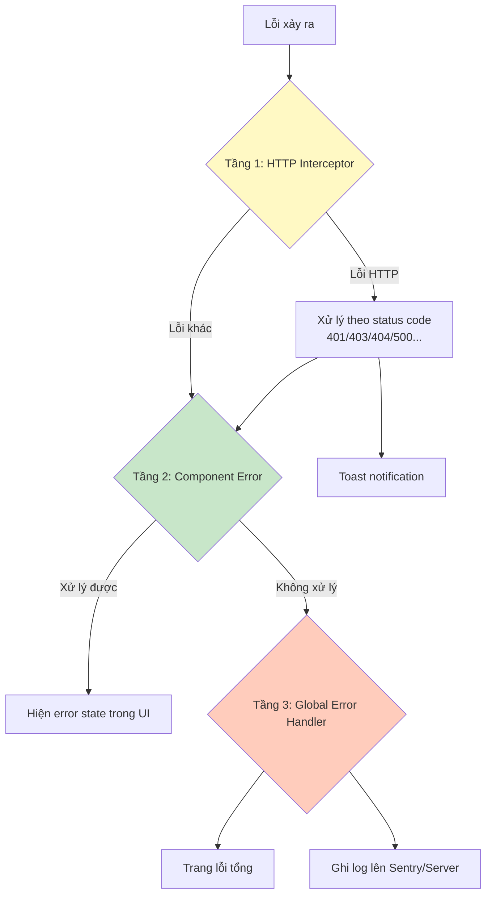

# 21. Error Handling & Global Patterns: Xử lý lỗi như người lớn 🛡️

> **Tại sao quan trọng?**
> Ứng dụng banking không được phép "chết lặng" — mọi lỗi phải được xử lý, log, và thông báo rõ ràng. Bài này xây dựng một hệ thống error handling **đa tầng**, từ component đến global.

---

## 🏛️ 1. Kiến trúc Error Handling 3 tầng



---

## 🌐 2. Global Error Handler

```typescript
// global-error.handler.ts
import { ErrorHandler, Injectable, inject, NgZone } from '@angular/core';
import { Router } from '@angular/router';

@Injectable()
export class GlobalErrorHandler implements ErrorHandler {
  private router = inject(Router);
  private logger = inject(LoggerService);
  private ngZone = inject(NgZone);

  handleError(error: unknown): void {
    // Phân loại lỗi
    if (error instanceof HttpErrorResponse) {
      // Đã xử lý ở interceptor
      return;
    }

    if (error instanceof TypeError) {
      this.logger.error('TypeError:', error.message, error.stack);
    } else if (error instanceof Error) {
      this.logger.error('Runtime Error:', error.message, error.stack);
    } else {
      this.logger.error('Unknown Error:', error);
    }

    // Gửi lên error tracking service (Sentry, Datadog, etc.)
    this.reportToErrorTracking(error);

    // Redirect đến trang lỗi (phải dùng ngZone vì có thể ở ngoài zone)
    this.ngZone.run(() => {
      this.router.navigate(['/error'], {
        queryParams: { 
          message: error instanceof Error ? error.message : 'Lỗi không xác định'
        }
      });
    });
  }

  private reportToErrorTracking(error: unknown) {
    // Tích hợp Sentry
    // Sentry.captureException(error);
    
    // Hoặc gửi về internal logging API
    // this.http.post('/api/error-logs', { error: String(error), url: location.href });
  }
}

// Đăng ký trong app.config.ts
export const appConfig: ApplicationConfig = {
  providers: [
    { provide: ErrorHandler, useClass: GlobalErrorHandler },
    // ...
  ]
};
```

---

## 🎯 3. Error Boundary Pattern trong Angular

Angular không có Error Boundary như React, nhưng ta có thể mô phỏng:

```typescript
// error-boundary.component.ts
@Component({
  selector: 'app-error-boundary',
  standalone: true,
  template: `
    @if (hasError()) {
      <div class="error-boundary">
        <div class="error-icon">⚠️</div>
        <h3>{{ title() }}</h3>
        <p>{{ message() }}</p>
        @if (showRetry()) {
          <button (click)="retry()">Thử lại</button>
        }
      </div>
    } @else {
      <ng-content></ng-content>
    }
  `
})
export class ErrorBoundaryComponent {
  @Input() title = 'Đã có lỗi xảy ra';
  @Input() message = 'Vui lòng thử lại hoặc liên hệ hỗ trợ.';
  @Input() showRetry = true;
  
  hasError = signal(false);
  private retryFn?: () => void;

  catchError(error: Error, retryFn?: () => void) {
    this.hasError.set(true);
    this.retryFn = retryFn;
  }

  retry() {
    this.hasError.set(false);
    this.retryFn?.();
  }
}
```

---

## 📊 4. Component Error State Pattern

```typescript
// Kiểu dữ liệu chuẩn cho async state
type AsyncState<T> = 
  | { status: 'idle' }
  | { status: 'loading' }
  | { status: 'success'; data: T }
  | { status: 'error'; error: string };

@Component({
  standalone: true,
  template: `
    @switch (state().status) {
      @case ('idle') {
        <p class="hint">Chọn bộ lọc để xem dữ liệu</p>
      }
      @case ('loading') {
        <app-skeleton-table [rows]="10" />
      }
      @case ('error') {
        <app-error-card 
          [message]="state().error"
          (retry)="loadData()"
        />
      }
      @case ('success') {
        <app-transaction-table [data]="state().data" />
      }
    }
  `
})
export class TransactionPageComponent {
  state = signal<AsyncState<Transaction[]>>({ status: 'idle' });
  
  private txService = inject(TransactionService);

  loadData() {
    this.state.set({ status: 'loading' });
    
    this.txService.getAll().subscribe({
      next: (data) => this.state.set({ status: 'success', data }),
      error: (err) => this.state.set({ 
        status: 'error', 
        error: err.error?.message ?? 'Không tải được dữ liệu' 
      })
    });
  }
}
```

---

## 🔔 5. Toast Notification Service

```typescript
// toast.service.ts
export interface Toast {
  id: string;
  type: 'success' | 'error' | 'warning' | 'info';
  title: string;
  message?: string;
  duration?: number; // ms, 0 = không tự tắt
}

@Injectable({ providedIn: 'root' })
export class ToastService {
  private toasts = signal<Toast[]>([]);
  readonly toasts$ = this.toasts.asReadonly();

  success(title: string, message?: string) {
    this.show({ type: 'success', title, message, duration: 3000 });
  }

  error(title: string, message?: string) {
    // Lỗi không tự tắt — người dùng phải bấm đóng
    this.show({ type: 'error', title, message, duration: 0 });
  }

  warning(title: string, message?: string) {
    this.show({ type: 'warning', title, message, duration: 5000 });
  }

  private show(toast: Omit<Toast, 'id'>) {
    const id = crypto.randomUUID();
    this.toasts.update(t => [...t, { ...toast, id }]);

    if (toast.duration && toast.duration > 0) {
      setTimeout(() => this.dismiss(id), toast.duration);
    }
  }

  dismiss(id: string) {
    this.toasts.update(t => t.filter(toast => toast.id !== id));
  }
}
```

```typescript
// toast-container.component.ts (đặt trong app.component.html)
@Component({
  selector: 'app-toast-container',
  standalone: true,
  template: `
    <div class="toast-container">
      @for (toast of toastService.toasts$(); track toast.id) {
        <div class="toast toast--{{ toast.type }}" [@slideIn]>
          <span class="toast-icon">
            @switch (toast.type) {
              @case ('success') { ✅ }
              @case ('error') { ❌ }
              @case ('warning') { ⚠️ }
              @case ('info') { ℹ️ }
            }
          </span>
          <div class="toast-content">
            <strong>{{ toast.title }}</strong>
            @if (toast.message) { <p>{{ toast.message }}</p> }
          </div>
          <button class="toast-close" (click)="toastService.dismiss(toast.id)">✕</button>
        </div>
      }
    </div>
  `
})
export class ToastContainerComponent {
  toastService = inject(ToastService);
}
```

---

## 📋 6. Form Validation Error Pattern

```typescript
// validation-message.component.ts — Tái sử dụng cho mọi form
@Component({
  selector: 'app-validation-message',
  standalone: true,
  template: `
    @if (control && control.invalid && (control.dirty || control.touched)) {
      <div class="validation-errors">
        @if (control.errors?.['required']) {
          <span class="error">Trường này không được để trống</span>
        }
        @if (control.errors?.['minlength']) {
          <span class="error">
            Tối thiểu {{ control.errors?.['minlength'].requiredLength }} ký tự
          </span>
        }
        @if (control.errors?.['maxlength']) {
          <span class="error">
            Tối đa {{ control.errors?.['maxlength'].requiredLength }} ký tự
          </span>
        }
        @if (control.errors?.['pattern']) {
          <span class="error">{{ label }} không đúng định dạng</span>
        }
        @if (control.errors?.['serverError']) {
          <span class="error">{{ control.errors?.['serverError'] }}</span>
        }
      </div>
    }
  `
})
export class ValidationMessageComponent {
  @Input() control: AbstractControl | null = null;
  @Input() label = 'Giá trị';
}
```

---

## 📊 7. Tóm tắt Error Handling Strategy

| Tầng | Công cụ | Xử lý gì |
|---|---|---|
| **HTTP** | `errorInterceptor` | 4xx/5xx từ API, Token hết hạn |
| **Component** | `AsyncState<T>` + signal | Loading/Error/Success UI states |
| **Form** | `ValidationMessageComponent` | Form validation errors |
| **Toast** | `ToastService` | User feedback ngắn gọn |
| **Global** | `GlobalErrorHandler` | Runtime errors, uncaught exceptions |
| **Routing** | Error page component | Điều hướng đến trang lỗi |

---

**Chúc mừng!** Bạn đã hoàn thành phần nâng cao của Angular Series! 🎉

**Tiếp theo:** [[00-Roadmap|Quay lại Roadmap]] để xem tổng quan, hoặc bắt đầu [[../React-Latest-Series/00-Roadmap|React Series]]!
