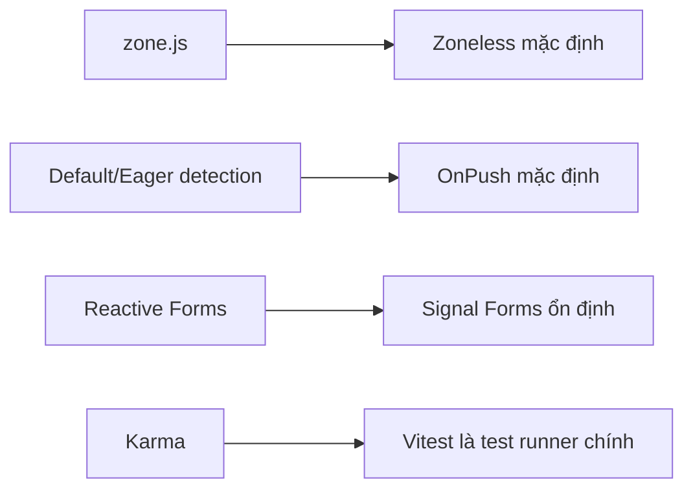
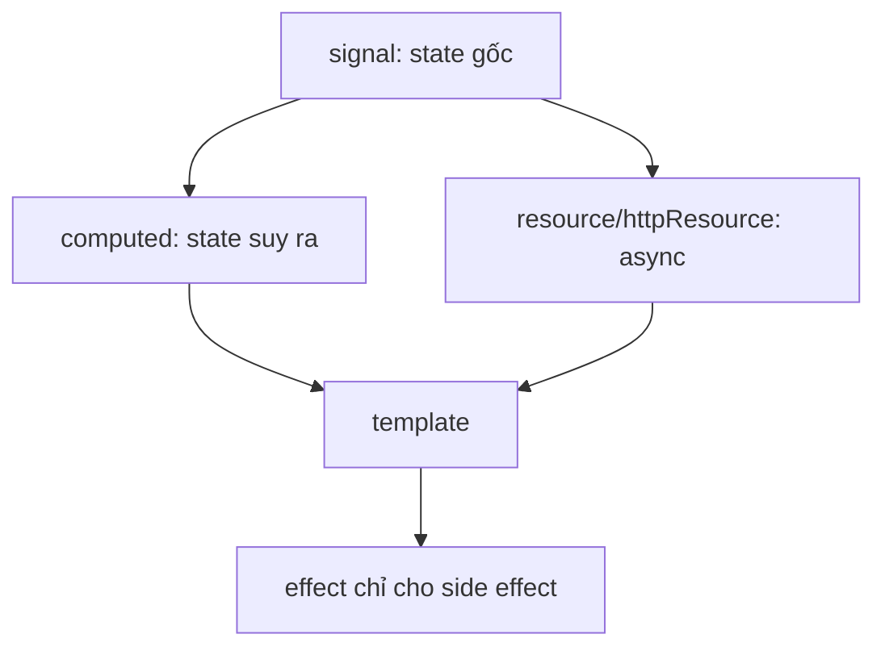

# Angular 22 — Technology Update 2026

## Tóm tắt dễ nhớ

Angular 22 phát hành ngày 03/06/2026. Hướng đi hiện đại của Angular có thể nhớ bằng bốn chuyển dịch:



Đây không phải lời khuyên “rewrite toàn bộ”. Với ứng dụng enterprise, nên nâng version trước, đo regression, sau đó migrate từng lát dọc.

## Những thay đổi ảnh hưởng cách thiết kế

### 1. Signals trở thành đường chính

`signal`, `computed`, `effect`, signal inputs/queries, `linkedSignal`, `resource()` và `httpResource()` tạo thành một mô hình reactive thống nhất hơn. State đồng bộ dùng `signal`; giá trị suy ra dùng `computed`; async resource dùng `resource/httpResource`; side effect chỉ dùng `effect`.



### 2. Zoneless và OnPush làm mặc định thay đổi

Khi không còn dựa vào Zone.js để quét thay đổi toàn ứng dụng, Angular cần tín hiệu rõ ràng hơn về nơi state đổi. Signals, event handler, async pipe và API framework trở thành các điểm thông báo change detection.

Điểm cần audit khi migrate:

- Mutation trực tiếp object/array nhưng không đổi reference.
- Callback từ thư viện ngoài Angular không cập nhật qua signal.
- Code dựa vào `setTimeout` rồi mong toàn cây tự được kiểm tra.
- Test dùng timing ngầm thay vì chờ trạng thái cụ thể.

### 3. Signal Forms ổn định

Signal Forms phù hợp khi muốn form state kết hợp tự nhiên với Signals. Reactive Forms vẫn hợp lệ; ứng dụng lớn nên migrate dần, không trộn hai abstraction trong cùng một form nếu không cần.

### 4. Vitest là test runner chính

Karma không còn là lựa chọn mặc định cho hướng phát triển mới. Khi migrate, ưu tiên:

1. Chạy test hiện tại và lưu baseline.
2. Chuyển matcher/setup.
3. Loại bỏ assumption phụ thuộc browser thật.
4. So sánh coverage và thời gian chạy.

## Compatibility cần kiểm tra

Angular 22.0.x yêu cầu Node `^22.22.3`, `^24.15.0` hoặc `^26.0.0`; TypeScript `>=6.0.0 <6.1.0`; RxJS `^6.5.3` hoặc `^7.4.0`.

## Checklist nâng cấp an toàn

```text
branch nâng cấp
  → cập nhật Node/TypeScript
  → ng update core + cli
  → build và unit test
  → kiểm tra SSR/hydration
  → profile change detection
  → migrate zoneless theo module/feature
  → migrate form và test runner độc lập
```

Lệnh nền tảng:

```bash
ng update @angular/cli@^22 @angular/core@^22
```

Luôn nâng đến patch mới nhất trong major 22.

## Article nên bổ sung tiếp

- `26-Angular-Zoneless-Migration-Playbook.md`
- `27-Signal-Forms-vs-Reactive-Forms.md`
- `28-Resource-httpResource-Production-Patterns.md`
- `29-Angular-SSR-Incremental-Hydration.md`
- `30-Vitest-Migration-for-Enterprise-Angular.md`
- `31-Angular-Aria-Accessible-Headless-Components.md`

## Liên kết trong Vault

- [[frontend-concept-map|Frontend Concept Map]]
- [[08-Signals-The-Modern-Reactivity|Signals]]
- [[15-Change-Detection-and-OnPush|Change Detection và OnPush]]
- [[09-Reactive-Forms-Mastery|Reactive Forms]]

## Nguồn chính thức

- [Angular versioning and releases](https://angular.dev/reference/releases)
- [Angular version compatibility](https://angular.dev/reference/versions)
- [Angular roadmap](https://angular.dev/roadmap)
- [Angular update command](https://angular.dev/cli/update)

