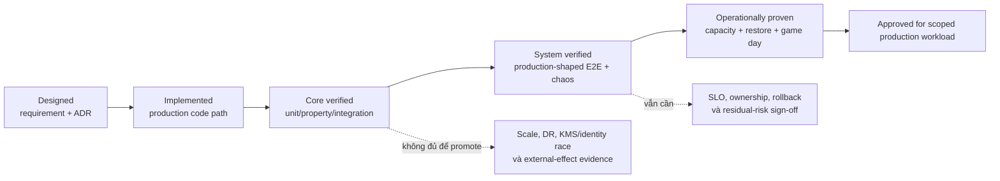

# BPMP Platform — Đánh giá kỹ thuật độc lập

> [!abstract] Nhiệm vụ assessment
> Tài liệu này đánh giá khả năng đưa BPMP vào production, không chỉ chất lượng của target architecture. Review phân biệt **designed**, **implemented**, **verified**, **partial** và **unproven**; ưu tiên correctness, durability, security, compatibility, failure recovery và operational evidence trước feature breadth hoặc benchmark đẹp.

## 1. Scope, baseline và phương pháp

### Baseline

- Repository: `D:/project/bpmp-platform`
- Commit: `ac60f91b3f7057f32336e5371fd5720e5fbf0c14`
- Commit time: 2026-08-06 23:07:35 +0700
- Assessment date: 2026-08-07
- Tài liệu chính: `requirements.md`, `design.md`, `microservices-architecture.md`, ADR-001/003/007/008, Requirement 1/2 compliance, 300k readiness, build/deploy và Kafka topology.
- Code path kiểm tra: compiler, deterministic domain core, RocksDB/Raft state machine, Engine server, Human Runtime, Projection Service, Governance, Cockpit fanout và dependency manifests.

### Quy tắc đánh giá

1. Code và executable test mạnh hơn prose claim.
2. Unit/property test không thay production-topology, chaos, restore hoặc capacity evidence.
3. Một topology E2E chạy thành công chứng minh integration path, không tự động chứng minh safety dưới mọi crash schedule.
4. “Exactly once” chỉ được dùng khi ranh giới và failure model được định nghĩa; network/Kafka/worker mặc định là at-least-once + idempotency/dedup.
5. Mọi benchmark phải công bố workload shape, distribution, concurrency, duration và môi trường.
6. Không suy ra “production-ready” từ việc dùng Rust, Raft, RocksDB, Kafka hoặc Kubernetes.

## 2. Kết luận điều hành

BPMP có target architecture mạnh và nhiều invariant quan trọng đã xuất hiện trong code: authoritative Rust core, atomic encrypted state/event/idempotency/audit/outbox batch, actor-preserving authz, transactional projections, signed/versioned WIR và governance proof. Đây không còn là thiết kế slideshow thuần túy.

Tuy nhiên baseline **chưa được phê duyệt cho production chứa PII, quyết định tín dụng hoặc external financial effect không thể hoàn tác**. Lý do không phải một lỗi kiến trúc đơn lẻ mà là sáu nhóm evidence còn thiếu:

1. Standards/semantic breadth của BPMN/DMN/CMMN.
2. Compatibility xuyên WIR/event/snapshot/binary version thật.
3. Production KMS, revoke/shred race và identity rotation chaos.
4. Backup/restore, RPO/RTO và region-loss strategy.
5. Multi-Raft-group sharding, hot-tenant isolation và long soak capacity.
6. External-effect adapter contracts, reconciliation và indeterminate outcome handling.

| Use case | Verdict |
|---|---|
| Local development / learning | **Ready** |
| Functional MVP dùng synthetic data | **Conditionally ready** |
| Bounded internal pilot không PII | **Chỉ sau pilot gates** |
| Production regulated/PII | **Not approved** |
| Thay Camunda/Temporal mission-critical | **Not approved** |

*Evidence-maturity model: mũi tên liền là điều kiện tích lũy bắt buộc, không phải timeline tự động. Baseline BPMP nằm khác nhau theo subsystem: nhiều core path ở `C`, functional topology chạm `S`, nhưng toàn platform chưa đạt `O`.*

## 3. Điểm mạnh đã có evidence

### 3.1 Source-of-truth boundary rõ

`bpmp-engine` là owner duy nhất của WIR interpretation, `decide/evolve`, authoritative transition, final authz và write-side idempotency. Human Runtime và Projection Service không tự diễn giải WIR. Boundary này giảm nguy cơ hai service tạo hai sự thật khác nhau.

### 3.2 Atomic authoritative consequences

RocksDB path có code và test cho một batch chứa encrypted workflow state/event, idempotency result, authorization audit và outbox. Đây là invariant đúng cho Engine boundary. Nó không làm Kafka delivery thành exactly-once; publisher và consumer vẫn phải xử lý duplicate.

### 3.3 Actor/workload separation tốt

ADR-008 tách workload identity khỏi end-user actor, bind proof vào tenant/command/audience và re-authorize trước idempotency lookup. Negative tests cho workload substitution là evidence có giá trị cao hơn gateway-only authentication.

### 3.4 Config/policy replay context

`config_version` và `policy_version` đi vào event/audit metadata. Runtime dùng immutable resolved snapshot tại safe point thay vì remote config call giữa command. Điều này hỗ trợ investigation và hạn chế policy tearing giữa một transaction.

### 3.5 Compliance erasure không bỏ quên side effect

Compensation Ledger, `TerminatedForCompliance`, `ReconciliationRequired` và work item phi-PII được thiết kế/implement theo cùng authoritative transition. Legal override yêu cầu maker-checker và digest bind; đây là boundary hiếm khi được thiết kế đủ sớm.

### 3.6 Assessment nội bộ không overclaim scale

`docs/300k-ccu-readiness.md` đã chỉ đúng serialization bottleneck, O(all subscriptions) fanout, PostgreSQL pool budget và Redis dependency. Repo tự ghi “not 300k ready”, phù hợp evidence hiện tại.

## 4. Findings ưu tiên

### F-01 — P0: Chưa có DR contract, RPO/RTO và restore evidence

**Observation:** Raft bảo vệ node failure trong một failure domain khi quorum còn sống; nó không thay backup, corruption recovery hoặc region-loss plan. Baseline chưa có RPO/RTO được phê duyệt, encrypted backup format, restore drill hay cross-region ownership rõ ràng.

**Impact:** Mất/quá hạn phục hồi toàn bộ workflow history; không thể chứng minh business continuity hoặc compliance retention.

**Required action:**

- Viết ADR DR cho RocksDB/Raft, WIR registry, PostgreSQL bounded-context DB và Kafka replay dependencies.
- Chốt RPO/RTO theo workload; định nghĩa consistency của snapshot với Raft log index/membership.
- Ký/hash/encrypt backup; kiểm restore vào clean cluster.
- Diễn tập node-volume loss, stale/corrupt snapshot, mất quorum và region loss.

**Exit criterion:** Một runbook được chạy thành công từ backup tới acceptance transaction, với RPO/RTO đo được và audit artifact lưu lại.

### F-02 — P0: Capacity claim bị chặn bởi serialization và fanout architecture

**Observation:** Một Engine group giữ proposal coordination qua quorum/apply; RocksDB có shared write coordination; Cockpit fanout scan toàn subscription; PostgreSQL pool chưa có global budget. Không có 100k/300k soak.

**Impact:** Tail latency, queue growth và noisy-neighbor failure xảy ra trước khi HPA/load balancer có tác dụng.

**Required action:** Shard directory nhiều Raft group, concurrent independent-stream proposal với deterministic stale-write rejection, indexed/sharded realtime fanout, byte-based admission control và total PostgreSQL connection budget.

**Exit criterion:** Ba workload profile connected-idle/normal/stress chạy ramp 30 phút + soak 2 giờ, có controlled failure và không có unbounded memory slope hay duplicate authoritative event.

### F-03 — P0: Standards breadth chưa đủ cho claim “BPMN/DMN/CMMN platform” theo nghĩa rộng

**Observation:** Executable Requirement 1 profile pass 12/12, nhưng literal requirement còn 5 partial. DMN runtime hiện chủ yếu FIRST/UNIQUE; deep structural type, FEEL breadth và COLLECT/PRIORITY/aggregator chưa đủ. CMMN mới là stage/milestone/if-part sentry subset.

**Impact:** Model hợp lệ theo OMG có thể bị từ chối hoặc, nguy hiểm hơn, được chấp nhận với semantic khác kỳ vọng nghiệp vụ.

**Required action:** Công bố versioned supported-profile matrix; fail closed cho construct ngoài catalog; grammar-based generators; conformance corpus; differential tests với reference implementation nơi licensing cho phép.

**Exit criterion:** Business owner ký scope profile; mọi accepted construct có compiler→engine→replay evidence; unsupported construct trả diagnostic có span và không sinh partial artifact.

### F-04 — P0: Atomic batch có core evidence nhưng thiếu crash/power-loss/restore matrix trên production media

**Observation:** WriteBatch invariant có code/test. Functional E2E chứng minh leader failover, nhưng chưa thay thế power loss, filesystem error, compaction stall, torn environment, snapshot install và disk corruption tests trên Linux/NVMe production-shaped environment.

**Impact:** Claim durability có thể đúng ở logic nhưng sai dưới storage/OS failure mode thực.

**Required action:** Crash injection trước/sau Raft commit, apply, WAL sync, response, Kafka ACK và checkpoint; kiểm invariant bằng clean reopen/restore. Đo p99 fsync/compaction stall và disk-full behavior.

**Exit criterion:** Không crash schedule nào tạo event mà thiếu idempotency/audit/outbox bắt buộc hoặc làm committed event biến mất sau recovery.

### F-05 — P0: External-effect safety phải được chứng minh theo từng adapter

**Observation:** BPMP đã có cross-system Compensation Ledger; vì vậy không đúng khi nói kiến trúc chỉ compensation nội bộ. Gap thật là target systems khác nhau có semantics khác nhau: idempotency key, query-by-operation-reference, cancel/compensate và indeterminate result.

**Impact:** Worker có thể hoàn tất external effect rồi mất ACK; retry có thể double charge/double posting nếu target không hỗ trợ dedup/reconcile.

**Required action:** Mỗi adapter khai báo capability contract: idempotent create/update, operation-status lookup, compensation semantics, retryable/final errors, timeout và reconciliation owner. Target không đáp ứng phải qua manual control hoặc không được dùng cho irreversible effect.

**Exit criterion:** Crash-after-effect-before-ACK test chứng minh retry/reconcile không tạo double business effect cho từng critical integration.

### F-06 — P1: Evolution đã được thiết kế, nhưng compatibility evidence còn thiếu

**Observation:** Requirement/design đã có canonical WIR schema, version pinning và EventUpcaster. Vì vậy nói “WIR evolution chưa được nhắc tới” là sai. Gap chính xác là chưa có real schema v2, old-version golden fixture và binary rollback/roll-forward matrix.

**Impact:** Engine upgrade có thể làm instance sống dài hạn không load/replay hoặc thay semantic behavior.

**Required action:** Tách ba axis: workflow business version, WIR wire version, event/snapshot schema. Bổ sung golden bytes cho mỗi supported version và cross-binary replay suite.

**Exit criterion:** Engine N/N+1 load và replay mọi supported artifact/history; rollback binary không corrupt state; retire version chỉ khi không còn reference.

### F-07 — P1: Identity/KMS/policy race chưa đủ production evidence

**Observation:** Core fail-closed và revoke epoch được thiết kế tốt, nhưng multi-replica key rotation, JWKS refresh failure, stale bundle, KMS cache expiry đồng thời append và crash quanh shred chưa được chứng minh đầy đủ.

**Impact:** Unauthorized transition, prolonged outage hoặc plaintext/data-unavailable behavior sai compliance.

**Required action:** Chaos test cho unknown signing key, bundle rollback, actor revocation giữa approval/propose, DEK epoch race, KMS outage/cache expiry và crash trước/sau compliance commit/shred.

**Exit criterion:** Mọi stale/tampered state fail closed; không plaintext; successful governance audit giữ requester/approver/digest; recovery không chạy business path trên shredded state.

### F-08 — P1: Replay-safe observability chưa có contract tường minh

**Observation:** Pure `decide/evolve` không nên emit telemetry. Nhưng adapter/application replay, rebuild và recovery có thể double-count nếu metric/span business được phát từ apply path mà không phân biệt replay mode.

**Impact:** Dashboard, alert, billing hoặc audit-derived metric sai; không ảnh hưởng state correctness nhưng ảnh hưởng vận hành và investigation.

**Required action:** Phân loại telemetry: command-attempt, committed-event, replay/rebuild và projection-effect. Business counters chỉ derive từ committed event/inbox identity; replay metric phải có label riêng với cardinality bounded.

**Exit criterion:** Rebuild/recovery test không tăng committed-business counter lần hai; trace vẫn cho phép phân biệt replay với first apply.

### F-09 — P1: Tenant isolation logic tốt nhưng physical noisy-neighbor control chưa đủ

**Observation:** Tenant nằm trong key/auth/query và quota logic. Tuy nhiên tenant lớn có thể chia sẻ Raft leader, RocksDB disk/CF, PostgreSQL pool và fanout hub với tenant nhỏ.

**Impact:** Một tenant làm tăng p99 hoặc exhaust disk/connection/queue của tenant khác dù không đọc được dữ liệu của họ.

**Required action:** Tenant-aware admission theo bytes/CPU/I/O, per-tenant queue age, shard placement policy và dedicated group/tier cho hot tenant; workload test với Zipfian tenant skew.

**Exit criterion:** Tenant vượt quota bị throttle/reject trong khi SLO và reserved capacity của tenant khác vẫn giữ trong test overload.

### F-10 — P1: Bus factor và operator ownership là production blocker

**Observation:** Stack trải rộng Rust/OpenRaft/RocksDB/Wasmtime/Go/Kafka/PostgreSQL/KMS/React. Code quality không thay thế người trực on-call hiểu failure semantics và có quyền xử lý.

**Impact:** MTTR cao; upgrade hoặc incident phụ thuộc một người; runbook không được kiểm chứng dưới áp lực.

**Required action:** Ownership matrix, second maintainer cho Engine/storage, incident game day, code-review requirement cho critical boundary và release rotation.

**Exit criterion:** Ít nhất hai người độc lập hoàn thành restore, leader/membership recovery, poison-event handling và rollback drill.

## 5. Vendor comparison — framing đã hiệu chỉnh

### 5.1 BPMP không phải phép cộng literal Camunda + Temporal

BPMP là custom workflow engine vay mượn:

- BPMN/DMN modeling và BA-first interaction từ ecosystem BPM.
- Durable event history, deterministic replay discipline và activity separation từ workflow-as-code systems.
- Compiler/IR, embedded authz và atomic governance là lựa chọn riêng.

Stakeholder phải hiểu đây là **build**, không phải tích hợp hai sản phẩm production-proven. ADR build-vs-buy/compose vẫn là P0 governance decision.

### 5.2 BPMP và Zeebe có pattern tương đồng nhưng không “kiến trúc tương đương” hoàn toàn

Cả hai có partition/replication, durable state và external workers. Tuy nhiên compiler semantics, authz, governance, storage/log protocol, API, operational tooling và maturity khác nhau. Việc dùng Raft/RocksDB không tạo lợi thế tự thân; lợi thế phải đến từ workload-specific invariant và evidence.

Camunda 8.9 hiện có fine-grained Orchestration Cluster và user-task authorization. Điểm khác biệt có thể bảo vệ của BPMP là hẹp hơn: embedded transition evaluator, actor/workload binding, revoke epoch và atomic ALLOW audit. Zeebe không chạy CMMN; không nên suy đoán nguyên nhân “vì nhu cầu thấp” nếu không có nguồn sản phẩm.

### 5.3 Temporal `GetVersion()` không phải WIR schema migration

`GetVersion()`/patching giữ workflow-code replay deterministic khi code thay đổi. BPMP cần thêm Protobuf WIR compatibility và event/snapshot upcasting. Có thể học deployment discipline từ Temporal, nhưng không được coi hai cơ chế là cùng abstraction.

### 5.4 WriteBatch không loại bỏ delivery semantics của outbox/CDC

BPMP atomically ghi authoritative consequences trong RocksDB state-machine apply. Transactional outbox trên RDBMS cũng có thể atomically ghi domain state + outbox rồi dùng CDC. Cả hai vẫn có publication lag và duplicate sau ACK/checkpoint race; consumer dedup là bắt buộc. So sánh nên tập trung vào authoritative boundary và operational trade-off, không nói CDC “chỉ giải quyết một nửa”.

### 5.5 Compensation không mặc định yêu cầu Temporal bên ngoài

BPMP có thể orchestration external saga thông qua durable tasks và Compensation Ledger. Temporal chỉ nên được thêm khi workload code-first, SDK/versioning/operations maturity của Temporal đem lại giá trị lớn hơn chi phí vận hành hai orchestrator. Hybrid làm tăng source-of-truth, tracing, correlation và failure-recovery complexity nên cần ADR riêng.

## 6. Risk register

Thang điểm: Likelihood (L) và Impact (I) từ 1–5; Risk = L×I. Điểm không phải xác suất toán học, mà là công cụ ưu tiên review.

| ID | Risk | L | I | Score | Owner cần có | Evidence đóng risk |
|---|---|---:|---:|---:|---|---|
| R1 | Standards semantic mismatch | 4 | 5 | 20 | Compiler/domain | Conformance catalog + differential/golden tests |
| R2 | Region/storage loss không restore đúng | 3 | 5 | 15 | Engine/SRE | Approved RPO/RTO + restore drill |
| R3 | Double external financial effect | 3 | 5 | 15 | Integration owner | Adapter idempotency/reconciliation crash tests |
| R4 | KMS/revoke/shred race | 3 | 5 | 15 | Security/governance | Multi-node chaos + audit artifact |
| R5 | Raft/shard safety bug | 3 | 5 | 15 | Engine/storage | Model check + partition/membership/snapshot chaos |
| R6 | WIR/event upgrade breaks long-running instance | 4 | 4 | 16 | Compiler/engine | Cross-version golden replay matrix |
| R7 | 300k/hot-tenant overload | 5 | 4 | 20 | Platform/SRE | Defined workload + long soak + isolation test |
| R8 | Projection/realtime stale hoặc mất hint | 4 | 3 | 12 | Query/cockpit | Durable resync, lag SLO, slow-consumer tests |
| R9 | Authz bundle/JWKS operational outage | 3 | 4 | 12 | Security/platform | Rotation/outage/rollback chaos |
| R10 | Bus factor/incident recovery | 4 | 4 | 16 | Engineering leadership | Second operator + game-day evidence |

## 7. Production scorecard

| Domain | Rating | Nhận xét |
|---|---|---|
| Domain correctness | **Amber** | Pure core và property direction tốt; standards breadth chưa đủ |
| Durability/atomicity | **Amber-Green core** | Atomic batch tốt; media/crash/restore evidence thiếu |
| Consensus/HA | **Amber** | Functional failover có; full chaos/membership/sharding chưa có |
| Security/authz | **Amber-Green core** | Boundary mạnh; rotation/outage/operations chưa đủ |
| Encryption/governance | **Amber** | Protocol sâu; production KMS/shred race chưa đủ |
| Contracts/evolution | **Amber** | Protobuf governance có; real multi-version history thiếu |
| External effects | **Amber-Red** | Ledger có; adapter-specific guarantees chưa được chứng minh |
| Performance/capacity | **Red** | Không có production-like target-scale evidence |
| DR/business continuity | **Red** | Chưa có approved RPO/RTO/restore drill |
| Observability/operations | **Amber-Red** | Telemetry foundation có; SLO/runbook/game-day chưa hoàn chỉnh |
| Organizational readiness | **Red until staffed** | Ownership/bus-factor evidence chưa có |

## 8. Required artifacts trước production review tiếp theo

1. ADR build-vs-buy/compose Camunda/Temporal.
2. Versioned supported BPMN/DMN/CMMN profile và conformance report.
3. WIR/event/snapshot compatibility policy + golden replay matrix.
4. External-effect capability matrix theo integration.
5. Raft/sharding directory protocol và model-check report.
6. Security threat model + identity/KMS chaos report.
7. DR ADR, RPO/RTO, backup manifest và restore exercise report.
8. Capacity test specification và raw result cho ba workload profile.
9. SLO/error-budget/dashboard/alert catalog.
10. Ownership/on-call/escalation/rollback/runbook và game-day sign-off.

## 9. Decision recommendation

Tiếp tục đầu tư BPMP là hợp lý nếu mục tiêu là xây một platform chuyên biệt có các invariant mà sản phẩm sẵn có không đáp ứng kinh tế hoặc tổ chức. Không nên phê duyệt thay thế Camunda/Temporal chỉ từ target architecture hoặc functional E2E.

Quyết định hợp lý tại baseline:

- Cho phép tiếp tục compiler/engine correctness và bounded synthetic-data pilot.
- Không dùng PII thật trước KMS/governance/DR gates.
- Không chạy irreversible financial effect trước adapter reconciliation gates.
- Không công bố 100k/300k capacity trước soak evidence.
- Không gọi full BPMN/DMN/CMMN support ngoài executable profile đã version hóa.

## 10. Liên kết và nguồn đối chiếu

- [[BPMP-Architecture-Technology-Deep-Dive]] — kiến trúc, evidence matrix và production gates
- `D:/project/bpmp-platform/requirements.md`
- `D:/project/bpmp-platform/design.md`
- `D:/project/bpmp-platform/microservices-architecture.md`
- `D:/project/bpmp-platform/docs/requirement-1-compliance.md`
- `D:/project/bpmp-platform/docs/requirement-2-compliance.md`
- `D:/project/bpmp-platform/docs/300k-ccu-readiness.md`
- `D:/project/bpmp-platform/docs/build-and-deploy.md`
- [Camunda 8 architecture](https://docs.camunda.io/docs/components/zeebe/technical-concepts/architecture/)
- [Camunda 8 partitions](https://docs.camunda.io/docs/components/zeebe/technical-concepts/partitions/)
- [Camunda 8 authorization](https://docs.camunda.io/docs/components/concepts/access-control/authorizations/)
- [Temporal documentation](https://docs.temporal.io/)
- [Temporal Go SDK `GetVersion`](https://github.com/temporalio/sdk-go/blob/master/workflow/workflow.go)

> [!note] Giới hạn review
> Assessment này là review code/documentation baseline, không phải chứng nhận độc lập sau khi trực tiếp vận hành production workload. Những gate ghi **unproven** hoặc **partial** chỉ được đóng bằng artifact thực thi, không bằng cập nhật prose.
