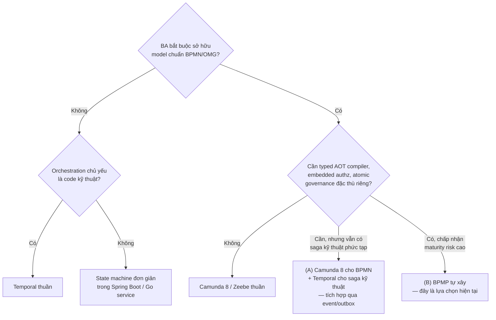
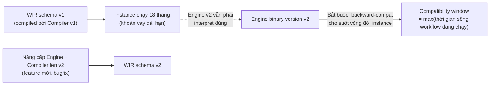

# BPMP Platform — Đánh giá kiến trúc độc lập

> [!abstract] Vị trí tài liệu này
> `[[BPMP-Architecture-Technology-Deep-Dive]]` mô tả kiến trúc **mục tiêu** rất chi tiết, đã có sẵn ma trận so sánh Camunda/Temporal và risk register. Tài liệu này **không lặp lại** nội dung đó. Đây là một bản review độc lập, đóng vai trò "outside reviewer": chất vấn giả định, chỉ ra gap chưa được nêu, và ép rõ requirement trước khi tiếp tục đầu tư engineering effort. Đọc song song hai file.

## 1. Điểm cần thống nhất trước khi đánh giá tiếp: "kết hợp Camunda và Temporal" nghĩa là gì?

Yêu cầu gốc mô tả BPMP là "kết hợp Camunda với Temporal". Nhưng chính tài liệu kiến trúc lại tuyên bố rõ:

> "BPMP không đơn thuần là 'Camunda viết lại bằng Rust' và cũng không phải 'Temporal có BPMN UI'."

Hai câu này **không tương thích nhau** nếu hiểu theo nghĩa đen. Có 3 khả năng, và chúng dẫn tới 3 kiến trúc khác nhau:

| Cách hiểu | Kiến trúc tương ứng | Đây có phải BPMP hiện tại không? |
|---|---|---|
| (A) Chạy thật Zeebe (Camunda 8) cho BPMN + chạy thật Temporal Server cho saga kỹ thuật, tích hợp qua event | Hai hệ thống production riêng biệt, BPMP chỉ là lớp orchestration/glue | **Không** |
| (B) Tự xây engine mới, "vay mượn ý tưởng" — BPMN-as-artifact từ thế giới Camunda, deterministic event-sourced replay từ thế giới Temporal | Rust compiler + Rust engine + Raft + RocksDB như `design.md` mô tả | **Đúng, đây là B** |
| (C) Dùng SDK Temporal, viết workflow bằng code, chỉ mượn BPMN làm tài liệu thiết kế (không thực thi) | Temporal thuần, BPMN chỉ là documentation | Không |

Đây không phải bắt bẻ chữ nghĩa. Nó ảnh hưởng trực tiếp đến 3 việc thực tế:

1. **Cách trình bày dự án với stakeholder/leadership.** Nếu ai đó ở VPBank nghe "kết hợp Camunda và Temporal" và hiểu theo (A), họ sẽ kỳ vọng sai — họ nghĩ bạn đang tích hợp hai sản phẩm đã production-proven, trong khi thực tế bạn đang **tự viết một workflow engine từ đầu** bằng Rust + OpenRaft + RocksDB. Rủi ro kỳ vọng (expectation risk) này lớn hơn rủi ro kỹ thuật.
2. **ADR còn thiếu.** Kiến trúc có ADR-001 (deterministic core), ADR-003 (protobuf), ADR-007 (dynamic config), ADR-008 (embedded authz) — nhưng **không có ADR nào trả lời "vì sao build thay vì buy/compose (A)"**. Đây là ADR quan trọng nhất còn thiếu, vì nó là ADR duy nhất có thể bị hỏi ngược ("sao không dùng Camunda 8 cho BPMN và Temporal cho saga, xong rồi?").
3. **Quyết định phạm vi (scope).** Nếu mục tiêu thật là (C) — Temporal thuần, BPMN chỉ để BA đọc hiểu — thì toàn bộ compiler layer (7 giai đoạn compile, WIR, ký Ed25519) là over-engineering không cần thiết.

**Khuyến nghị cụ thể:** viết một ADR mới — `ADR-00X-build-vs-compose-camunda-temporal.md` — nêu rõ vì sao (B) được chọn thay vì (A). Nếu lý do là "học tập và làm chủ toàn bộ distributed systems stack" (một mục tiêu hoàn toàn chính đáng), hãy ghi rõ điều đó trong ADR thay vì để nó ngầm hiểu. Nó thay đổi hoàn toàn khẩu vị rủi ro (risk appetite) được phép chấp nhận ở phần 4.

## 2. Tóm tắt đánh giá

BPMP, xét về mặt lý thuyết kiến trúc, được thiết kế **tốt hơn** phần lớn hệ thống workflow tự chế (home-grown) thường gặp: invariant atomic WriteBatch, embedded authz với revoke epoch, config replayable theo `config_version`/`policy_version`, compiler boundary tách biệt BPMN khỏi runtime. Đây không phải lời khen xã giao — so với việc "tự viết REST API + `@Scheduled` + status column" (câu hỏi ban đầu của bạn), BPMP đã nhảy thẳng lên trình độ kiến trúc ngang hàng với Zeebe/Temporal về mặt tư duy.

Nhưng **giá trị kiến trúc không tự động chuyển thành giá trị production**. Rủi ro lớn nhất không nằm ở thiết kế — nó nằm ở việc kiến trúc này đòi hỏi tái tạo lại, từ số không, hàng chục năm-người engineering mà Camunda và Temporal đã đầu tư để xử lý các edge case ngữ nghĩa BPMN/DMN, chaos-test Raft, và vá lỗi replay. Phần 4-5 dưới đây đi vào chi tiết từng điểm.

## 3. Điểm mạnh thực sự — vì sao đáng làm (nếu mục tiêu đúng là học/làm chủ platform)

Đây là 4 điểm tôi cho là **thật sự** khác biệt, không phải marketing:

1. **Compile boundary buộc lỗi lộ ra ở CI, không phải ở production.** Zeebe validate BPMN lúc deploy nhưng không làm full symbolic gateway reachability + type-check data contract như thiết kế BPMP nhắm tới. Nếu phần compiler này thực sự đạt được "mục tiêu cốt lõi" đã nêu (không chỉ là target), đây là lợi thế correctness thật, đặc biệt quan trọng cho banking domain nơi một gateway logic sai có thể nghĩa là duyệt sai một khoản vay.

2. **Một WriteBatch atomic chứa event + idempotency + audit + outbox.** Đây giải quyết đúng vấn đề dual-write mà outbox pattern kiểu CDC (Debezium) chỉ giải quyết được một nửa (CDC vẫn có độ trễ, vẫn cần dedup ở consumer). Làm atomic ngay tại storage engine là thiết kế đúng nếu RocksDB WriteBatch semantics được test kỹ.

3. **Authz fail-closed embedded trong Engine, không phải remote PDP.** Giải quyết đúng bài toán "cache policy stale" và "network dependency trên critical path" — vấn đề rất thực tế khi PDMS của bạn đang có multi-layer authorization (Identity/RBAC/Resource/ABAC/Data Filter) chạy như service riêng.

4. **Config version gắn vào audit trail cho replay xác định.** Đây là chi tiết dễ bị bỏ qua trong hầu hết hệ thống workflow tự chế — không ghi lại "quyết định này dùng policy version nào" nghĩa là 6 tháng sau không điều tra lại được tại sao một transition được ALLOW. BPMP làm đúng chỗ này.

## 4. Điểm yếu và rủi ro — nhìn thẳng, không né

### 4.1 Bạn đang tái tạo lại Zeebe, không phải tránh nó

Nhìn kỹ: Compiler → WIR ≈ Zeebe's internal execution graph sau khi deploy BPMN. Raft + RocksDB ≈ Zeebe's partitioned/replicated log + state. Outbox → Kafka ≈ Zeebe Exporter. Đây gần như là **kiến trúc tương đương**, viết lại bằng Rust thay vì Java. Tài liệu gốc đã tự nhận điều này ở mục 14 ("BPMP có Raft/RocksDB tự nó không phải lợi thế cạnh tranh") — điều tôi muốn nhấn mạnh thêm: Zeebe mất khoảng 6-8 năm và một đội ngũ core-engineer full-time để đạt độ phủ BPMN/DMN hiện tại. "Requirement 1 chưa phủ toàn bộ catalog" trong warning box không phải một dòng cảnh báo nhỏ — nó là **rủi ro lớn nhất của toàn bộ dự án**, vì độ phủ ngữ nghĩa BPMN đúng là phần khó nhất, không phải phần Rust/Raft (phần đó chỉ khó về kỹ thuật hệ thống, có tài liệu tham khảo rõ ràng).

### 4.2 CMMN: cân nhắc cắt bỏ thay vì theo đuổi độ phủ đầy đủ

CMMN (sentries, discretionary items, exit criteria) có độ mơ hồ ngữ nghĩa cao ngay trong bản thân spec OMG, và mức độ áp dụng trong ngành rất thấp — kể cả Camunda cũng không đầu tư sâu vào CMMN vì nhu cầu khách hàng thực tế thấp. Câu hỏi cần trả lời trước khi đổ thêm effort: **có use case BA cụ thể nào ở BPMP/PDMS thực sự cần CMMN không, hay nó chỉ đang được theo đuổi vì "đủ bộ BPMN/DMN/CMMN"?** Nếu không có use case cụ thể, khuyến nghị hạ CMMN xuống "not supported" tường minh thay vì để nó là một gap ngầm trong Requirement 1.

### 4.3 DMN hit-policy và FEEL: rủi ro correctness tài chính, không chỉ rủi ro coverage

DMN có nhiều hit policy (UNIQUE, FIRST, PRIORITY, COLLECT với aggregator SUM/MIN/MAX/COUNT...) mà sai lệch nhỏ trong cách evaluate có thể tạo ra quyết định tín dụng sai — đây trực tiếp liên quan tới domain PDMS/credit scoring của bạn. Camunda dùng FEEL engine đã refine nhiều năm. Tài liệu hiện tại nói WIR có "DMN function" nhưng không đề cập chiến lược test correctness cho từng hit policy. Đây nên là một hạng mục test riêng (property-based test so sánh output với một reference DMN engine), không chỉ nằm chung trong "catalog tests".

### 4.4 Vấn đề versioning khó nhất chưa được nhắc tới: WIR schema evolution xuyên vòng đời Engine

Tài liệu xử lý tốt **business version** của workflow (một quy trình v1 và v2 cùng tồn tại — giống Zeebe). Nhưng có một vấn đề khác, sâu hơn, chưa thấy đề cập: khi **Engine binary chính nó nâng cấp** (Rust core version mới, Compiler version mới), WIR schema (Protobuf format của chính WIR, không phải business logic) phải tương thích ngược cho **toàn bộ thời gian sống còn lại của mọi instance đang chạy** — có thể là nhiều tháng hoặc nhiều năm với workflow tín dụng dài hạn.

Đây chính là vấn đề mà Temporal xử lý bằng `GetVersion()` API — nổi tiếng là dễ dùng sai ngay cả với team dày dạn kinh nghiệm. `design.md` cần một chiến lược tường minh (ví dụ: `schema_version` field trong WIR + Engine giữ interpreter cho N version gần nhất + golden replay test cho từng version cũ) — hiện chỉ thấy "Buf breaking check" ở CI, đó là điều kiện cần nhưng chưa đủ.

### 4.5 Tenant isolation ở tầng Raft/RocksDB — blast radius chưa rõ

Mục 15 của tài liệu gốc đã đúng khi chỉ ra một Raft group = một write bottleneck, và đề xuất shard theo `(tenant_id, stream_id)`. Nhưng còn thiếu: khi đã sharding, **tenant lớn với workflow nhiều multi-instance loop hoặc payload lớn có làm chậm tenant nhỏ dùng chung Raft group không?** Quota (đã có trong dynamic config) giới hạn logic, nhưng không giới hạn vật lý (I/O contention trên cùng RocksDB column family, cùng disk). Cần quyết định: tenant lớn có Raft group riêng (dedicated), tenant nhỏ dùng pool chung — đây là một quyết định capacity-planning, không phải chỉ code.

### 4.6 Observability dưới deterministic replay: nguy cơ double-emit

Thiết kế nhấn rất mạnh vào `decide()`/`evolve()` thuần (không đọc clock/network/DB) để đảm bảo replay xác định — đúng hướng. Nhưng tài liệu không đề cập: khi Engine replay lại state (crash recovery, hoặc audit investigation), **OpenTelemetry span/metric có bị emit lại (double-count) không?** Đây là gotcha kinh điển của event-sourced/deterministic-replay system — Temporal SDK phải có API riêng (side-effect marker) để tránh side-effect logging bị lặp khi replay. Cần xác nhận Engine phân biệt được "apply lần đầu" và "replay để phục hồi state" ở tầng instrumentation, không chỉ ở tầng state machine.

### 4.7 Compensation trong Engine ≠ Saga xuyên hệ thống

WriteBatch atomic bao gồm "compensation/governance ledger" — điều này đảm bảo tính nhất quán **bên trong một Engine commit**. Nhưng compensation thật trong banking thường phải xuyên qua hệ thống ngoài (core banking, gateway thanh toán) — nơi rollback không atomic được vì effect đã xảy ra ở hệ thống khác (tiền đã chuyển). Câu hỏi mở: mô hình compensation của BPMP có bao phủ cross-service saga (kiểu Temporal saga pattern) hay chỉ compensation nội bộ trong phạm vi WIR/BPMN compensation boundary event? Nếu chỉ nội bộ, cần một tầng saga orchestration riêng cho phần cross-system — và đó chính là chỗ Temporal (option A/hybrid ở mục 1) thực sự mạnh hơn.

### 4.8 Disaster Recovery / multi-region — chưa xuất hiện trong 18 mục

Raft về bản chất được tối ưu cho latency trong-region (đồng thuận đa số cần round-trip nhanh). Không có mục nào trong tài liệu gốc nói về RPO/RTO, backup RocksDB snapshot, hay chiến lược cross-region (thường là async snapshot shipping, không phải Raft đồng bộ xuyên vùng). Với hệ thống nhắm vào banking-grade, đây là gap vận hành nghiêm trọng cần một ADR riêng trước khi tiến gần production thật.

### 4.9 Rủi ro tổ chức: bus factor

Đây là điểm thẳng thắn nhất và quan trọng nhất: stack hiện tại là Rust + OpenRaft + RocksDB + Wasmtime + Protobuf/Buf + Go + gRPC + Kafka/Redpanda + PostgreSQL + Redis + React 19 + OpenTelemetry — mỗi công nghệ đều có độ sâu riêng. Camunda và Temporal mỗi bên có đội ngũ hàng chục kỹ sư core làm việc nhiều năm để xử lý đúng các edge case (timer skew, gateway semantics hiếm gặp, replay bug). Nếu BPMP là dự án cá nhân/nhóm nhỏ, rủi ro lớn nhất **không phải kỹ thuật** — mà là bạn sẽ phải tự phát hiện lại từng edge case đó, thường là trong production, mà không có 6-8 năm issue tracker của cộng đồng để tham khảo trước. Điều này không có nghĩa là đừng làm — nếu mục tiêu là học và làm chủ toàn bộ distributed systems stack (rất khớp với hướng học Rust/Go/PostgreSQL/Kafka bạn đang theo đuổi), đây là một trong những dự án học tập giá trị nhất có thể làm. Nhưng nó cần được *đóng khung đúng*: là dự án học tập/portfolio có kỷ luật kiến trúc production-grade, không phải "hệ thống sẽ thay Camunda ở PDMS trong 12 tháng tới".

## 5. Câu hỏi mở cần trả lời trước khi đầu tư tiếp

1. Mục tiêu cuối của BPMP là gì: portfolio/học tập nghiêm túc, proof-of-concept nội bộ, hay ứng viên thay thế Camunda BPM đang chạy thật trong PDMS?
2. Có use case BA cụ thể nào bắt buộc CMMN không, hay có thể cắt để tập trung làm BPMN + DMN cho tốt?
3. Compensation cross-system (core banking, payment gateway) có nằm trong phạm vi BPMP, hay sẽ luôn cần một saga layer riêng bên ngoài Engine?
4. Chiến lược WIR schema evolution xuyên nâng cấp Engine binary là gì — có golden replay test cho version cũ chưa?
5. Ai là người thứ hai hiểu đủ sâu OpenRaft + RocksDB internals để đây không phải single point of knowledge?
6. Có kế hoạch DR/backup cho RocksDB snapshot và multi-region chưa, hay đang coi đó là vấn đề "sau 300k CCU"?

## 6. Khuyến nghị hành động ưu tiên

| Ưu tiên | Hành động | Vì sao |
|---|---|---|
| P0 | Viết ADR "build vs compose Camunda 8 + Temporal" | Giải quyết mâu thuẫn framing ở mục 1, định hình lại kỳ vọng stakeholder |
| P0 | Quyết định tường minh về CMMN: giữ hay cắt | Tránh đổ effort vào catalog coverage không ai dùng |
| P1 | Thiết kế golden replay test cho WIR schema evolution | Đây là vấn đề khó nhất về lâu dài, nên giải trước khi có instance chạy thật dài hạn |
| P1 | Property-based test DMN hit-policy so với reference engine | Rủi ro correctness tài chính trực tiếp |
| P1 | Làm rõ ranh giới compensation nội bộ Engine vs saga cross-system | Ảnh hưởng đến việc có cần tích hợp Temporal thật (option Hybrid) hay không |
| P2 | Viết ADR DR/multi-region cho Raft+RocksDB | Cần trước khi tuyên bố banking-grade, không cần trước milestone học tập |
| P2 | Xác nhận instrumentation replay-safe (no double-emit) | Ảnh hưởng độ tin cậy audit/observability, không chặn tiến độ ngắn hạn |

## 7. Liên kết

- [[BPMP-Architecture-Technology-Deep-Dive]] — kiến trúc mục tiêu đầy đủ, ma trận so sánh, risk register gốc
- [[concepts/consensus-raft-paxos]]
- [[concepts/consistency-models-spectrum]]
