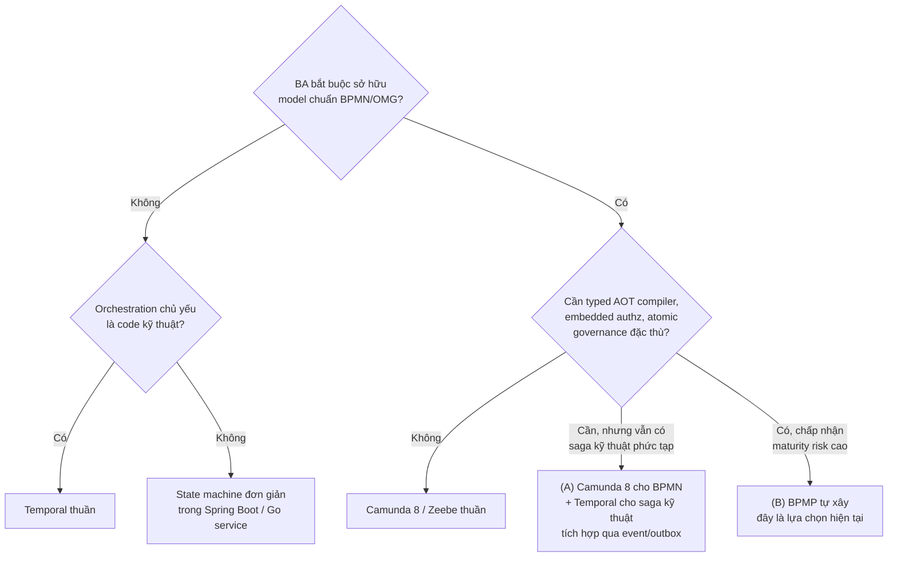
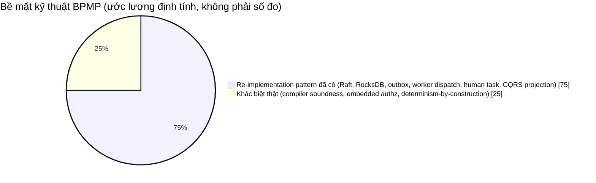
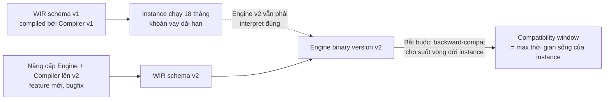

# BPMP Platform — Đánh giá kiến trúc độc lập

> [!abstract] Vị trí tài liệu này
> `[[BPMP-Architecture-Technology-Deep-Dive]]` mô tả kiến trúc **mục tiêu** rất chi tiết, đã có sẵn ma trận so sánh Camunda/Temporal và risk register. Tài liệu này **không lặp lại** nội dung đó. Đây là một bản review độc lập, đóng vai trò "outside reviewer": chất vấn giả định, chỉ ra gap chưa được nêu, và ép rõ requirement trước khi tiếp tục đầu tư engineering effort. Đọc song song hai file.

## 1. Điểm cần thống nhất trước khi đánh giá tiếp: "kết hợp Camunda và Temporal" nghĩa là gì?

Yêu cầu gốc mô tả BPMP là "kết hợp Camunda với Temporal". Nhưng chính tài liệu kiến trúc lại tuyên bố rõ:

> "BPMP không đơn thuần là 'Camunda viết lại bằng Rust' và cũng không phải 'Temporal có BPMN UI'."

Hai câu này **không tương thích nhau** nếu hiểu theo nghĩa đen. Có 3 khả năng, và chúng dẫn tới 3 kiến trúc khác nhau:

| Cách hiểu | Kiến trúc tương ứng | Đây có phải BPMP hiện tại không? |
|---|---|---|
| (A) Chạy thật Zeebe (Camunda 8) cho BPMN + chạy thật Temporal Server cho saga kỹ thuật, tích hợp qua event | Hai hệ thống production riêng biệt, BPMP chỉ là lớp orchestration/glue | **Không** |
| (B) Tự xây engine mới, "vay mượn ý tưởng" — BPMN-as-artifact từ thế giới Camunda, deterministic event-sourced replay từ thế giới Temporal | Rust compiler + Rust engine + Raft + RocksDB như `design.md` mô tả | **Đúng, đây là B** |
| (C) Dùng SDK Temporal, viết workflow bằng code, chỉ mượn BPMN làm tài liệu thiết kế (không thực thi) | Temporal thuần, BPMN chỉ là documentation | Không |

Đây không phải bắt bẻ chữ nghĩa. Nó ảnh hưởng trực tiếp đến 3 việc thực tế:

1. **Cách trình bày dự án với stakeholder/leadership.** Nếu ai đó ở VPBank nghe "kết hợp Camunda và Temporal" và hiểu theo (A), họ sẽ kỳ vọng sai — họ nghĩ bạn đang tích hợp hai sản phẩm đã production-proven, trong khi thực tế bạn đang **tự viết một workflow engine từ đầu** bằng Rust + OpenRaft + RocksDB. Rủi ro kỳ vọng (expectation risk) này lớn hơn rủi ro kỹ thuật.
2. **ADR còn thiếu.** Kiến trúc có ADR-001 (deterministic core), ADR-003 (protobuf), ADR-007 (dynamic config), ADR-008 (embedded authz) — nhưng **không có ADR nào trả lời "vì sao build thay vì buy/compose (A)"**. Đây là ADR quan trọng nhất còn thiếu.
3. **Quyết định phạm vi (scope).** Nếu mục tiêu thật là (C) — Temporal thuần, BPMN chỉ để BA đọc hiểu — thì toàn bộ compiler layer (7 giai đoạn compile, WIR, ký Ed25519) là over-engineering không cần thiết.

**Khuyến nghị cụ thể:** viết một ADR mới — `ADR-00X-build-vs-compose-camunda-temporal.md` — nêu rõ vì sao (B) được chọn thay vì (A). Nếu lý do là "học tập và làm chủ toàn bộ distributed systems stack" (một mục tiêu hoàn toàn chính đáng), hãy ghi rõ điều đó trong ADR thay vì để nó ngầm hiểu.

## 2. Tóm tắt đánh giá

BPMP, xét về mặt lý thuyết kiến trúc, được thiết kế **tốt hơn** phần lớn hệ thống workflow tự chế (home-grown) thường gặp: invariant atomic WriteBatch, embedded authz với revoke epoch, config replayable theo `config_version`/`policy_version`, compiler boundary tách biệt BPMN khỏi runtime. So với việc "tự viết REST API + `@Scheduled` + status column" (câu hỏi ban đầu của bạn), BPMP đã nhảy thẳng lên trình độ kiến trúc ngang hàng với Zeebe/Temporal về mặt tư duy.

Nhưng câu hỏi bạn đặt ra lần này quan trọng hơn: **giá trị kiến trúc có phải giá trị mới, hay chỉ là một bản build lại của những gì đã tồn tại?** Mục 4 dưới đây trả lời trực diện câu đó bằng một verdict cụ thể, không mơ hồ. Mục 5 đi vào từng gap kỹ thuật.

## 3. Điểm mạnh thực sự — vì sao đáng làm

Bốn điểm sau đây thật sự khác biệt so với mặt bằng chung của một hệ thống workflow tự chế điển hình:

1. **Compile boundary buộc lỗi lộ ra ở CI, không phải ở production.**
2. **Một WriteBatch atomic chứa event + idempotency + audit + outbox** — giải quyết đúng vấn đề dual-write mà CDC-based outbox chỉ giải quyết một phần.
3. **Authz fail-closed embedded trong Engine, không phải remote PDP.**
4. **Config version gắn vào audit trail cho replay xác định.**

Mục 4 sẽ đánh giá 4 điểm này cụ thể hơn: cái nào là *mới thật* so với Zeebe/Temporal, cái nào chỉ là *làm tốt một pattern đã có*.

## 4. BPMP có phải một hướng đi mới, hay đang vẽ lại bánh xe?

Đây là câu hỏi đúng và cần một câu trả lời thẳng, không né. **Câu trả lời: cả hai, theo tỷ lệ không đều nhau.**

Phần lớn bề mặt kỹ thuật — Raft consensus, RocksDB WriteBatch state machine, outbox → Kafka, credit-based gRPC worker dispatch, CQRS projection — là **tái triển khai (re-implementation)** các pattern mà Zeebe (Camunda 8) và Temporal đã production-hardened nhiều năm. Phần này không sai, có thể làm tốt, nhưng **không phải đổi mới** — dù viết bằng Rust hay bất kỳ ngôn ngữ nào.

Nhưng có đúng 3 điểm khác biệt kỹ thuật **thật**, không phải khẩu hiệu:

### 4.1 Xác minh ngữ nghĩa BPMN ở compile-time, không chỉ validate cấu trúc

Zeebe validate BPMN lúc deploy (structural/schema validation) và biên dịch model thành internal execution graph — nhưng không chạy full static type-check trên toàn bộ data-flow, không chứng minh gateway soundness theo kiểu symbolic reachability analysis. Ý tưởng "xác minh tính đúng đắn cấu trúc BPMN" (soundness của workflow-net, theo hướng nghiên cứu Petri-net của van der Aalst) đã tồn tại trong giới academic từ lâu, nhưng **chưa có production engine mainstream nào đưa nó thành một CI gate bắt buộc trước deploy**. Nếu compiler BPMP thực sự làm được điều "mục tiêu cốt lõi" đã nêu (không chỉ là target chưa chứng minh), đây là điểm khác biệt thật — không phải BPMP phát minh ra kỹ thuật này, mà là BPMP là bên đưa một kỹ thuật academic vào một production pipeline mà Zeebe/Camunda chưa làm.

### 4.2 Authorization là primitive lõi của `decide()`, không phải lớp ngoài

Zeebe không có bộ đánh giá ABAC chi tiết theo từng transition, ký sẵn, có revoke epoch, atomic với audit, nằm ngay trong broker — authorization ở Camunda 8 thường dựa vào Identity/OAuth ở lớp ngoài broker. Temporal cũng vậy: auth là namespace/API-level, không phải per-transition trong workflow history. Việc đặt authz **bên trong** hàm quyết định thuần (`decide()`) và commit ALLOW audit cùng transition là một vị trí kiến trúc khác — không tồn tại tương đương trực tiếp ở cả hai đối thủ so sánh. Đây là điểm khác biệt thật, và đặc biệt phù hợp với domain ngân hàng nơi bạn đã làm dynamic 5-layer authorization ở PDMS.

### 4.3 Loại bỏ non-determinism "bằng cấu trúc", không chỉ bằng kỷ luật

Lỗi phổ biến nhất trong production của Temporal là non-determinism vô tình (gọi `time.Now()`, random, hoặc thay đổi logic workflow code giữa các lần deploy khiến replay lệch history) — Temporal SDK phải cung cấp API riêng (`GetVersion`, `SideEffect`) để né lỗi này, và ngay cả team dày kinh nghiệm vẫn mắc. BPMP, nếu compiler thực sự ép được `decide()`/`evolve()` không đọc clock/network/random ở mức type system (thay vì chỉ ở mức quy ước code), thì đây là loại bỏ hẳn một lớp lỗi runtime rất phổ biến ở Temporal — bằng cấu trúc, không phải bằng kỷ luật lập trình viên. Đây là khác biệt thật, có giá trị kỹ thuật cụ thể, đo được.

### 4.4 Một dữ kiện quan trọng bị bỏ sót: license của Zeebe/Camunda 8 đã đổi

Kể từ 2024, toàn bộ Camunda 8 Self-Managed — bao gồm Zeebe — chuyển sang **Camunda License 1.0**: source-available (đọc được code) nhưng theo tài liệu chính thức của Camunda, **chạy production self-managed đòi hỏi mua Camunda Self-Managed Enterprise Edition license**; bản miễn phí chỉ dùng được cho môi trường non-production. Đây khác với **Camunda 7** (Camunda BPM, đang chạy tại PDMS) — Camunda 7 vẫn Apache License 2.0 nhưng đã ngừng active development chính thức từ Camunda, hiện do cộng đồng/fork duy trì.

Dữ kiện này quan trọng vì nó lấp một lỗ hổng trong câu hỏi "sao không dùng Zeebe luôn": nếu VPBank không muốn trả Enterprise license cho Camunda 8 hoặc không dùng SaaS, thì "tự xây thay vì Zeebe" **có một lý do kinh tế thật**, không chỉ lý do kỹ thuật hay sở thích kiểm soát kiến trúc. Đây là luận điểm nên đưa thẳng vào ADR ở mục 1 — nó mạnh hơn nhiều so với lý do "muốn tự chủ platform".

### 4.5 Bảng phân loại: cái gì mới thật, cái gì là re-implementation

| Layer | Mới thật hay re-implementation? | So sánh trực tiếp |
|---|---|---|
| Raft replication, partitioned log | Re-implementation | Zeebe đã dùng partition + Raft-based replication nhiều năm |
| RocksDB WriteBatch làm state machine | Re-implementation | Zeebe cũng dùng LSM-tree/RocksDB cho state |
| Outbox → Kafka publish sau commit | Re-implementation | Tương đương Zeebe Exporter pattern |
| Worker dispatch credit-based qua gRPC | Re-implementation, khác vài chi tiết | Zeebe job worker protocol; Temporal task queue |
| Human task/SLA runtime | Re-implementation | Camunda Tasklist và nhiều clone khác trên thị trường |
| CQRS projection từ committed event | Re-implementation | Pattern chuẩn, không riêng của ai |
| AOT compiler với static soundness verification làm CI gate | **Mới thật trong bối cảnh production engine** | Không có tương đương trực tiếp ở Zeebe/Temporal hiện tại |
| Authz embedded, ký, atomic với transition, trong `decide()` | **Mới thật** | Không có tương đương trực tiếp |
| Non-determinism ngăn bằng type system thay vì SDK discipline | **Mới thật, nếu giữ đúng lời hứa compiler** | Khác cách Temporal xử lý (`GetVersion`/`SideEffect`) |

### 4.6 Verdict khả thi — vậy có nên tiếp tục theo hướng "xây lại toàn bộ" không?

Với tỷ lệ ước lượng ~75% re-implementation / ~25% khác biệt thật, câu trả lời phụ thuộc vào mục tiêu (đã nêu ở mục 1 là câu hỏi mở chưa trả lời):

- **Nếu mục tiêu là học tập/portfolio** (khớp với hướng học Rust/Go/PostgreSQL/Kafka/distributed systems bạn đang theo đuổi trong vault): hoàn toàn đáng làm, kể cả phần 75% re-implementation — vì tự tay build lại Raft/RocksDB/outbox là cách học distributed systems sâu nhất có thể. Giá trị nằm ở quá trình, không phải ở việc sản phẩm cuối có "mới" hay không.
- **Nếu mục tiêu là ứng viên thay thế Camunda 7 tại PDMS production**: câu hỏi bắt buộc phải trả lời là — liệu 3 điểm khác biệt thật (4.1-4.3) có đủ giá trị nghiệp vụ để biện minh cho việc xây lại 75% còn lại từ số không, so với một phương án rẻ hơn nhiều: giữ nguyên Camunda 7 làm lõi, chỉ xây phần khác biệt thật xung quanh nó dưới dạng vệ tinh (satellite). Camunda 7 vẫn là engine mang value nhất — mục 4.7 liệt kê đầy đủ những vệ tinh khả thi, không chỉ compiler checker và authz sidecar.

Đây không phải kết luận "đừng làm BPMP" — mà là một lựa chọn cần được cân nhắc tường minh và ghi vào ADR, thay vì mặc định "xây engine mới" là con đường duy nhất để có 3 điểm khác biệt đó.

### 4.7 Danh mục đầy đủ ý tưởng vệ tinh cho phương án surgical (Camunda 7 làm lõi)

Mỗi ý tưởng dưới đây gắn vào một extension point thật của Camunda 7 — không phải xây song song một cơ chế mới.

**Insight quan trọng nhất:** invariant "event + idempotency + audit + outbox trong một WriteBatch atomic" mà BPMP tự hào nhất **lấy được ngay trên Camunda 7, không cần Raft/RocksDB**. Mỗi command của Camunda 7 chạy trong một `CommandContext`; đăng ký một `CommandInterceptor` qua `ProcessEnginePlugin` sẽ tham gia **cùng transaction JDBC** với chính transition của engine — insert một dòng outbox trong đúng transaction đó là atomic thật, không phải outbox kiểu CDC có độ trễ.

| Ý tưởng | Gắn vào Camunda 7 qua đâu | Giá trị BPMP lấy được | Effort |
|---|---|---|---|
| Transactional outbox sidecar | `CommandInterceptor` + `ProcessEnginePlugin`, cùng JDBC transaction | Atomic event/audit/outbox — invariant lõi nhất của BPMP | Trung bình |
| Temporal làm saga sidecar cho compensation cross-system | External Task: Camunda gọi 1 Temporal workflow cho đoạn saga phức tạp (core banking, payment gateway), chờ signal hoàn tất | Đây thực sự là "kết hợp Camunda + Temporal" đúng nghĩa đen | Trung bình-cao |
| Immutable/hash-chained audit ledger | Custom `HistoryEventHandler` bên cạnh default history table, mỗi event ghi kèm hash(prev + payload) | Tamper-evidence cho audit, không cần event-sourced engine đầy đủ | Thấp-trung bình |
| Signed BPMN/DMN deployment gate | Hook trước `repositoryService.createDeployment()`: chạy soundness checker + ký hash Ed25519, lưu kèm deployment | Supply-chain integrity cho process definition; mở rộng từ compiler checker | Thấp (gộp với compiler checker) |
| DMN property-test harness | Tool độc lập, test hit-policy so với chính DMN engine của Camunda làm reference | Rủi ro correctness tài chính (xem 5.3) | Thấp |
| WASM sandboxed script-task worker | External Task Client chuẩn, nhưng thực thi payload trong Wasmtime (fuel/memory limit) thay vì Java delegate tuỳ ý | Local sandboxed execution, bounded resource | Trung bình |
| Credit-based external task client wrapper | Wrap fetch-and-lock API với bounded inflight, lease renewal, crash-safe assignment | Chống 1 worker chậm làm nghẽn hệ thống | Thấp-trung bình |
| Config/policy snapshot & replay-traceability service | `ExecutionListener` stamp `config_version`/`policy_version` vào process variable mỗi transition | Replay được quyết định lịch sử theo đúng policy tại thời điểm đó | Trung bình |
| Tenant-sharded engine pool + routing gateway | N instance Camunda 7 (mỗi DB riêng, hoặc multi-tenancy có sẵn) sau 1 routing layer theo tenant | Blast-radius isolation cho tenant lớn, không cần tự làm Raft sharding | Trung bình-cao, chỉ cần khi có scale pressure thật |

**Thứ tự ưu tiên nếu đi theo hướng surgical:**

1. Transactional outbox sidecar — chứng minh ngay luận điểm "atomic commit" mà không cần một dòng Rust nào.
2. Temporal-saga-sidecar — trả lời trực tiếp câu hỏi gốc "kết hợp Camunda + Temporal", đúng chỗ Temporal mạnh hơn compensation nội bộ của bất kỳ BPMN engine nào.
3. Signed deployment gate + compiler soundness checker (gộp chung).
4. Authz sidecar qua `CommandInterceptor`.
5. Phần còn lại (audit ledger, DMN test harness, WASM worker, credit-based client, config snapshot, tenant sharding) — làm khi có nhu cầu cụ thể phát sinh, không làm trước vì "muốn đủ bộ".

## 5. Điểm yếu và rủi ro — nhìn thẳng, không né

### 5.1 Bạn đang tái tạo lại Zeebe ở phần lõi hệ thống, không phải tránh nó

Compiler → WIR ≈ Zeebe's internal execution graph. Raft + RocksDB ≈ Zeebe's partitioned/replicated log + state. Outbox → Kafka ≈ Zeebe Exporter. Zeebe mất khoảng 6-8 năm và một đội ngũ core-engineer full-time để đạt độ phủ BPMN/DMN hiện tại. "Requirement 1 chưa phủ toàn bộ catalog" trong warning box của tài liệu gốc không phải một dòng cảnh báo nhỏ — nó là **rủi ro lớn nhất của toàn bộ dự án**, vì độ phủ ngữ nghĩa BPMN đúng là phần khó nhất, không phải phần Rust/Raft.

### 5.2 CMMN: cân nhắc cắt bỏ thay vì theo đuổi độ phủ đầy đủ

CMMN có độ mơ hồ ngữ nghĩa cao ngay trong spec OMG, và mức độ áp dụng trong ngành rất thấp — kể cả Camunda cũng không đầu tư sâu vào CMMN. Câu hỏi cần trả lời: **có use case BA cụ thể nào thực sự cần CMMN không, hay nó chỉ đang được theo đuổi vì "đủ bộ BPMN/DMN/CMMN"?** Nếu không có use case cụ thể, khuyến nghị hạ CMMN xuống "not supported" tường minh.

### 5.3 DMN hit-policy và FEEL: rủi ro correctness tài chính, không chỉ rủi ro coverage

DMN có nhiều hit policy (UNIQUE, FIRST, PRIORITY, COLLECT với aggregator SUM/MIN/MAX/COUNT...) mà sai lệch nhỏ trong cách evaluate có thể tạo ra quyết định tín dụng sai — liên quan trực tiếp domain PDMS/credit scoring. Cần property-based test so sánh output với một reference DMN engine cho từng hit policy, không chỉ nằm chung trong "catalog tests".

### 5.4 Vấn đề versioning khó nhất chưa được nhắc tới: WIR schema evolution xuyên vòng đời Engine

Tài liệu xử lý tốt **business version** của workflow (v1/v2 cùng tồn tại — giống Zeebe). Nhưng khi **Engine binary chính nó nâng cấp**, WIR schema (Protobuf format của WIR, không phải business logic) phải tương thích ngược cho **toàn bộ thời gian sống còn lại của mọi instance đang chạy** — có thể nhiều tháng/năm với workflow tín dụng dài hạn.

Đây chính là vấn đề mà Temporal xử lý bằng `GetVersion()` — nổi tiếng dễ dùng sai ngay cả với team dày kinh nghiệm. Cần một chiến lược tường minh (ví dụ: `schema_version` field trong WIR + Engine giữ interpreter cho N version gần nhất + golden replay test cho từng version cũ) — hiện chỉ thấy "Buf breaking check" ở CI, đó là điều kiện cần nhưng chưa đủ.

### 5.5 Tenant isolation ở tầng Raft/RocksDB — blast radius chưa rõ

Mục 15 của tài liệu gốc đúng khi chỉ ra một Raft group = một write bottleneck, và đề xuất shard theo `(tenant_id, stream_id)`. Nhưng còn thiếu: tenant lớn với nhiều multi-instance loop hoặc payload lớn có làm chậm tenant nhỏ dùng chung Raft group không? Quota (đã có trong dynamic config) giới hạn logic, nhưng không giới hạn vật lý (I/O contention trên cùng RocksDB column family/disk). Cần quyết định capacity-planning: tenant lớn có Raft group riêng, tenant nhỏ dùng pool chung.

### 5.6 Observability dưới deterministic replay: nguy cơ double-emit

Thiết kế nhấn mạnh `decide()`/`evolve()` thuần để đảm bảo replay xác định — đúng hướng. Nhưng chưa đề cập: khi Engine replay lại state (crash recovery, audit investigation), OpenTelemetry span/metric có bị emit lại (double-count) không? Đây là gotcha kinh điển của event-sourced/deterministic-replay system — Temporal SDK phải có API riêng (side-effect marker) để tránh side-effect logging bị lặp khi replay.

### 5.7 Compensation trong Engine ≠ Saga xuyên hệ thống

WriteBatch atomic bao gồm "compensation/governance ledger" — đảm bảo nhất quán **bên trong một Engine commit**. Nhưng compensation thật trong banking thường phải xuyên qua hệ thống ngoài (core banking, gateway thanh toán) — nơi rollback không atomic được vì effect đã xảy ra ở hệ thống khác. Câu hỏi mở: mô hình compensation của BPMP có bao phủ cross-service saga hay chỉ compensation nội bộ trong phạm vi WIR/BPMN compensation boundary event? Nếu chỉ nội bộ, đây chính là chỗ phương án Hybrid (A) ở mục 1 — dùng Temporal thật cho saga kỹ thuật — thực sự mạnh hơn.

### 5.8 Disaster Recovery / multi-region — chưa xuất hiện trong tài liệu gốc

Raft về bản chất tối ưu cho latency trong-region. Không có mục nào nói về RPO/RTO, backup RocksDB snapshot, hay chiến lược cross-region (thường là async snapshot shipping, không phải Raft đồng bộ xuyên vùng). Với hệ thống nhắm banking-grade, đây là gap vận hành nghiêm trọng cần một ADR riêng trước khi tiến gần production thật.

### 5.9 Rủi ro tổ chức: bus factor

Stack hiện tại: Rust + OpenRaft + RocksDB + Wasmtime + Protobuf/Buf + Go + gRPC + Kafka/Redpanda + PostgreSQL + Redis + React 19 + OpenTelemetry. Camunda và Temporal mỗi bên có đội ngũ hàng chục kỹ sư core làm việc nhiều năm để xử lý đúng edge case (timer skew, gateway semantics hiếm gặp, replay bug). Nếu BPMP là dự án cá nhân/nhóm nhỏ, rủi ro lớn nhất **không phải kỹ thuật** — mà là bạn sẽ tự phát hiện lại từng edge case đó, thường là trong production, không có 6-8 năm issue tracker cộng đồng để tham khảo trước. Điều này không có nghĩa là đừng làm — nếu mục tiêu là học và làm chủ toàn bộ distributed systems stack, đây là một trong những dự án học tập giá trị nhất có thể làm. Nhưng cần được đóng khung đúng: dự án học tập/portfolio có kỷ luật production-grade, không phải "sẽ thay Camunda ở PDMS trong 12 tháng tới".

## 6. Câu hỏi mở cần trả lời trước khi đầu tư tiếp

1. Mục tiêu cuối của BPMP là gì: portfolio/học tập nghiêm túc, proof-of-concept nội bộ, hay ứng viên thay thế Camunda BPM đang chạy thật trong PDMS?
2. Có use case BA cụ thể nào bắt buộc CMMN không, hay có thể cắt để tập trung làm BPMN + DMN cho tốt?
3. Compensation cross-system (core banking, payment gateway) có nằm trong phạm vi BPMP, hay sẽ luôn cần một saga layer riêng bên ngoài Engine (ví dụ Temporal thật, theo phương án Hybrid ở mục 1 / vệ tinh ở 4.7)?
4. Chiến lược WIR schema evolution xuyên nâng cấp Engine binary là gì — có golden replay test cho version cũ chưa?
5. Ai là người thứ hai hiểu đủ sâu OpenRaft + RocksDB internals để đây không phải single point of knowledge?
6. Có kế hoạch DR/backup cho RocksDB snapshot và multi-region chưa, hay đang coi đó là vấn đề "sau 300k CCU"?
7. Nếu chỉ 3 điểm ở mục 4.1-4.3 là giá trị khác biệt thật, phương án "surgical" ở 4.7 (giữ Camunda 7, chỉ xây các vệ tinh) có được cân nhắc nghiêm túc chưa, hay đã bị loại mà không ghi lại lý do?

## 7. Khuyến nghị hành động ưu tiên

| Ưu tiên | Hành động | Vì sao |
|---|---|---|
| P0 | Viết ADR "build vs compose Camunda 8 + Temporal", bao gồm dữ kiện licensing Camunda License 1.0 | Giải quyết mâu thuẫn framing ở mục 1, định hình lại kỳ vọng stakeholder |
| P0 | Viết ADR "surgical vs full custom engine" — đánh giá 9 ý tưởng vệ tinh ở mục 4.7 trên nền Camunda 7 hiện có, so với xây engine mới | Nếu bỏ qua bước này, rủi ro là đầu tư 75% công sức vào phần không tạo khác biệt |
| P0 | Prototype transactional outbox sidecar (CommandInterceptor + cùng JDBC transaction) trên Camunda 7 | Cách rẻ nhất để chứng minh/bác bỏ luận điểm "cần Raft/RocksDB mới atomic được" |
| P0 | Quyết định tường minh về CMMN: giữ hay cắt | Tránh đổ effort vào catalog coverage không ai dùng |
| P1 | Thiết kế golden replay test cho WIR schema evolution (nếu vẫn đi hướng B) | Vấn đề khó nhất về lâu dài, nên giải trước khi có instance chạy thật dài hạn |
| P1 | Property-based test DMN hit-policy so với reference engine | Rủi ro correctness tài chính trực tiếp |
| P1 | Prototype Temporal-saga-sidecar cho một compensation flow cross-system thật | Trả lời trực tiếp câu hỏi "kết hợp Camunda + Temporal", đo được giá trị thực tế |
| P2 | Viết ADR DR/multi-region cho Raft+RocksDB (nếu vẫn đi hướng B) | Cần trước khi tuyên bố banking-grade, không cần trước milestone học tập |
| P2 | Xác nhận instrumentation replay-safe (no double-emit) | Ảnh hưởng độ tin cậy audit/observability, không chặn tiến độ ngắn hạn |

## 8. Liên kết

- [[BPMP-Architecture-Technology-Deep-Dive]] — kiến trúc mục tiêu đầy đủ, ma trận so sánh, risk register gốc
- [[concepts/consensus-raft-paxos]]
- [[concepts/consistency-models-spectrum]]
