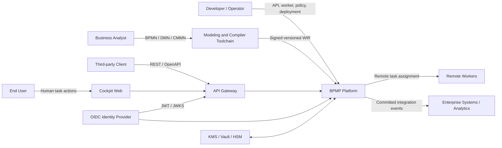
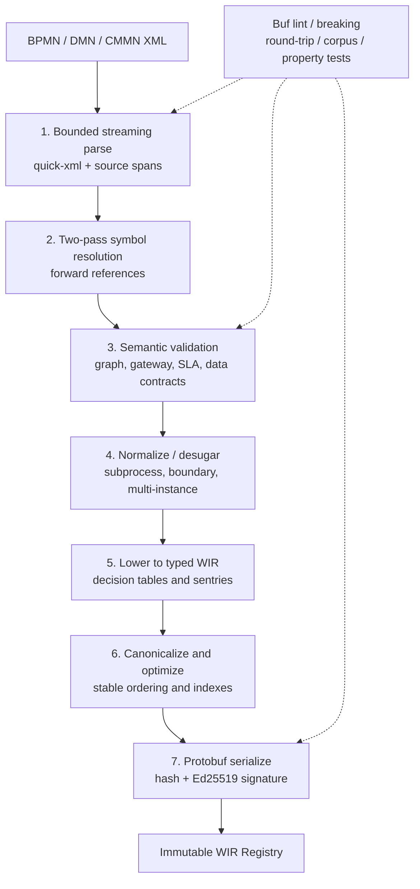
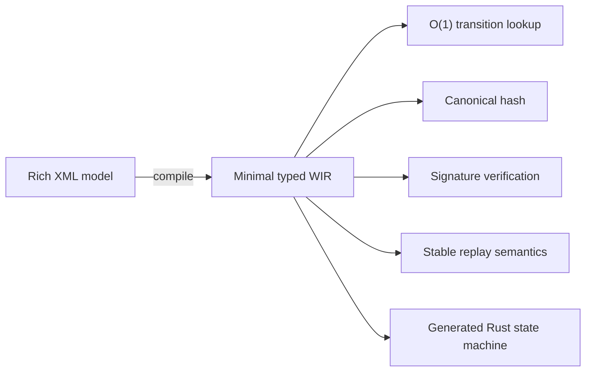
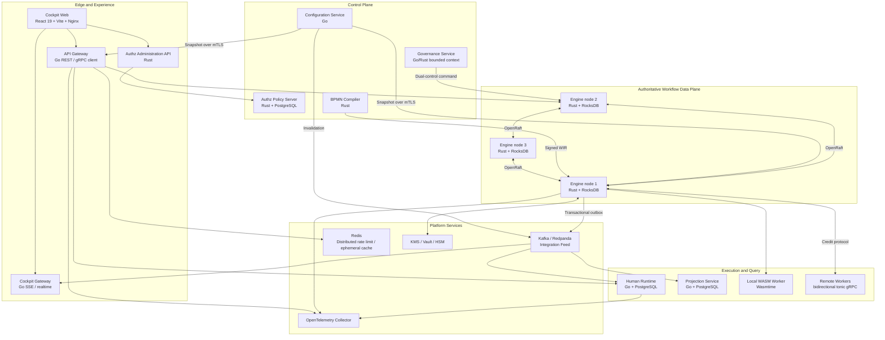
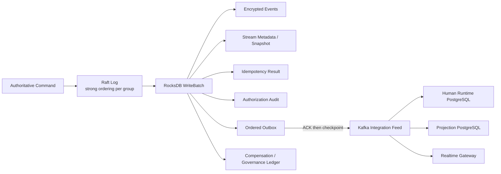
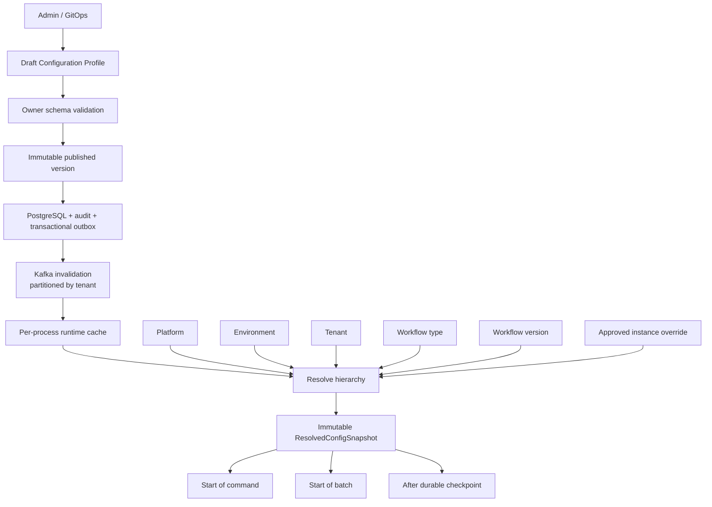
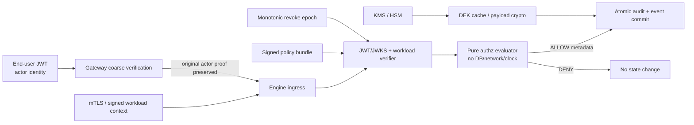
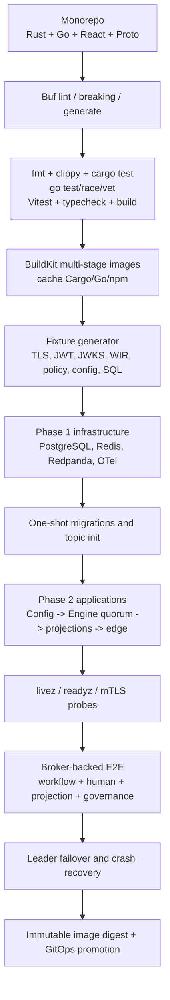
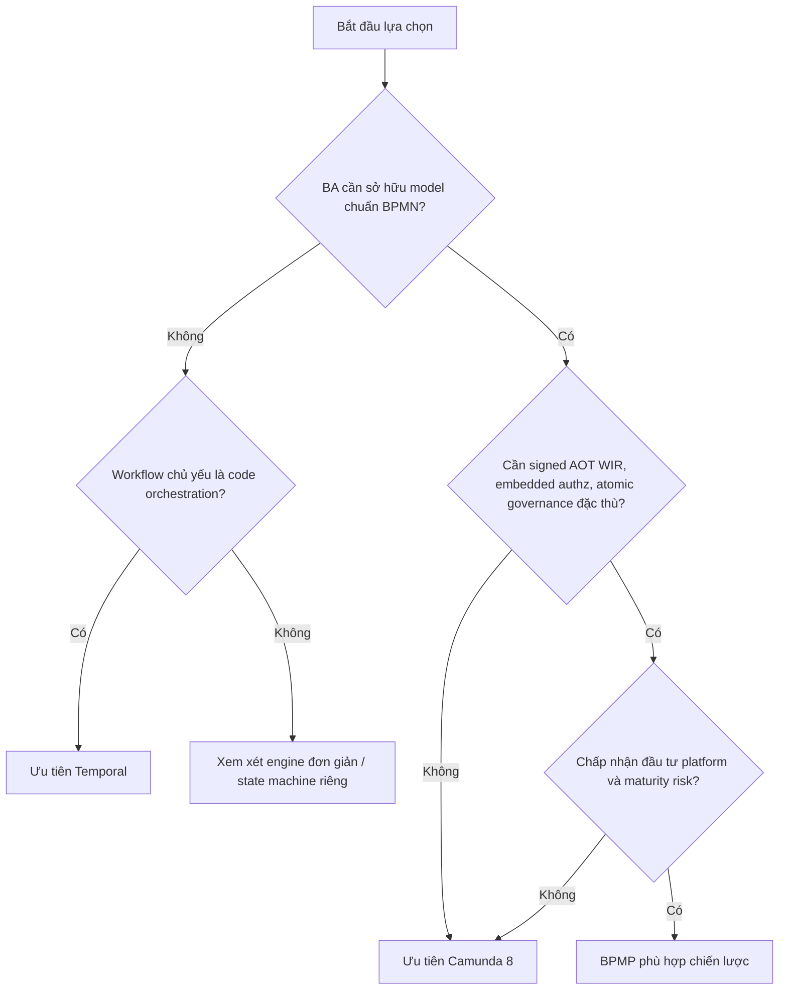
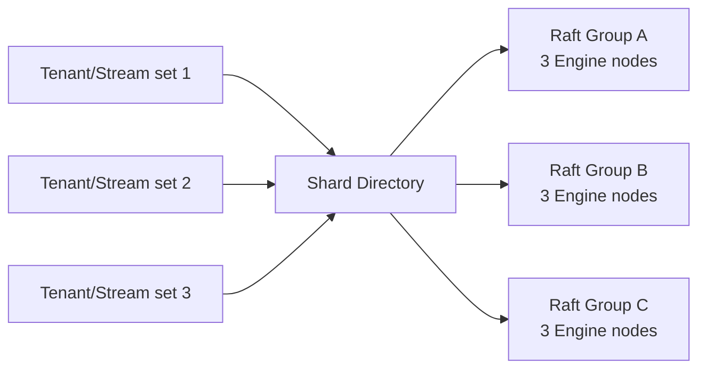

# BPMP Platform — Phân tích kiến trúc và công nghệ

> [!abstract] Mục tiêu tài liệu
> Tài liệu này diễn giải `design.md` thành một architecture deep dive có thể dùng cho review kỹ thuật, onboarding, quyết định đầu tư và chuẩn bị production. Nội dung phân biệt rõ **kiến trúc mục tiêu**, **code đã có bằng chứng**, và **năng lực còn phải kiểm chứng**. BPMP được so sánh với Camunda 8 và Temporal theo workload, không theo khẩu hiệu sản phẩm.

## 1. Kết luận điều hành

BPMP là một workflow platform theo hướng **BPMN-as-IR + deterministic durable execution**:

1. Business Analyst mô hình hóa bằng BPMN/DMN/CMMN.
2. Compiler Rust biên dịch trước XML thành WIR đã type-check, normalize, version và ký số.
3. Rust Engine là nơi duy nhất diễn giải WIR và quyết định transition.
4. Mỗi command được xác thực lại, quyết định bằng hàm thuần, rồi commit qua Raft.
5. Event, idempotency result, audit, outbox và governance/compensation liên quan được ghi atomically.
6. Kafka chỉ phát committed integration event; PostgreSQL phục vụ bounded context và query model, không thay Engine làm nguồn sự thật.

BPMP không đơn thuần là "Camunda viết lại bằng Rust" và cũng không phải "Temporal có BPMN UI". Điểm khác biệt là đưa BPMN/DMN/CMMN qua một **compiler boundary** giống compiler ngôn ngữ lập trình, sau đó chạy một **typed intermediate representation** trong một deterministic event-sourced engine.

> [!warning] Trạng thái tuyên bố
> E2E hiện đã chứng minh topology Kafka/PostgreSQL/ba Engine process/Human Runtime/API Gateway/Cockpit, durable projection, governance và leader failover. Tuy nhiên, tài liệu compliance vẫn xác nhận Requirement 1 chưa phủ toàn bộ catalog BPMN/DMN/CMMN theo nghĩa tuyệt đối; Requirement 2 còn thiếu một số production-path evidence. Kiến trúc hiện tại cũng chưa đủ bằng chứng để tuyên bố 300k CCU nếu chưa có sharding nhiều Raft group, realtime fanout sharding và soak test production-like.

## 2. Các lực thiết kế

| Lực thiết kế | Hệ quả kiến trúc |
|---|---|
| Quy trình do BA sở hữu nhưng runtime phải type-safe | BPMN/DMN/CMMN được compile AOT sang WIR, không parse XML trên command path |
| Workflow kéo dài nhiều tháng/năm | Event sourcing, snapshot, deterministic replay, version pinning |
| Không được double effect khi retry/failover | Idempotency thuộc write side của Engine và commit cùng event |
| Security theo từng transition | Authz evaluator thuần nằm trong Engine; Gateway không phải authority cuối |
| Human task và machine task có workload khác nhau | Engine giữ authority; Human Runtime và workers là projection/execution adapters |
| Microservices nhưng cần atomic workflow correctness | Raft + RocksDB là authoritative boundary; Kafka chỉ tích hợp hậu commit |
| Không hardcode policy theo tenant | Configuration Profile versioned, resolve theo scope, install tại safe point |
| PII, retention, erasure, maker-checker | Encrypted payload, key scope, immutable audit, governance proof và compensation ledger |
| Tải lớn và sự cố downstream | Bounded queues, credit-based dispatch, bulkhead, backpressure, outbox |

## 3. System context



### Ranh giới trách nhiệm quan trọng

| Deployable | Sở hữu | Tuyệt đối không sở hữu |
|---|---|---|
| `bpmn-compiler` | Parse/validate BPMN, DMN, CMMN; emit signed WIR | Runtime state |
| `bpmp-engine` | WIR interpretation, state, Raft, event log, final authz, idempotency, compensation atomicity | Human query UI, AI inference |
| `human-runtime` | Work-item projection, assignment, delegation, SLA/escalation | WIR interpretation, authoritative transition |
| `api-gateway` | Public API, coarse authn, rate limit, normalization | Final authz, write-side idempotency |
| `projection-service` | Rebuildable query models and checkpoints | Authoritative workflow state |
| `governance-service` | Approval workflow, barrier/shred orchestration, governance audit | Direct write vào RocksDB/Raft |
| `authz-control-plane` | Policy administration and signed bundle publication | Authoritative transition decision |
| `configuration-service` | Versioned config lifecycle, validation, audit, publication | Mid-command policy mutation |
| `cockpit-gateway` | Tenant-scoped realtime hints and bounded delivery | Durable workflow source of truth |
| `cockpit-web` | Operator/BA experience | Security authority or embedded policy |

## 4. Design-time architecture: BPMN-as-IR



### Vì sao compile AOT thay vì parse BPMN lúc runtime?

- **Fail sớm:** unresolved reference, dead path, gateway không sound, data mismatch và unsupported element bị chặn ở CI/deploy.
- **Giảm runtime variability:** command path không chạy XML parser, schema resolver hoặc ad-hoc expression parser.
- **Canonical artifact:** cùng semantic input sinh ordering ổn định để hash, ký, diff và cache.
- **Security:** runtime chỉ nhận artifact đã kiểm schema version, content hash, signature và bounds.
- **Hiệu năng:** Engine dùng dispatch table/index đã dựng; không lặp graph construction cho mỗi instance.
- **Đa ngôn ngữ nhưng một semantics:** Protobuf là durable contract; Go service coi WIR là opaque.

### WIR là gì?

WIR không phải DTO sao chép BPMN XML. Nó là state-machine IR gồm node/transition đã resolve, typed guards, timer/correlation definition, retained scope, multi-instance metadata, DMN function và CMMN sentry. Mỗi WIR gắn `tenant_id`, workflow type/version, schema version, content hash và signature metadata.



## 5. Runtime deployment architecture



## 6. Authoritative command path

```mermaid
sequenceDiagram
    autonumber
    participant C as Client
    participant G as API Gateway
    participant E as Engine Leader
    participant A as Embedded Authz
    participant D as Pure decide/evolve
    participant R as Raft Quorum
    participant S as RocksDB State Machine
    participant K as Kafka Publisher

    C->>G: Command + JWT + tenant + idempotency key
    G->>G: Recovery, request ID, coarse authn, rate limit, validation
    G->>E: gRPC command + original actor proof + workload proof
    E->>A: Verify workload and actor; evaluate signed bundle
    alt Denied or stale revoke epoch
        A-->>C: Fail closed; no state mutation
    else Allowed
        E->>E: Check tenant-scoped idempotency
        E->>D: decide(state, command, config snapshot, injected time)
        D-->>E: Deterministic events
        E->>R: client_write(authoritative command)
        R->>R: Replicate and quorum commit
        R->>S: Apply one atomic WriteBatch
        Note over S: event + idempotency + audit + outbox<br/>stream metadata + compensation/governance
        S-->>E: Durable receipt
        E-->>C: Command receipt
        K->>S: Poll ordered outbox
        K->>K: Publish and wait broker ACK
        K->>S: Persist checkpoint after ACK
    end
```

### Invariant cốt lõi

```text
Committed command
  = Raft quorum commit
  + deterministic state-machine apply
  + one RocksDB WriteBatch containing all authoritative consequences
```

Không có trạng thái hợp lệ trong đó workflow event đã commit nhưng idempotency result, security audit hoặc outbox bắt buộc lại thiếu. Kafka outage không rollback command: outbox giữ bản ghi và publisher retry theo thứ tự.

## 7. Storage và consistency model



| Store | Vai trò | Consistency | Có thể rebuild? |
|---|---|---|---|
| RocksDB + Raft | Authoritative workflow event/state | Strong per Raft group | Không được coi là disposable |
| Engine outbox | Bridge hậu commit sang Kafka | Atomic với event | Có thể retry, không bỏ qua |
| Kafka/Redpanda | Integration feed và broadcast invalidation | Ordered theo partition key | Không thay authoritative log |
| Human PostgreSQL | Work item, assignment, SLA, audit projection | Transactional trong Human context | Có thể rebuild một phần từ events |
| Projection PostgreSQL | Query/read model, inbox, checkpoint | Transactional consume | Có thể rebuild đầy đủ từ committed events |
| Authz PostgreSQL | Policy administration/control plane | Transactional + version/audit | Không quyết định transition trực tiếp |
| Redis | Rate limit/cache tạm | Ephemeral/distributed | Có |

Liên hệ: [[concepts/consensus-raft-paxos]], [[concepts/consistency-models-spectrum]], [[concepts/postgresql-index-internals]].

## 8. Dynamic configuration và safe point



Policy không được đổi giữa transaction, WriteBatch hoặc Kafka acknowledgement sequence. Event/audit ghi `config_version` và `policy_version`, nhờ đó replay và điều tra biết quyết định lịch sử dùng policy nào.

Các giá trị phải dynamic gồm rate limit, quota, timeout, retry/backoff, circuit breaker, bulkhead, worker routing, SLA/escalation, batch size, lease, retention, KMS policy, pagination và feature flag. Các constant giao thức như Protobuf field number, stable enum tag và WIR schema compatibility guard **không** phải runtime config.

## 9. Security architecture



### Tại sao authz phải embedded?

- Một remote PDP trên command critical path thêm network latency và availability dependency.
- Cache remote dễ tạo cửa sổ policy stale.
- Workload identity không được phép đại diện end-user actor.
- Evaluator thuần nhận đầy đủ bundle, proof, epoch và evaluation timestamp đã inject, nên replay/test xác định.
- ALLOW audit được commit cùng transition, không tồn tại "transition thành công nhưng thiếu bằng chứng quyền".

## 10. Worker model

| Loại worker | Công nghệ | Khi dùng | Cơ chế bảo vệ |
|---|---|---|---|
| Local script/service task | Wasmtime | Logic nhỏ, deterministic-ish, cần latency thấp | Fuel, memory limiter, capability allowlist, pinned artifact |
| Remote worker | tonic bidirectional gRPC | Tích hợp hệ thống ngoài, SDK đa ngôn ngữ | Credit, bounded inflight, signed assignment token, lease, ACK |
| Human task | Human Runtime Go | Assignment, delegation, SLA, maker-checker | PostgreSQL version, durable intent, authoritative completion tại Engine |

Credit-based dispatch giữ invariant `0 <= inflight(worker) <= credits_granted(worker)`. Engine không đẩy vô hạn vào worker chậm; assignment/lease được persisted để crash recovery không tạo double execution không kiểm soát.

## 11. CQRS, projection và realtime

Engine không phục vụ dashboard bằng cách scan event log. Projection Service consume committed event, ghi inbox + read model + checkpoint trong một PostgreSQL transaction, sau đó mới ACK Kafka. Cockpit Gateway chỉ phát **hint** realtime; client phải resync query model khi mất cursor hoặc queue overflow.

```mermaid
sequenceDiagram
    participant E as Engine Outbox
    participant K as Kafka
    participant P as Projection Service
    participant DB as Read Model PostgreSQL
    participant R as Cockpit Gateway
    participant UI as Cockpit Web

    E->>K: Publish committed event
    K->>P: Poll bounded batch
    P->>DB: BEGIN; inbox + projection + checkpoint; COMMIT
    P->>K: Commit offset
    K->>R: Committed event hint
    R-->>UI: SSE signal with cursor
    UI->>P: Query authoritative read model through API
```

## 12. Vì sao chọn từng technology

| Technology | Lý do chọn | Giá trị cụ thể | Trade-off phải quản trị |
|---|---|---|---|
| Rust | Memory safety không GC, control layout/concurrency | Deterministic core, compiler, crypto, stateful Engine | Compile time và learning curve cao |
| Tokio | Async ecosystem chuẩn của Rust | Bounded network I/O, timers, streaming | Phải tách blocking RocksDB/native work khỏi async coordination |
| tonic + Protobuf | Typed streaming và đa ngôn ngữ | Rust-Go contract, worker credit stream, deadlines | Schema governance bắt buộc |
| Buf | Lint/breaking/codegen gate | Ngăn tái sử dụng field number và generated drift | CI cần baseline release rõ ràng |
| RocksDB | Mature LSM, WAL, column family, WriteBatch | Event/idempotency/audit/outbox atomic local apply | Native build nặng; compaction và lock cần vận hành đúng |
| OpenRaft | Rust-native Raft framework | Authoritative replication, membership, leader forwarding | Cần model checking, partition chaos và shard directory |
| Wasmtime 36.0.4 | Mature sandbox với fuel/memory controls | Chạy local task mà không nạp native plugin vào Engine | Phải có upgrade/CVE qualification định kỳ |
| Go | Goroutine/network stack, simple deployment | Gateway, projection, human runtime, realtime fanout | GC/memory phải đo ở 300k connection |
| PostgreSQL + pgx/v5 | Transaction, index, locking rõ ràng | Human/config/projection/governance bounded contexts | Pool budget và hot-tenant query plan phải dynamic |
| Kafka/Redpanda + franz-go | Durable integration stream, ecosystem tốt | Outbox publication, projection, cache invalidation | Không dùng làm workflow authority; quản trị lag/retention/ACL |
| Redis | Atomic distributed limiter/cache | Multi-replica edge controls | Thêm sync dependency vào request path |
| React 19 + Vite + Zod | Typed SPA, fast build, runtime validation | Cockpit và contract fail-fast | Cần error boundary, browser E2E, bundle budget |
| OpenTelemetry | Vendor-neutral traces/metrics/logs | Correlation xuyên Rust-Go-Kafka-gRPC | Cardinality/PII policy và sampling phải kiểm soát |
| Docker Compose / Kubernetes | Reproducible E2E và production orchestration | Health-based staged startup, StatefulSet/Deployment | Compose proof không thay thế multi-zone production test |

### Stack thực tế đang được pin trong repo

| Layer | Version hiện tại |
|---|---|
| Rust MSRV/toolchain | 1.91 / 1.91.1 |
| Tokio / tonic / prost | ~1.51.4 / 0.14.6 / 0.14.4 |
| OpenRaft / RocksDB / Wasmtime | 0.9.24 / 0.24.0 / 36.0.4 |
| Go / gRPC-Go / pgx / franz-go | 1.25.12 / 1.82.1 / 5.9.2 / 1.21.0 |
| React / Vite / TypeScript / Zod | 19.2.8 / 8.1.5 / 7.0.2 / 4.4.3 |
| Docker E2E data plane | PostgreSQL 17.5, Redis 7.4.2, Redpanda 24.3.18 |
| Telemetry | OpenTelemetry Collector 0.130.1; Go OTel 1.44.0 |

`design.md` có target baseline tương lai riêng. Nâng version phải qua security advisory, compatibility, replay golden, chaos và benchmark; không tự động thay toàn bộ stack bằng newest release.

## 13. Build và deployment flow



### Production order

1. Publish immutable images, descriptors, signed WIR và policy bundles.
2. Apply migration bằng credential của đúng bounded context.
3. Provision Kafka topics/ACL/retention từ topology tập trung.
4. Start Configuration Service và publish đủ mandatory owner policies.
5. Chỉ ACTIVE tenant khi readiness không còn owner thiếu.
6. Start 3/5 Engine member với volume riêng; bootstrap membership một lần.
7. Start Projection, Governance, Human Runtime, API Gateway.
8. Start Cockpit Gateway/Web; kiểm SSE drain/resync.
9. Mở ingress sau acceptance transaction và consumer lag bằng 0.

## 14. BPMP so với Camunda 8 và Temporal

### Định vị đúng

- **Camunda 8/Zeebe:** BPMN-first platform trưởng thành, broker partitioned/replicated, hệ sinh thái Modeler/Operate/Tasklist và connectors mạnh.
- **Temporal:** code-first durable execution, SDK developer experience mạnh, workflow code replay bằng event history, task queue/activity abstraction trưởng thành.
- **BPMP:** standards-first nhưng compiler-oriented; cố gắng kết hợp BA model với typed WIR, deterministic Rust core, embedded transition authz và enterprise governance atomicity.

### Ma trận so sánh

| Tiêu chí | BPMP | Camunda 8 | Temporal |
|---|---|---|---|
| Tác giả workflow | BA + engineer qua BPMN/DMN/CMMN | BA + engineer qua BPMN/DMN | Developer viết workflow code |
| Runtime definition | Signed typed WIR đã compile | BPMN deployment được broker thực thi | Workflow code trong SDK worker |
| XML trên runtime path | Không | Model được deploy cho engine | Không BPMN/XML |
| Compile-time graph/type analysis | Mục tiêu cốt lõi: reachability, gateway, SLA, data-flow | Modeler lint + engine validation; coverage theo Camunda profile | Type system của language, nhưng không có BPMN graph semantics |
| Authority | Rust Engine + RocksDB/Raft | Zeebe broker partition | Temporal Service history + workflow workers |
| Business logic execution | Local WASM hoặc remote gRPC worker | External job workers/connectors | Activities + workflow code workers |
| Human task | Bounded context riêng, authoritative completion quay về Engine | Tasklist/user tasks tích hợp | Pattern/SDK, không BPMN-native |
| DMN/CMMN | Typed IR; breadth còn đang mở rộng | DMN mạnh; BPMN coverage công bố rõ | Không native BPMN/DMN/CMMN |
| Authz transition | Embedded evaluator, signed bundle, revoke epoch, atomic audit | Thường dựa identity/authorization của platform và app integration | Namespace/API auth + application authorization pattern |
| Config replayability | `config_version`/`policy_version` đi cùng event/audit | Có config/deployment mechanisms, không cùng BPMP model | Workflow code/versioning và search attributes; app config do ứng dụng quản trị |
| Governance atomicity | Compensation/governance consequences trong Engine commit | Cần mô hình hóa/integration theo use case | Saga/compensation viết bằng workflow code |
| Maturity/ecosystem | Đang xây dựng, rủi ro cao hơn | Production mature, ecosystem lớn | Production mature, SDK/ecosystem lớn |
| Lock-in | Open contracts và standards, nhưng custom engine | Camunda extensions/operations ecosystem | Temporal SDK/programming model |

### BPMP vượt trội ở đâu, nếu hoàn thành đúng thiết kế?

#### 14.1 So với Camunda

1. **Compiler boundary mạnh hơn runtime model ingestion:** BPMP biến model thành canonical typed WIR và ký artifact. Điều này phù hợp tổ chức muốn model validation giống software compilation.
2. **Không parse/resolve XML trong runtime:** giảm attack surface và biến thiên latency tại Engine.
3. **Data contract và symbolic gateway analysis:** có thể phát hiện mismatch/coverage trước deploy sâu hơn một model lint thông thường.
4. **Embedded transition authz:** quyết định quyền không phụ thuộc remote PDP và audit ALLOW commit cùng event.
5. **Atomic enterprise governance:** idempotency, encrypted event, audit, outbox, compensation/governance nằm trong một authoritative commit.
6. **Local sandboxed execution:** Wasmtime cho task phù hợp có thể giảm network hop so với mọi service task đều là external job worker.
7. **Config snapshot replayable:** tenant/workflow policy được version hóa và gắn vào quyết định lịch sử.

Camunda vẫn vượt BPMP rõ ràng ở maturity, BPMN tooling, connector ecosystem, vận hành cluster, documentation, support và bằng chứng scale. Camunda 8 cũng dùng partition + Raft replication và RocksDB; vì vậy "BPMP có Raft/RocksDB" tự nó **không** phải lợi thế cạnh tranh.

#### 14.2 So với Temporal

1. **BA-first và standards-first:** quy trình là BPMN/DMN/CMMN artifact có thể review với nghiệp vụ, không chỉ workflow source code.
2. **Static process analysis:** compiler hiểu gateway, reachability, boundary, SLA, data contract và decision table ở cấp mô hình.
3. **Artifact governance:** WIR immutable, signed, tenant/version scoped; deployment có canonical diff.
4. **Human workflow là first-class bounded context:** assignment/delegation/SLA/audit không phải tự dựng hoàn toàn từ SDK primitives.
5. **Policy-aware replay:** config/policy version là explicit decision input và audit metadata.
6. **Transition-level security authority:** actor/workload proof tách biệt, revoke epoch và signed bundle chạy trong core path.

Temporal vẫn vượt BPMP ở developer productivity cho code-first orchestration, SDK breadth, durable timer/signal/activity primitives, workflow versioning practice, operational maturity và production evidence. Với workflow thuần kỹ thuật do developer sở hữu, Temporal thường là lựa chọn ít rủi ro hơn.

### Khi nào chọn nền tảng nào?



## 15. Scale path và bottleneck

Một Raft group có một leader serialization point. Scale đúng không phải thêm vô hạn follower mà là nhiều group/shard theo `(tenant_id, stream_id)` với shard directory và rebalancing an toàn.



Các blocker trước tuyên bố 300k CCU:

- Shard directory và nhiều Raft group chưa hoàn thiện production.
- RocksDB log/apply/snapshot còn contention quanh write coordination.
- Cockpit realtime fanout cần index shard theo tenant + signal, durable resume và byte quota.
- PostgreSQL pool budget/PgBouncer phải dynamic và có global capacity plan.
- Redis trên request path cần explicit outage policy.
- Cần 30 phút ramp + 2 giờ soak với 300k connected-idle, normal peak và stress profile.

## 16. Risk register và production gates

| Risk | Tác động | Gate bắt buộc |
|---|---|---|
| BPMN/DMN/CMMN standards breadth chưa đủ | Model enterprise bị fail-closed hoặc semantic gap | Catalog tests, grammar PBT, generated-code equivalence |
| Raft/network partition bug | Mất availability hoặc consistency | Model checking + 3/5 node chaos + membership tests |
| RocksDB compaction/snapshot stall | Tail latency tăng | Linux NVMe benchmark, bounded batch, snapshot isolation |
| Wasmtime CVE/version drift | Sandbox risk | Scheduled LTS qualification, CVE scan, artifact allowlist |
| Kafka lag/outbox poison event | Projection stale | DLQ/replay runbook, lag SLO, crash-before/after-ACK tests |
| Authz bundle/revoke cache corruption | Unauthorized transition hoặc outage | Fail-closed install, monotonic epoch, key rotation chaos |
| Dynamic config partial install | Replica dùng policy khác nhau | Per-process broadcast group, safe point, zero-lag rollout gate |
| 300k realtime connections | Memory/FD/fanout collapse | Sharded hub, slow-consumer policy, long soak test |
| Custom platform maturity | Delivery/operations cost | Phased rollout, synthetic data until PII gates pass |

## 17. Architecture principles cần bảo vệ

1. Chỉ Engine diễn giải WIR và sở hữu authoritative transition.
2. `decide()`/`evolve()` không đọc clock, network, DB, environment hoặc random.
3. Kafka không bao giờ được nâng thành authoritative event store của workflow.
4. Không service nào query database của service khác.
5. Original actor proof và idempotency key không bị Gateway thay thế.
6. Event, idempotency, audit và outbox bắt buộc phải atomic.
7. Encrypted path fail-closed; không có plaintext fallback.
8. Config chỉ đổi tại command/batch/checkpoint safe point.
9. Published artifact/config/policy là immutable; rollback tạo version mới.
10. Queue, retry, cache, batch, message, goroutine/task và connection đều bounded.

## 18. Nguồn và traceability

### Nguồn nội bộ

- `D:/project/bpmp-platform/design.md`
- `D:/project/bpmp-platform/requirements.md`
- `D:/project/bpmp-platform/microservices-architecture.md`
- `D:/project/bpmp-platform/docs/adr/ADR-001-rust-deterministic-core.md`
- `D:/project/bpmp-platform/docs/adr/ADR-003-protobuf-durable-contracts.md`
- `D:/project/bpmp-platform/docs/adr/ADR-007-dynamic-configuration.md`
- `D:/project/bpmp-platform/docs/adr/ADR-008-embedded-authoritative-authorization.md`
- `D:/project/bpmp-platform/docs/requirement-1-compliance.md`
- `D:/project/bpmp-platform/docs/requirement-2-compliance.md`
- `D:/project/bpmp-platform/docs/300k-ccu-readiness.md`
- `D:/project/bpmp-platform/docs/build-and-deploy.md`
- `D:/project/bpmp-platform/docs/kafka-topology.md`

### Nguồn chính thức đối chiếu sản phẩm

- [Camunda 8 architecture](https://docs.camunda.io/docs/components/zeebe/technical-concepts/architecture/)
- [Camunda 8 partitions and replication](https://docs.camunda.io/docs/components/zeebe/technical-concepts/partitions/)
- [Camunda 8 BPMN coverage](https://docs.camunda.io/docs/components/modeler/bpmn/bpmn-coverage/)
- [Camunda 8 BPMN tasks](https://docs.camunda.io/docs/components/modeler/bpmn/tasks/)
- [Camunda 8 public API stability](https://docs.camunda.io/docs/reference/public-api/)
- [Temporal official documentation](https://docs.temporal.io/)
- [Temporal durable execution overview](https://temporal.io/)

> [!note] Cách đọc so sánh
> Các đặc điểm Camunda/Temporal ở trên dựa trên tài liệu chính thức được kiểm tra ngày 2026-08-06. Điểm "BPMP vượt trội" là lợi thế **theo thiết kế và workload mục tiêu**, chỉ trở thành lợi thế production sau khi các gate correctness, chaos, scale và operations tương ứng có bằng chứng đo được.

> [!info] Ghi chú định dạng (2026-08-08)
> Toàn bộ diagram Mermaid trong tài liệu này đã chuẩn hóa line-break trong node label sang `<br/>` thay vì `\n` để render ổn định trên Obsidian. Xem thêm đánh giá độc lập tại [[BPMP-Architecture-Independent-Review]].
