# BPMP Platform — Phân tích kiến trúc và công nghệ

> [!abstract] Mục tiêu tài liệu
> Tài liệu này diễn giải `design.md` thành một architecture deep dive có thể dùng cho review kỹ thuật, onboarding, quyết định đầu tư và chuẩn bị production. Nội dung phân biệt rõ **kiến trúc mục tiêu**, **code đã có bằng chứng**, và **năng lực còn phải kiểm chứng**. BPMP được so sánh với Camunda 8 và Temporal theo workload, không theo khẩu hiệu sản phẩm.

> [!info] Quy ước mức bằng chứng
> - **Implemented:** có code production path trong baseline repository.
> - **Verified:** có test hoặc E2E chạy qua đúng production-shaped boundary liên quan.
> - **Partial:** đã có implementation/evidence lõi nhưng thiếu một phần standards breadth, failure injection, scale hoặc operations.
> - **Designed:** mới có requirement/design/ADR; chưa được coi là năng lực runtime.
> - **Unproven:** có code hoặc topology nhưng chưa có workload/chaos/soak evidence đủ để đưa ra claim production.
>
> Mọi claim không gắn evidence trong tài liệu này phải được hiểu là **target architecture**, không phải production capability.

## 1. Kết luận điều hành

BPMP là một workflow platform theo hướng **BPMN-as-IR + deterministic durable execution**:

1. Business Analyst mô hình hóa bằng BPMN/DMN/CMMN.
2. Compiler Rust biên dịch trước XML thành WIR đã type-check, normalize, version và ký số.
3. Rust Engine là nơi duy nhất diễn giải WIR và quyết định transition.
4. Mỗi command được xác thực lại, quyết định bằng hàm thuần, rồi commit qua Raft.
5. Event, idempotency result, audit, outbox và governance/compensation liên quan được ghi atomically.
6. Kafka chỉ phát committed integration event; PostgreSQL phục vụ bounded context và query model, không thay Engine làm nguồn sự thật.

BPMP không đơn thuần là “Camunda viết lại bằng Rust” và cũng không phải “Temporal có BPMN UI”. Điểm khác biệt là đưa BPMN/DMN/CMMN qua một **compiler boundary** giống compiler ngôn ngữ lập trình, sau đó chạy một **typed intermediate representation** trong một deterministic event-sourced engine.

> [!warning] Trạng thái tuyên bố
> E2E hiện đã chứng minh topology Kafka/PostgreSQL/ba Engine process/Human Runtime/API Gateway/Cockpit, durable projection, governance và leader failover. Tuy nhiên, tài liệu compliance vẫn xác nhận Requirement 1 chưa phủ toàn bộ catalog BPMN/DMN/CMMN theo nghĩa tuyệt đối; Requirement 2 còn thiếu một số production-path evidence. Kiến trúc hiện tại cũng chưa đủ bằng chứng để tuyên bố 300k CCU nếu chưa có sharding nhiều Raft group, realtime fanout sharding và soak test production-like.

## 2. Các lực thiết kế

| Lực thiết kế | Hệ quả kiến trúc |
|---|---|
| Quy trình do BA sở hữu nhưng runtime phải type-safe | BPMN/DMN/CMMN được compile AOT sang WIR, không parse XML trên command path |
| Workflow kéo dài nhiều tháng/năm | Event sourcing, snapshot, deterministic replay, version pinning |
| Không được double effect khi retry/failover | Idempotency thuộc write side của Engine và commit cùng event |
| Security theo từng transition | Authz evaluator thuần nằm trong Engine; Gateway không phải authority cuối |
| Human task và machine task có workload khác nhau | Engine giữ authority; Human Runtime và workers là projection/execution adapters |
| Microservices nhưng cần atomic workflow correctness | Raft + RocksDB là authoritative boundary; Kafka chỉ tích hợp hậu commit |
| Không hardcode policy theo tenant | Configuration Profile versioned, resolve theo scope, install tại safe point |
| PII, retention, erasure, maker-checker | Encrypted payload, key scope, immutable audit, governance proof và compensation ledger |
| Tải lớn và sự cố downstream | Bounded queues, credit-based dispatch, bulkhead, backpressure, outbox |

## 3. System context

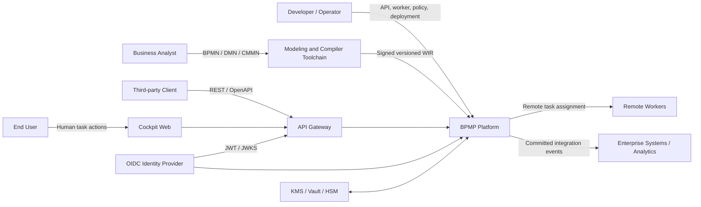

*Loại hình: system-context view. `BPMP Platform` là một system boundary logic; sơ đồ này không thể hiện deployable, protocol nội bộ, cardinality hay network zone.*

### Ranh giới trách nhiệm quan trọng

| Deployable | Sở hữu | Tuyệt đối không sở hữu |
|---|---|---|
| `bpmn-compiler` | Parse/validate BPMN, DMN, CMMN; emit signed WIR | Runtime state |
| `bpmp-engine` | WIR interpretation, state, Raft, event log, final authz, idempotency, compensation atomicity | Human query UI, AI inference |
| `human-runtime` | Work-item projection, assignment, delegation, SLA/escalation | WIR interpretation, authoritative transition |
| `api-gateway` | Public API, coarse authn, rate limit, normalization | Final authz, write-side idempotency |
| `projection-service` | Rebuildable query models and checkpoints | Authoritative workflow state |
| `governance-service` | Approval workflow, barrier/shred orchestration, governance audit | Direct write vào RocksDB/Raft |
| `authz-control-plane` | Policy administration and signed bundle publication | Authoritative transition decision |
| `configuration-service` | Versioned config lifecycle, validation, audit, publication | Mid-command policy mutation |
| `cockpit-gateway` | Tenant-scoped realtime hints and bounded delivery | Durable workflow source of truth |
| `cockpit-web` | Operator/BA experience | Security authority or embedded policy |

## 4. Design-time architecture: BPMN-as-IR

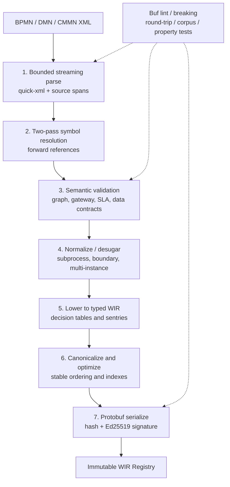

*Loại hình: compiler pipeline. Mũi tên liền là artifact transformation; mũi tên nét đứt là quality gate tác động vào nhiều pha, không phải runtime dependency.*

### Vì sao compile AOT thay vì parse BPMN lúc runtime?

- **Fail sớm:** unresolved reference, dead path, gateway không sound, data mismatch và unsupported element bị chặn ở CI/deploy.
- **Giảm runtime variability:** command path không chạy XML parser, schema resolver hoặc ad-hoc expression parser.
- **Canonical artifact:** cùng semantic input sinh ordering ổn định để hash, ký, diff và cache.
- **Security:** runtime chỉ nhận artifact đã kiểm schema version, content hash, signature và bounds.
- **Hiệu năng:** Engine dùng dispatch table/index đã dựng; không lặp graph construction cho mỗi instance.
- **Đa ngôn ngữ nhưng một semantics:** Protobuf là durable contract; Go service coi WIR là opaque.

### WIR là gì?

WIR không phải DTO sao chép BPMN XML. Nó là state-machine IR gồm node/transition đã resolve, typed guards, timer/correlation definition, retained scope, multi-instance metadata, DMN function và CMMN sentry. Mỗi WIR gắn `tenant_id`, workflow type/version, schema version, content hash và signature metadata.

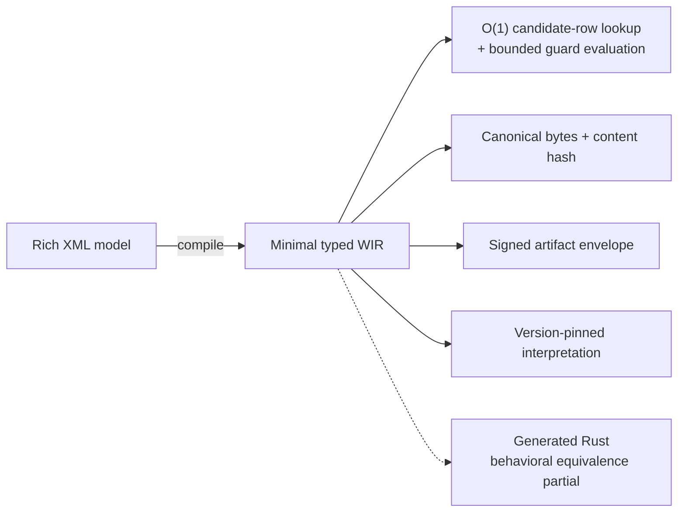

*Loại hình: property map, không phải execution flow. WIR góp phần ổn định replay nhưng replay correctness còn phụ thuộc version-pinned interpreter, event ordering, upcaster và injected nondeterministic inputs. Nét đứt đánh dấu generated-Rust path chưa có full behavioral-equivalence evidence.*

## 5. Runtime deployment architecture

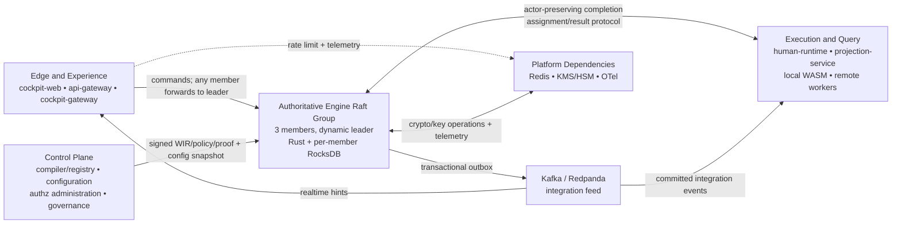

*Loại hình: summary logical deployment view. Các box aggregate nhiều deployable để giữ một nguồn authority ở trung tâm và tránh spaghetti; bảng ownership ngay dưới và các diagram command/config/security/CQRS cung cấp chi tiết. `Engine Raft Group` gộp ba process, không ngụ ý vai trò leader cố định. Sơ đồ không phải pod, network-zone hay protocol-completeness diagram.*

## 6. Authoritative command path

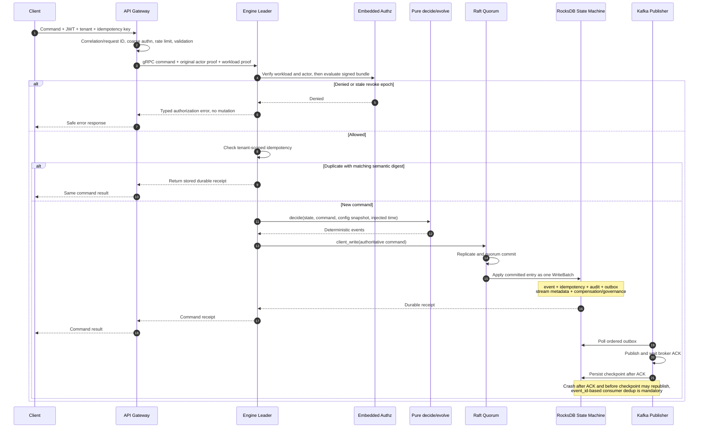

*Loại hình: success/duplicate/deny sequence for one authoritative command. Gateway luôn nằm trên response path; Kafka publication xảy ra hậu commit và không quyết định command validity.*

### Invariant cốt lõi

```text
Committed command
  = Raft quorum commit
  + deterministic state-machine apply
  + one RocksDB WriteBatch containing all authoritative consequences
```

Không có trạng thái hợp lệ trong đó workflow event đã commit nhưng idempotency result, security audit hoặc outbox bắt buộc lại thiếu. Kafka outage không rollback command: outbox giữ bản ghi và publisher retry theo thứ tự.

## 7. Storage và consistency model

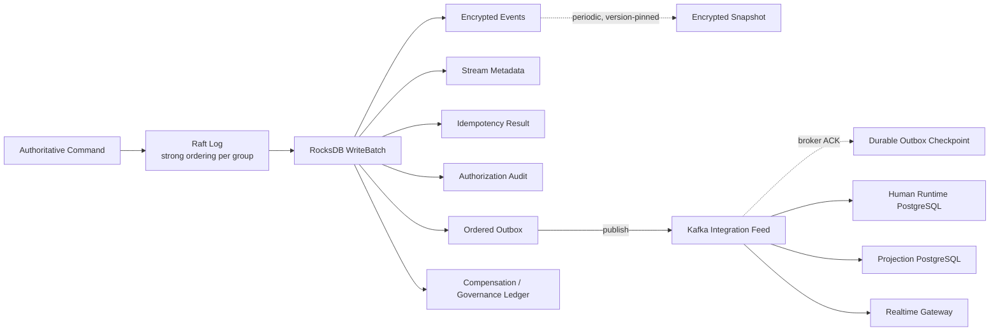

*Loại hình: storage ownership and post-commit propagation. Các nhánh từ `WriteBatch` là cùng authoritative apply; snapshot là công việc định kỳ/version-pinned, không được hiểu là tạo ở mọi command. Broker ACK chỉ cho phép advance outbox checkpoint; nó không biến Kafka thành nguồn sự thật.*

| Store | Vai trò | Consistency | Có thể rebuild? |
|---|---|---|---|
| RocksDB + Raft | Authoritative workflow event/state | Strong per Raft group | Không được coi là disposable |
| Engine outbox | Bridge hậu commit sang Kafka | Atomic với event | Có thể retry, không bỏ qua |
| Kafka/Redpanda | Integration feed và broadcast invalidation | Ordered theo partition key | Không thay authoritative log |
| Human PostgreSQL | Work item, assignment, SLA, audit projection | Transactional trong Human context | Có thể rebuild một phần từ events |
| Projection PostgreSQL | Query/read model, inbox, checkpoint | Transactional consume | Có thể rebuild đầy đủ từ committed events |
| Authz PostgreSQL | Policy administration/control plane | Transactional + version/audit | Không quyết định transition trực tiếp |
| Redis | Rate limit/cache tạm | Ephemeral/distributed | Có |

Liên hệ: [[concepts/consensus-raft-paxos]], [[concepts/consistency-models-spectrum]], [[concepts/postgresql-index-internals]].

## 8. Dynamic configuration và safe point

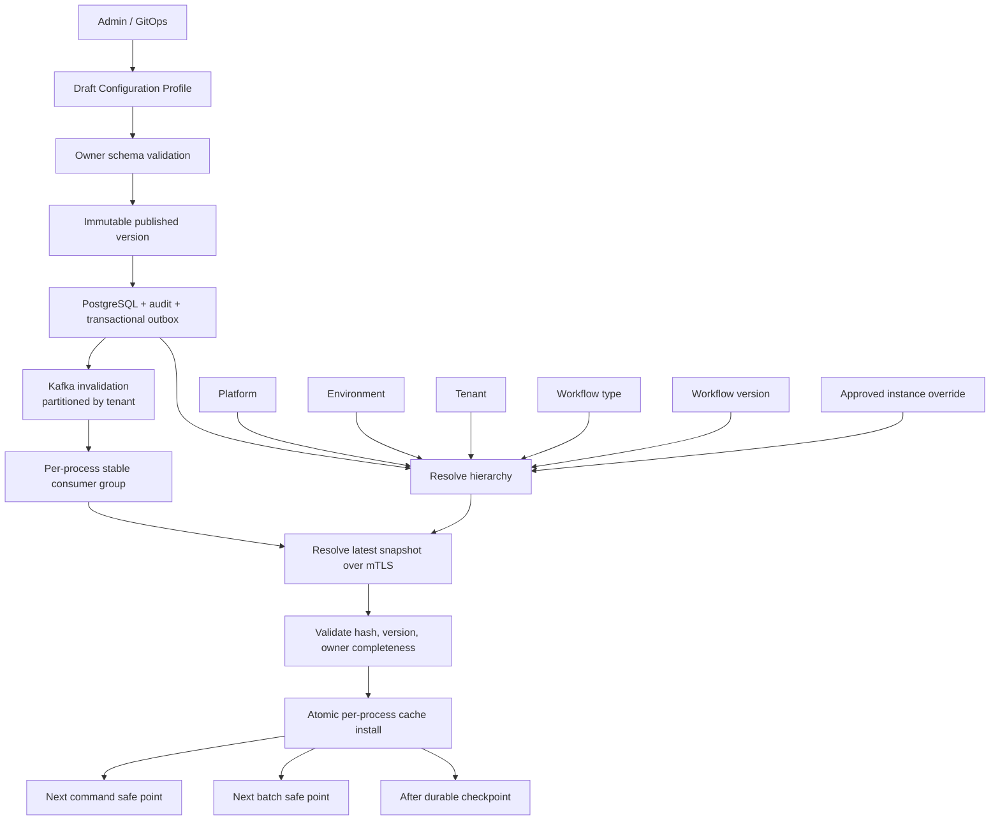

*Loại hình: configuration publication and installation sequence. Kafka message là invalidation signal, không mang authoritative snapshot; mỗi process dùng consumer group riêng để mọi replica đều cài version mới. Cache chỉ đổi tại safe point phù hợp với loại workload.*

Policy không được đổi giữa transaction, WriteBatch hoặc Kafka acknowledgement sequence. Event/audit ghi `config_version` và `policy_version`, nhờ đó replay và điều tra biết quyết định lịch sử dùng policy nào.

Các giá trị phải dynamic gồm rate limit, quota, timeout, retry/backoff, circuit breaker, bulkhead, worker routing, SLA/escalation, batch size, lease, retention, KMS policy, pagination và feature flag. Các constant giao thức như Protobuf field number, stable enum tag và WIR schema compatibility guard **không** phải runtime config.

## 9. Security architecture

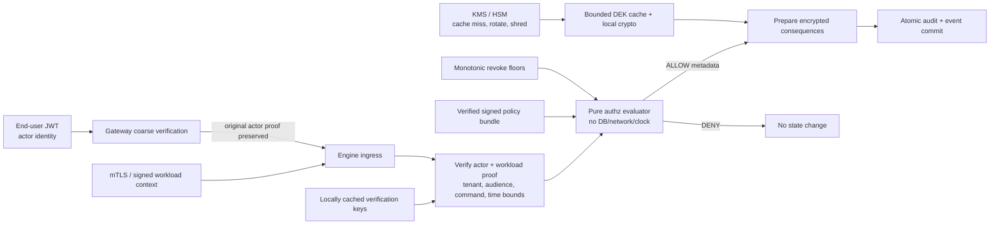

*Loại hình: trust-boundary data flow. Pure evaluator chỉ nhận verified local inputs; KMS/JWKS network I/O không được ngầm đặt trong evaluator. Nếu proof, bundle, revoke floor hoặc DEK không hợp lệ thì path fail closed trước state mutation.*

### Tại sao authz phải embedded?

- Một remote PDP trên command critical path thêm network latency và availability dependency.
- Cache remote dễ tạo cửa sổ policy stale.
- Workload identity không được phép đại diện end-user actor.
- Evaluator thuần nhận đầy đủ bundle, proof, epoch và evaluation timestamp đã inject, nên replay/test xác định.
- ALLOW audit được commit cùng transition, không tồn tại “transition thành công nhưng thiếu bằng chứng quyền”.

## 10. Worker model

| Loại worker | Công nghệ | Khi dùng | Cơ chế bảo vệ |
|---|---|---|---|
| Local script/service task | Wasmtime | Logic nhỏ cần latency thấp; chạy ngoài pure `decide/evolve` dù cùng Engine process | Fuel, memory limiter, capability allowlist, pinned artifact, durable/idempotent completion |
| Remote worker | tonic bidirectional gRPC | Tích hợp hệ thống ngoài, SDK đa ngôn ngữ | Credit, bounded inflight, signed assignment token, lease, ACK |
| Human task | Human Runtime Go | Assignment, delegation, SLA, maker-checker | PostgreSQL version, durable intent, authoritative completion tại Engine |

Credit-based dispatch giữ invariant `0 <= inflight(worker) <= credits_granted(worker)`. Engine không đẩy vô hạn vào worker chậm; assignment/lease được persisted để crash recovery không tạo double execution không kiểm soát.

## 11. CQRS, projection và realtime

Engine không phục vụ dashboard bằng cách scan event log. Projection Service consume committed event, ghi inbox + read model + checkpoint trong một PostgreSQL transaction, sau đó mới ACK Kafka. Cockpit Gateway chỉ phát **hint** realtime; client phải resync query model khi mất cursor hoặc queue overflow.

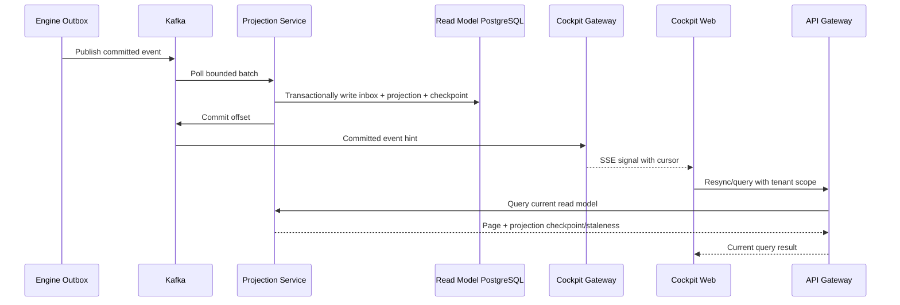

*Loại hình: CQRS propagation and resync sequence. SSE là hint có thể mất/drop; UI correctness đến từ query lại read model. Projection vẫn eventual so với Engine authority, vì vậy checkpoint/staleness phải lộ ra khi quyết định người dùng phụ thuộc freshness.*

## 12. Vì sao chọn từng technology

| Technology | Lý do chọn | Giá trị cụ thể | Trade-off phải quản trị |
|---|---|---|---|
| Rust | Memory safety không GC, control layout/concurrency | Deterministic core, compiler, crypto, stateful Engine | Compile time và learning curve cao |
| Tokio | Async ecosystem chuẩn của Rust | Bounded network I/O, timers, streaming | Phải tách blocking RocksDB/native work khỏi async coordination |
| tonic + Protobuf | Typed streaming và đa ngôn ngữ | Rust-Go contract, worker credit stream, deadlines | Schema governance bắt buộc |
| Buf | Lint/breaking/codegen gate | Ngăn tái sử dụng field number và generated drift | CI cần baseline release rõ ràng |
| RocksDB | Mature LSM, WAL, column family, WriteBatch | Event/idempotency/audit/outbox atomic local apply | Native build nặng; compaction và lock cần vận hành đúng |
| OpenRaft | Rust-native Raft framework | Authoritative replication, membership, leader forwarding | Cần model checking, partition chaos và shard directory |
| Wasmtime 36.0.4 | Mature sandbox với fuel/memory controls | Chạy local task mà không nạp native plugin vào Engine | Phải có upgrade/CVE qualification định kỳ |
| Go | Goroutine/network stack, simple deployment | Gateway, projection, human runtime, realtime fanout | GC/memory phải đo ở 300k connection |
| PostgreSQL + pgx/v5 | Transaction, index, locking rõ ràng | Human/config/projection/governance bounded contexts | Pool budget và hot-tenant query plan phải dynamic |
| Kafka/Redpanda + franz-go | Durable integration stream, ecosystem tốt | Outbox publication, projection, cache invalidation | Không dùng làm workflow authority; quản trị lag/retention/ACL |
| Redis | Atomic distributed limiter/cache | Multi-replica edge controls | Thêm sync dependency vào request path |
| React 19 + Vite + Zod | Typed SPA, fast build, runtime validation | Cockpit và contract fail-fast | Cần error boundary, browser E2E, bundle budget |
| OpenTelemetry | Vendor-neutral traces/metrics/logs | Correlation xuyên Rust-Go-Kafka-gRPC | Cardinality/PII policy và sampling phải kiểm soát |
| Docker Compose / Kubernetes | Reproducible E2E và production orchestration | Health-based staged startup, StatefulSet/Deployment | Compose proof không thay thế multi-zone production test |

### Stack thực tế đang được pin trong repo

| Layer | Version hiện tại |
|---|---|
| Rust MSRV/toolchain | 1.91 / 1.91.1 |
| Tokio / tonic / prost | ~1.51.4 / 0.14.6 / 0.14.4 |
| OpenRaft / RocksDB / Wasmtime | 0.9.24 / 0.24.0 / 36.0.4 |
| Go / gRPC-Go / pgx / franz-go | 1.25.12 / 1.82.1 / 5.9.2 / 1.21.0 |
| React / Vite / TypeScript / Zod | 19.2.8 / 8.1.5 / 7.0.2 / 4.4.3 |
| Docker E2E data plane | PostgreSQL 17.5, Redis 7.4.2, Redpanda 24.3.18 |
| Telemetry | OpenTelemetry Collector 0.130.1; Go OTel 1.44.0 |

`design.md` có target baseline tương lai riêng. Nâng version phải qua security advisory, compatibility, replay golden, chaos và benchmark; không tự động thay toàn bộ stack bằng newest release.

## 13. Build và deployment flow

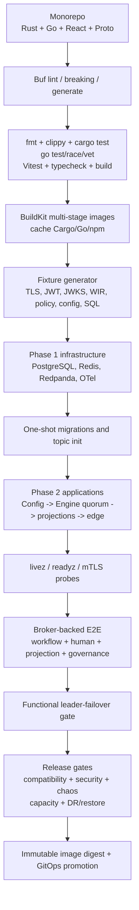

*Loại hình: release-gate pipeline. Đây là dependency/order model, không phải thời lượng pipeline. Functional E2E và một leader-failover scenario không đủ để đi thẳng tới production promotion; compatibility, security, broader chaos, capacity và restore là gate độc lập.*

### Production order

1. Publish immutable images, descriptors, signed WIR và policy bundles.
2. Apply migration bằng credential của đúng bounded context.
3. Provision Kafka topics/ACL/retention từ topology tập trung.
4. Start Configuration Service và publish đủ mandatory owner policies.
5. Chỉ ACTIVE tenant khi readiness không còn owner thiếu.
6. Start 3/5 Engine member với volume riêng; bootstrap membership một lần.
7. Start Projection, Governance, Human Runtime, API Gateway.
8. Start Cockpit Gateway/Web; kiểm SSE drain/resync.
9. Mở ingress sau acceptance transaction và consumer lag bằng 0.

## 14. BPMP so với Camunda 8 và Temporal

### Định vị đúng

- **Camunda 8/Zeebe:** BPMN-first platform trưởng thành, broker partitioned/replicated, hệ sinh thái Modeler/Operate/Tasklist và connectors mạnh.
- **Temporal:** code-first durable execution, SDK developer experience mạnh, workflow code replay bằng event history, task queue/activity abstraction trưởng thành.
- **BPMP:** standards-first nhưng compiler-oriented; cố gắng kết hợp BA model với typed WIR, deterministic Rust core, embedded transition authz và enterprise governance atomicity.

### Ma trận so sánh

| Tiêu chí | BPMP | Camunda 8 | Temporal |
|---|---|---|---|
| Tác giả workflow | BA + engineer qua BPMN/DMN/CMMN | BA + engineer qua BPMN/DMN | Developer viết workflow code |
| Runtime definition | Signed typed WIR đã compile | BPMN deployment được broker thực thi | Workflow code trong SDK worker |
| XML trên runtime path | Không | Model được deploy cho engine | Không BPMN/XML |
| Compile-time graph/type analysis | Mục tiêu cốt lõi: reachability, gateway, SLA, data-flow | Modeler lint + engine validation; coverage theo Camunda profile | Type system của language, nhưng không có BPMN graph semantics |
| Authority | Rust Engine + RocksDB/Raft | Zeebe broker partition | Temporal Service history + workflow workers |
| Business logic execution | Local WASM hoặc remote gRPC worker | External job workers/connectors | Activities + workflow code workers |
| Human task | Bounded context riêng, authoritative completion quay về Engine | Tasklist/user tasks tích hợp | Pattern/SDK, không BPMN-native |
| DMN/CMMN | Typed IR; hiện mới hỗ trợ profile giới hạn | DMN và BPMN profile; Zeebe không chạy CMMN | Không native BPMN/DMN/CMMN |
| Authz transition | Embedded evaluator, signed bundle, revoke epoch, atomic ALLOW audit | Camunda 8.9 có Orchestration Cluster và user-task authorization; không cùng mô hình embedded ABAC/revoke-epoch/atomic audit của BPMP | Server/API authorization; quyền nghiệp vụ chi tiết thường nằm trong application/workflow design |
| Config replayability | `config_version`/`policy_version` đi cùng event/audit | Có config/deployment mechanisms, không cùng BPMP model | Workflow code/versioning và search attributes; app config do ứng dụng quản trị |
| Governance atomicity | Compensation/governance consequences trong Engine commit | Cần mô hình hóa/integration theo use case | Saga/compensation viết bằng workflow code |
| Maturity/ecosystem | Đang xây dựng, rủi ro cao hơn | Production mature, ecosystem lớn | Production mature, SDK/ecosystem lớn |
| Lock-in | Open contracts và standards, nhưng custom engine | Camunda extensions/operations ecosystem | Temporal SDK/programming model |

### BPMP vượt trội ở đâu, nếu hoàn thành đúng thiết kế?

#### 14.1 So với Camunda

1. **Compiler boundary mạnh hơn runtime model ingestion:** BPMP biến model thành canonical typed WIR và ký artifact. Điều này phù hợp tổ chức muốn model validation giống software compilation.
2. **Không parse/resolve XML trong runtime:** giảm attack surface và biến thiên latency tại Engine.
3. **Data contract và symbolic gateway analysis:** có thể phát hiện mismatch/coverage trước deploy sâu hơn một model lint thông thường.
4. **Embedded transition authz:** quyết định quyền không phụ thuộc remote PDP và audit ALLOW commit cùng event.
5. **Atomic enterprise governance:** idempotency, encrypted event, audit, outbox, compensation/governance nằm trong một authoritative commit.
6. **Local sandboxed execution:** Wasmtime cho task phù hợp có thể giảm network hop so với mọi service task đều là external job worker.
7. **Config snapshot replayable:** tenant/workflow policy được version hóa và gắn vào quyết định lịch sử.

Camunda vẫn vượt BPMP rõ ràng ở maturity, BPMN tooling, connector ecosystem, vận hành cluster, documentation, support và bằng chứng scale. Camunda 8 cũng dùng partition + Raft replication và RocksDB; vì vậy “BPMP có Raft/RocksDB” tự nó **không** phải lợi thế cạnh tranh.

#### 14.2 So với Temporal

1. **BA-first và standards-first:** quy trình là BPMN/DMN/CMMN artifact có thể review với nghiệp vụ, không chỉ workflow source code.
2. **Static process analysis:** compiler hiểu gateway, reachability, boundary, SLA, data contract và decision table ở cấp mô hình.
3. **Artifact governance:** WIR immutable, signed, tenant/version scoped; deployment có canonical diff.
4. **Human workflow là first-class bounded context:** assignment/delegation/SLA/audit không phải tự dựng hoàn toàn từ SDK primitives.
5. **Policy-aware replay:** config/policy version là explicit decision input và audit metadata.
6. **Transition-level security authority:** actor/workload proof tách biệt, revoke epoch và signed bundle chạy trong core path.

Temporal vẫn vượt BPMP ở developer productivity cho code-first orchestration, SDK breadth, durable timer/signal/activity primitives, workflow versioning practice, operational maturity và production evidence. Với workflow thuần kỹ thuật do developer sở hữu, Temporal thường là lựa chọn ít rủi ro hơn.

### Khi nào chọn nền tảng nào?

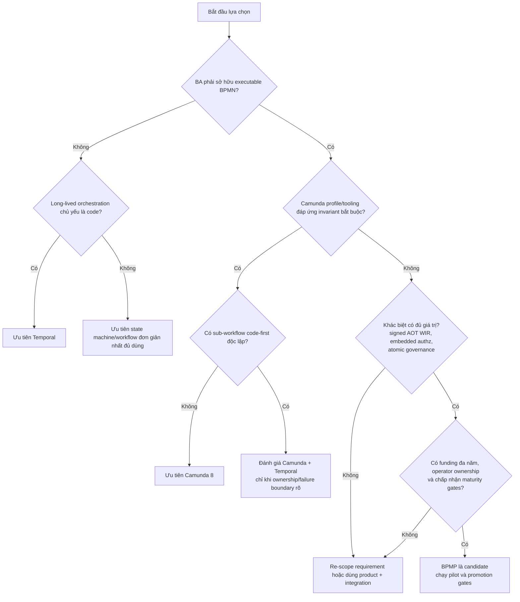

*Loại hình: decision-support tree, không phải scoring algorithm. Kết quả là shortlist/candidate chứ không phải quyết định mua/xây tự động; TCO, licensing, data residency, team capability và measured workload vẫn phải đi qua ADR.*

## 15. Scale path và bottleneck

Một Raft group có một leader serialization point. Scale đúng không phải thêm vô hạn follower mà là nhiều group/shard theo `(tenant_id, stream_id)` với shard directory và rebalancing an toàn.

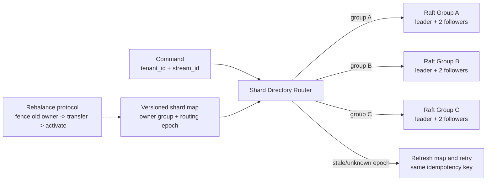

*Loại hình: target sharding model, hiện chưa phải implemented production topology. Một `(tenant_id, stream_id)` chỉ có đúng một authoritative owner group tại một routing epoch; rebalance phải fence owner cũ trước khi owner mới nhận write. Directory availability không được làm hai group cùng commit một stream.*

Các blocker trước tuyên bố 300k CCU:

- Shard directory và nhiều Raft group chưa hoàn thiện production.
- RocksDB log/apply/snapshot còn contention quanh write coordination.
- Cockpit realtime fanout cần index shard theo tenant + signal, durable resume và byte quota.
- PostgreSQL pool budget/PgBouncer phải dynamic và có global capacity plan.
- Redis trên request path cần explicit outage policy.
- Cần 30 phút ramp + 2 giờ soak với 300k connected-idle, normal peak và stress profile.

## 16. Risk register và production gates

| Risk | Tác động | Gate bắt buộc |
|---|---|---|
| BPMN/DMN/CMMN standards breadth chưa đủ | Model enterprise bị fail-closed hoặc semantic gap | Catalog tests, grammar PBT, generated-code equivalence |
| Raft/network partition bug | Mất availability hoặc consistency | Model checking + 3/5 node chaos + membership tests |
| RocksDB compaction/snapshot stall | Tail latency tăng | Linux NVMe benchmark, bounded batch, snapshot isolation |
| Wasmtime CVE/version drift | Sandbox risk | Scheduled LTS qualification, CVE scan, artifact allowlist |
| Kafka lag/outbox poison event | Projection stale | DLQ/replay runbook, lag SLO, crash-before/after-ACK tests |
| Authz bundle/revoke cache corruption | Unauthorized transition hoặc outage | Fail-closed install, monotonic epoch, key rotation chaos |
| Dynamic config partial install | Replica dùng policy khác nhau | Per-process broadcast group, safe point, zero-lag rollout gate |
| 300k realtime connections | Memory/FD/fanout collapse | Sharded hub, slow-consumer policy, long soak test |
| Custom platform maturity | Delivery/operations cost | Phased rollout, synthetic data until PII gates pass |

## 17. Architecture principles cần bảo vệ

1. Chỉ Engine diễn giải WIR và sở hữu authoritative transition.
2. `decide()`/`evolve()` không đọc clock, network, DB, environment hoặc random.
3. Kafka không bao giờ được nâng thành authoritative event store của workflow.
4. Không service nào query database của service khác.
5. Original actor proof và idempotency key không bị Gateway thay thế.
6. Event, idempotency, audit và outbox bắt buộc phải atomic.
7. Encrypted path fail-closed; không có plaintext fallback.
8. Config chỉ đổi tại command/batch/checkpoint safe point.
9. Published artifact/config/policy là immutable; rollback tạo version mới.
10. Queue, retry, cache, batch, message, goroutine/task và connection đều bounded.

## 18. Production assessment scope và baseline

### Assessment verdict

| Phạm vi sử dụng | Verdict tại baseline | Lý do |
|---|---|---|
| Local development / học tập / portfolio | **Ready** | Build topology, functional tests và bounded-context boundaries đã đủ rõ |
| Functional MVP với synthetic data | **Conditionally ready** | Core command, Human Runtime, projection, governance và leader-failover path đã có evidence; phải giữ đúng pinned topology |
| Internal pilot không chứa PII, tải giới hạn | **Conditionally ready after pilot gates** | Cần workload definition, error budget, restore drill và failure injection cho dependency thật |
| Production có PII hoặc quyết định tài chính | **Not approved** | Standards breadth, production KMS/rotation, DR/restore, long soak, multi-zone chaos và operational ownership chưa đủ evidence |
| Thay Camunda/Temporal ở workload mission-critical | **Not approved** | Chưa có maturity, compatibility window, scale history, upgrade/rollback history và operator runbook tương đương |

Assessment này dùng repository `D:/project/bpmp-platform` tại commit `ac60f91b3f7057f32336e5371fd5720e5fbf0c14` ngày 2026-08-06. Một claim chỉ được nâng cấp sau baseline này khi evidence tương ứng được bổ sung và trace lại vào tài liệu.

### Workload bắt buộc phải định nghĩa trước capacity claim

Không dùng duy nhất từ “CCU”. Mọi benchmark hoặc SLO phải ghi ít nhất:

| Dimension | Giá trị cần công bố |
|---|---|
| Connection shape | HTTP, SSE/WebSocket, remote-worker gRPC; connected-idle hay active |
| Active ratio | Phần trăm connection phát request/task trong mỗi cửa sổ |
| Command/read mix | Workflow command, task operation, query và realtime hint mỗi giây |
| Payload | p50/p95/p99 bytes trước và sau serialization/encryption |
| Workflow shape | Event count/instance, fan-out, multi-instance cardinality, timer density |
| Tenant skew | Hot tenant, hot stream, dedicated/shared shard distribution |
| Durability | Raft group size, zone layout, fsync policy, broker ACK policy |
| Latency | p50/p95/p99 và timeout/error budget, không chỉ average |
| Test duration | Ramp, steady-state soak, failure window và recovery window |

## 19. Claim-to-evidence matrix

| Claim | Status | Code/test evidence | Residual risk / điều kiện nâng cấp |
|---|---|---|---|
| Chỉ Rust Engine diễn giải WIR và quyết định authoritative transition | **Verified architectural boundary** | `ADR-001`; `crates/bpmp-domain-core`; Go services dùng generated contract | Cần dependency/architecture test trong CI để ngăn logic WIR bị copy sang service khác |
| WIR là signed, versioned Protobuf artifact | **Verified core** | `ADR-003`; compiler acceptance AC10/AC12; compiler-to-engine loading | Chưa có schema v2 và old-version golden compatibility suite |
| BPMN/DMN/CMMN compiler đáp ứng full standards catalog | **Partial** | Requirement 1 executable profile 12/12 | Literal requirement còn 5 partial; DMN mới chủ yếu FIRST/UNIQUE, CMMN chỉ subset |
| `decide/evolve` deterministic và replay-safe | **Verified core, partial system** | Pure domain crate, property tests, snapshot/replay tests | Cần golden replay xuyên binary/toolchain version; instrumentation phải ở ngoài pure replay path |
| Event + state + idempotency + ALLOW audit + outbox commit atomically | **Implemented and tested on Linux path** | `crates/bpmp-adapter-rocksdb/src/rocks.rs`, test `workflow_raft_batch_atomically_commits_encrypted_state_idempotency_audit_and_outbox` | Cần crash/power-loss matrix trên production filesystem/NVMe và restore verification |
| Kafka outage không làm mất/rollback committed workflow command | **Verified functional path** | Ordered RocksDB outbox, ACK-before-checkpoint publisher, broker-backed E2E documentation | Crash sau broker ACK tạo duplicate hợp lệ; consumer dedup và poison-event runbook vẫn bắt buộc |
| Human Runtime không tự finalize authoritative transition | **Verified core, partial production path** | Requirement 2 compliance, Go-to-Rust actor-preserving command path | Thiếu deployment-level Go→Rust test dùng RocksDB và identity/JWKS rotation chaos |
| Projection effects + inbox/checkpoint atomically trong PostgreSQL | **Verified core** | Projection integration/E2E evidence và rebuild design | Không được gọi là end-to-end exactly-once; broker redelivery vẫn xảy ra, hiệu lực đạt qua dedup/idempotent apply |
| Embedded authz chống workload-substitution và stale revoke | **Verified core, partial operations** | `ADR-008`, signed bundle/revoke tests, negative actor tests | Cần key rotation, JWKS outage, bundle corruption và policy rollout chaos ở multi-replica topology |
| Governance abort-and-reconcile không shred trước atomic terminal/reconciliation commit | **Implemented core, partial production** | Governance domain, Engine WriteBatch path, E2E approval flow | KMS revocation-barrier race, crash-before/after-shred và legal-deadline operations chưa đủ evidence |
| 3-node leader failover hoạt động | **Verified functional topology** | Broker-backed E2E dừng bootstrap leader và hoàn tất work item qua majority | Không thay thế partition, disk-loss, stale snapshot, membership-change và multi-zone chaos |
| 300k CCU hoặc 100k worker connections | **Unproven** | Chỉ có protocol/boundedness direction và nhỏ-scale benchmarks | Phải hoàn thành shard directory, indexed fanout, pool budget và production-like soak |
| DR/multi-region đạt banking-grade | **Designed gap** | Snapshot/backup được nhắc ở architecture; chưa có RPO/RTO evidence | Cần ADR, backup format, restore drill, cross-region policy và corruption recovery |

## 20. Failure semantics và crash-point matrix

| Failure point | Authoritative result | Recovery contract | Evidence status |
|---|---|---|---|
| Trước Raft propose | Không commit | Client retry cùng idempotency key | Core covered |
| Sau propose nhưng trước quorum commit | Chưa được ACK; outcome có thể chưa biết với client | Retry; Engine lookup authoritative idempotency result sau authz | Core covered; cần partition chaos rộng hơn |
| Sau quorum commit nhưng client mất response | Command đã commit | Retry trả durable receipt cũ, không chạy lại side effect | Core/E2E covered |
| Sau commit trước Kafka publish | Workflow vẫn hợp lệ | Outbox publisher resume từ durable checkpoint | Functional covered |
| Sau Kafka ACK trước outbox checkpoint | Có thể publish duplicate | Giữ nguyên `event_id`; consumer dedup trước effect | Covered by design/tests; production broker crash drill required |
| Consumer crash trước PostgreSQL commit | Không projection effect | Kafka redelivery | Core covered |
| Consumer crash sau DB commit trước offset commit | Projection đã có; message redeliver | Inbox/dedup hoặc stable upsert ngăn double effect | Core covered |
| Worker mất kết nối sau external effect trước ACK | External outcome không chắc chắn | Stable operation/idempotency key; reconcile với target; không tuyên bố exactly-once network | Partial; adapter-specific evidence required |
| KMS down trên DEK cache miss | Không append, không state transition | Fail closed; retry có deadline sau KMS recovery | Core covered; outage/expiry chaos required |
| Key revoke đồng thời append | Node epoch cũ không được ghi/đọc tiếp | Fence scope, monotonic epoch, evict/lease barrier | Designed/partial |
| Crash sau compliance commit trước key shred | Instance terminal/reconciliation state đã durable; dữ liệu còn đọc được tạm thời | Governance resume shred idempotently | Partial |
| Crash sau key shred trước external checkpoint | Payload không còn đọc được | Rehydrate trả typed compliance error; reconciliation metadata sống bằng operational key | Partial; destructive KMS drill required |
| Leader mất | Committed entries không được mất; minority không commit | Elect leader, restore service khi quorum còn | Functional failover covered; full chaos incomplete |
| RocksDB volume mất/corrupt | Node có thể rebuild/catch up nếu quorum/snapshot tốt | Replace node, install verified snapshot/log | Unproven operationally |
| Toàn region mất | Không có cam kết hiện tại | Phụ thuộc future backup/cross-region ADR | Open blocker |

Không dùng cụm từ “exactly once” cho worker, Kafka hoặc network delivery. BPMP cung cấp **at-least-once delivery + durable idempotency/dedup để đạt exactly-once business effect trong phạm vi invariant đã kiểm soát**. External system không hỗ trợ idempotency/reconciliation vẫn là residual risk tường minh.

## 21. Ordering, concurrency và backpressure assessment

- **Per-stream order:** sequence và optimistic expected version bảo vệ thứ tự authoritative trên một stream.
- **Cross-stream order:** không có global business order guarantee. Global outbox cursor chỉ phục vụ publication progress, không được dùng làm transaction order xuyên workflow.
- **Raft-group order:** một group serialize log entry; scale phải bằng nhiều group, không bằng thêm follower vô hạn.
- **Guard complexity:** dispatch-table lookup candidate row có thể O(1), nhưng decision cost còn phụ thuộc out-degree và độ phức tạp expression; không được quảng cáo toàn command path O(1).
- **Worker delivery:** credit invariant giới hạn task in-flight theo worker; queue còn phải bounded theo cả item count và bytes.
- **Human work item:** optimistic version bảo vệ concurrent claim/delegate/complete cục bộ; Engine event mới là nguồn finality.
- **Configuration:** command lấy immutable resolved snapshot ở safe point; thay đổi giữa transaction/WriteBatch/ACK sequence bị cấm.
- **Shutdown:** mọi service production phải stop nhận mới, drain bounded in-flight tới deadline, persist checkpoint/lease và đóng connection; hiện cần trace runbook/test cho từng deployable.

## 22. Workflow, WIR và event evolution

Ba loại versioning không được trộn:

| Loại | Mục đích | Cơ chế | Status |
|---|---|---|---|
| Workflow business version | Instance cũ tiếp tục logic cũ | Pin `WorkflowVersion`, registry đa-version, safe-point migration | Core design/partial implementation |
| WIR schema/wire version | Engine mới đọc artifact compiler cũ | Versioned Protobuf, reserved field, artifact hash/signature, interpreter compatibility | Schema v1 verified; compatibility window chưa được chứng minh |
| Event/snapshot schema | Binary mới replay bytes lịch sử | Explicit pure upcaster chain + golden fixtures | Designed; chưa có real v2 fixture matrix |

Temporal `GetVersion()`/patching là cơ chế bảo vệ replay khi **workflow source code** thay đổi; nó chỉ là analog ở cấp deployment discipline, không thay thế Protobuf compatibility hoặc event upcasting của BPMP.

Gate trước khi phát hành schema v2:

1. Buf lint/breaking và clean codegen trên Rust/Go.
2. Golden WIR/event/snapshot bytes của mọi version được hỗ trợ.
3. Engine mới load/replay artifact và history cũ trên clean process.
4. Compiler mới không âm thầm thay semantic output của model cũ; canonical diff phải được review.
5. Roll-forward/rollback binary được thử với instance pin nhiều version.
6. Retire version chỉ khi không còn instance, snapshot, replay job hoặc retention hold tham chiếu.

## 23. Security threat model và trust boundaries

| Threat | Required control | Current assessment |
|---|---|---|
| Gateway/service giả actor | Original signed actor proof; audience bind tới workload; Engine re-verify | Core verified |
| Replay actor proof/idempotency leak | Command/tenant/audience/expiry/revoke bind; authz trước lookup | Core verified |
| Policy rollback/tamper | Canonical bytes, hash, Ed25519, monotonic bundle sequence/revoke epoch | Core verified; rotation chaos thiếu |
| Cross-tenant ID/confused deputy | Tenant trong storage key/domain type; actor và resource cùng scope | Core tests có; hot-path audit cần duy trì |
| Plaintext khi KMS lỗi | Encrypt trước WriteBatch; fail closed | Core verified; production KMS test thiếu |
| Stale DEK sau revoke | Key epoch, fence/barrier, bounded zeroized cache | Partial |
| Poison/oversized Protobuf/XML/WASM | Message/input/depth limits, DTD/XXE reject, fuel/memory quota | Compiler/WASM core covered; fuzz corpus phải chạy CI |
| PII trong logs/metrics | Structured redaction, approved tenant/correlation fields, cardinality policy | Designed/partial evidence |
| Unauthorized governance override | Dedicated capability, two actors, fresh auth, signed digest, commit-time recheck | Core verified; identity/KMS chaos thiếu |
| Supply-chain compromise | Pinned lockfiles/images, SBOM, provenance/signing, CVE gate | Deployment design; release evidence chưa trace trong article |

Camunda/Temporal comparison không được dùng để suy ra BPMP “an toàn hơn” một cách tổng quát. Claim hẹp có thể bảo vệ là: BPMP thiết kế transition authorization và ALLOW audit như một phần của authoritative commit; hiệu quả production còn phụ thuộc key management, policy distribution và operator discipline.

## 24. Performance, capacity và operational readiness

### Bottleneck đã xác nhận từ code review

1. `proposal_lock` đang giữ qua prepare, quorum `client_write` và local apply: một proposal in-flight mỗi Engine group.
2. RocksDB log/state/outbox/timer/correlation chia sẻ write coordination; snapshot có thể kéo dài critical section.
3. Cockpit hub hiện scan toàn subscription set cho mỗi signal và clone payload theo subscriber.
4. PostgreSQL pool chưa có global capacity budget theo tổng replica.
5. Redis rate-limit là synchronous dependency trên public request path; outage policy chưa được chốt theo operation.

### Evidence hiện có và giới hạn

- Human Runtime có local benchmark ở concurrency 8 với latency rất thấp; không ngoại suy thành production p95 ở tenant skew hoặc multi-hop topology.
- 3-node E2E chứng minh function/failover, không chứng minh sustained throughput, queue saturation hoặc memory stability.
- Không có evidence cho 300k connection, 100k worker, 1M sleeping instance working-set hoặc multi-Raft-group rebalance.
- Windows unit/build result không thay thế Linux RocksDB/NVMe benchmark vì production adapter được gate theo Linux.

### SLO tối thiểu phải có trước pilot

| SLI | Cần định nghĩa |
|---|---|
| Authoritative command | accepted throughput, p50/p95/p99, timeout, indeterminate outcome rate |
| Raft | propose, quorum commit, apply lag, leader changes, snapshot/install duration |
| Outbox/Kafka | oldest-record age, publish retry, duplicate rate, poison record |
| Projection/Human | consumer lag, checkpoint age, DB pool wait, transaction retry/conflict |
| Worker | queue bytes/age, credits, lease expiry, redelivery, unresolved external effect |
| Realtime | active connections, outbound queue bytes, dropped hints, resync-required rate |
| KMS/governance | cache hit, resolve latency, fence duration, shred/reconciliation deadline |
| Storage | WAL/fsync, compaction stall, disk headroom, snapshot/restore success |

## 25. Production promotion gates

| Gate | Pass condition | Baseline status |
|---|---|---|
| Standards profile | Supported BPMN/DMN/CMMN catalog versioned; unsupported construct fail-closed; business owners accept scope | **Partial** |
| Durable compatibility | Golden replay/load cho mọi WIR/event/snapshot version được support | **Partial** |
| Consensus safety | Model checking + minority/partition/crash/membership/snapshot chaos | **Partial** |
| Atomic command | Crash/power-loss tests chứng minh event/state/idempotency/audit/outbox không tách | **Core pass; production media pending** |
| External effect safety | Adapter-by-adapter idempotency/reconciliation contract và crash matrix | **Partial** |
| Identity/authz | JWKS/key rotation, revoke race, bundle rollback/corruption, workload substitution | **Core pass; chaos pending** |
| Encryption/governance | Production KMS, cache expiry/revoke race, crash around commit/shred, reconciliation SLA | **Partial** |
| Tenant isolation | Negative tests mọi ingress/storage/query + noisy-neighbor workload | **Functional pass; physical isolation pending** |
| Capacity | Defined profiles, 30-minute ramp, 2-hour soak, overload/recovery, p99/error budget | **Fail / no evidence** |
| DR | RPO/RTO approved; encrypted backup; restore/corruption/region-loss drill | **Fail / open blocker** |
| Operations | Runbook, alert, dashboard, on-call owner, rollback/roll-forward, capacity headroom | **Partial** |
| Supply chain | SBOM, signed provenance/image, pinned dependency, advisory and rollback evidence | **Partial** |

> [!danger] Production decision
> Baseline hiện tại **không được phê duyệt cho production chứa PII, quyết định tín dụng hoặc side-effect tài chính không thể hoàn tác**. Quyết định này không phủ nhận chất lượng thiết kế; nó phản ánh thiếu evidence ở standards breadth, compatibility, capacity, KMS/governance chaos, DR và operational ownership. Chỉ đổi verdict khi từng gate có artifact kiểm chứng và người chịu trách nhiệm ký nhận residual risk.

## 26. Diagram và model quality assessment

### Visual grammar

- Mũi tên liền: control/data/artifact flow thực sự trong view đang xét.
- Mũi tên nét đứt: quality gate, telemetry, periodic derivation hoặc target relationship không nằm trên critical path.
- Hộp bo trong flowchart: component/artifact/state; hình thoi: decision condition.
- Từ **logical**, **target**, **sequence** và **property map** trong caption xác định loại model; không được đọc một logical view như network/deployment topology vật lý.
- Diagram không mang status mặc định. Caption phải nói rõ implemented, partial hay target khi hình chứa năng lực chưa được chứng minh.

| Diagram/model | Mục đích | Độ đúng semantic sau audit | Cognitive load | Giới hạn cần nhớ |
|---|---|---|---|---|
| System context | Actor/external-system boundary | **Good** | Low | Không thể hiện deployable/network zone |
| Compiler pipeline | Artifact transformation + quality gates | **Good** | Medium | Không đồng nghĩa full standards coverage |
| WIR property map | Giá trị của typed/canonical artifact | **Good with partial marker** | Low | Replay còn phụ thuộc interpreter/event/upcaster |
| Runtime deployment | Bounded-context/deployable interaction | **Good** | Low-medium | Các deployable được aggregate; không phải pod/network diagram |
| Authoritative command sequence | Deny/duplicate/new command semantics | **Good** | Medium | Chỉ một command; không mô tả concurrent interleaving |
| Storage/consistency | Atomic authority và post-commit propagation | **Good** | Medium | Snapshot periodic; Kafka vẫn at-least-once |
| Dynamic configuration | Publish/invalidate/resolve/install/safe-point | **Good** | Medium | Mỗi process phải có broadcast-style group riêng |
| Security trust flow | Proof verification, pure evaluation, encryption | **Good** | Medium | Không thay full threat/data-flow diagram theo network zone |
| CQRS/realtime | Projection transaction, hint và resync | **Good** | Low | Read model eventual; checkpoint/staleness phải được expose |
| Build/release gates | Dependency order tới promotion | **Good** | Low | Không thể hiện duration/parallel jobs; gate chưa pass vẫn chặn |
| Platform decision tree | Build/buy/hybrid shortlist | **Good as heuristic** | Medium | Không thay weighted ADR/TCO analysis |
| Shard-directory model | Single owner per stream/epoch | **Target-only, semantically sound** | Low | Rebalance/fencing chưa có production evidence |

Không có raster image, benchmark chart hoặc quantitative plot trong baseline article. Mermaid phù hợp vì các quan hệ cần diễn giải là boundary, sequence, ownership và decision—not pixel-accurate UI. Khi bổ sung benchmark, nên dùng chart có axis/unit/confidence interval; không dùng Mermaid để trình bày số liệu latency/throughput.

## 27. Nguồn và traceability

### Nguồn nội bộ

- `D:/project/bpmp-platform/design.md`
- `D:/project/bpmp-platform/requirements.md`
- `D:/project/bpmp-platform/microservices-architecture.md`
- `D:/project/bpmp-platform/docs/adr/ADR-001-rust-deterministic-core.md`
- `D:/project/bpmp-platform/docs/adr/ADR-003-protobuf-durable-contracts.md`
- `D:/project/bpmp-platform/docs/adr/ADR-007-dynamic-configuration.md`
- `D:/project/bpmp-platform/docs/adr/ADR-008-embedded-authoritative-authorization.md`
- `D:/project/bpmp-platform/docs/requirement-1-compliance.md`
- `D:/project/bpmp-platform/docs/requirement-2-compliance.md`
- `D:/project/bpmp-platform/docs/300k-ccu-readiness.md`
- `D:/project/bpmp-platform/docs/build-and-deploy.md`
- `D:/project/bpmp-platform/docs/kafka-topology.md`
- `D:/project/bpmp-platform/docs/production-deployment-process.md`
- `D:/project/bpmp-platform/crates/bpmp-adapter-rocksdb/src/rocks.rs`
- `D:/project/bpmp-platform/apps/rust/bpmp-engine-server/src/raft_runtime.rs`
- `D:/project/bpmp-platform/apps/go/cockpit-gateway/subscription/hub.go`

### Nguồn chính thức đối chiếu sản phẩm

- [Camunda 8 architecture](https://docs.camunda.io/docs/components/zeebe/technical-concepts/architecture/)
- [Camunda 8 partitions and replication](https://docs.camunda.io/docs/components/zeebe/technical-concepts/partitions/)
- [Camunda 8 BPMN coverage](https://docs.camunda.io/docs/components/modeler/bpmn/bpmn-coverage/)
- [Camunda 8 BPMN tasks](https://docs.camunda.io/docs/components/modeler/bpmn/tasks/)
- [Camunda 8 public API stability](https://docs.camunda.io/docs/reference/public-api/)
- [Camunda 8 Orchestration Cluster authorization](https://docs.camunda.io/docs/components/concepts/access-control/authorizations/)
- [Temporal official documentation](https://docs.temporal.io/)
- [Temporal durable execution overview](https://temporal.io/)
- [Temporal Go SDK `GetVersion`](https://github.com/temporalio/sdk-go/blob/master/workflow/workflow.go)

> [!note] Cách đọc so sánh
> Các đặc điểm Camunda/Temporal ở trên dựa trên tài liệu chính thức được kiểm tra lại ngày 2026-08-07. Điểm “BPMP vượt trội” là lợi thế **theo thiết kế và workload mục tiêu**, chỉ trở thành lợi thế production sau khi các gate correctness, chaos, scale và operations tương ứng có bằng chứng đo được.
