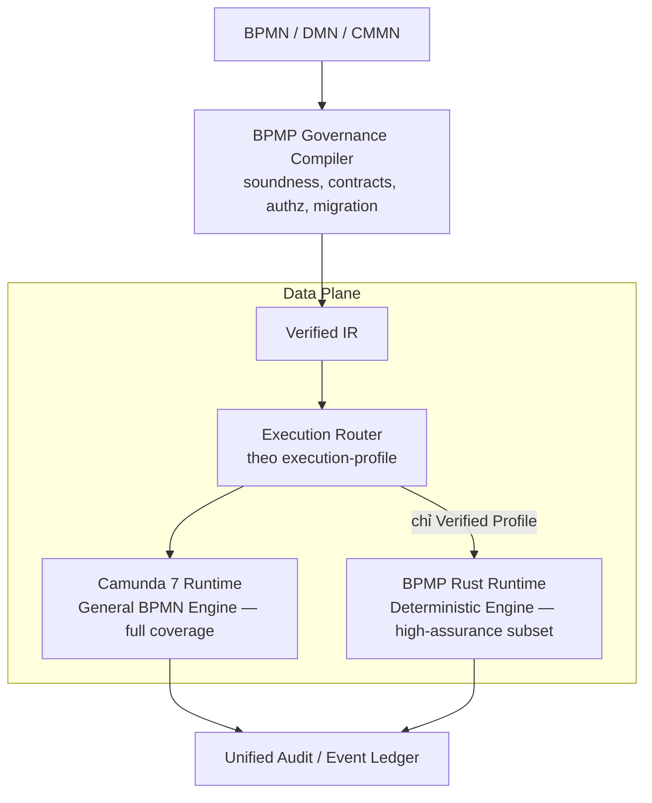
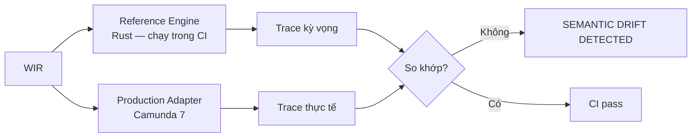
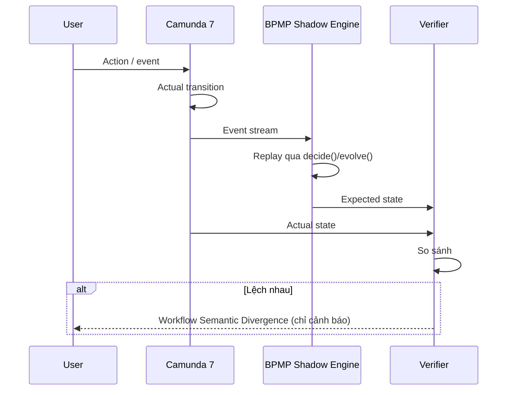
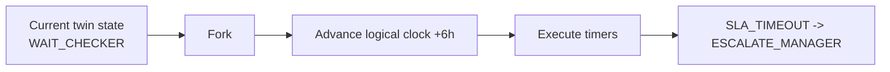
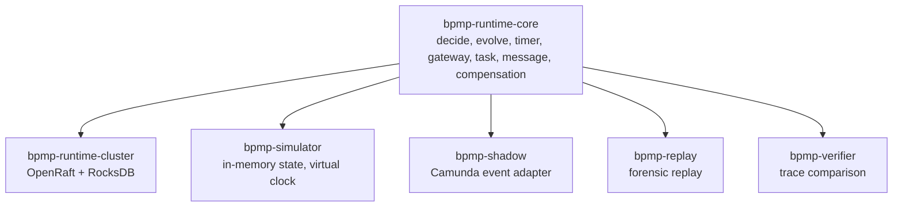
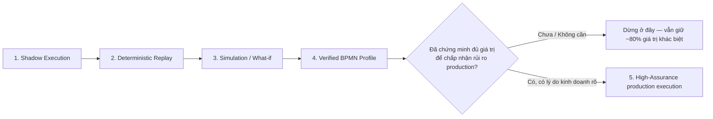

# BPMP Platform — Kiến trúc đề xuất: Shadow / Verification / Simulation Platform

> [!abstract] Vị trí tài liệu này
> Đây là bài thứ ba trong bộ ba tài liệu BPMP. `[[BPMP-Architecture-Technology-Deep-Dive]]` mô tả kiến trúc mục tiêu ban đầu (Rust engine như một Zeebe alternative đầy đủ). `[[BPMP-Architecture-Independent-Review]]` chỉ ra rằng ~75% bề mặt kỹ thuật đó là re-implementation không tạo khác biệt, và đề xuất phương án "surgical" (satellite trên Camunda 7). Tài liệu này ghi lại một **pivot thứ ba**, tổng hợp hơn: **không xoá OpenRaft/RocksDB/Rust engine, mà đổi vai trò của chúng** — từ "cạnh tranh production authority với Camunda 7" sang "Shadow/Verification/Simulation platform chạy song song Camunda 7". Đây hiện là hướng được khuyến nghị mạnh nhất trong 3 phương án.

## 1. Tóm tắt pivot

| | Trước (Deep-Dive gốc) | Sau (pivot này) |
|---|---|---|
| Vai trò Rust engine | Production authority, cạnh tranh trực tiếp Zeebe | Reference semantics, verifier, simulator — Camunda 7 vẫn giữ production authority cho phần lớn workflow |
| Yêu cầu phủ BPMN | Toàn bộ catalog BPMN/DMN/CMMN | Chỉ một **Verified Profile** — tập construct dùng trong workflow tiền (credit approval, payment) |
| Câu chuyện chiến lược | "BPMP thay Camunda" | "BPMP xác minh và mô phỏng những gì Camunda đang chạy" |
| Rủi ro production (DR, schema evolution, tenant isolation, HA) | Áp dụng ngay từ đầu | Chỉ áp dụng nếu/khi triển khai bước 5 (production execution) — có thể trì hoãn vô thời hạn |
| Code OpenRaft/RocksDB hiện có | Phải chứng minh production-grade để thắng Zeebe | Tái sử dụng nguyên vẹn cho Independent Workflow Ledger — bar thấp hơn nhiều |

## 2. Kiến trúc tổng quan



Compiler phân loại mỗi workflow deploy theo `execution-profile`:

```yaml
execution-profile: high-assurance

requirements:
  deterministic: true
  replicated: true
  tamper-evident-audit: true
  fail-closed-authz: true
  replayable: true
```

Workflow thường (leave request, document approval, reporting) → Camunda. Workflow trọng yếu (credit approval, payment authorization, fraud investigation, regulatory workflow) → có thể dùng Verified Profile.

Nếu BA dùng construct compiler không hỗ trợ cho profile này, compiler từ chối rõ ràng thay vì âm thầm hạ chuẩn:

```text
BPMP-E3104
Unsupported construct for HIGH_ASSURANCE execution profile: InclusiveGateway
Suggested execution target: CAMUNDA_7
```

## 3. Năm capability mà deterministic core "cho không" — vì đã có sẵn decide()/evolve()

### 3.1 Reference Execution Engine — semantic oracle chạy trong CI

WIR có hai executor: Reference Engine (Rust) và Production Adapter (Camunda 7). Compiler chạy cả hai trên cùng một scenario test, so sánh trace:



Ví dụ: scenario `amount = 500M` phải cho ra trace `START → VALIDATE → APPROVE → END` ở cả hai bên. Lệch nhau nghĩa là model hoặc engine có bug — bắt được ở CI, trước khi lên production.

### 3.2 Shadow Execution — divergence detection trên production thật

Production vẫn chạy hoàn toàn trên Camunda. Mọi transition được gửi song song sang BPMP Shadow Engine để replay và tính expected state độc lập:



Ví dụ output khi lệch:

```text
Workflow Semantic Divergence
instance: credit-193829
Camunda: APPROVED
BPMP expected: WAITING_L2_APPROVAL
reason: amount > 1,000,000,000 requires L2 approval
```

> [!warning] Invariant bắt buộc
> Shadow Engine **chỉ quan sát, không bao giờ gate hoặc auto-remediate** Camunda ở giai đoạn này. Nếu sau này cân nhắc để Shadow chặn/sửa transition thật, đó là một quyết định kiến trúc hoàn toàn khác (đưa hai engine độc lập vào vị trí phải đồng thuận) — cần ADR riêng, không mặc định.

### 3.3 Digital Twin & What-if simulation

Mỗi process instance thật trên Camunda có một bản twin trên BPMP giữ state tương đương (`WAIT_CHECKER`, policy version, simulated SLA). Twin cho phép fork state, advance virtual clock, và chạy timer để trả lời câu hỏi giả định mà không chạm production:



### 3.4 Process Simulation quy mô lớn (Monte Carlo)

Chạy hàng chục nghìn instance ảo bằng chính `decide()`/`evolve()`, không cần Camunda thật, để hiểu process **trước khi** nó chạy thật — bottleneck, phân phối SLA:

```text
100,000 simulated cases, amount 10M -> 5B
P50 completion: 13h   P95 completion: 38h
23% violate SLA — bottleneck: CHECKER_APPROVAL, expected queue: 3,821 cases
```

Camunda trả lời "execute process đúng luật". BPMP simulation trả lời "hiểu process trước khi chạy" — một câu hỏi khác hẳn.

### 3.5 Historical Replay / Forensics

Với `instance + events + policy_version + config_version + workflow_version`, replay lại từng bước để trả lời "vì sao hồ sơ này được approve":

```text
14:31:01 SUBMITTED maker=abc
14:31:05 CHECKER_ASSIGNED policy=41
14:43:17 APPROVED checker=xyz
Decision: ALLOW — Policy: CREDIT_APPROVAL_V41 — Rule: amount < 1B AND checker.department == maker.department
```

## 4. Capability model / Execution Router

```rust
pub enum ExecutionProfile {
    Camunda,
    Verified,
    Simulation,
    Shadow,
}
```

Kernel dùng chung, các layer trên là các "backend" khác nhau — giống một compiler IR có nhiều codegen target:



## 5. Đánh giá phản biện: capability nào thực sự cần Rust engine độc lập?

Đây là câu hỏi quan trọng nhất chưa được đặt ra trong đề xuất gốc — không phải mọi capability đều justify việc giữ toàn bộ stack Rust/Raft/RocksDB.

| Capability | Có bắt buộc cần Rust engine độc lập không? | Vì sao |
|---|---|---|
| Reference Engine / semantic oracle CI | **Có** | Cần một implementation độc lập để so sánh — dùng chính Camunda làm reference thì mất ý nghĩa |
| Shadow Execution | **Có** | Cần state tính độc lập song song với Camunda thật |
| Digital Twin / What-if | **Có** | Cần fork state + advance virtual clock mà không chạm production Camunda |
| Process Simulation quy mô lớn | **Có** | Cần throughput hàng chục nghìn instance ảo/giây — Camunda không thiết kế cho việc này |
| Historical Replay / Forensics | **Một phần** | Trùng lặp đáng kể với "Config/policy snapshot & replay-traceability service" (satellite trên Camunda 7 alone, đã đề xuất ở `[[BPMP-Architecture-Independent-Review]]` mục 4.7) — chỉ cần full deterministic replay nếu muốn tái dựng **state trung gian** chính xác từng bước, không chỉ đọc lại log sự kiện đã có |
| High-assurance production execution (bước 5) | **Chỉ nếu quyết định làm** | Đây là phần duy nhất thực sự cần production-grade HA/DR/schema-evolution — nên cân nhắc kỹ ở mục 7 |

## 6. Rủi ro mới phát sinh từ chính kiến trúc này

Đây không phải rủi ro lặp lại từ `[[BPMP-Architecture-Independent-Review]]` — đây là rủi ro **riêng của pivot này**.

### 6.1 Semantic drift là con dao hai lưỡi

Shadow Execution chỉ đúng nếu Rust reference semantics luôn đồng bộ với hành vi thật của Camunda 7. Camunda 7 patch/bugfix không nằm trong tầm kiểm soát của bạn. Mỗi lần Camunda 7 thay đổi một edge case (đặc biệt trong FEEL expression evaluation của DMN) mà reference chưa cập nhật, Verifier báo divergence **sai**. Vài lần false alarm liên tiếp là đủ để đội compliance bắt đầu bỏ qua cảnh báo thật — cần một quy trình đồng bộ semantics rõ ràng mỗi khi nâng cấp Camunda 7, không chỉ code review thông thường.

### 6.2 Ground truth ambiguity khi divergence xảy ra

Chưa có tuyên bố tường minh: Shadow luôn chỉ quan sát, hay có kịch bản nào expected state được dùng để gate/auto-remediate Camunda? Nếu để ngỏ, sớm muộn sẽ có áp lực nghiệp vụ muốn "tự động chặn khi phát hiện lệch" — lúc đó bạn tạo ra bài toán hai engine độc lập phải đồng thuận, một dạng Byzantine-lite problem không hề nhỏ. Cần ghi rõ trong ADR: **observe-only, không gate**, ít nhất ở giai đoạn đầu.

### 6.3 Scope thu hẹp nhưng correctness bar không thu hẹp

Verified Profile giảm số construct phải hỗ trợ, nhưng đúng những construct đó phục vụ workflow tiền (credit approval, payment authorization, fraud investigation) — nơi một lỗi semantics đắt nhất. Rigor test (property-based test, formal method, chaos test) cho phần Verified Profile cần **cao hơn**, không phải thấp hơn, so với khi còn định phủ toàn bộ BPMN catalog.

### 6.4 Simulation chỉ đáng tin nếu được calibrate và backtest

Số liệu như "checker processing: 2h ± ..." cần fit từ dữ liệu lịch sử thật (Camunda history table), và phải backtest — so dự đoán quá khứ với kết quả thật xảy ra sau đó — trước khi dùng cho quyết định capacity planning thật. Nếu không, đây là con số "trông khoa học" nhưng có thể sai lệch nguy hiểm.

### 6.5 Bus factor không giảm — chỉ đổi lý do tồn tại

6 crate (`runtime-core`, `runtime-cluster`, `simulator`, `shadow`, `replay`, `verifier`) đều cần giữ đồng bộ semantics với Camunda 7 mãi mãi. Pivot này làm câu chuyện chiến lược mạnh hơn hẳn, nhưng **không** giảm khối lượng engineering phải maintain lâu dài. Risk bus-factor ở `[[BPMP-Architecture-Independent-Review]]` mục 5.9 vẫn nguyên vẹn.

## 7. Khuyến nghị mạnh nhất: bước 5 nên là optional, không phải endpoint mặc định

4 capability đầu (Reference Engine, Shadow, Digital Twin, Simulation) **không bao giờ chạm production authority**. Hậu quả tệ nhất của một bug ở đó là cảnh báo sai hoặc dự đoán sai — không phải duyệt nhầm một khoản vay. Điều này có nghĩa: toàn bộ risk register nặng nhất từ `[[BPMP-Architecture-Independent-Review]]` (DR/multi-region, WIR schema evolution xuyên nâng cấp Engine binary cho instance chạy nhiều tháng, tenant isolation blast radius, HA production) **chỉ áp dụng cho bước 5**.



**Khuyến nghị cụ thể:** ghi tường minh vào ADR rằng bước 5 là quyết định riêng, được re-evaluate sau khi 1-4 đã chứng minh giá trị bằng dữ liệu thật (bao nhiêu lần Shadow bắt được bug thật, simulation dự đoán đúng bao nhiêu %) — không phải điểm đến mặc định của roadmap.

## 8. Roadmap và decision gate

| Ưu tiên | Capability | Chạm production authority? | Gate trước khi sang bước tiếp |
|---|---|---|---|
| 1 | Shadow Execution | Không | Đồng bộ semantics với Camunda 7 hiện tại; xác nhận observe-only |
| 2 | Deterministic Replay / Forensics | Không | So sánh chi phí với satellite Camunda-only (mục 5); chỉ làm full nếu satellite không đủ |
| 3 | Simulation / What-if | Không | Có pipeline calibrate + backtest từ dữ liệu lịch sử thật trước khi dùng cho quyết định |
| 4 | Verified BPMN Profile (chạy CI, chưa production) | Không | Property-based test + formal verification cho đúng tập construct đã chọn |
| 5 | High-Assurance production execution | **Có** | ADR riêng, chỉ mở khi 1-4 đã chứng minh giá trị bằng số liệu, chấp nhận toàn bộ risk register production ở `[[BPMP-Architecture-Independent-Review]]` |

## 9. Liên kết

- [[BPMP-Architecture-Technology-Deep-Dive]] — kiến trúc mục tiêu gốc
- [[BPMP-Architecture-Independent-Review]] — phản biện, gap analysis, satellite alternatives trên Camunda 7
- [[concepts/consensus-raft-paxos]]
- [[concepts/consistency-models-spectrum]]
