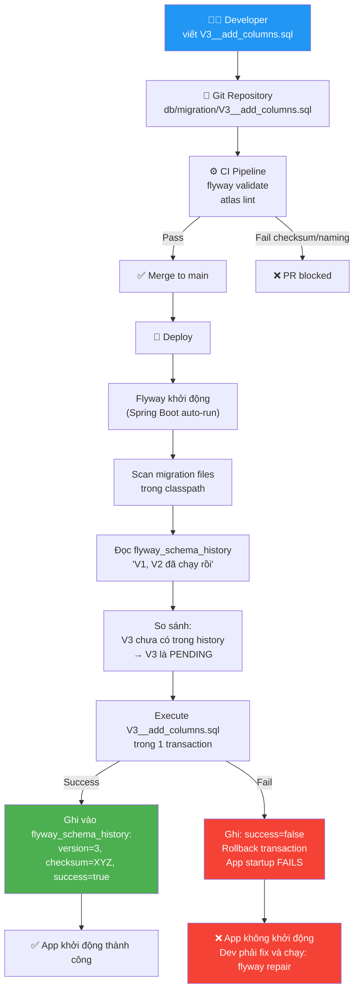

# Database Migration — Giải thích từ đầu cho người mới

> Bài này giải thích **tại sao** migration tools tồn tại, **cơ chế thực sự** bên trong, và những khái niệm dễ nhầm nhất — trước khi đọc các bài chuyên sâu.

**Series**: [[DBMigration-MOC]] | **Next**: [[DBMigration-01-Flyway-Deep-Dive]]

---

## 1. Vấn đề gốc rễ — Tại sao cần migration tool?

Hãy bắt đầu bằng câu chuyện thực tế.

### Tình huống không có migration tool

Bạn và 5 người trong team đang phát triển PDMS. Database đang có bảng `document`.

**Tháng 1**: Dev A thêm cột `priority` vào bảng `document` trên máy local của mình, rồi viết code Java dùng cột đó. Anh ta gửi code lên Git, nhưng **không gửi kèm SQL**. Dev B pull code về, chạy app → lỗi `column "priority" does not exist`. Dev B mất 30 phút debug mới hiểu ra vấn đề.

**Tháng 2**: Sắp golive. Lead dev hỏi: "Staging đang thiếu gì so với prod?". Không ai biết chắc. Team phải ngồi compare thủ công 2-4 giờ.

**Tháng 3**: Golive xong, phát hiện thiếu 2 stored procedure. App lỗi production. Rollback thủ công trong đêm.

Đây chính xác là `GOLIVE PAIN` mà PDMS đang gặp.

### Migration tool giải quyết bằng cách nào?

Ý tưởng cốt lõi rất đơn giản:

> **Mỗi thay đổi database phải được viết thành file SQL, đặt tên có version, và commit cùng code.**

```
Không có migration tool:              Có migration tool:
─────────────────────                 ─────────────────────
Dev A sửa DB trên máy local     →     Dev A viết V2__add_priority.sql
Dev B không biết gì             →     Dev B chạy: flyway migrate
Dev B tự debug                  →     Flyway apply V2 tự động
Golive: compare thủ công        →     Golive: flyway info → thấy ngay
```

---

## 2. Flyway hoạt động thế nào — Từng bước

### Lần đầu tiên Flyway chạy

```
Flyway khởi động
    │
    ├─ Nhìn vào DB → "Bảng flyway_schema_history có chưa?"
    │                    │
    │               Chưa có → Tạo bảng tracking
    │               Rồi có  → Đọc lịch sử
    │
    ├─ Scan thư mục migration/ → Tìm tất cả file V*.sql và R*.sql
    │
    ├─ So sánh: "File nào đã chạy? File nào chưa?"
    │
    └─ Chạy các file chưa chạy, theo thứ tự version
```

### flyway_schema_history — "Nhật ký" của Flyway

Bảng này là tất cả. Flyway không "nhớ" gì ngoài bảng này.

```sql
-- Đây là bảng Flyway tự tạo khi chạy lần đầu
-- Bạn không cần tạo, không cần sửa thủ công

SELECT installed_rank, version, description, script, checksum, success
FROM flyway_schema_history
ORDER BY installed_rank;

-- Ví dụ output thực tế:
-- rank | version | description            | script                      | checksum   | success
-- ─────┼─────────┼────────────────────────┼─────────────────────────────┼────────────┼─────────
--  1   | 1       | Baseline existing      | V1__Baseline_existing.sql   | -782341234 | true
--  2   | 1.1     | Add document tables    | V1_1__Add_document_tables.sql| 1234567890 | true
--  3   | 2       | Add tenant support     | V2__Add_tenant_support.sql  | 987654321  | true
--  4   | null    | SP validate document   | R__SP_validate_document.sql | 112233445  | true  ← Repeatable
```

**`checksum`** là gì? Khi Flyway chạy file `V2__Add_tenant_support.sql`, nó tính một con số đặc trưng của nội dung file đó (CRC32). Con số này được lưu vào bảng. Lần sau Flyway chạy, nó tính lại checksum của file và so sánh. Nếu khác → ai đó đã sửa file → lỗi ngay.

Đây chính là lý do tại sao **"Không sửa file đã chạy"** là rule số 1.

---

## 3. Giải thích chi tiết bảng Rules — Từng dòng

Bảng trong bài 01 có dòng này gây nhầm lẫn:

```
Version phải tăng dần | V1 → V2 → V3, không nhảy cóc (V1 → V3 ổn, bỏ V2 ổn)
```

### "Bỏ V2 ổn" thực sự nghĩa là gì?

Flyway **không yêu cầu version phải liên tục**. Nó chỉ yêu cầu version sau phải **lớn hơn** version đã chạy gần nhất.

```
Ví dụ 1: V1, V3 (bỏ V2) → HỢP LỆ
──────────────────────────────────
Bạn có files: V1__init.sql, V3__add_feature.sql
Flyway chạy: V1 trước, V3 sau
Không có V2 → Flyway không phàn nàn, chạy bình thường

Ví dụ 2: V1, V2, V4 (bỏ V3) → HỢP LỆ
──────────────────────────────────────
Bạn có files: V1__init.sql, V2__second.sql, V4__fourth.sql
Flyway chạy: V1 → V2 → V4, bỏ qua V3 vì không có file
```

**Tại sao lại được phép?** Trong team đông người, dev A đang làm feature cần V2, dev B đang làm feature cần V3. Nếu feature của B xong trước, B cần tạo file migration. B chọn số V3 (không bận tâm V2 chưa có). Sau đó A xong, tạo V2. Khi merge: V2 và V3 đều tồn tại, Flyway chạy V2 trước V3 — mọi thứ ổn.

```
Ví dụ 3: V1, V3, V2 (V2 xuất hiện SAU khi V3 đã chạy) → VẤN ĐỀ
──────────────────────────────────────────────────────────────────
Flyway đã chạy V3 rồi
Bây giờ file V2 xuất hiện (dev A merge muộn)
Mặc định: Flyway báo lỗi "out-of-order migration detected"
Cấu hình out-of-order: true → Flyway chạy V2 sau V3 (nguy hiểm trên prod)
```

---

### "Không sửa file đã chạy" — Tại sao nghiêm trọng?

```
Tình huống:
──────────
1. Bạn tạo V2__create_table.sql với nội dung:
   CREATE TABLE foo (id INT);
   
2. Flyway chạy trên staging → OK, lưu checksum = 12345

3. Bạn phát hiện lỗi, sửa file thành:
   CREATE TABLE foo (id BIGINT);  ← đổi INT thành BIGINT

4. Flyway chạy lần tiếp theo:
   - Đọc lịch sử: V2 đã chạy rồi, checksum = 12345
   - Tính checksum file hiện tại: 67890
   - 12345 ≠ 67890 → LỖI: "Validate failed: Migration checksum mismatch"
   
Lý do rule này tồn tại:
   Staging đã tạo bảng foo với cột id INT
   Production cũng đã tạo foo với id INT (giống nhau)
   Nếu bạn sửa file, Flyway trên prod sẽ không biết sửa hay không sửa
   → Staging và prod có thể đi lệch nhau mà không hay
   
Cách đúng:
   Tạo V3__alter_foo_id_to_bigint.sql:
   ALTER TABLE foo ALTER COLUMN id TYPE BIGINT;
```

---

### "Repeatable re-run khi file thay đổi" — Cơ chế

File `R__` khác hoàn toàn với `V__`:

```
V__ (Versioned):              R__ (Repeatable):
────────────────              ──────────────────
Chạy đúng 1 lần              Chạy lại mỗi khi checksum thay đổi
Có version number             KHÔNG có version number
Thứ tự: theo version          Thứ tự: theo tên file (alphabet)
Dùng cho: DDL, data           Dùng cho: stored procs, views, functions
```

```
Ví dụ lifecycle của R__SP_validate.sql:
────────────────────────────────────────
Lần 1: File có checksum = AAA → Flyway chạy SP, lưu checksum AAA
Lần 2: File không đổi → Flyway thấy checksum còn AAA → BỎ QUA
Lần 3: Bạn sửa logic SP → checksum đổi thành BBB
        → Flyway thấy BBB ≠ AAA → CHẠY LẠI file
Lần 4: File không đổi → checksum vẫn BBB → BỎ QUA
```

Đây là lý do stored procedures được đặt trong file `R__`: mỗi lần sửa logic SP, chỉ cần sửa file, commit, Flyway tự detect và re-apply. Không cần tạo file migration mới.

---

### "Version có thể có dấu chấm" — Cách Flyway so sánh

```
V1        → [1]
V1.2      → [1, 2]
V1.2.3    → [1, 2, 3]
V2024.11  → [2024, 11]

So sánh từ trái sang phải:
V1.2 < V1.10   (vì 2 < 10, không phải string sort!)
V1.9 < V2.0    (vì segment đầu: 1 < 2)
V1.2 < V1.2.1  (vì [1,2] < [1,2,1] — thêm segment là lớn hơn)
```

Cạm bẫy phổ biến nếu không biết:

```
❌ Nếu dùng tên file kiểu string:
   V1, V10, V2 → sort alphabetically: V1 < V10 < V2
   Flyway sẽ chạy: V1 → V10 → V2 (SAI ORDER!)

✅ Flyway không sort string — nó parse số:
   V1  = [1]
   V2  = [2]
   V10 = [10]
   Order đúng: V1 → V2 → V10
```

---

## 4. Sơ đồ toàn bộ luồng — Từ file đến database



---

## 5. Versioned vs Repeatable — Khi nào dùng cái nào?

```
Câu hỏi đơn giản để quyết định:
"Nếu chạy lại file này 2 lần, có lỗi không?"

Nếu có lỗi → dùng V__ (chạy 1 lần thôi)
Nếu không lỗi (idempotent) → có thể dùng R__
```

```sql
-- Ví dụ file V__ (chạy 2 lần sẽ lỗi):
CREATE TABLE document (...);  -- Lần 2: ERROR: relation "document" already exists

-- Ví dụ file R__ (chạy 2 lần vẫn OK):
CREATE OR REPLACE FUNCTION sp_validate(...)  -- OR REPLACE = idempotent
LANGUAGE plpgsql AS $$ ... $$;
```

```
V__ dùng cho:                     R__ dùng cho:
──────────────                    ─────────────
CREATE TABLE                      CREATE OR REPLACE FUNCTION
ALTER TABLE                       CREATE OR REPLACE PROCEDURE
CREATE INDEX                      CREATE OR REPLACE VIEW
INSERT lookup data                CREATE OR REPLACE TRIGGER
DROP TABLE (không khuyến khích)   REFRESH MATERIALIZED VIEW
```

---

## 6. Baseline — Khái niệm quan trọng nhất khi onboard

**Baseline** giải quyết câu hỏi: "Nếu DB đã có 200 bảng rồi, làm sao bắt đầu dùng Flyway mà không bị Flyway cố tạo lại những gì đã có?"

```
Tình huống PDMS hiện tại:
──────────────────────────
DB production đang có 200 bảng, 50 stored procs
Chưa bao giờ dùng Flyway

Nếu không baseline:
Flyway scan folder → thấy V1__create_200_tables.sql
Flyway check history → không có gì → coi V1 là PENDING
Flyway chạy V1 → ERROR: table "document" already exists!
(Vì bảng đã tồn tại rồi!)

Với baseline:
"flyway baseline" → Flyway ghi vào history: "V1 = BASELINE"
Ý nghĩa: "Tao coi như V1 đã chạy rồi, đừng chạy nữa"
Flyway chỉ chạy V2, V3, V4... (những thứ mới sau baseline)
```

```
Timeline baseline:
─────────────────
           Baseline point
               │
───[V1]────────┼────[V2]────[V3]────[V4]────▶ thời gian
   (skip,      │     (run)   (run)   (run)
   đã có sẵn)  │
               │
        flyway baseline chạy ở đây
        Đánh dấu V1 = đã xong
```

---

## 7. Những lỗi newbie hay gặp — Và cách fix

### Lỗi 1: Checksum mismatch

```
ERROR: Validate failed:
Migration checksum mismatch for migration version 2
-> Applied to database : 12345678
-> Resolved locally    : 87654321

Nguyên nhân: Ai đó sửa file V2__something.sql sau khi đã chạy

Fix:
Option A (Đúng nguyên tắc): Tạo file V{next}__fix_the_issue.sql
Option B (Chỉ khi chắc chắn thay đổi không ảnh hưởng gì):
         flyway repair  ← cập nhật checksum trong DB theo file hiện tại
         CẢNH BÁO: repair chỉ dùng khi thực sự hiểu tác động
```

### Lỗi 2: Migration failed — App không khởi động được

```
ERROR: Migration V3__add_columns.sql failed!
Please restore backups and roll back accordingly

Chuyện gì đã xảy ra:
1. Flyway bắt đầu chạy V3
2. SQL trong V3 bị lỗi (typo, vi phạm constraint...)
3. Flyway rollback transaction → DB như chưa chạy V3
4. Flyway ghi vào history: V3 = FAILED (success = false)
5. Lần sau Flyway khởi động: thấy V3 failed → từ chối chạy tiếp

Fix:
1. Sửa lỗi SQL trong V3__add_columns.sql
2. flyway repair  ← xóa record FAILED khỏi history
3. flyway migrate  ← thử lại
```

### Lỗi 3: Out-of-order migration

```
ERROR: Detected resolved migration not applied to database: 1.5
Applied migrations resolve to: 1, 1.1, 1.2, 1.3, 2
                                                    ↑
                               V1.5 đột nhiên xuất hiện SAU khi V2 đã chạy

Nguyên nhân: Dev A tạo V1.5 và merge muộn, sau khi V2 đã deploy

Fix ngắn hạn (DEV chỉ):
spring.flyway.out-of-order: true  → cho phép V1.5 chạy sau V2

Fix đúng (production):
Rename V1.5 → V{next} (VD: V2.1) và tạo PR mới
```

### Lỗi 4: Repeatable file bị lỗi nhưng SP cũ vẫn chạy

```
Situation:
R__SP_validate.sql có lỗi → Flyway báo lỗi khi chạy
Nhưng SP cũ (version trước) vẫn đang chạy được trong DB

Tại sao:
Flyway chạy R__SP_validate.sql trong 1 transaction
Nếu lỗi → transaction rollback → SP trong DB KHÔNG thay đổi
→ Version cũ của SP vẫn còn

Fix:
1. Sửa lỗi trong R__SP_validate.sql
2. flyway repair (nếu có FAILED record)
3. flyway migrate → chạy lại file đã sửa
```

---

## 8. Mental Model — Cách nghĩ đúng về migration

```
Migration tool = "Git for Database"

Git:                              Flyway:
────                              ───────
Mỗi commit = 1 thay đổi code     Mỗi file V__ = 1 thay đổi DB
.git/history = lịch sử commits   flyway_schema_history = lịch sử migrations
git log = xem commits đã chạy    flyway info = xem migrations đã chạy
git pull = lấy code mới          flyway migrate = apply migrations mới
Không sửa commit cũ              Không sửa file V__ đã chạy
git revert = tạo commit mới      Rollback = tạo file V__ mới (reverse SQL)
```

```
Repeatable (R__) = "Terraform apply"

Terraform:                        Flyway Repeatable:
──────────                        ──────────────────
Khai báo desired state            Stored proc = desired state
terraform apply = sync to state   flyway migrate = sync to latest R__ file
Mỗi lần apply = idempotent        Mỗi lần chạy = idempotent (OR REPLACE)
Chạy lại khi file thay đổi       Chạy lại khi file thay đổi
```

---

## 9. Quick Reference — Lệnh hay dùng nhất

```bash
# Xem tình trạng: file nào đã chạy, file nào pending
flyway info

# Apply tất cả pending migrations
flyway migrate

# Validate: file migration có bị sửa không?
flyway validate

# Fix sau khi migration fail
flyway repair

# Baseline: đánh dấu DB hiện tại là "đã migration xong đến V1"
flyway baseline

# ⚠️ NGUY HIỂM: DROP tất cả objects (chỉ dùng trên dev)
flyway clean
```

```bash
# Spring Boot: Flyway tự chạy khi app start
# Nhưng nếu muốn chạy manual:
mvn flyway:info
mvn flyway:migrate
mvn flyway:validate
```

---

## 10. Checklist trước khi viết migration đầu tiên

```
✅ Xác định version hiện tại cao nhất là bao nhiêu?
   flyway info | grep -E "Success|Baseline" | tail -1

✅ File đặt đúng thư mục chưa?
   V__ → src/main/resources/db/migration/
   R__ → src/main/resources/db/stored_procedures/

✅ Naming đúng convention chưa?
   V{version}__{description}.sql  (double underscore)
   R__{prefix}_{name}.sql

✅ SQL có idempotent không?
   CREATE TABLE → thêm IF NOT EXISTS
   INSERT → thêm ON CONFLICT DO NOTHING
   Stored proc → dùng CREATE OR REPLACE

✅ Test local trước khi commit:
   flyway migrate → OK?
   flyway validate → OK?
   App start → OK?

✅ Nếu ALTER TABLE lớn:
   Bước 1: ADD COLUMN nullable
   Bước 2: UPDATE fill data
   Bước 3: SET NOT NULL
   Ba bước = ba file migration riêng (an toàn hơn)
```

---

**Next**: Đọc [[DBMigration-01-Flyway-Deep-Dive]] với những gì đã hiểu ở đây.

---

#flyway #database-migration #newbie #concepts #postgresql #spring-boot #checklist
