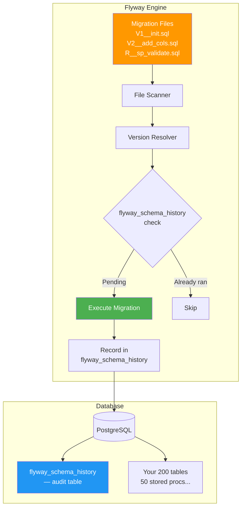
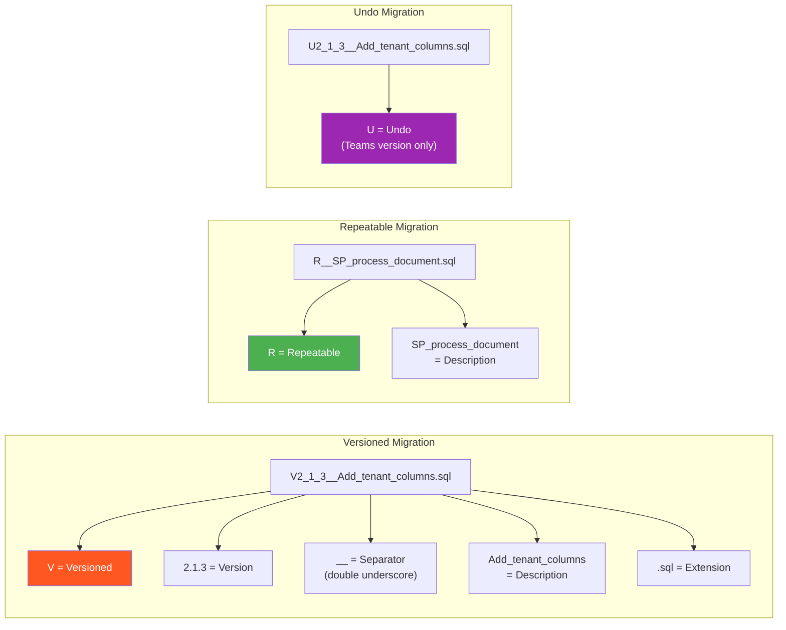
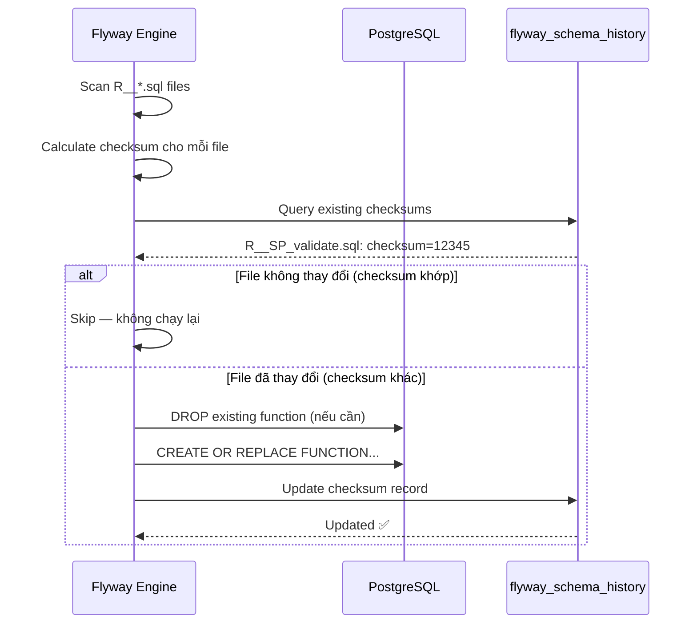
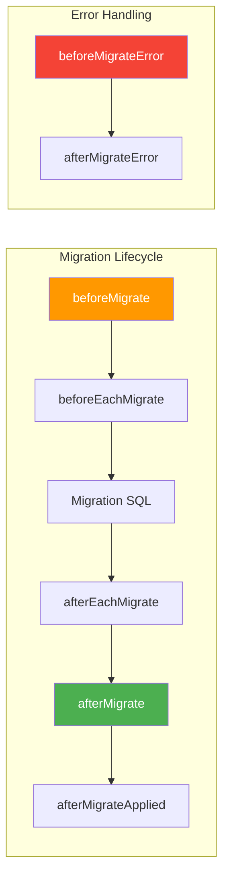
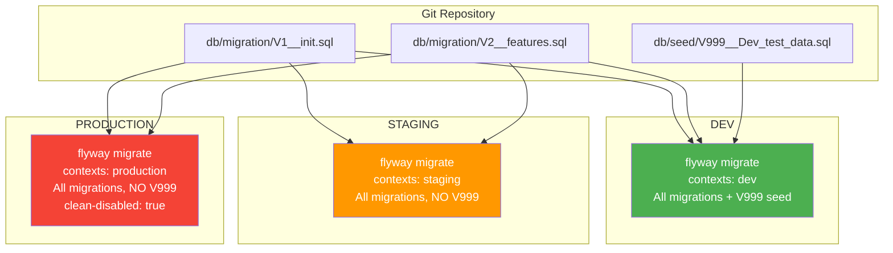

# Flyway Deep Dive — Cơ chế hoạt động & Enterprise Patterns

> **Flyway**: Migration tool SQL-first, versioned, đơn giản nhưng mạnh mẽ. Triết lý: **"Plain SQL is king"** — không wrapper, không XML, không magic.

**Series**: [[DBMigration-MOC]] | **Next**: [[DBMigration-02-AtlasGo-Deep-Dive]]

---

## 1. Kiến trúc tổng quan



---

## 2. flyway_schema_history — Bảng tracking

```sql
-- Flyway tự tạo khi chạy lần đầu
CREATE TABLE flyway_schema_history (
    installed_rank  INT           NOT NULL,  -- thứ tự chạy
    version         VARCHAR(50),             -- "1", "1.1", "2.3.1"
    description     VARCHAR(200)  NOT NULL,  -- từ tên file
    type            VARCHAR(20)   NOT NULL,  -- SQL, JDBC, BASELINE...
    script          VARCHAR(1000) NOT NULL,  -- tên file
    checksum        INT,                     -- CRC32 của file
    installed_by    VARCHAR(100)  NOT NULL,  -- DB user
    installed_on    TIMESTAMP     NOT NULL DEFAULT NOW(),
    execution_time  INT           NOT NULL,  -- milliseconds
    success         BOOLEAN       NOT NULL,  -- true/false
    PRIMARY KEY (installed_rank)
);
```

### Ví dụ dữ liệu thực tế

```
installed_rank | version | description              | script                           | success
───────────────┼─────────┼──────────────────────────┼──────────────────────────────────┼────────
1              | 1       | Baseline existing schema | V1__Baseline_existing_schema.sql  | true
2              | 1.1     | Add document tables      | V1_1__Add_document_tables.sql     | true
3              | 1.2     | Add indexes              | V1_2__Add_indexes.sql             | true
4              | null    | stored proc validate     | R__SP_validate_document.sql       | true  ← Repeatable
5              | 2       | Tenant support columns   | V2__Tenant_support_columns.sql    | true
```

---

## 3. Naming Convention — Cốt lõi của Flyway



### Rules quan trọng

| Rule | Chi tiết |
|------|---------|
| Version phải tăng dần | V1 → V2 → V3, không nhảy cóc (V1 → V3 ổn, bỏ V2 ổn) |
| Không sửa file đã chạy | Checksum mismatch → error |
| Repeatable re-run khi file thay đổi | Dùng cho views, stored procs |
| Version có thể có "." | V1.2.3, V2024.11.20 đều hợp lệ |

---

## 4. Dependency & Spring Boot Configuration

### Maven

```xml
<dependency>
    <groupId>org.flywaydb</groupId>
    <artifactId>flyway-core</artifactId>
    <!-- Version do Spring Boot manage -->
</dependency>

<!-- PostgreSQL specific extensions (Flyway 10+) -->
<dependency>
    <groupId>org.flywaydb</groupId>
    <artifactId>flyway-database-postgresql</artifactId>
</dependency>

<dependency>
    <groupId>org.postgresql</groupId>
    <artifactId>postgresql</artifactId>
    <scope>runtime</scope>
</dependency>
```

### application.yml — Full Reference

```yaml
spring:
  datasource:
    url: jdbc:postgresql://localhost:5432/pdms_db
    username: ${DB_USERNAME}
    password: ${DB_PASSWORD}

  flyway:
    # === CƠ BẢN ===
    enabled: true
    locations:
      - classpath:db/migration           # Versioned migrations
      - classpath:db/stored_procedures   # Repeatable migrations (stored procs)
      - classpath:db/seed/{vendor}       # Vendor-specific paths

    # === CREDENTIALS (dedicated user) ===
    url: jdbc:postgresql://localhost:5432/pdms_db
    user: ${FLYWAY_USERNAME:flyway_user}
    password: ${FLYWAY_PASSWORD}

    # === BASELINE (quan trọng cho project đang giữa chừng!) ===
    baseline-on-migrate: false           # true chỉ khi onboard DB có sẵn
    baseline-version: "1"               # Version baseline
    baseline-description: "Existing schema before Flyway"

    # === BEHAVIOR ===
    default-schema: public
    schemas:
      - public
      - iam                              # Multi-schema support
    table: flyway_schema_history         # Tên bảng tracking

    # === SAFETY ===
    clean-disabled: true                 # KHÔNG BAO GIỜ false trên prod!
    clean-on-validation-error: false

    # === VALIDATION ===
    validate-on-migrate: true            # Validate trước khi chạy
    validate-migration-naming: true      # Validate naming convention
    out-of-order: false                  # Không cho phép version cũ chạy sau

    # === PLACEHOLDERS (biến trong SQL) ===
    placeholders:
      schema: public
      default_tenant: VPBANK
      batch_size: "10000"
    placeholder-replacement: true
    placeholder-prefix: "${{"          # Tránh conflict với Spring ${...}
    placeholder-suffix: "}}"

    # === PERFORMANCE ===
    connect-retries: 3
    connect-retries-interval: 10
```

---

## 5. File Structure — 200 Tables Enterprise

```
src/main/resources/
└── db/
    ├── migration/                          ← Versioned (thứ tự chạy cố định)
    │   ├── V1__Baseline_existing_schema.sql     ← QUAN TRỌNG: baseline khi onboard
    │   ├── V1_1__Create_lookup_tables.sql
    │   ├── V1_2__Create_core_document_tables.sql
    │   ├── V1_3__Create_credit_tables.sql
    │   ├── V1_4__Create_iam_tables.sql
    │   ├── V1_5__Create_audit_tables.sql
    │   ├── V1_6__Add_foreign_keys.sql
    │   ├── V1_7__Create_indexes.sql
    │   ├── V1_8__Seed_lookup_data.sql
    │   ├── V2__Add_tenant_support.sql           ← Sprint/release tiếp theo
    │   ├── V2_1__Add_tsdb_module_tables.sql
    │   └── V3__IAM_service_migration.sql
    │
    ├── stored_procedures/                  ← Repeatable (re-run khi file thay đổi)
    │   ├── R__001_SP_validate_document.sql
    │   ├── R__002_SP_process_batch.sql
    │   ├── R__003_FN_generate_warehouse_code.sql
    │   ├── R__004_FN_calculate_document_status.sql
    │   └── R__050_VIEW_document_summary.sql
    │
    └── seed/                               ← Context-specific data
        ├── V1_9__Seed_dev_test_data.sql    ← Chỉ chạy trên dev/staging
        └── afterMigrate.sql                ← Hook: chạy sau mỗi migrate
```

---

## 6. Versioned Migration — Patterns

### DDL cơ bản

```sql
-- V1_2__Create_core_document_tables.sql
-- Flyway chạy trong 1 transaction per file (PostgreSQL)

-- Tạo extension trước
CREATE EXTENSION IF NOT EXISTS "uuid-ossp";
CREATE EXTENSION IF NOT EXISTS "pgcrypto";

-- Core document table
CREATE TABLE IF NOT EXISTS document (
    id              UUID        NOT NULL DEFAULT gen_random_uuid(),
    document_code   VARCHAR(50) NOT NULL,
    case_id         UUID        NOT NULL,
    warehouse_id    UUID        NOT NULL,
    status_id       BIGINT      NOT NULL,
    tenant_code     VARCHAR(20) NOT NULL DEFAULT '${default_tenant}',
    priority        INT         NOT NULL DEFAULT 0,
    -- Audit
    created_by      VARCHAR(100),
    created_at      TIMESTAMPTZ NOT NULL DEFAULT NOW(),
    updated_by      VARCHAR(100),
    updated_at      TIMESTAMPTZ,
    -- Soft delete
    deleted         BOOLEAN     NOT NULL DEFAULT FALSE,
    deleted_at      TIMESTAMPTZ,
    deleted_by      VARCHAR(100),
    CONSTRAINT pk_document PRIMARY KEY (id),
    CONSTRAINT uq_document_code UNIQUE (document_code)
);

COMMENT ON TABLE document IS 'Hồ sơ vật lý — core table PDMS';
COMMENT ON COLUMN document.tenant_code IS 'Mã tenant cho multi-tenant support';
```

### ALTER TABLE — 3 bước an toàn

```sql
-- V2__Add_tenant_support.sql
-- Zero-downtime: add nullable trước, fill sau, add constraint cuối

-- Step 1: Add nullable (fast, không lock table)
ALTER TABLE document ADD COLUMN IF NOT EXISTS tenant_code VARCHAR(20);
ALTER TABLE credit_case ADD COLUMN IF NOT EXISTS tenant_code VARCHAR(20);
ALTER TABLE warehouse ADD COLUMN IF NOT EXISTS tenant_code VARCHAR(20);

-- Step 2: Fill data theo batch (tránh lock lâu)
DO $$
DECLARE
    batch_size  INT := 10000;
    rows_done   INT;
BEGIN
    -- Fill document
    LOOP
        UPDATE document SET tenant_code = 'VPBANK'
        WHERE tenant_code IS NULL
          AND id IN (SELECT id FROM document WHERE tenant_code IS NULL LIMIT batch_size);
        GET DIAGNOSTICS rows_done = ROW_COUNT;
        EXIT WHEN rows_done = 0;
        PERFORM pg_sleep(0.05);
    END LOOP;

    -- Fill credit_case
    UPDATE credit_case SET tenant_code = 'VPBANK' WHERE tenant_code IS NULL;

    -- Fill warehouse
    UPDATE warehouse SET tenant_code = 'VPBANK' WHERE tenant_code IS NULL;
END $$;

-- Step 3: Add NOT NULL constraint (nhanh sau khi đã fill)
ALTER TABLE document ALTER COLUMN tenant_code SET NOT NULL;
ALTER TABLE document ALTER COLUMN tenant_code SET DEFAULT 'VPBANK';
ALTER TABLE credit_case ALTER COLUMN tenant_code SET NOT NULL;
ALTER TABLE warehouse ALTER COLUMN tenant_code SET NOT NULL;
```

### Index migration — CONCURRENT

```sql
-- V1_7__Create_indexes.sql
-- Flyway mặc định dùng transaction, nhưng CREATE INDEX CONCURRENTLY
-- KHÔNG thể trong transaction → phải dùng flywayRepair hoặc non-transactional

-- Với Flyway: dùng annotation đặc biệt
-- @formatter:off

-- Sử dụng DO block hoặc cấu hình nonTransactional migration

CREATE INDEX IF NOT EXISTS idx_document_status_tenant
    ON document(status_id, tenant_code)
    WHERE deleted = false;

CREATE INDEX IF NOT EXISTS idx_document_code_search
    ON document(document_code);

CREATE INDEX IF NOT EXISTS idx_document_created_at
    ON document(created_at DESC)
    WHERE deleted = false;

-- Composite index cho common queries
CREATE INDEX IF NOT EXISTS idx_document_case_status
    ON document(case_id, status_id, deleted);
```

---

## 7. Repeatable Migrations — Stored Procedures

Đây là **killer feature** của Flyway cho dự án nhiều stored procs:



### Pattern cho stored procedure file

```sql
-- R__001_SP_validate_document.sql
-- "R__" prefix = Repeatable
-- "001_" prefix = đảm bảo thứ tự nếu có dependency

-- Luôn dùng CREATE OR REPLACE để idempotent
CREATE OR REPLACE FUNCTION sp_validate_document_batch(
    p_batch_id      UUID,
    p_tenant_code   VARCHAR(20),
    p_batch_size    INT DEFAULT 1000
)
RETURNS TABLE (
    document_id     UUID,
    validation_code VARCHAR(50),
    is_valid        BOOLEAN,
    error_message   TEXT
)
LANGUAGE plpgsql
AS $$
DECLARE
    v_start_time TIMESTAMPTZ := NOW();
BEGIN
    -- Log execution start
    INSERT INTO audit_log (action, entity_type, tenant_code, created_at)
    VALUES ('BATCH_VALIDATE_START', 'DOCUMENT', p_tenant_code, v_start_time);

    RETURN QUERY
    SELECT
        d.id,
        'DOC_VALIDATE'::VARCHAR(50),
        (d.status_id IS NOT NULL
         AND d.warehouse_id IS NOT NULL
         AND d.case_id IS NOT NULL)::BOOLEAN,
        CASE
            WHEN d.status_id IS NULL THEN 'Missing status'
            WHEN d.warehouse_id IS NULL THEN 'Missing warehouse'
            WHEN d.case_id IS NULL THEN 'Missing case'
            ELSE NULL
        END
    FROM document d
    WHERE d.tenant_code = p_tenant_code
      AND d.deleted = FALSE
    LIMIT p_batch_size;
END;
$$;

-- Grant permissions
GRANT EXECUTE ON FUNCTION sp_validate_document_batch(UUID, VARCHAR, INT)
    TO pdms_app_user;
```

### Ordering dependencies

```sql
-- R__000_Types_and_Domains.sql (chạy đầu tiên do 000)
-- Custom types phải tạo trước functions dùng chúng

CREATE TYPE document_status_enum AS ENUM (
    'DRAFT', 'SUBMITTED', 'REVIEWING', 'APPROVED', 'REJECTED', 'ARCHIVED'
);

DO $$ BEGIN
    CREATE TYPE tenant_config_type AS (
        tenant_code VARCHAR(20),
        max_documents INT,
        storage_limit_gb NUMERIC
    );
EXCEPTION WHEN duplicate_object THEN NULL; END $$;
```

---

## 8. Flyway Callbacks — Hooks



### Callback SQL files

```sql
-- db/migration/callbacks/beforeMigrate.sql
-- Chạy TRƯỚC mỗi lần migrate (bất kể có pending gì không)

DO $$
BEGIN
    -- Log migration attempt
    INSERT INTO migration_audit_log (
        event_type,
        executed_at,
        executed_by,
        database_version
    ) VALUES (
        'MIGRATION_START',
        NOW(),
        current_user,
        version()
    )
    ON CONFLICT DO NOTHING;
END $$;
```

```sql
-- db/migration/callbacks/afterMigrate.sql
-- Chạy SAU khi migrate thành công

-- Refresh materialized views nếu cần
REFRESH MATERIALIZED VIEW CONCURRENTLY IF EXISTS mv_document_summary;

-- Update statistics
ANALYZE document;
ANALYZE credit_case;
```

---

## 9. Flyway CLI — Commands Reference

```bash
# === INSTALLATION ===
# macOS
brew install flyway

# Docker (không cần install local)
docker run --rm flyway/flyway:latest -version

# === MIGRATION ===
flyway migrate                              # Apply pending migrations
flyway migrate -target=2                   # Migrate đến version 2 (không hơn)
flyway migrate -dryRunOutput=preview.sql   # Dry run — xuất SQL (Teams)

# === VALIDATION ===
flyway validate                            # Validate migration files vs DB history
flyway info                                # Xem status tất cả migrations

# Output của `flyway info`:
# +-----------+---------+------------------------------+--------+
# | Category  | Version | Description                  | State  |
# +-----------+---------+------------------------------+--------+
# | Versioned | 1       | Baseline existing schema     | Baseli |
# | Versioned | 1.1     | Create lookup tables         | Success|
# | Versioned | 2       | Add tenant support           | Pending|  ← chưa chạy
# | Repeatable|         | SP validate document         | Outdated| ← file đã sửa
# +-----------+---------+------------------------------+--------+

# === REPAIR ===
flyway repair                              # Fix failed migrations trong history

# === BASELINE (quan trọng khi onboard!) ===
flyway baseline                            # Mark current DB state là baseline
flyway baseline -baselineVersion=1 \
  -baselineDescription="Existing PDMS schema"

# === CLEAN (CHỈ DÙNG TRÊN DEV!) ===
flyway clean                               # DROP toàn bộ objects — NGUY HIỂM!
```

---

## 10. Multi-Environment Strategy



### Cấu hình per-environment

```yaml
# application-prod.yml
spring:
  flyway:
    enabled: true
    clean-disabled: true              # LUÔN TRUE trên prod
    out-of-order: false               # Không cho phép version cũ
    validate-on-migrate: true
    locations:
      - classpath:db/migration        # Production: KHÔNG có seed
      - classpath:db/stored_procedures
    placeholders:
      default_tenant: VPBANK
    connect-retries: 5

# application-dev.yml  
spring:
  flyway:
    locations:
      - classpath:db/migration
      - classpath:db/stored_procedures
      - classpath:db/seed             # Dev: có test data
    clean-disabled: false             # Dev: có thể clean và restart
    out-of-order: true                # Dev: cho phép flexible hơn
```

---

## 11. Troubleshooting

### Migration failed — DB ở trạng thái không nhất quán

```bash
# 1. Xem status
flyway info

# 2. Kiểm tra failed migration trong history
SELECT * FROM flyway_schema_history WHERE success = false ORDER BY installed_on DESC;

# 3. Fix SQL trong file (hoặc tạo file mới nếu partial đã chạy)

# 4. Repair để remove failed record
flyway repair

# 5. Chạy lại
flyway migrate
```

### Checksum mismatch (ai đó sửa file đã commit)

```bash
# Option 1: Repair (cập nhật checksum trong DB — chỉ khi biết chắc thay đổi là safe)
flyway repair

# Option 2: Tạo migration mới để sửa (đúng hơn về nguyên tắc)
# → Tạo V_next__Fix_the_issue.sql
```

### Out-of-order version

```
ERROR: Detected resolved migration not applied to database: 1.5
Applied migrations resolve to: 1, 1.1, 1.2, 1.3, 2
```

```yaml
# Cho phép out-of-order (development chỉ)
spring.flyway.out-of-order: true

# Production: KHÔNG nên — tìm hiểu tại sao V1.5 bị miss
```

---

## Summary

```
Flyway strength:
✅ SQL-first: dev quen ngay, không học syntax mới
✅ Repeatable migrations: killer feature cho stored procs
✅ Spring Boot zero-config: chỉ cần add dependency
✅ Lightweight: không XML, không complexity thừa
✅ Callbacks: hooks vào migration lifecycle

Flyway weakness:
❌ Không có auto-diff schema (phải tự viết migration)
❌ Rollback chỉ có trong Teams (trả phí) — Community không có
❌ Không có preconditions phức tạp như Liquibase
❌ Không có built-in compare 2 DB environments
```

**Next**: [[DBMigration-02-AtlasGo-Deep-Dive]]

---

#flyway #database-migration #spring-boot #postgresql #stored-procedures #enterprise

---

## Deep Dive — Giải thích sâu cho những khái niệm dễ nhầm

### Tại sao "bỏ V2 ổn" nhưng "V2 xuất hiện muộn lại nguy hiểm"?

Hai tình huống này trông giống nhau nhưng hoàn toàn khác nhau:

```
Tình huống A — "Bỏ V2 ổn" (SAFE):
────────────────────────────────────
Files trên disk: V1, V3 (không có V2)
Flyway_history:  (trống)

Flyway chạy: V1 → V3
Không có V2 → Flyway không biết → không quan tâm → OK

Tình huống B — "V2 xuất hiện muộn" (NGUY HIỂM):
──────────────────────────────────────────────────
Files trên disk: V1, V2, V3
Flyway_history:  V1 ✅, V3 ✅  ← V3 đã chạy rồi!

Flyway nhận ra: "V2 tồn tại nhưng chưa trong history"
               "V3 đã trong history rồi"
               "V2 < V3 → V2 phải chạy TRƯỚC V3 → nhưng V3 đã chạy!"

Mặc định (out-of-order=false): ERROR
out-of-order=true: Flyway chạy V2 SAU V3 — nhưng thứ tự SQL có thể sai!
```

**Ví dụ thực tế tại sao out-of-order nguy hiểm:**

```sql
-- V2__add_priority_column.sql (xuất hiện muộn)
ALTER TABLE document ADD COLUMN priority INT DEFAULT 0;

-- V3__add_priority_index.sql (đã chạy trước trên prod)
CREATE INDEX idx_doc_priority ON document(priority);
-- Nếu V2 chưa chạy → column priority chưa có → INDEX NÀY ĐÃ LỖI khi apply!
-- Nhưng nếu prod đã "vượt qua" được (có thể do tay ai đó add column) → drift
```

**Giải pháp đúng khi V2 xuất hiện muộn:** Rename V2 → V4 (version sau cùng) trước khi merge. SQL logic có thể cần điều chỉnh để phản ánh đúng thứ tự mới.

---

### Checksum — Cơ chế thực sự bên trong

Flyway dùng thuật toán **CRC32** để tính checksum, sau đó lưu vào cột `checksum` (kiểu INT) trong `flyway_schema_history`.

```
Ví dụ thực tế:
────────────────
Nội dung file V2__create_table.sql:
  "CREATE TABLE foo (id INT);"
  CRC32 → 1234567890  ← lưu vào DB

Sau khi ai đó thêm dấu cách:
  "CREATE TABLE foo ( id INT );"
  CRC32 → 9876543210  ← KHÁC HOÀN TOÀN

→ Validate fail ngay cả khi thay đổi không ảnh hưởng gì đến SQL
```

**Quirk quan trọng:** Flyway tính checksum TRƯỚC khi parse SQL. Nghĩa là comment, whitespace, line ending (LF vs CRLF) đều ảnh hưởng. Đây là nguồn gốc bug khi dev dùng Windows (CRLF) và CI/CD dùng Linux (LF) — checksum khác nhau giữa hai môi trường.

```bash
# Fix: chuẩn hóa line endings trong .gitattributes
echo "*.sql text eol=lf" >> .gitattributes
git add --renormalize .
```

---

### Vì sao flyway migrate chạy trong Spring Boot startup mà không cần gọi tay?

```
Spring Boot autoconfiguration:
───────────────────────────────
1. Spring Boot detect: classpath có flyway.jar không?
2. Có → tự tạo FlywayAutoConfiguration bean
3. FlywayAutoConfiguration tạo Flyway bean + FlywayMigrationInitializer bean
4. FlywayMigrationInitializer implement InitializingBean → afterPropertiesSet() gọi flyway.migrate()
5. Spring đảm bảo Flyway migrate XONG trước khi datasource được dùng bởi JPA/Hibernate

Thứ tự khởi động:
  DataSource bean created
      ↓
  Flyway bean created (inject DataSource)
      ↓
  flyway.migrate() — apply tất cả pending
      ↓
  EntityManagerFactory (JPA) created — giờ mới init JPA
      ↓
  App ready
```

Đây là lý do khi migration fail → app fail startup hoàn toàn. Không có cách nào bypass, đây là design intentional: "Nếu DB schema không đúng, app không nên chạy."

---

### Flyway repair — Dùng khi nào, dùng thế nào

`flyway repair` là lệnh "emergency fix" cho hai tình huống:

```
Tình huống 1: Migration bị FAILED trong history
────────────────────────────────────────────────
flyway_schema_history có row: V3, success=false

Flyway thấy row failed → từ chối chạy tiếp
Bạn fix bug trong V3__something.sql
Chạy: flyway repair → xóa row failed khỏi history
Chạy: flyway migrate → thử V3 lại từ đầu

Tình huống 2: Checksum mismatch (file bị sửa)
─────────────────────────────────────────────
flyway_schema_history: V2, checksum=1111
File V2 trên disk: checksum=2222

Chạy: flyway repair → cập nhật checksum trong DB thành 2222
⚠️ NGUY HIỂM: chỉ làm khi chắc chắn thay đổi trong file
   KHÔNG làm gì khác ngoài việc "bắt Flyway bỏ qua sự khác biệt"
   Staging và prod có thể lệch nhau nếu dùng repair bừa bãi
```

---

### Flyway callbacks — Hook vào lifecycle

Flyway cho phép chạy SQL/Java trước/sau mỗi migration:

```
Callback files (đặt cùng folder với migrations):

beforeMigrate.sql    → Chạy trước toàn bộ migrate
afterMigrate.sql     → Chạy sau toàn bộ migrate thành công
afterMigrateError.sql → Chạy sau khi migrate có lỗi

beforeEachMigrate.sql → Chạy trước MỖI file migration
afterEachMigrate.sql  → Chạy sau MỖI file migration thành công
```

```sql
-- afterMigrate.sql — Ví dụ thực tế từ PDMS
-- Refresh materialized views sau mỗi lần migrate

REFRESH MATERIALIZED VIEW CONCURRENTLY mv_document_summary;
REFRESH MATERIALIZED VIEW CONCURRENTLY mv_credit_case_stats;

-- afterMigrate chạy mỗi lần app start + có migrate
-- Đảm bảo MV luôn fresh sau schema change
```

---

### Placeholder — Biến trong migration SQL

Flyway hỗ trợ placeholder để tránh hardcode giá trị môi trường:

```sql
-- Migration file dùng placeholder ${...}
INSERT INTO system_config (key, value)
VALUES ('DEFAULT_TENANT', '${defaultTenant}');

INSERT INTO admin_user (email, role)
VALUES ('${adminEmail}', 'SUPER_ADMIN');
```

```yaml
# application-dev.yml
spring:
  flyway:
    placeholders:
      defaultTenant: VPBANK_DEV
      adminEmail: admin-dev@vpbank.com

# application-prod.yml  
spring:
  flyway:
    placeholders:
      defaultTenant: VPBANK
      adminEmail: admin@vpbank.com
```

Placeholder giải quyết vấn đề "seed data khác nhau giữa môi trường" mà không cần tạo nhiều file migration.
