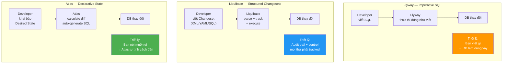
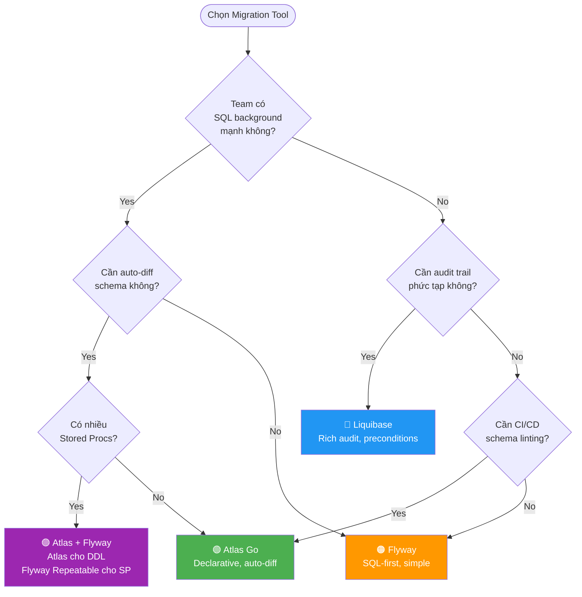
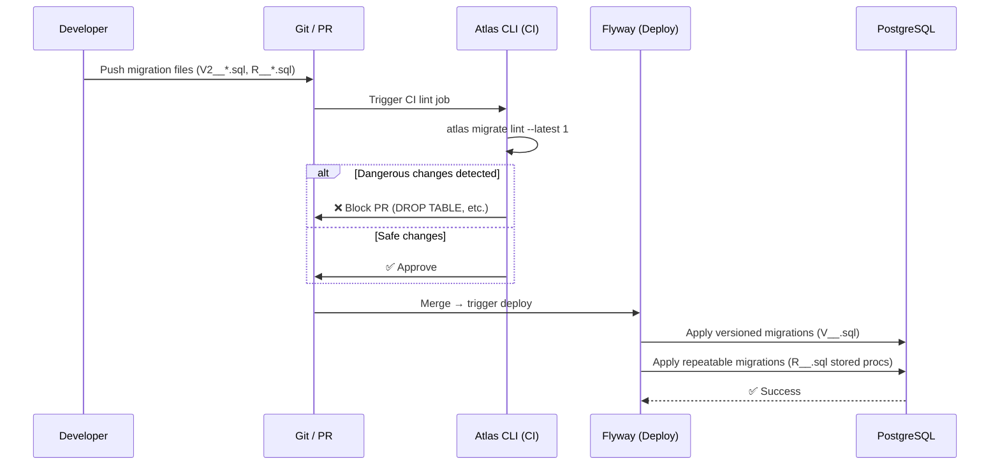
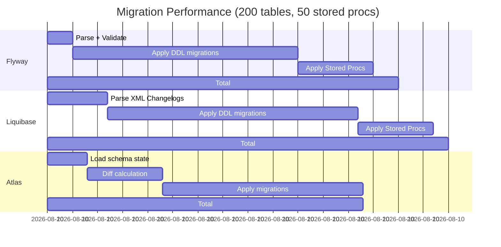
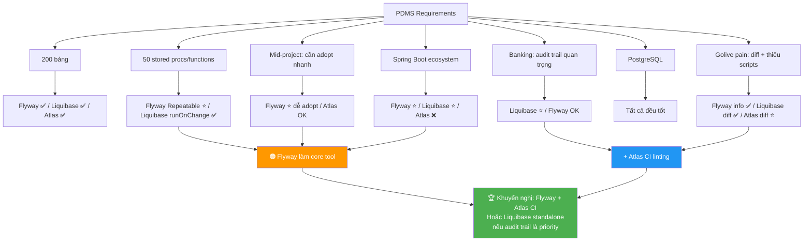

# Tool Comparison: Liquibase vs Flyway vs Atlas Go

> **Mục tiêu**: So sánh khoa học 3 công cụ migration — use cases, điểm mạnh/yếu, cách kết hợp, và những misuse phổ biến cần tránh.

**Series**: [[DBMigration-MOC]] | **Prev**: [[DBMigration-02-AtlasGo-Deep-Dive]] | **Next**: [[DBMigration-04-Enterprise-Patterns]]

---

## 1. Architecture Philosophy — 3 Trường phái khác nhau



---

## 2. Feature Matrix — Chi tiết

```mermaid
xychart-beta
    title "Tool Capability Scores (1-10)"
    x-axis ["Ease of Use", "SQL Native", "Auto Diff", "SP Support", "Rollback", "CI/CD", "Spring Boot", "Audit Trail"]
    y-axis "Score" 0 --> 10
    bar [8, 9, 3, 8, 4, 5, 9, 6]
    bar [5, 7, 5, 8, 9, 6, 9, 10]
    bar [7, 8, 10, 4, 8, 10, 4, 7]
```



| Feature | Flyway | Liquibase | Atlas Go |
|---------|:------:|:---------:|:--------:|
| **Ease of adoption** | ⭐⭐⭐⭐⭐ | ⭐⭐⭐ | ⭐⭐⭐⭐ |
| **SQL-first** | ✅ Native | ⚠️ Có thể dùng SQL | ✅ Native |
| **Auto-generate migration** | ❌ | ⚠️ diffChangeLog (phức tạp) | ✅ Atlas's core feature |
| **Schema drift detection** | ❌ | ⚠️ Có nhưng cần setup | ✅ Native |
| **Stored Procedures** | ✅ Repeatable migrations | ✅ runOnChange | ⚠️ Hạn chế |
| **Rollback** | ❌ Community / ✅ Teams | ✅ Built-in | ✅ Auto-gen |
| **Preconditions / Guards** | ❌ | ✅ Phong phú | ⚠️ Hạn chế |
| **Audit trail** | ⭐⭐⭐ | ⭐⭐⭐⭐⭐ | ⭐⭐⭐ |
| **CI/CD linting** | ❌ | ❌ | ✅ Native |
| **Spring Boot auto** | ✅ | ✅ | ❌ |
| **Multi-schema** | ⚠️ Manual | ✅ | ✅ |
| **Multi-tenant** | ⚠️ Manual | ✅ | ✅ |
| **License** | Apache 2.0 (Community) | Apache 2.0 | Apache 2.0 |
| **Paid features** | Teams: Undo, Dry-run | Pro: Enterprise features | Cloud: CI dashboard |

---

## 3. Use Case Map — Khi nào dùng cái nào?



### Use Cases cụ thể

#### Dùng Flyway khi:
- Team dev quen SQL, không muốn học XML/HCL
- Project nhỏ-medium, ít phức tạp
- **Nhiều Stored Procedures** (Flyway Repeatable migration tốt nhất)
- Cần Spring Boot integration zero-config
- Muốn đơn giản, không over-engineer

#### Dùng Liquibase khi:
- Cần audit trail chi tiết (enterprise compliance, banking)
- Cần preconditions phức tạp (guard conditions)
- Multi-schema, multi-tenant phức tạp
- Team đã quen XML/YAML workflow
- Cần built-in rollback (không muốn trả tiền Teams Flyway)
- **PDMS context**: banking → audit trail quan trọng → Liquibase fit tốt

#### Dùng Atlas Go khi:
- Muốn schema-as-code (Terraform-style)
- Cần CI/CD linting để phát hiện dangerous changes
- Auto-generate migration từ schema definition
- Đội ngũ infrastructure-heavy (quen HCL)
- Cần drift detection giữa environments

#### Kết hợp Atlas + Flyway khi:
- Cần cả auto-diff (Atlas) và stored proc management (Flyway)
- Atlas validate schema + Flyway apply migrations

---

## 4. Combination Patterns — Kết hợp công cụ

### Pattern 1: Atlas Lint + Flyway Apply



```yaml
# CI: Atlas lint
- name: Atlas Schema Lint
  run: |
    atlas migrate lint \
      --dir "file://src/main/resources/db/migration" \
      --dev-url "docker://postgres/15/test" \
      --latest 1

# CD: Flyway apply
- name: Flyway Migrate
  run: |
    flyway migrate \
      -url=${PROD_DB_URL} \
      -user=${FLYWAY_USER} \
      -password=${FLYWAY_PASS}
```

### Pattern 2: Atlas Schema Drift Detection + Liquibase Migration

```bash
# Weekly drift check với Atlas
atlas schema diff \
  --from "postgres://user@staging-db:5432/pdms" \
  --to   "postgres://user@prod-db:5432/pdms"

# Nếu có drift → generate migration với Liquibase diffChangeLog
liquibase diffChangeLog \
  --changeLogFile=emergency-sync.xml \
  --url=postgres://prod-db:5432/pdms \
  --referenceUrl=postgres://staging-db:5432/pdms
```

### Pattern 3: Atlas inspect → Bootstrap Flyway

```bash
# Bước 1: Atlas inspect DB hiện có → SQL schema dump
atlas schema inspect \
  --url "postgres://user@prod-db:5432/pdms" \
  --format "{{ sql . }}" \
  > V1__Baseline_existing_schema.sql

# Bước 2: Flyway baseline
flyway baseline \
  -baselineVersion=1 \
  -baselineDescription="Existing PDMS schema"

# Bước 3: Từ đây dùng Flyway cho migrations
# Atlas chỉ dùng để lint CI và drift detection
```

---

## 5. ⚠️ Misuse — Những lỗi sai phổ biến

### Misuse 1: Sửa migration file đã chạy

```
❌ SAI với tất cả 3 tools:
   Ai đó sửa V1_2__Create_tables.sql sau khi đã chạy trên staging/prod
   
Hậu quả:
   Flyway:     FlywayException: Validate failed — checksum mismatch
   Liquibase:  ValidationFailedException: Checksum mismatch
   Atlas:      Migration hash mismatch error

✅ ĐÚNG: Luôn tạo file migration mới
   V1_2_1__Fix_table_definition.sql  ← file mới
```

### Misuse 2: Dùng `clean` trên production

```
❌ NGUY HIỂM:
   flyway.cleanDisabled = false  (trên prod)
   flyway clean  ← DROP tất cả objects trong DB!
   
   spring.jpa.hibernate.ddl-auto = create-drop  ← tương tự
   
✅ LUÔN:
   flyway.cleanDisabled = true  (trên staging và prod)
   spring.jpa.hibernate.ddl-auto = none  (trên mọi env, dùng Flyway/Liquibase thay thế)
```

### Misuse 3: Dùng hibernate.ddl-auto song song với migration tool

```
❌ SAI: Dùng cả 2 cùng lúc
   spring.jpa.hibernate.ddl-auto = update  ← Hibernate tự ALTER TABLE
   spring.flyway.enabled = true            ← Flyway cũng ALTER TABLE
   → Conflict, race condition, không biết ai thay đổi gì

✅ ĐÚNG: Chọn 1 hoặc tách biệt rõ ràng
   spring.jpa.hibernate.ddl-auto = validate  ← Hibernate CHỈ validate
   spring.flyway.enabled = true              ← Flyway quản lý schema
```

### Misuse 4: Version number không nhất quán

```
❌ SAI:
   V1__init.sql
   V10__add_feature.sql
   V2__second_feature.sql   ← Sort string: V1 < V10 < V2 !
   
✅ ĐÚNG: Dùng timestamp hoặc zero-padded
   V20241101__init.sql
   V20241115__add_feature.sql
   V20241120__second_feature.sql
   
   HOẶC:
   V001__init.sql
   V002__add_feature.sql
   V010__another_feature.sql
```

### Misuse 5: Không test rollback

```
❌ Phổ biến: Viết migration nhưng không bao giờ test rollback
   → Khi production lỗi, muốn rollback nhưng không có plan

✅ ĐÚNG: Mỗi migration phải có rollback plan
   Flyway Community: tạo rollback script thủ công
   Liquibase: <rollback> tag trong changeset
   Atlas: auto-gen rollback từ diff
```

### Misuse 6: Stored Procedures không dùng Repeatable migration

```
❌ SAI (với Flyway):
   V5__Create_sp_validate.sql   ← Versioned
   Khi sửa SP, tạo V6__Update_sp_validate.sql → V7__Fix_sp_validate.sql...
   → 20+ migration chỉ để update 1 stored proc
   
✅ ĐÚNG:
   R__SP_validate_document.sql  ← Repeatable
   → Flyway tự detect khi file thay đổi và re-run
   → Chỉ 1 file cho mỗi stored proc, sạch sẽ
```

### Misuse 7: Migration quá lớn

```
❌ SAI:
   V1__Everything.sql  ← 5000 dòng, tạo 200 tables trong 1 file
   → Khó debug khi lỗi, không thể retry từng phần
   → Transaction timeout trên large table
   
✅ ĐÚNG: Mỗi migration nhỏ, focused
   V1_01__Create_lookup_tables.sql    ← 20 lookup tables
   V1_02__Create_core_tables.sql      ← Core tables
   V1_03__Create_indexes.sql          ← Indexes
   V1_04__Add_foreign_keys.sql        ← FKs
   V1_05__Seed_initial_data.sql       ← Data
```

### Misuse 8: Không có dedicated migration user

```
❌ SAI:
   Dùng app user (chỉ có SELECT/INSERT/UPDATE/DELETE)
   để chạy migration (cần CREATE/ALTER/DROP)
   → Phải grant excess permissions cho app user
   → Security risk: app có thể DROP TABLE nếu bị compromise

✅ ĐÚNG:
   flyway_user:  quyền DDL (chỉ dùng lúc migrate)
   pdms_app_user: chỉ DML (app thường ngày)
```

---

## 6. Performance Comparison



> ⚠️ Con số trên là ước tính minh họa — thực tế phụ thuộc vào network latency, DB size, và số lượng pending migrations.

---

## 7. Decision cho PDMS Context



---

## 8. Summary Comparison Card

```
┌──────────────────────────────────────────────────────────────┐
│                    TOOL SELECTION GUIDE                      │
├─────────────────┬────────────┬────────────┬──────────────────┤
│                 │  FLYWAY    │ LIQUIBASE  │   ATLAS GO       │
├─────────────────┼────────────┼────────────┼──────────────────┤
│ Learn in 1 day  │     ✅     │     ❌     │      ⚠️          │
│ Stored Procs    │ ⭐ Best    │     ✅     │      ❌          │
│ Auto-diff       │     ❌     │     ⚠️     │   ⭐ Best        │
│ Spring Boot     │ ⭐ Native  │ ⭐ Native  │      ❌          │
│ Rollback free   │     ❌     │     ✅     │      ✅          │
│ CI Linting      │     ❌     │     ❌     │   ⭐ Best        │
│ Audit trail     │     ⚠️     │ ⭐ Best    │      ⚠️          │
│ PDMS fit score  │    8/10    │    9/10    │     7/10         │
└─────────────────┴────────────┴────────────┴──────────────────┘

Best combinations:
  Option A: Flyway (migration) + Atlas (CI lint)         → Fast to adopt
  Option B: Liquibase standalone                          → Best audit trail
  Option C: Flyway + Liquibase diff (periodic compare)   → Belt & suspenders
```

**Next**: [[DBMigration-04-Enterprise-Patterns]]

---

#comparison #flyway #liquibase #atlasgo #enterprise #misuse #best-practices
