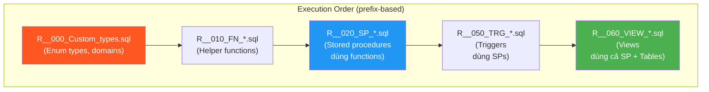
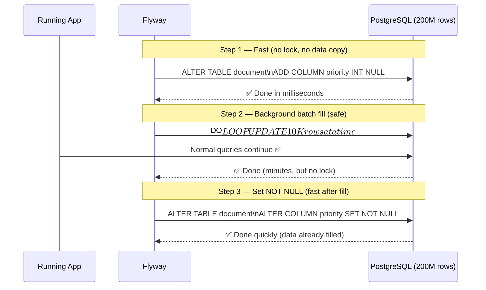
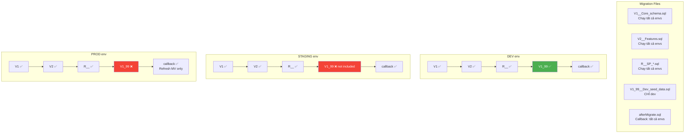

# Enterprise Patterns — 200 Tables + 50 Stored Procedures

> **Mục tiêu**: Patterns và tổ chức file cụ thể cho hệ thống enterprise quy mô lớn — 200 bảng, 50 stored procs/functions, multi-environment, multi-tenant.

**Series**: [[DBMigration-MOC]] | **Prev**: [[DBMigration-03-Tool-Comparison]] | **Next**: [[DBMigration-05-Adoption-Roadmap]]

---

## 1. Tổ chức thư mục — Large Scale Project

```
src/main/resources/db/
│
├── migration/                              ← Flyway versioned migrations
│   │
│   ├── baseline/
│   │   └── V1__Baseline_existing_schema.sql    ← Snapshot DB ban đầu (1 lần)
│   │
│   ├── v1_initial/                         ← Nhóm theo release/sprint
│   │   ├── V1_01__Create_extensions.sql
│   │   ├── V1_02__Create_lookup_tables.sql
│   │   ├── V1_03__Create_core_tables.sql
│   │   ├── V1_04__Create_credit_tables.sql
│   │   ├── V1_05__Create_iam_tables.sql
│   │   ├── V1_06__Create_audit_tables.sql
│   │   ├── V1_07__Add_foreign_keys.sql
│   │   ├── V1_08__Create_indexes.sql
│   │   ├── V1_09__Create_sequences.sql
│   │   └── V1_10__Seed_lookup_data.sql
│   │
│   ├── v2_tenant/
│   │   ├── V2_01__Add_tenant_columns.sql
│   │   ├── V2_02__Fill_tenant_data.sql
│   │   ├── V2_03__Add_tenant_indexes.sql
│   │   └── V2_04__Add_tsdb_module.sql
│   │
│   └── v3_iam_migration/                   ← AuthZ migration sprint
│       ├── V3_01__Create_iam_schema.sql
│       ├── V3_02__Migrate_users_to_iam.sql
│       └── V3_03__Update_fk_references.sql
│
├── stored_procedures/                      ← Flyway Repeatable migrations
│   │
│   ├── types/
│   │   └── R__000_Custom_types.sql         ← Chạy đầu tiên (prefix 000)
│   │
│   ├── functions/
│   │   ├── R__010_FN_generate_doc_code.sql
│   │   ├── R__011_FN_generate_warehouse_code.sql
│   │   ├── R__012_FN_calculate_doc_status.sql
│   │   └── R__019_FN_audit_trigger.sql
│   │
│   ├── procedures/
│   │   ├── R__020_SP_validate_document_batch.sql
│   │   ├── R__021_SP_process_credit_case.sql
│   │   ├── R__022_SP_import_excel_data.sql
│   │   └── R__049_SP_cleanup_audit_logs.sql
│   │
│   ├── triggers/
│   │   ├── R__050_TRG_document_audit.sql
│   │   └── R__051_TRG_update_timestamp.sql
│   │
│   └── views/
│       ├── R__060_VIEW_document_summary.sql
│       ├── R__061_VIEW_credit_case_overview.sql
│       └── R__062_VIEW_warehouse_inventory.sql
│
├── seed/
│   ├── V1_99__Seed_dev_test_data.sql       ← CHỈ chạy trên dev
│   └── afterMigrate__refresh_views.sql     ← Callback: refresh MV sau migrate
│
└── schema/                                 ← Atlas schema definitions (optional)
    ├── schema.hcl                          ← Desired state (cho Atlas CI)
    └── atlas.hcl                           ← Atlas project config
```

---

## 2. Stored Procedure Strategy — 50 SP/Functions

### Dependency ordering với prefix



### Template cho mỗi SP file

```sql
-- R__020_SP_validate_document_batch.sql
-- ============================================================
-- Stored Procedure: sp_validate_document_batch
-- Purpose: Validate hàng loạt hồ sơ theo batch_id
-- Dependencies: document, document_status, audit_log tables
-- Author: bach | Created: 2024-01-15 | Modified: 2024-11-20
-- Change log:
--   2024-01-15: Initial creation
--   2024-11-20: Add tenant_code filter, optimize query
-- ============================================================

-- Drop function nếu signature thay đổi (thay đổi params)
-- DROP FUNCTION IF EXISTS sp_validate_document_batch(UUID, VARCHAR, INT);

-- Luôn dùng CREATE OR REPLACE để idempotent
CREATE OR REPLACE FUNCTION sp_validate_document_batch(
    p_batch_id      UUID,
    p_tenant_code   VARCHAR(20)  DEFAULT 'VPBANK',
    p_batch_size    INT          DEFAULT 1000,
    p_validate_mode VARCHAR(20)  DEFAULT 'FULL'   -- 'FULL' | 'QUICK'
)
RETURNS TABLE (
    document_id     UUID,
    validation_code VARCHAR(50),
    is_valid        BOOLEAN,
    error_count     INT,
    error_messages  TEXT[]
)
LANGUAGE plpgsql
SECURITY DEFINER   -- Chạy với quyền của function owner, không phải caller
AS $$
DECLARE
    v_start_time    TIMESTAMPTZ := NOW();
    v_processed     INT := 0;
BEGIN
    -- Validate input
    IF p_batch_id IS NULL THEN
        RAISE EXCEPTION 'batch_id cannot be null';
    END IF;

    -- Log start
    INSERT INTO audit_log (
        action, entity_type, entity_id,
        tenant_code, created_at, metadata
    ) VALUES (
        'SP_VALIDATE_START', 'DOCUMENT_BATCH', p_batch_id,
        p_tenant_code, v_start_time,
        jsonb_build_object('batch_size', p_batch_size, 'mode', p_validate_mode)
    );

    -- Main validation logic
    RETURN QUERY
    WITH validation_results AS (
        SELECT
            d.id AS doc_id,
            ARRAY_REMOVE(ARRAY[
                CASE WHEN d.status_id IS NULL     THEN 'ERR_NO_STATUS'     END,
                CASE WHEN d.warehouse_id IS NULL  THEN 'ERR_NO_WAREHOUSE'  END,
                CASE WHEN d.case_id IS NULL       THEN 'ERR_NO_CASE'       END,
                CASE WHEN d.document_code IS NULL THEN 'ERR_NO_CODE'       END,
                -- Additional checks for FULL mode
                CASE WHEN p_validate_mode = 'FULL'
                     AND NOT EXISTS (
                         SELECT 1 FROM credit_case cc
                         WHERE cc.id = d.case_id
                           AND cc.tenant_code = p_tenant_code
                     ) THEN 'ERR_CASE_NOT_FOUND' END
            ], NULL) AS errors
        FROM document d
        WHERE d.tenant_code = p_tenant_code
          AND d.deleted = FALSE
        LIMIT p_batch_size
    )
    SELECT
        vr.doc_id,
        'BATCH_' || p_batch_id::VARCHAR(8),
        (array_length(vr.errors, 1) IS NULL)::BOOLEAN,
        COALESCE(array_length(vr.errors, 1), 0),
        vr.errors
    FROM validation_results vr;

    GET DIAGNOSTICS v_processed = ROW_COUNT;

    -- Log completion
    UPDATE audit_log
    SET metadata = metadata || jsonb_build_object(
        'processed', v_processed,
        'duration_ms', EXTRACT(EPOCH FROM (NOW() - v_start_time)) * 1000
    )
    WHERE entity_id = p_batch_id AND action = 'SP_VALIDATE_START';

END;
$$;

-- Grant execute to app user
GRANT EXECUTE ON FUNCTION sp_validate_document_batch(UUID, VARCHAR, INT, VARCHAR)
    TO pdms_app_user;

-- Add comment
COMMENT ON FUNCTION sp_validate_document_batch IS
    'Validate document batch — kiểm tra tính hợp lệ của hồ sơ theo batch';
```

---

## 3. Large Table Migration Patterns

### Pattern: ADD COLUMN zero-downtime



```sql
-- V2_01__Add_tenant_columns.sql
-- Zero-downtime pattern cho large tables

BEGIN;

-- === PHASE 1: Add columns nullable (không lock, không copy data) ===
ALTER TABLE document      ADD COLUMN IF NOT EXISTS tenant_code VARCHAR(20);
ALTER TABLE credit_case   ADD COLUMN IF NOT EXISTS tenant_code VARCHAR(20);
ALTER TABLE warehouse     ADD COLUMN IF NOT EXISTS tenant_code VARCHAR(20);
ALTER TABLE audit_log     ADD COLUMN IF NOT EXISTS tenant_code VARCHAR(20);
-- ... tất cả 200 tables cần tenant_code

COMMIT;
```

```sql
-- V2_02__Fill_tenant_data.sql
-- Tách ra file riêng: có thể chạy lại nếu lỗi giữa chừng

DO $$
DECLARE
    tables_to_fill  TEXT[] := ARRAY['document', 'credit_case', 'warehouse', 'audit_log'];
    t               TEXT;
    batch_size      INT := 10000;
    rows_done       INT;
    total_done      INT := 0;
BEGIN
    FOREACH t IN ARRAY tables_to_fill LOOP
        RAISE NOTICE 'Filling tenant_code for table: %', t;
        total_done := 0;

        LOOP
            EXECUTE format(
                'UPDATE %I SET tenant_code = $1
                 WHERE tenant_code IS NULL
                   AND id IN (
                       SELECT id FROM %I
                       WHERE tenant_code IS NULL
                       ORDER BY id
                       LIMIT $2
                   )',
                t, t
            ) USING 'VPBANK', batch_size;

            GET DIAGNOSTICS rows_done = ROW_COUNT;
            total_done := total_done + rows_done;
            EXIT WHEN rows_done = 0;

            -- Nhường CPU cho normal app traffic
            PERFORM pg_sleep(0.05);

            RAISE NOTICE '  % rows processed for %', total_done, t;
        END LOOP;

        RAISE NOTICE 'Done: % rows updated for %', total_done, t;
    END LOOP;
END $$;
```

```sql
-- V2_03__Add_tenant_constraints.sql
-- Chỉ chạy sau khi V2_02 hoàn thành

-- Set NOT NULL và default (nhanh vì data đã fill đủ)
ALTER TABLE document    ALTER COLUMN tenant_code SET NOT NULL;
ALTER TABLE document    ALTER COLUMN tenant_code SET DEFAULT 'VPBANK';
ALTER TABLE credit_case ALTER COLUMN tenant_code SET NOT NULL;
ALTER TABLE credit_case ALTER COLUMN tenant_code SET DEFAULT 'VPBANK';
-- ...

-- Add indexes CONCURRENTLY — không lock table
-- Flyway mặc định dùng transaction, nhưng CONCURRENTLY cần ngoài transaction
-- → Dùng separate migration file với flywayNonTransactional annotation
```

### Pattern: CONCURRENT Index — Non-transactional migration

```java
// FlywayNonTransactionalCallback.java — Java migration cho CONCURRENT index
// Khi SQL thuần không thể chạy trong transaction

@Component
public class V2_04__Create_tenant_indexes_concurrent extends BaseJavaMigration {
    
    @Override
    public void migrate(Context context) throws Exception {
        try (var stmt = context.getConnection().createStatement()) {
            // Không trong transaction → CONCURRENT works!
            context.getConnection().setAutoCommit(true);
            
            stmt.execute("""
                CREATE INDEX CONCURRENTLY IF NOT EXISTS idx_document_tenant_status
                ON document(tenant_code, status_id)
                WHERE deleted = false
            """);
            
            stmt.execute("""
                CREATE INDEX CONCURRENTLY IF NOT EXISTS idx_credit_case_tenant
                ON credit_case(tenant_code, status_id)
                WHERE deleted = false
            """);
            
            stmt.execute("""
                CREATE INDEX CONCURRENTLY IF NOT EXISTS idx_warehouse_tenant
                ON warehouse(tenant_code, type_id)
            """);
        }
    }
    
    @Override
    public boolean canExecuteInTransaction() {
        return false;  // Key: báo Flyway không wrap trong transaction
    }
}
```

---

## 4. Multi-Environment Data Strategy



### application.yml per environment

```yaml
# application-dev.yml
spring:
  flyway:
    locations:
      - classpath:db/migration
      - classpath:db/stored_procedures
      - classpath:db/seed           # ← có seed data
    clean-disabled: false           # Dev có thể reset
    out-of-order: true              # Dev flexible hơn

# application-staging.yml
spring:
  flyway:
    locations:
      - classpath:db/migration
      - classpath:db/stored_procedures
                                    # ← không có seed
    clean-disabled: true
    out-of-order: false

# application-prod.yml
spring:
  flyway:
    locations:
      - classpath:db/migration
      - classpath:db/stored_procedures
    clean-disabled: true            # ALWAYS
    validate-on-migrate: true
    out-of-order: false             # NEVER allow out-of-order prod
    connect-retries: 5
```

---

## 5. Insert Data — Idempotent Seed Strategy

```sql
-- V1_10__Seed_lookup_data.sql
-- Tất cả INSERT phải idempotent — có thể chạy lại mà không lỗi

-- Pattern 1: ON CONFLICT DO NOTHING (phổ biến nhất)
INSERT INTO document_status (id, code, name, description, is_active, sort_order)
VALUES
    (1,  'DRAFT',     'Nháp',         'Hồ sơ đang soạn thảo',    true, 1),
    (2,  'SUBMITTED', 'Đã nộp',        'Hồ sơ đã nộp vào kho',    true, 2),
    (3,  'REVIEWING', 'Đang kiểm tra', 'Hồ sơ đang được kiểm tra', true, 3),
    (4,  'APPROVED',  'Đã duyệt',      'Hồ sơ đã được duyệt',      true, 4),
    (5,  'REJECTED',  'Bị từ chối',    'Hồ sơ bị từ chối',         true, 5),
    (6,  'ARCHIVED',  'Đã lưu trữ',    'Hồ sơ đã chuyển lưu trữ',  true, 6)
ON CONFLICT (id) DO NOTHING;

-- Pattern 2: ON CONFLICT DO UPDATE (upsert — update nếu đã tồn tại)
INSERT INTO system_config (config_key, config_value, description)
VALUES
    ('MAX_FILE_SIZE_MB',    '50',     'Kích thước file tối đa'),
    ('MAX_BATCH_SIZE',      '10000',  'Số records tối đa mỗi batch'),
    ('DEFAULT_TENANT_CODE', 'VPBANK', 'Tenant mặc định')
ON CONFLICT (config_key) DO UPDATE SET
    config_value  = EXCLUDED.config_value,
    description   = EXCLUDED.description,
    updated_at    = NOW();

-- Pattern 3: INSERT WHERE NOT EXISTS (cho dữ liệu phức tạp)
INSERT INTO warehouse_type (id, code, name, province_code)
SELECT v.id, v.code, v.name, v.province_code
FROM (VALUES
    (1, 'HAN_MAIN', 'Kho chính Hà Nội', 'HAN'),
    (2, 'HCM_MAIN', 'Kho chính HCM',    'HCM'),
    (3, 'DAN_MAIN', 'Kho chính Đà Nẵng', 'DAN')
) AS v(id, code, name, province_code)
WHERE NOT EXISTS (
    SELECT 1 FROM warehouse_type WHERE id = v.id
);
```

### CSV Import cho data lớn

```sql
-- V1_10__Seed_provinces.sql
-- Load từ CSV trong classpath

-- Flyway không hỗ trợ COPY trực tiếp, dùng INSERT bulk
-- Hoặc dùng Java migration với JDBC COPY

-- Với nhỏ hơn 500 records: inline VALUES
-- Với lớn hơn: Java migration
```

```java
// V1_11__Seed_provinces_from_csv.java
public class V1_11__Seed_provinces_from_csv extends BaseJavaMigration {
    
    @Override
    public void migrate(Context context) throws Exception {
        var conn = context.getConnection();
        
        // Đọc CSV từ classpath
        try (var is = getClass().getResourceAsStream("/db/data/provinces-vietnam.csv");
             var reader = new BufferedReader(new InputStreamReader(is, StandardCharsets.UTF_8));
             var stmt = conn.prepareStatement(
                 "INSERT INTO province (id, code, name, region) VALUES (?, ?, ?, ?) " +
                 "ON CONFLICT (id) DO NOTHING"
             )) {
            
            String line;
            reader.readLine(); // Skip header
            
            int batchCount = 0;
            while ((line = reader.readLine()) != null) {
                String[] parts = line.split(",");
                stmt.setInt(1, Integer.parseInt(parts[0].trim()));
                stmt.setString(2, parts[1].trim());
                stmt.setString(3, parts[2].trim());
                stmt.setString(4, parts[3].trim());
                stmt.addBatch();
                
                if (++batchCount % 100 == 0) {
                    stmt.executeBatch();
                }
            }
            stmt.executeBatch(); // Flush remaining
        }
    }
}
```

---

## 6. Golive Pre-Check Script

```bash
#!/bin/bash
# pre-golive-check.sh — Chạy trước mỗi lần golive

set -e

ENV=${1:-"staging"}
echo "=== Pre-Golive Check: $ENV ==="

# 1. Validate migration files
echo "[1/6] Validating migration files..."
flyway validate \
  -url=$DB_URL \
  -user=$FLYWAY_USER \
  -password=$FLYWAY_PASS \
  -locations=classpath:db/migration,classpath:db/stored_procedures
echo "✅ All migration files valid"

# 2. Xem pending migrations
echo ""
echo "[2/6] Pending migrations:"
flyway info \
  -url=$DB_URL \
  -user=$FLYWAY_USER \
  -password=$FLYWAY_PASS | grep "Pending\|Outdated"

# 3. Dry-run (xuất SQL sẽ chạy — chỉ có Flyway Teams)
# Nếu dùng Community: xem danh sách files pending thay thế
echo ""
echo "[3/6] Pending migration files:"
flyway info \
  -url=$DB_URL \
  -user=$FLYWAY_USER \
  -password=$FLYWAY_PASS \
  -outputType=json | jq '.migrations[] | select(.state == "Pending" or .state == "Outdated") | .filepath'

# 4. Atlas schema drift check
if command -v atlas &> /dev/null; then
    echo ""
    echo "[4/6] Schema drift check (staging vs prod)..."
    atlas schema diff \
      --from "$STAGING_DB_URL" \
      --to   "$PROD_DB_URL" \
      2>&1 || true  # Don't fail on diff
fi

# 5. Check lock status (Flyway)
echo ""
echo "[5/6] Checking for stale Flyway locks..."
REPAIR_NEEDED=$(psql "$DB_URL" -t -c \
  "SELECT COUNT(*) FROM flyway_schema_history WHERE success = false;")
if [ "$REPAIR_NEEDED" -gt 0 ]; then
    echo "⚠️  Found $REPAIR_NEEDED failed migrations — run 'flyway repair' first!"
    exit 1
fi
echo "✅ No failed migrations"

# 6. Backup reminder
echo ""
echo "[6/6] ═══════════════════════════════════"
echo "       ⚠️  BACKUP PROD DB BEFORE GOLIVE!  "
echo "       ═══════════════════════════════════"
read -p "Confirm backup completed (yes/no): " confirm
[ "$confirm" = "yes" ] || { echo "❌ Abort: backup first!"; exit 1; }

echo ""
echo "=== Pre-golive check PASSED ==="
echo "Ready to run: ./deploy.sh $ENV"
```

---

## 7. Post-Golive Verification

```bash
#!/bin/bash
# post-golive-verify.sh

echo "=== Post-Golive Verification ==="

# 1. Flyway status — phải là 0 pending
PENDING=$(flyway info -url=$PROD_DB_URL -outputType=json \
  | jq '[.migrations[] | select(.state == "Pending")] | length')
echo "[1/3] Pending migrations: $PENDING"
[ "$PENDING" -eq 0 ] || { echo "❌ Still has pending migrations!"; exit 1; }
echo "✅ 0 pending"

# 2. Spot check critical tables exist
echo "[2/3] Checking critical tables..."
TABLES=("document" "credit_case" "warehouse" "document_status" "audit_log")
for table in "${TABLES[@]}"; do
    COUNT=$(psql "$PROD_DB_URL" -t -c "SELECT COUNT(*) FROM information_schema.tables WHERE table_name = '$table' AND table_schema = 'public';")
    [ "$COUNT" -gt 0 ] && echo "  ✅ $table" || echo "  ❌ $table MISSING!"
done

# 3. Spot check stored procs
echo "[3/3] Checking stored procedures..."
SP_COUNT=$(psql "$PROD_DB_URL" -t -c \
  "SELECT COUNT(*) FROM information_schema.routines WHERE routine_schema = 'public' AND routine_type = 'FUNCTION';")
echo "  Functions/SPs found: $SP_COUNT"

echo ""
echo "=== Golive verification complete ==="
```

---

## Summary

```
Enterprise patterns cho 200 tables + 50 SPs:

File tổ chức:
├── Nhóm migration theo version/sprint (v1_initial/, v2_tenant/...)
├── Prefix số cho stored procs (R__000, R__010, R__020...)
└── Tách seed data ra riêng, không mix với DDL

Key patterns:
├── 3-bước ADD COLUMN: nullable → fill → NOT NULL
├── CONCURRENT INDEX qua Java migration (canExecuteInTransaction=false)
├── Batch UPDATE tránh lock lâu trên large tables
├── ON CONFLICT cho idempotent seed data
└── Repeatable migration (R__) cho tất cả SPs/functions/views

Golive discipline:
├── pre-golive-check.sh trước mỗi deploy
├── Atlas drift check giữa environments
├── post-golive-verify.sh sau deploy
└── Backup trước khi apply production
```

**Next**: [[DBMigration-05-Adoption-Roadmap]]

---

#enterprise #flyway #stored-procedures #200-tables #postgresql #zero-downtime #patterns
