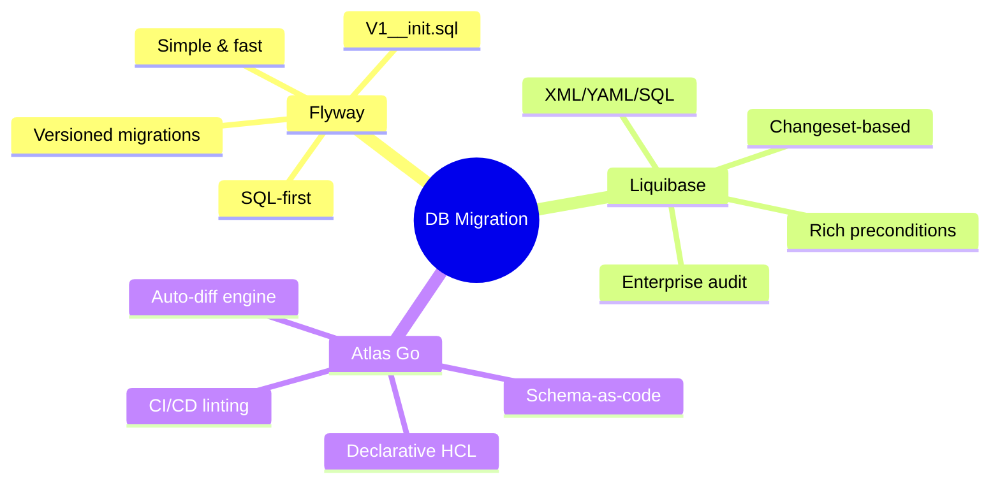
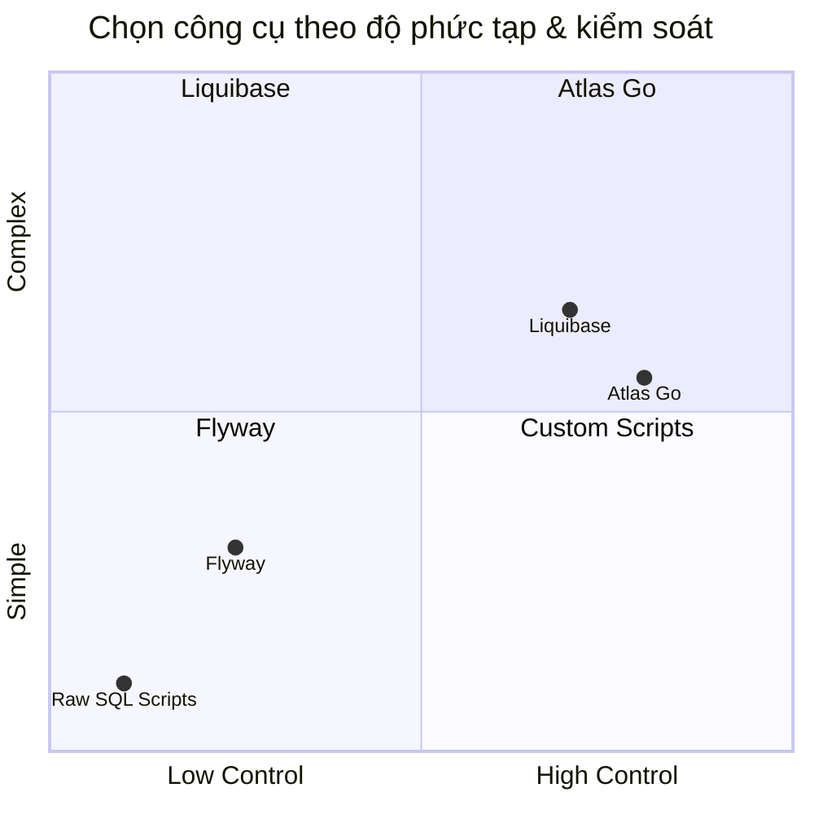
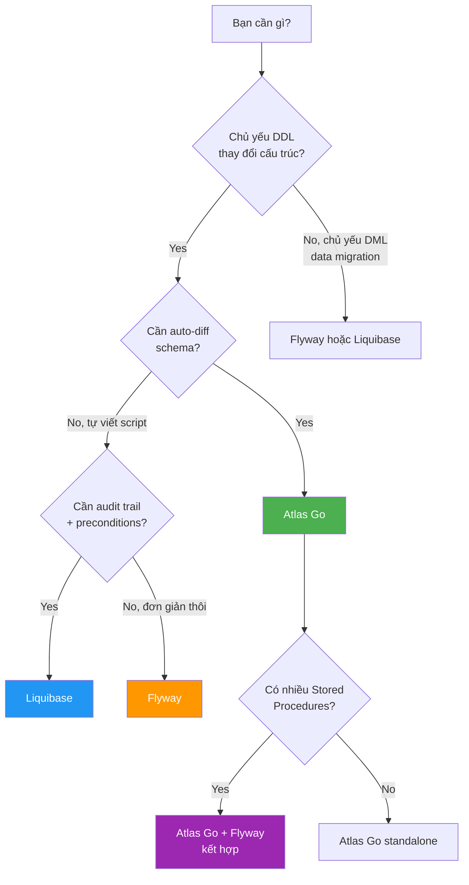

# Database Migration Tools — Map of Content

> **Series mục tiêu**: So sánh chuyên sâu Flyway · Atlas Go · Liquibase — lựa chọn đúng công cụ, triển khai đúng cách cho hệ thống enterprise 200+ bảng, 50+ stored procedures. Kèm **lộ trình triển khai thực tế** cho dự án đang chạy giữa chừng.

---

## 🗺️ Series Index

| # | Article | Nội dung |
|---|---------|----------|
| 0 | [[DBMigration-00-Newbie-Guide]] | **Đọc trước** — Tại sao cần migration tool, cơ chế checksum, giải thích sâu từng rule, mental model |
| 1 | [[DBMigration-01-Flyway-Deep-Dive]] | Core mechanics, Spring Boot config, versioned + repeatable migrations, enterprise patterns |
| 2 | [[DBMigration-02-AtlasGo-Deep-Dive]] | Schema-as-code, HCL/SQL, declarative diff engine, CI linting, PostgreSQL native |
| 3 | [[DBMigration-03-Tool-Comparison]] | Liquibase vs Flyway vs Atlas — use cases, kết hợp, misuse warnings |
| 4 | [[DBMigration-04-Enterprise-Patterns]] | 200 tables + 50 stored procs: tổ chức file, stored proc strategy, multi-env |
| 5 | [[DBMigration-05-Adoption-Roadmap]] | **Lộ trình triển khai cho dự án đang giữa chừng** — song song feature dev |

> 💡 **Nếu là lần đầu đọc series này**: Bắt đầu từ bài 00. Các bài 01–05 viết theo kiểu reference — đầy đủ nhưng giả định bạn đã hiểu cơ bản. Bài 00 giải thích những thứ mà các bài kia bỏ qua.

---

## 🔥 Bức tranh toàn cảnh — 3 công cụ, 3 triết lý



---

## ⚡ Quick Decision Matrix



| Tiêu chí | Flyway | Liquibase | Atlas Go |
|---------|--------|-----------|----------|
| **Learning curve** | ⭐ Thấp | ⭐⭐⭐ Cao | ⭐⭐ Trung bình |
| **SQL-first** | ✅ Native | ⚠️ Wrap XML | ✅ Native |
| **Auto-diff schema** | ❌ | ⚠️ Có nhưng phức tạp | ✅ Native |
| **Stored Procedures** | ✅ Tốt | ✅ Tốt | ⚠️ Hạn chế |
| **Spring Boot integration** | ✅ Auto | ✅ Auto | ❌ Manual |
| **Rollback** | ⚠️ Teams only | ✅ Built-in | ✅ Auto-gen |
| **CI/CD linting** | ❌ | ⚠️ | ✅ Native |
| **Multi-tenant** | ⚠️ Manual | ✅ | ✅ |
| **Phù hợp PDMS** | ⭐⭐⭐ | ⭐⭐⭐⭐ | ⭐⭐⭐ |

---

## 🎯 Use Case Map — Dùng cái nào khi nào?



---

## 🚨 Tình huống PDMS — Cần giải quyết ngay

```
Hiện trạng:
├── 200 bảng đang production
├── 50 stored procedures/functions
├── Scripts lưu rải rác, không versioned
├── Mỗi golive: diff thủ công, hay thiếu scripts
└── Dự án đang mid-phase, không thể dừng feature dev

Giải pháp được khuyến nghị:
└── Flyway (core migration) + Atlas CI linting
    ├── Nhanh adopt (SQL-first, dev đã quen)
    ├── generateScript từ DB hiện tại để baseline
    ├── Repeatable migrations cho stored procs
    └── Parallel với feature dev từ ngày đầu
```

→ Xem lộ trình chi tiết: [[DBMigration-05-Adoption-Roadmap]]

---

## 🏷️ Tags

#database-migration #flyway #atlasgo #liquibase #enterprise #postgresql #spring-boot #devops #pdms #schema-management
