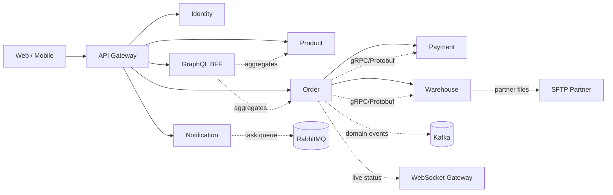
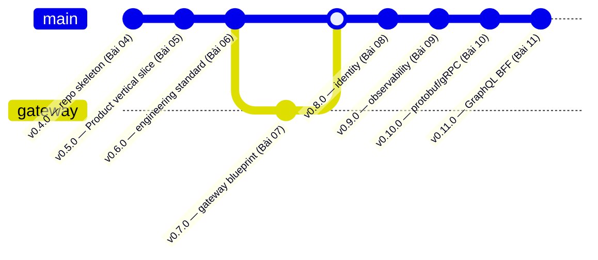

# Go Microservices Mastery — từ Basic đến Production

> [!abstract] Kết quả cuối series
> Xây dựng **GoCommerce**, một hệ thống commerce/fulfillment chạy được trên máy cá nhân và có đường nâng cấp rõ ràng lên production. Người học không chỉ biết gọi thư viện mà hiểu **vì sao chọn REST, gRPC, GraphQL, Kafka, RabbitMQ, SFTP hay WebSocket tại từng boundary**.

## Bắt đầu ở đâu?

- Chưa chắc Go có phù hợp: [[02-Vi-sao-Go-cho-Microservices]]
- Muốn thấy hệ thống cuối cùng: [[03-Kien-truc-GoCommerce]]
- Muốn bắt tay code ngay: [[04-Chuan-bi-moi-truong-va-Repository]]
- Đã vững Go: bắt đầu từ bài 05, dùng [[Go-Zero-To-Hero/Lộ-trình-Tổng-quan|Go Zero to Hero]] để tra cứu khi cần.

## Case study xuyên suốt

GoCommerce gồm các capability tăng dần theo series:

> [!tip] Một dự án, không phải hàng chục demo rời rạc
> Mỗi bài tạo một lát cắt có thể chạy và kiểm chứng. Commit/tag đề xuất ở cuối bài giúp quay lại bất kỳ trạng thái nào.

## Chuẩn nội dung v2 — sâu hơn, nối mã nguồn liên tục

> [!important] Ba thay đổi so với v1
> 1. **Mỗi bài có mục "🔬 Đào sâu kỹ thuật"** — không dừng ở "gọi API thế nào" mà đi vào cơ chế runtime/OS bên dưới (scheduler, syscall, connection pool, memory layout, wire format), kèm benchmark (`testing.B`) hoặc `pprof` khi phù hợp.
> 2. **Code xâu chuỗi (chained code)** — cùng một repo `gocommerce` phát triển liên tục qua các bài, không phải snippet rời rạc. Mỗi bài kết thúc bằng lệnh `git tag` để đánh dấu trạng thái repo tương ứng; bài sau luôn nêu rõ mình sửa/thêm file nào so với tag trước.
> 3. **Minh họa nhiều lớp** — ngoài `flowchart`/`sequenceDiagram`, các bài có concurrency/timing sẽ thêm diagram dạng timeline (goroutine/thread) hoặc state machine để thấy "hình dạng" của hành vi runtime, không chỉ đọc mô tả.

Quy ước tag: `vMAJOR.LESSON.0`, ví dụ hoàn thành bài 07 thì `git tag v0.7.0 -m "Bài 07: API Gateway blueprint"`. Muốn xem code tại một mốc bất kỳ: `git checkout v0.6.0 -- .`

## Lộ trình 54 bài (00–53)

Ký hiệu: ✅ đã có bài chi tiết · 🧱 sẽ triển khai tiếp · 🔗 tận dụng bài chuyên sâu sẵn có.

### Phase 0 — Orientation

| # | Article | Deliverable | Trạng thái |
|---|---|---|---|
| 00 | Series Hub | Bản đồ toàn series | ✅ |
| 01 | [[01-Phuong-phap-hoc-va-Definition-of-Done]] | Cách học, chuẩn hoàn thành | ✅ |
| 02 | [[02-Vi-sao-Go-cho-Microservices]] | Decision record chọn Go | ✅ |
| 03 | [[03-Kien-truc-GoCommerce]] | Context map và luồng nghiệp vụ | ✅ |

### Phase 1 — Foundation: service đầu tiên

| # | Article | Deliverable | Trạng thái |
|---|---|---|---|
| 04 | [[04-Chuan-bi-moi-truong-va-Repository]] | Monorepo, tooling, local infra | ✅ |
| 05 | [[05-Product-Service-Vertical-Slice]] | Product API chạy được | ✅ |
| 06 | [[06-Chuan-Engineering-cho-moi-Service]] | Config, log, error, shutdown | ✅ |
| 07 | [[07-API-Gateway-Full-Feature-Blueprint]] | Gateway production blueprint | ✅ |
| 08 | [[08-Authentication-Authorization-va-Third-Party-Identity]] | AuthN/AuthZ và third-party IdP | ✅ |
| 09 | [[09-Observability-Standard-Metrics-Prometheus-Logs]] | Metrics, Prometheus, distributed logs | ✅ |
| 10 | [[10-Protobuf-gRPC-Full-Feature]] | Protobuf/gRPC full-feature, nested message, streaming | ✅ |
| 11 | [[11-GraphQL-Full-Feature]] | GraphQL BFF full-feature, DataLoader, subscription | ✅ |
| 12 | REST API production | Pagination, validation, Problem Details | 🧱 |
| 13 | PostgreSQL + migrations | Repository thật, transaction | 🧱 |
| 14 | Testing pyramid | Unit, integration, contract | 🧱 |
| 15 | Docker image an toàn | Multi-stage, non-root, healthcheck | 🧱 |

### Phase 2 — Gateway, Identity và tách services

| # | Article | Deliverable | Trạng thái |
|---|---|---|---|
| 16 | Modular monolith trước microservices | Module boundaries | 🧱 |
| 17 | Tách Order service | Strangler migration | 🧱 |
| 18 | Gateway routing và reverse proxy | Route table, discovery, streaming | 🧱 |
| 19 | Gateway security pipeline | TLS, CORS, auth, quotas, WAF hooks | 🧱 |
| 20 | Gateway resilience | Timeout, retry, circuit breaker, load shed | 🧱 |
| 21 | OIDC login và token lifecycle | Authorization Code + PKCE | 🧱 |
| 22 | Third-party identity federation | Google/Microsoft/enterprise IdP | 🧱 |
| 23 | Authorization enforcement | RBAC, ABAC, ReBAC, object-level policy | 🧱 |

### Phase 3 — Event-driven với Kafka

| # | Article | Deliverable | Trạng thái |
|---|---|---|---|
| 24 | Kafka mental model | Topic, partition, offset, group | 🔗 [[Microservices-Patterns/Kafka-Partition-and-Offset-Internals|Deep dive]] |
| 25 | Go producer/consumer | Order events end-to-end | 🔗 [[Go-Zero-To-Hero/Bai-17-Kafka-Sarama|Go + Kafka]] |
| 26 | Event contract và schema evolution | Versioned envelope (Protobuf `Any`, bài 10) | 🧱 |
| 27 | Idempotent consumer | Inbox/deduplication | 🧱 |
| 28 | Transactional Outbox | DB + event nhất quán | 🔗 [[Microservices-Patterns/Transactional-Outbox|Outbox pattern]] |
| 29 | Retry topic và DLQ | Poison-message recovery | 🧱 |
| 30 | Ordering, rebalance, backpressure | Consumer vận hành ổn định | 🧱 |
| 31 | Saga choreography | Order–Payment–Inventory | 🔗 [[Microservices-Patterns/Saga-Pattern|Saga pattern]] |

### Phase 4 — RabbitMQ cho task/workflow

| # | Article | Deliverable | Trạng thái |
|---|---|---|---|
| 32 | Kafka hay RabbitMQ? | Decision matrix theo use case | 🧱 |
| 33 | Exchange, queue, binding | Notification topology | 🧱 |
| 34 | Work queue trong Go | Email worker pool | 🧱 |
| 35 | Ack, confirm, prefetch | At-least-once an toàn | 🧱 |
| 36 | TTL, retry, DLX | Retry có kiểm soát | 🧱 |
| 37 | Quorum queue và operations | HA và monitoring | 🧱 |

### Phase 5 — Enterprise integration và realtime

| # | Article | Deliverable | Trạng thái |
|---|---|---|---|
| 38 | SFTP ingestion | Download, checksum, archive | 🧱 |
| 39 | SFTP outbound | Atomic upload, PGP, reconciliation | 🧱 |
| 40 | TCP socket fundamentals | Framing, deadline, connection lifecycle | 🧱 |
| 41 | WebSocket gateway | Live order tracking | 🧱 |
| 42 | Webhook delivery platform | Signature, retry, replay protection | 🧱 |
| 43 | Batch và scheduler phân tán | Lock, leader election | 🧱 |

### Phase 6 — Reliability, observability, security

| # | Article | Deliverable | Trạng thái |
|---|---|---|---|
| 44 | Timeout, retry, circuit breaker | Resilience policy | 🔗 [[Microservices-Patterns/Circuit-Breaker|Circuit Breaker]] |
| 45 | Rate limit và load shedding | Bảo vệ service | 🧱 |
| 46 | OpenTelemetry | Trace xuyên REST/gRPC/GraphQL/broker | 🔗 [[Microservices-Patterns/Distributed-Tracing|Tracing]] |
| 47 | Prometheus + Grafana | Recording rules, dashboard, alert | 🧱 |
| 48 | Distributed logging | Collector, Loki/OpenSearch, retention | 🧱 |
| 49 | Secrets, TLS/mTLS, supply chain | Security baseline, mTLS cho gRPC nội bộ | 🧱 |
| 50 | Performance engineering | pprof, benchmark, load test | 🧱 |

### Phase 7 — Production và capstone

| # | Article | Deliverable | Trạng thái |
|---|---|---|---|
| 51 | Kubernetes deployment | Probe, resources, autoscaling | 🧱 |
| 52 | CI/CD và migration strategy | Progressive delivery, `buf breaking` trong pipeline | 🧱 |
| 53 | Capstone: chaos, DR, production review | Game day + runbook + review | 🧱 |

## Nhịp học đề xuất

- **Nhanh — 13 tuần:** 4 bài/tuần, ưu tiên lab và Definition of Done.
- **Chắc — 26 tuần:** 2 bài/tuần, thêm bài tập mở rộng và viết ADR.
- **Dùng cho team:** 1 phase/sprint; review code và vận hành demo cuối sprint.

## Nguyên tắc công nghệ

1. Standard library trước framework; abstraction chỉ xuất hiện sau khi thấy pain point.
2. PostgreSQL là source of truth; Redis không được dùng như database mặc định.
3. Event delivery mặc định là **at-least-once**; handler phải idempotent.
4. Không dùng distributed transaction như phép màu; dùng local transaction + outbox/saga.
5. Mọi network call đều có timeout, cancellation và quan sát được.
6. Tách service theo business capability, không theo bảng dữ liệu.
7. gRPC/Protobuf cho giao tiếp nội bộ typed; GraphQL cho BFF tổng hợp hướng client; REST cho public API tương thích rộng — mỗi công nghệ có một việc, không thay thế lẫn nhau tùy tiện.

## Nguồn chuẩn

- [Go release history](https://go.dev/doc/devel/release)
- [Go 1.26 release notes](https://go.dev/doc/go1.26)
- [Apache Kafka documentation](https://kafka.apache.org/documentation/)
- [RabbitMQ documentation](https://www.rabbitmq.com/docs)
- [gRPC documentation](https://grpc.io/docs/)
- [Protocol Buffers documentation](https://protobuf.dev/)
- [GraphQL specification](https://spec.graphql.org/)
- [OpenTelemetry documentation](https://opentelemetry.io/docs/)
- [Kubernetes documentation](https://kubernetes.io/docs/)

---

**Tiếp theo:** [[01-Phuong-phap-hoc-va-Definition-of-Done]]
