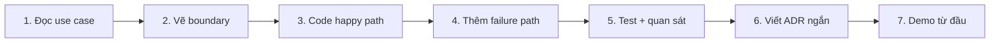

# Bài 01 — Học series thế nào để vào dự án nhanh?

> [!success] Sau bài này
> Bạn có một cách học đo được bằng sản phẩm chạy được, thay vì “đọc xong thấy hiểu”.

## Vòng lặp của mỗi article



### 1. Đọc use case

Trả lời ba câu trước khi code:

- Ai gọi capability này?
- Thành công làm thay đổi business state nào?
- Nếu dependency chết giữa chừng, hệ thống cần đảm bảo điều gì?

### 2. Vẽ boundary

Không bắt đầu bằng package hay broker. Bắt đầu bằng **business capability**, dữ liệu nó sở hữu và contract nó công bố.

### 3. Code happy path

Tạo lát cắt nhỏ nhất đi xuyên qua transport → application → domain → repository. Chưa tối ưu và chưa tạo interface ở mọi nơi.

### 4. Thêm failure path

Ít nhất phải xử lý:

- input sai;
- resource không tồn tại hoặc conflict;
- dependency timeout;
- shutdown khi request/message đang xử lý;
- message bị giao lại.

### 5. Test và quan sát

Một tính năng chưa hoàn tất nếu chỉ “trả về 200”. Cần thấy được log có cấu trúc, metric/trace phù hợp và test cho invariant quan trọng.

### 6. Viết ADR

ADR một trang:

```markdown
# ADR-NNN: <quyết định>
Status: Accepted
Context: vấn đề và constraint
Decision: chọn gì
Consequences: được gì, trả giá gì
Revisit when: khi nào cần xem lại
```

### 7. Demo từ đầu

Xóa container/volume test, chạy lại README và xác nhận người khác không cần kiến thức ẩn của người viết.

## Definition of Done cho mỗi bài

- [ ] Chạy được bằng các lệnh trong bài.
- [ ] Có request/event mẫu để chứng minh happy path.
- [ ] Có ít nhất một failure case được kiểm thử.
- [ ] `go test ./...` thành công.
- [ ] `go test -race ./...` thành công với phần có concurrency.
- [ ] Không commit secret; config nhận qua environment.
- [ ] Network server/client có timeout và truyền `context.Context`.
- [ ] Log có `service`, `request_id` hoặc `trace_id`; không log token/PII.
- [ ] README/sơ đồ phản ánh đúng code hiện tại.
- [ ] Ghi lại trade-off quan trọng bằng ADR.

## Ba cấp độ bài tập

> [!example] Core
> Làm đúng các bước để có deliverable chuẩn. Phù hợp người cần vào dự án nhanh.

> [!example] Production
> Thêm retry, idempotency, security, metrics và operational check tương ứng.

> [!example] Architect
> So sánh ít nhất hai phương án, ghi ADR và xác định tín hiệu khiến quyết định phải thay đổi.

## Quy tắc không “copy-paste mù”

Sau mỗi đoạn code, hãy tự trả lời:

1. Object nào sở hữu state?
2. Lifetime của goroutine/connection là bao lâu?
3. Ai hủy operation?
4. Error được chuyển thành transport response/event thế nào?
5. Retry có thể tạo duplicate side effect không?

Nếu chưa trả lời được, quay lại đoạn vừa code trước khi thêm thư viện tiếp theo.

## Nhật ký tiến độ gợi ý

| Ngày | Bài | Core | Production | Điều chưa rõ | ADR/commit |
|---|---|---:|---:|---|---|
| | | ⬜ | ⬜ | | |

---

**Trước:** [[00-Series-Hub]] · **Tiếp theo:** [[02-Vi-sao-Go-cho-Microservices]]
